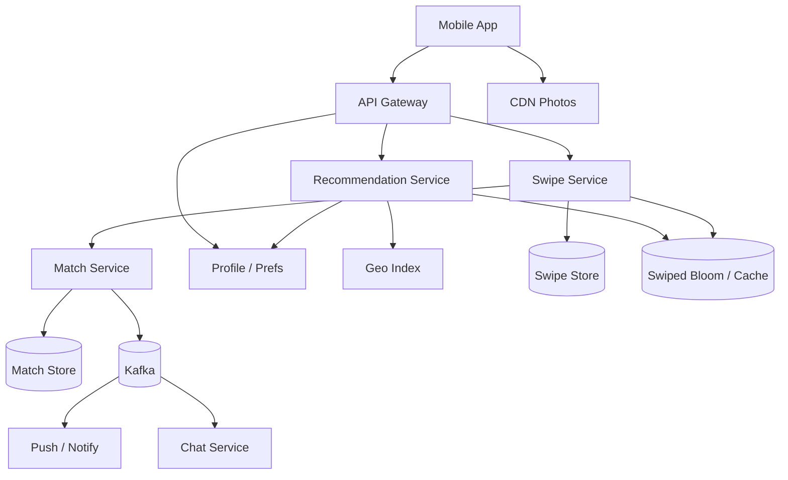

# System Design: Tinder-Style Matching

> **Focus areas:** Geo discovery · Swipe stack · Mutual match · Privacy · Rate limits · Recommendations · Progressive scale  
> **Style:** Senior/staff interview prep with progressive scale (10× → 100× → 1,000×)  
> **Product orientation:** Dating app cards nearby, like/pass swipes, match on mutual like, then chat handoff

---

## Table of Contents

1. [Clarify Requirements (Interview Q&A)](#1-clarify-requirements-interview-qa)
2. [Back-of-the-Envelope Estimation](#2-back-of-the-envelope-estimation)
3. [High-Level Design](#3-high-level-design)
4. [Architecture Diagram](#4-architecture-diagram)
5. [Design Deep Dive](#5-design-deep-dive)
6. [Wrap-Up](#6-wrap-up)
7. [Deeper / Related Interview Questions](#7-deeper--related-interview-questions)

---

## 1. Clarify Requirements (Interview Q&A)

Tinder is **geo-ranked candidate serving + bilateral matching**, not a social feed. Bound radius, stack quality, and match atomicity.

### 1.0 What this is / is not

| This is | This is not |
|---------|-------------|
| Profile discovery within preferences + distance | Twitter feed / PYMK professional graph |
| Swipe like/pass; match on mutual like | Full chat system (handoff IDs only) |
| Elo/attractiveness + preference ranking | Exact dating science product claims |
| Abuse/block/report safety | Payment subscriptions deep-dive (mention) |

### 1.1 Functional Requirements

| # | Question to ask | Expected / typical interviewer answer | Design implication |
|---|-----------------|----------------------------------------|--------------------|
| F1 | Core loop? | See card → like/pass → match if mutual | Swipe store + match detector |
| F2 | Geo? | Distance filter + sort | Geo index (geohash/S2/H3) |
| F3 | Preferences? | Age, gender/orientation, distance, optional filters | Candidate filters pre-rank |
| F4 | Stack size? | Prefetch 10–30 locally | Batch recommend API |
| F5 | Match definition? | Both liked; notify both; open chat thread | Atomic match record |
| F6 | Undo / rewind? | Premium feature Phase 1.5 | Soft state on last swipe |
| F7 | Super like? | Limited daily | Distinct swipe type |
| F8 | Passive visibility? | Who liked you Phase 2 | Separate index |
| F9 | Inactive users? | Demote / hide | Last-active signals |
| F10 | Photos? | Multiple; CDN | Media plane like Instagram lite |
| F11 | Blocking? | Yes | Hard filters |
| F12 | Passport / travel? | Phase 2 | Temporary geo override |
| F13 | Fairness? | Avoid only showing “top Elo” | Exploration / controlled exposure |

**MVP scope:**

1. Profile create with geo + prefs + photos.
2. Recommend stack near user.
3. Record like/pass; create match on mutual.
4. Notify match; return `match_id` for chat service.
5. Basic rate limits; block/report hooks.
6. Exclude already-swiped.

**Out of MVP:** Video chat, meet-up planning, full Boost marketplace economics, detailed paid SKUs.

### 1.2 Non-Functional Requirements

| # | Question | Expected answer | Target |
|---|----------|-----------------|--------|
| N1 | Recommend latency | Instant swipe UX | p99 < 200ms |
| N2 | Swipe write | Snappy | p99 < 100ms |
| N3 | Match correctness | No lost/dup matches | Exactly-one match record per pair |
| N4 | Location privacy | Fuzzy for display | Precise stored carefully; show rounded |
| N5 | Availability | High | 99.9% |
| N6 | Anti-abuse | Critical | Bots, scraping, harassment controls |
| N7 | Freshness | New users appear quickly | Minutes |

### 1.3 Cases

**Happy paths**

1. Open app → 20 cards → swipe likes → mutual → match screen → chat.
2. Update location → next recommend uses new geo cell.
3. Pass user → never see again (unless rewind).

**Edge / failure cases**

| Case | Behavior |
|------|----------|
| Simultaneous mutual likes | Idempotent match create with canonical pair key |
| User changes gender prefs mid-stack | Invalidate stack; refetch |
| Sparse rural area | Expand radius gradually; show farther with label |
| Celebrity / influencer account | Rate-limit inbound likes; special queues |
| Scraper pulling all profiles | Auth, rate limit, image watermarking, anomaly |
| Stale location (user moved) | Decay trust; require refresh |
| Match then block | Close match; hide chat |
| Double swipe delivery | Idempotent swipe key |

### 1.4 Scales

| Metric | Baseline | 10× | 100× | 1,000× |
|--------|----------|-----|------|--------|
| MAU | 5M | 50M | 500M | 5B |
| DAU | 1M | 10M | 100M | 1B |
| Swipes / day | 200M | 2B | 20B | 200B |
| Peak swipe QPS | 5K | 50K | 500K | 5M |
| Recommend QPS | 2K | 20K | 200K | 2M |
| Matches / day | 2M | 20M | 200M | 2B |
| Geo cells active | mid | high | huge | huge |

**Jumps:**

- **10×:** Geo index + swipe KV; match service; Redis stacks.
- **100×:** Tiered ranking; sharded swipes; regional cells.
- **1,000×:** ML rankers; sophisticated fairness; multi-country data residency.

### 1.5 Etc.

> Design Tinder-like matching: geo + preference candidate generation, ranked swipe stack, mutual-like matches with notifications, from ~1M DAU to 1000×. Chat is an external dependency.

---

## 2. Back-of-the-Envelope Estimation

### 2.1 Swipe storage

```text
Swipe record ~40–64 B
200M/day × 64 B ≈ 12.8 GB/day
Retain 1 year → ~5 TB raw (+ indexes)
Shard by user_id (swiper)
```

### 2.2 Recommend

```text
2K QPS × fetch 500 candidates × filter/rank → need geo prefilter first
Geo cell query must cut to hundreds before rank
```

### 2.3 Hot cities

```text
NYC / London density >> rural
Risk: hot partitions on geo cells
→ subdivide busy H3 cells; shard by cell+time
```

### 2.4 Match notifications

```text
2M matches/day → ~25 QPS avg; peaks higher
Push notification service separate
```

---

## 3. High-Level Design

### 3.1 Core insight: bilateral like + geo retrieval

```text
Recommend(user):
  candidates = geo_near(user.loc, radius) ∩ preferences
             − already_swiped − blocked − inactive
  rank by distance, activity, preference fit, desirability model
  return top K

Swipe(user, target, LIKE):
  record swipe
  if reciprocal LIKE exists → create Match(canonical(user,target))
```

**Deal-breaker:** SQL `ORDER BY distance` table scan of all users.

### 3.2 Geo indexing

Use **H3 / S2 / geohash** cells:

```text
user.location → cell_id at resolution R
Index: cell_id → [active user ids]
Query: k-ring around user cell; expand if insufficient candidates
```

| System | Notes |
|--------|-------|
| Geohash | Simple; edge distortion |
| S2 | Google-proven |
| H3 | Uniform hex rings nice for k-ring |

Store precise lat/lon encrypted/restricted; serve distance buckets to clients.

### 3.3 Domain model

```text
Profile { user_id, prefs, birthdate, bio, photo_ids, last_active, elo/score }
Location { user_id, lat, lon, cell_id, updated_at }
Swipe { swiper_id, target_id, action, ts }  PK (swiper_id, target_id)
Match { match_id, user_low, user_high, ts, state }
Block { a, b }
```

Canonical match key: `(min(u1,u2), max(u1,u2))`.

### 3.4 Ranking (MVP → staff)

**MVP score:**

```text
score = w1 * activity_recency
      + w2 * preference_fit
      - w3 * distance_km
      + w4 * photo_quality
      + exploration_bonus
```

**Staff:** ML ranker predicting P(like) × P(match) × P(message), with fairness constraints so new users get impressions (similar to ads pacing / explore).

**Elo-like desirability:** historically used; modern systems use multi-objective ML. Mention Elo as interview classic but note feedback loops / inequality.

### 3.5 APIs

| Method | Path | Purpose |
|--------|------|---------|
| POST | `/v1/profile` | Create/update |
| PUT | `/v1/location` | Update geo |
| GET | `/v1/recommend?limit=` | Card stack |
| POST | `/v1/swipe` | like/pass/superlike |
| GET | `/v1/matches` | List matches |
| POST | `/v1/blocks` | Block |
| POST | `/v1/reports` | Report |

**Swipe:**

```http
POST /v1/swipe
Idempotency-Key: ...
{ "target_id": "u_...", "action": "like" }
→ { "matched": true, "match_id": "m_..." }
```

### 3.6 Match creation (correctness)

```text
In Match Service transaction / Lua / conditional write:
  if swipe(A→B)==LIKE and swipe(B→A)==LIKE:
     INSERT match (user_low, user_high) IF NOT EXISTS
     emit MatchCreated once
```

Use **single match writer** keyed by canonical pair (consistent hash) to avoid dup matches under concurrency.

### 3.7 Already-swiped exclusion

- Store swipes in Cassandra/KV keyed by swiper.
- Maintain Redis Bloom / bitset of recent targets for fast reject in recommend.
- Rebuild bloom from durable swipes periodically.

### 3.8 Storage choices

| Data | Store | Why |
|------|-------|-----|
| Profiles | SQL/KV | Mixed reads |
| Geo index | Redis / ES / custom | Cell → users |
| Swipes | Cassandra | Huge append/upsert |
| Matches | SQL/KV | Fewer, transactional feel |
| Photos | Object store + CDN | Bytes |
| Queues | Kafka | match notifies, rank features |

### 3.9 Privacy & safety

- Distance fuzzing in UI.
- Photo access authenticated / signed URLs.
- Rate-limit recommends and swipes.
- Detect bots (swipe velocity, low mutual entropy).
- Report → trust & safety queue; hide offenders fast.

### 3.10 Recommend algorithm (step-by-step)

```text
function recommend(user, limit=20):
  prefs ← load_prefs(user)
  cells ← h3_kring(user.cell, ring=0..R)  # expand until enough
  raw ← union(get_cell_users(c) for c in cells)
  raw ← filter(raw):
      matches_prefs(user, candidate) and matches_prefs(candidate, user)
      and not swiped(user, candidate)
      and not blocked_either
      and last_active > now - 30d
      and age_in_range
  scored ← rank(raw, features)
  apply_exploration(scored)  # reserve ~10% slots for new/low-impression
  return top limit with signed photo URLs
```

**Mutual preference filter** (often missed): if A wants women 25–35 but B’s prefs exclude A’s gender/age, don’t show B to A (or demote heavily) — reduces one-sided dead-ends.

### 3.11 Match state machine

```text
NoRelation
  → SwipeLike recorded (one side)
  → MatchActive   (both liked; chat ACL open)
  → MatchUnmatched / Closed (unmatch or block)
  → (terminal) Hidden
```

Transitions must be **monotonic** for match creation (can’t unmatch without explicit action). Like→Pass later is product-specific (usually immutable after swipe).

### 3.12 Geo update protocol

```text
PUT /location {lat, lon}
  1. Validate teleport heuristics (optional)
  2. new_cell = h3(lat,lon,res)
  3. Transactional-ish:
       remove user from old_cell index
       add user to new_cell index
       update Location row
  4. Invalidate cached stack
```

At high QPS, cell index updates are Redis SADD/SREM; durable location in DB is SoT; periodic reconcile repairs index drift.

### 3.13 Trade-off tables

**Geo index store**

| Option | Pros | Cons | When |
|--------|------|------|------|
| Redis SET per cell | Fast | Memory; rebuild | MVP–10× |
| Elasticsearch geo | Rich queries | Cost/ops at swipe scale | MVP OK |
| Custom posting lists | Efficient huge cells | Build effort | 100×+ |

**Swipe store**

| Option | Pros | Cons |
|--------|------|------|
| Cassandra `(swiper, target)` | Write scale | Multi-row match check needs second read |
| DynamoDB | Managed | Cost at 200B swipes/day |
| MySQL | Simple | Won’t survive 100× |

**Match detection**

| Option | Pros | Cons |
|--------|------|------|
| Read reciprocal on each like | Simple | Extra read |
| Secondary index likes-received | Fast “liked you” | Huge write amp |
| Pair-shard lock | Dup-free | Routing complexity |

### 3.14 Abuse & marketplace integrity

| Attack | Defense |
|--------|---------|
| Swipe bots farming matches | Velocity limits, device attest, ML |
| Scrape all profiles in city | Rate limit recommend; watermark photos; anomaly |
| Fake GPS to rich neighborhoods | Teleport detect; passport paid feature |
| Harassment after match | Block/report; message filters in chat service |
| Ban evasion | Device/payment/graph signals |

### 3.15 Paid features (design hooks only)

- Rewind: store last swipe soft-delete.
- Boost: temporary score multiplier + inventory pacing.
- See who liked you: capped `likes_received` index or sampled.

Don’t let paid features corrupt match correctness invariants.

---

## 4. Architecture Diagram



---

## 5. Design Deep Dive

### 5.1 Reliability

- Swipe durable before match check; match insert idempotent.
- If match notify fails, retry from Kafka — match record exists.
- Location updates atomic with cell index move (remove old cell, add new).
- Backpressure on recommend under geo hotspots: shrink candidate quality gracefully.
- **Exactly-one match:** conditional `INSERT ... IF NOT EXISTS` on `(user_low, user_high)`; losers still see `matched:true` via read.
- **Photo outage:** return profiles with placeholder; don’t block swipes.
- **Partial reciprocal read failure:** fail closed (no match) + async repair scanner that finds mutual likes without match rows.

**Idempotency**

```text
Swipe PK (swiper_id, target_id) — retries safe
MatchCreated event_id = match_id — consumers dedupe
```

### 5.2 Scalability

**Shard swipes by swiper_id; matches by canonical pair; geo by cell.**

**Scale jumps:**

- **10×:** Cell index + swipe KV + match service.
- **100×:** Regional stacks; ML ranker; hotspot cell splits.
- **1,000×:** Multi-country residency; layered retrieval; sophisticated abuse ML.

**Parallelization:** fetch multiple cells in parallel; batch profile hydrate.

**Storage tiers:** cold swipes to cheaper storage after N months; matches retained longer.

**Hot city math**

```text
Cell with 500k active users
Recommend cannot pull all 500k
→ sample / use secondary index by last_active ZSET inside cell
→ retrieve top active 2–5k then filter/rank
```

**Regional cells:** EU profiles stay in EU; recommend uses local geo index; passport feature explicitly reads foreign indexes with consent.

### 5.3 Maintainability

- Metrics: recommend p99, empty-stack rate, match rate, swipe QPS, geo hotspot size, abuse blocks, match-repair count.
- Experimentation on ranker weights / exploration rate.
- Tools: reindex cell, rebuild bloom, merge dup matches (shouldn’t happen), mutual-like repair job.
- Clear degrade: distance-only sort if ML down.
- **SLO:** match creation success after mutual like > 99.99% within 1s (including repair).
- **Privacy reviews:** distance fuzzing, photo URL expiry, export/delete.

---

## 6. Wrap-Up

| Decision | Choice | Why |
|----------|--------|-----|
| Retrieval | Geo cells + prefs | Bound candidate set |
| Match | Canonical pair idempotent | Correctness under races |
| Swipes | Durable KV + bloom | Scale exclusions |
| Rank | Multi-objective + explore | Quality + fairness |
| Chat | Separate service | Boundary clarity |

**Phases:** geo+random → preference filters → mutual match → ranking/Elo → ML+paid features.

> “Matching is geo candidate generation plus an idempotent mutual-like state machine — chat is downstream.”

---

## 7. Deeper / Related Interview Questions

**Q1. How do you implement distance filter efficiently?**  
A: Index users into H3/S2 cells; query k-ring; compute exact Haversine on pruned set only.

**Q2. Race: A and B like each other at once — dup matches?**  
A: Canonical pair key with conditional insert; single-flight per pair shard.

**Q3. Why not Elasticsearch geo for everything?**  
A: Works to medium scale; at huge swipe QPS custom cell indexes + caches often win. ES good MVP.

**Q4. Elo system pitfalls?**  
A: Attractiveness feedback loops; new user cold start; gaming. Prefer ML with exploration.

**Q5. Stack reuse vs refetch?**  
A: Client cache with TTL; invalidate on pref/location change; mark served to reduce repeats.

**Q6. “People who liked you” index?**  
A: Secondary index `target_id → likers` expensive; sample or paid feature with capped storage.

**Q7. Rural sparseness?**  
A: Progressive radius expand; show distance; optionally passport.

**Q8. Privacy of exact location?**  
A: Store precise server-side; client sees buckets; careful with trilateration via many accounts (detect).

**Q9. Swipe idempotency?**  
A: PK `(swiper, target)`; retries return same result; action updates if product allows change.

**Q10. Heterogeneous preferences (orientation)?**  
A: Filter both directions: A eligible for B’s prefs and vice versa for match probability ranking (mutual compatibility).

**Q11. Photo moderation?**  
A: Async vision classifiers before wide exposure; quarantine.

**Q12. Hotspot cell with 2M users?**  
A: Split resolution; secondary shard by user_id hash inside cell; sample candidates.

**Q13. Rate limits?**  
A: Swipes/day, likes/day, superlikes; recommend/minute; stricter for new accounts.

**Q14. GDPR erase?**  
A: Delete profile, swipes, geo; matches tombstoned for other user.

**Q15. Consistency of “already swiped”?**  
A: Durable swipe is SoT; bloom false positive → rare extra durable check (false negative worse: show again — rebuild).

**Q16. Match notification at-least-once → dup push?**  
A: Client dedupe by match_id; push service collapse keys.

**Q17. Why chat separate?**  
A: Different SLOs/storage (messages); match event opens channel ACL.

**Q18. Ranking online features?**  
A: Last active, distance, prior like rates, photo count — fetch from feature cache.

**Q19. Load balancer sticky sessions?**  
A: Unnecessary if state in Redis/DB; keep recommend stateless.

**Q20. Footgun?**  
A: Global popularity sort without geo/prefs — useless and unfair.

**Q21. Data structure for cell index?**  
A: Redis SET/ZSET per cell; or posting lists on disk for huge cells with caching.

**Q22. Timezone / travel?**  
A: Location updates drive cells; detect teleport anomalies (vpn/passport).

**Q23. A/B metrics?**  
A: Match rate, conversations started, 7-day retention, report rate (guardrail).

**Q24. Blocking vs unmatching?**  
A: Block implies unmatch + swipe exclusion both ways.

**Q25. Memory estimate for blooms?**  
A: Per user bloom for ~10k recent swipes — small; global not feasible.

**Q26. Multi-region?**  
A: User home region for profile/swipes; geo index local; traveling user may query foreign cells read-only.

**Q27. Fake GPS?**  
A: Signal heuristics; don’t rely solely on client lat/lon trust for safety-critical.

**Q28. Algorithm: merge cells candidates?**  
A: Fetch rings; heap by distance; filter; rank top K.

**Q29. How is this different from PYMK?**  
A: Geo + bilateral romantic prefs + swipe state machine vs social FoF explanations.

**Q30. Close?**  
A: Cell geo retrieval, durable swipes, idempotent mutual match, ranked stack with exploration — that’s the skeleton.

---

*End of Tinder matching system design prep doc.*
