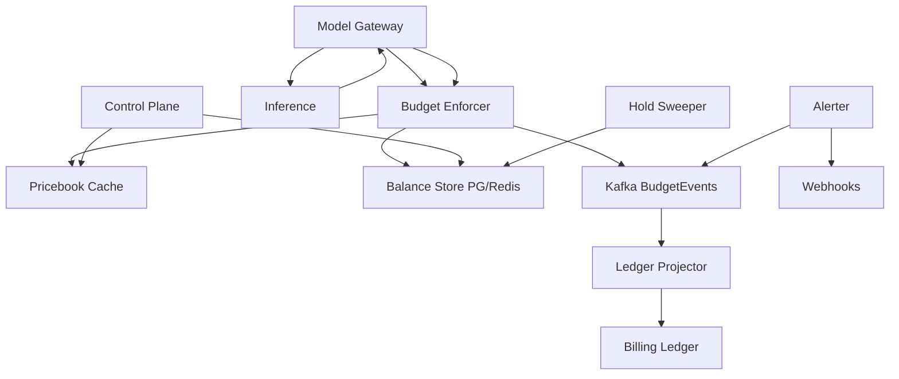

# System Design: Token / Spend Budget Service

> **Focus areas:** Pre-auth holds · Estimate→settle · Multi-currency units · Streaming overage · Soft/hard budgets · Ledger reconciliation  
> **Style:** Financially flavored control of LLM/API spend with progressive scale (10× → 100× → 1,000×)  
> **Domain:** Token budgets and dollar spend caps for tenants/projects/users with reservation lifecycle

---

## Table of Contents

1. [Clarify Requirements (Interview Q&A)](#1-clarify-requirements-interview-qa)
2. [Back-of-the-Envelope Estimation](#2-back-of-the-envelope-estimation)
3. [High-Level Design](#3-high-level-design)
4. [Architecture Diagram](#4-architecture-diagram)
5. [Design Deep Dive](#5-design-deep-dive)
6. [Wrap-Up](#6-wrap-up)
7. [Deeper / Related Interview Questions](#7-deeper--related-interview-questions)

---

## 1. Clarify Requirements (Interview Q&A)

Bound what “budget” means: tokens, USD, or both; when money is committed; and how wrong streaming estimates may be.

### 1.0 What this is / is not

| This is | This is not |
|---------|-------------|
| A **budget reservation & settlement** service for token and/or spend caps | Full invoicing, tax, or payment-method charging (Stripe etc.) |
| Hold → consume → release/refund lifecycle keyed by `request_id` / `run_id` | Pure RPM rate limiter (complementary; often paired) |
| Near-real-time remaining balance for product UX | Perfect bank-grade ledger alone (pairs with double-entry ledger) |
| Enforcement before expensive inference | Batch “bill at end of month” only |

### 1.1 Functional Requirements

| # | Question to ask | Expected / typical interviewer answer | Design implication |
|---|-----------------|----------------------------------------|--------------------|
| F1 | Tokens, dollars, or both? | Both: **token budgets** for capacity + **spend budgets** in micros of USD | Dual meters; price table maps tokens→spend by model |
| F2 | Hierarchy? | Tenant → project → user (optional); model-family sub-caps | Nested budgets with clamp; see hierarchical quotas sibling design |
| F3 | Pre-authorize? | Yes—hold estimated cost before inference starts | Reservation with TTL; deny if insufficient |
| F4 | Streaming overage? | Actual tokens may exceed estimate mid-stream | Top-up holds, soft cut, or hard cancel policy |
| F5 | Soft vs hard budget? | Soft: notify; Hard: block new admits; in-flight policy explicit | Separate thresholds; in-flight drain rules |
| F6 | Period? | Monthly calendar or rolling 30d; prepaid credits | Period buckets + credit grants ledger |
| F7 | Credits / promos? | Promo credits burn before paid balance | Priority stack for funding sources |
| F8 | Idempotency? | Critical—retries must not double-hold | `Idempotency-Key` / `run_id` unique holds |
| F9 | Refunds? | Cancelled runs refund unused hold; completed settle actual | Compensating entries |
| F10 | Price changes? | Price frozen at reservation from pricebook version | Snapshot `pricebook_version` on hold |
| F11 | Multi-region? | Enforce regionally; tenant budget global | Sliced budgets or home-budget region |
| F12 | Visibility? | Remaining, projected burn, alerts at 50/80/100% | Events + headers + webhooks |
| F13 | Overdraft? | Enterprise may allow limited overdraft; free tier no | `overdraft_limit_micros` per tenant |
| F14 | Who can mutate budgets? | Billing admin / platform; not arbitrary API keys | Control-plane AuthZ + audit |

**MVP functional scope:**

1. Budgets in **token units** and **USD micros** per tenant/project.
2. `Reserve(estimate)` → allow inference → `Settle(actual)` / `Release`.
3. Hard block when remaining < estimate (minus overdraft).
4. Pricebook: model → $/1K input, $/1K output (and cached tokens if needed).
5. Streaming policy: mid-flight top-up or cancel at hard cap.
6. Monthly period reset + prepaid credit grants.
7. Usage events to Kafka; Postgres for budget accounts + holds.
8. Alert webhooks at soft thresholds.

**Out of MVP:**

- Tax/VAT invoicing, dunning, payment capture
- Marketplace split billing across sellers
- Real-time FX conversion (assume USD micros)
- Per-token double-entry in the hot path (async ledger OK)

### 1.2 Non-Functional Requirements

| # | Question | Expected answer | Target |
|---|----------|-----------------|--------|
| N1 | Reserve latency | Before model admit | p99 < 5 ms regional |
| N2 | Correctness | No unbounded free inference | Overspend bound ≤ max(estimate error, overdraft, slice skew) |
| N3 | Availability | Budget down → cannot sell inference safely | 99.99% data plane; fail-closed for hard budgets |
| N4 | Durability | Settled spend durable | Postgres + append-only ledger/events; RPO≈0 for settles |
| N5 | Consistency | Read-your-writes for balance UX in home region | Strong on account row / Redis balance; global eventual slices |
| N6 | Audit | Every hold/settle/refund attributable | Immutable event log |
| N7 | Security | No cross-tenant balance read/write | Scoped keys; encrypted pricebook admin |
| N8 | Cost | Hot path not a distributed DB txn per token | Aggregate holds; async fine ledger |

### 1.3 Cases

**Happy paths**

1. User starts run → estimate 2K tokens / $0.02 → reserve → stream → actual $0.015 → settle → release unused.
2. Soft 80% → webhook to admin; requests continue.
3. Hard 100% → new reserves deny; in-flight finish under drain policy.
4. Cancel mid-run → settle partial tokens → refund remainder of hold.
5. Promo credits $10 + paid $100 → burn promo first.

**Edge / failure cases**

| Case | Behavior |
|------|----------|
| Actual ≫ estimate | Attempt top-up reserve; else soft-truncate output / cancel per policy |
| Duplicate reserve same run_id | Return original hold |
| Settle without reserve | Reject or create retrospective hold if policy allows (audit) |
| Pricebook changes mid-run | Use snapshotted version from reserve |
| Period rollover mid-hold | Hold belongs to open period; settle attributes correctly |
| Negative balance race | Conditional update `WHERE balance - hold >= -overdraft` |
| Redis cache of balance stale | SoT conditional update in Postgres/Redis atomic; cache is hint |
| Region partition | Local slice exhaustion may deny early; no unbounded global overspend |
| Refund after invoice close | Issue credit grant; don’t mutate closed statement silently |
| Clock skew on period boundary | Period computed in UTC with explicit tenant TZ rules |

### 1.4 Scales

| Metric | Baseline | 10× | 100× | 1,000× |
|--------|----------|-----|------|--------|
| Tenants with budgets | 10K | 100K | 1M | 10M |
| Reserves / sec | 20K | 200K | 2M | 20M |
| Settles / sec | 20K | 200K | 2M | 20M |
| Avg hold lifetime | 30s | 30s | 30–60s | 30–120s |
| Concurrent holds | 600K | 6M | 60M | 600M |
| Pricebook entries | 500 | 500 | 2K | 5K |
| Alert fanout / day | 10K | 100K | 1M | 10M |
| Ledger lines / day | 5M | 50M | 500M | 5B |

**What each jump forces:**

- **10×:** Redis balance cache + PG durable holds; Kafka ledger projection.
- **100×:** Shard accounts by tenant; regional slices; hold table partitioning.
- **1,000×:** Avoid per-token ledger lines; aggregate settle; cell-local budgets; tiered storage for events.

### 1.5 Etc.

- **Inference dependency:** Model gateway calls Budget Service before admit and on completion.
- **Rounding:** Integer micros and integer tokens only—no floats in money path.
- **Estimate function:** `input_tokens * pin + max_output * pout` (+ tool/image adders).
- **Companion systems:** Hierarchical quotas (RPM/concurrency); double-entry ledger (finance).

**Scope statement:**

> Design a token/spend budget service with estimate holds, settle/refund, soft/hard thresholds, promo credit burn order, and bounded overspend under streaming and multi-region—scaling from ~20K to ~20M reserves/sec.

---

## 2. Back-of-the-Envelope Estimation

### 2.1 Concurrent holds memory

```text
Hold record ≈ 200 B (ids, amounts, versions, expiry)
Baseline: 600K × 200 B ≈ 120 MB
1,000×: 600M × 200 B ≈ 120 GB → shard + TTL compaction mandatory
```

### 2.2 Account update QPS

```text
Each reserve: conditional debit available → held
Each settle: held → spent (+ refund delta)
Peak write pairs ≈ 2 × reserve_qps
Baseline: ~40K balance mutations/s
Postgres single row updates: tens of K/s best case → shard / Redis atomic balances at 10×+
```

### 2.3 Ledger volume

```text
Naive: 1 ledger line per token → impossible
Design: 1–3 lines per request (hold, settle, refund)
Baseline 5M req/day × 2 lines × 100 B ≈ 1 GB/day raw events
1,000×: ~1 TB/day events → object storage + columnar aggregates
```

### 2.4 Bandwidth

```text
Reserve RPC ~300 B round-trip
20K × 300 B ≈ 6 MB/s
20M × 300 B ≈ 6 GB/s → co-locate budget enforcer with gateway (sidecar)
```

### 2.5 Pricebook

```text
5K models × 200 B = 1 MB — fully cached everywhere; versioned
```

### 2.6 Alerting

```text
Crossing 80% once per tenant/period: not per request
Use edge-triggered alerts with hysteresis (clear below 75%)
```

---

## 3. High-Level Design

### 3.1 Account model

```text
BudgetAccount:
  account_id
  tenant_id, project_id?, user_id?
  period_start, period_end
  currency: TOKEN | USD_MICROS
  limit_amount
  overdraft_limit
  spent_amount          # settled
  held_amount           # outstanding reservations
  available := limit + overdraft - spent - held + credits_remaining
  soft_thresholds[]
  version               # optimistic concurrency

CreditGrant:
  grant_id, account_id, remaining, expires_at, priority

Hold:
  hold_id (= run_id)
  account_id
  estimated_tokens, estimated_micros
  pricebook_version
  state: HELD | SETTLED | RELEASED | EXPIRED
  expires_at

PricebookEntry:
  model_id, version
  input_micros_per_1k, output_micros_per_1k, ...
```

**Available balance invariant:**

```text
spent + held ≤ limit + overdraft + active_credits
available = limit + overdraft + credits - spent - held ≥ 0  (for hard, before overdraft use)
```

### 3.2 Lifecycle

```text
RESERVE(run_id, estimate):
  compute cost from pricebook_version
  select funding (promo credits → paid pool)
  if available < cost: DENY
  held += cost; write Hold(HELD); emit event

TOP_UP(run_id, extra):  # streaming
  same as reserve addendum or DENY → cancel signal

SETTLE(run_id, actual_usage):
  cost = price(actual, snapshotted pricebook)
  delta = held - cost
  spent += cost; held -= held_amount
  if delta > 0: return to available / credits
  if delta < 0: try consume extra or record overage debt
  Hold → SETTLED

RELEASE(run_id):
  held -= hold; Hold → RELEASED
```

### 3.3 Streaming overage policies

| Policy | Behavior | UX | Risk |
|--------|----------|-----|------|
| **A. Conservative estimate** | Reserve p95 output | Fewer top-ups | More false denies |
| **B. Top-up** | Additional holds as tokens stream | Continues | More RPCs |
| **C. Soft cut** | Stop generation at hard remaining | Truncated output | Partial answers |
| **D. Allow overdraft** | Finish run, mark debt | Best UX | Financial risk |

**MVP choice:** A + B with small overdraft for paid tiers; C for free tier; never silent infinite stream.

### 3.4 Funding priority (credits)

```text
On reserve/settle burn order:
  1. Expiring promo credits (earliest expiry first)
  2. Non-expiring grants
  3. Period included allowance
  4. Pay-as-you-go / overdraft
```

Store burn allocations on the hold for accurate refunds.

### 3.5 Storage choice

| Data | Store | Why |
|------|-------|-----|
| Account balances + holds | Redis (atomic) + Postgres (durable mirror) OR Postgres with SKIP LOCKED shards | Speed vs durability |
| Pricebook | Postgres + versioned cache | Rare writes |
| Events | Kafka → warehouse / ledger | Audit & billing |
| Alerts state | Redis / PG | Reset hysteresis |

**Recommended MVP:** Redis for hot `available/held/spent` with **write-through async** to Postgres; settle events durable in Kafka before ACK if finance-critical—or sync PG update for settle at lower QPS tiers.

**Staff nuance:** For money, prefer **Postgres conditional update as SoT** at baseline; introduce Redis only with reconciliation. Interview answer: start correct, then optimize with proven reconciler.

### 3.6 APIs

| Method | Path | Purpose |
|--------|------|---------|
| POST | `/v1/budgets/reserve` | Create hold |
| POST | `/v1/budgets/topup` | Mid-stream increase |
| POST | `/v1/budgets/settle` | Final usage |
| POST | `/v1/budgets/release` | Cancel hold |
| GET | `/v1/budgets/accounts/{id}` | Balance snapshot |
| POST | `/v1/budgets/credits` | Grant promo credit |
| PUT | `/v1/budgets/accounts/{id}/limits` | Set caps |
| GET | `/v1/pricebook` | Current prices |
| POST | `/v1/pricebook` | Admin publish new version |

**Reserve:**

```json
{
  "run_id": "run_...",
  "account_selector": {"tenant_id":"t","project_id":"p"},
  "model": "gpt-4o-2026-xx",
  "estimate": {"input_tokens": 1200, "max_output_tokens": 2048},
  "idempotency_key": "run_..."
}
```

### 3.7 Components

```text
Model Gateway
    -> Budget Enforcer (sidecar)
         -> Balance Store (PG and/or Redis)
         -> Pricebook Cache
    -> Inference
    -> settle callback
Control Plane: limits, credits, pricebook admin
Kafka: BudgetEvents → Ledger Projector → Billing
Sweeper: expired holds
Alerter: threshold transitions
Global Slice Coordinator (multi-region)
```

### 3.8 Trade-offs

| Decision | Choose | Alternative | Deal-breaker |
|----------|--------|-------------|--------------|
| Money SoT | Conditional PG row / atomic Redis+reconcile | Best-effort counters | Silent free inference |
| Price snapshot | Freeze on reserve | Always latest | Bill shock / disputes |
| Floats | Forbidden | Double USD | Rounding exploits |
| Global budget | Slices + safety | Sync cross-region txn | Availability collapse |
| Per-token ledger | Aggregate per run | Per token | Storage explosion |

### 3.9 Progressive evolution

- **Baseline:** PG accounts + holds; sync reserve/settle; single region.
- **10×:** Redis hot balances; Kafka events; sweeper; alerts.
- **100×:** Tenant sharding; regional slices; streaming top-up path optimized.
- **1,000×:** Sidecar-only hot path; aggregated settles; cold event tier; whale accounts isolated.

---

## 4. Architecture Diagram

### 4.1 System context



### 4.2 Reserve–stream–settle

```text
Client        Gateway         Budget              Inference
  |              |               |                    |
  | POST run     |               |                    |
  |------------->| reserve       |                    |
  |              |-------------->|                    |
  |              |  held OK      |                    |
  |              |<--------------|                    |
  |              | start stream                     |
  |              |----------------------------------->|
  |  tokens...   |<-----------------------------------|
  |              | topup? optional                    |
  |              |-------------->|                    |
  |              | settle actual |                    |
  |              |-------------->|                    |
  |  completed   |               |                    |
  |<-------------|               |                    |
```

### 4.3 Balance state machine (hold)

```text
HELD --> SETTLED
HELD --> RELEASED
HELD --> EXPIRED --> (sweeper releases)
```

---

## 5. Design Deep Dive

### 5.1 Reliability

#### 5.1.1 Hard invariants

1. **No inference admit without successful hard-budget reserve** (product-configurable exceptions logged).
2. **Hold state machine single-terminal** via CAS.
3. **spent + held ≤ limit + overdraft + credits** after every mutation.
4. **Pricebook version immutability** per hold.
5. **Idempotent reserve/settle/release** by `run_id`.
6. **Audit event for every balance mutation.**

#### 5.1.2 Exactly-once-ish settlement

```text
BEGIN
  read Hold WHERE run_id=? FOR UPDATE
  if state != HELD: return stored result
  apply spent/held/credits
  state = SETTLED
  write outbox event
COMMIT
Ledger projector consumes outbox/Kafka idempotently
```

#### 5.1.3 Failure modes

| Failure | Mitigation |
|---------|------------|
| Crash after inference before settle | Sweeper + gateway retry settle; usage from run record |
| Crash after settle before client ACK | Idempotent settle replay |
| Double inference with one hold | Upstream run idempotency—budget cannot fix alone |
| Expired hold while running | Gateway must top-up/renew TTL periodically |
| Redis/PG divergence | Reconciler job; PG wins for finance |

#### 5.1.4 Overspend bound declaration

Be explicit in the interview:

```text
Max overspend ≈ sum(
  in-flight holds under-estimated,
  regional slice skew,
  overdraft_limit,
  reconciliation lag
)
```

Product sets `overdraft_limit`; engineering minimizes the rest.

#### 5.1.5 Backpressure

If budget store slow: fail-closed (`503`) for new reserves; do not fail-open to free compute. In-flight renewals get priority thread pool.

### 5.2 Scalability

#### 5.2.1 Sharding

- Shard key: `tenant_id` (accounts for a tenant co-located).
- Hot whale: dedicated DB + higher overdraft monitoring.
- Holds table partitioned by time / hash(`run_id`).

#### 5.2.2 Caching

| Cache | TTL | Risk |
|-------|-----|------|
| Pricebook | until version bump | Stale prices if miss invalidation |
| Available balance | ms–s | Over-admit if used alone—must atomic debit SoT |
| Soft alert state | period | Duplicate alerts without hysteresis |

#### 5.2.3 Multi-region

**Option 1 — Home budget region:** all reserves for tenant go to home (exact, higher latency).  
**Option 2 — Slices:** each region gets `limit * weight * safety`; rebalance (like quotas).  

Pick Option 2 for latency-sensitive inference; Option 1 for strict prepaid wallets.

#### 5.2.4 Aggregation for 1,000× ledger

- Hot path: mutate account aggregates only.
- Emit one `BudgetSettled` event per run with token breakdown.
- Warehouse builds daily cubes; finance ledger may create summarized journal entries.

### 5.3 Maintainability

#### 5.3.1 Pricebook ops

- Publish is append-only version; never edit historical version.
- Canary: shadow price computation vs old.
- Model alias → concrete price rows.

#### 5.3.2 Observability

| Metric | Notes |
|--------|-------|
| reserve_deny_total{reason} | limit, overdraft, store_down |
| overspend_micros | estimated bound tracking |
| hold_expire_total | should be ~0 |
| settle_latency | |
| credit_burn_micros | |

Trace: `run_id` through reserve/settle.

#### 5.3.3 Migrations

- New fee dimensions (cached input tokens): additive fields on settle; old settlers default 0.
- Period change: close accounts, open new rows—don’t rewrite history.

#### 5.3.4 Support tooling

- “Explain balance” API: spent, held, credits, holds outstanding list.
- Force-release stuck hold with audit (ops role).

---

## 6. Wrap-Up

### 6.1 Decision summary

| Area | Decision |
|------|----------|
| Units | Integer tokens + USD micros |
| Lifecycle | Reserve → top-up? → settle/release |
| Prices | Versioned pricebook snapshotted on hold |
| Credits | Burn promo first, track allocation |
| Streaming | Top-up + free-tier hard cut |
| SoT | Conditional account updates + event log |
| Global | Regional slices or home region |
| Failure | Fail-closed on hard budgets |

### 6.2 Phased rollout

1. Tenant monthly USD hard cap, sync PG, no credits.
2. Token budgets + pricebook + settle from usage.
3. Credits, soft alerts, streaming top-up.
4. Redis/sidecar acceleration + multi-region slices.
5. Whale isolation + warehouse-grade event tiering.

### 6.3 Closing line

> A budget service is **pre-authorization for expensive side effects**: freeze price, hold funds, settle actuals, and state your overspend bound—not a decorative remaining-tokens counter.

---

## 7. Deeper / Related Interview Questions

1. **Why snapshot pricebook on reserve?**  
   Prevents mid-run price changes from causing bill shock or arbitrage.

2. **Why integers only?**  
   Floats accumulate rounding error; money paths use fixed-point micros.

3. **How is this different from a rate limiter?**  
   Rate limiter: velocity; budget: cumulative economic/capacity allocation over a period.

4. **What if settle never comes?**  
   Hold TTL + sweeper; gateway durable intent to settle from run record.

5. **How to handle tool calls that add cost mid-run?**  
   Top-up API; include tool price classes in pricebook.

6. **Can available balance go negative?**  
   Only within `overdraft_limit`; enforce with conditional updates.

7. **Promo credit expiry during a hold?**  
   Soft-reserve credit id on hold; if expired before settle, re-fund from next source or deny top-up.

8. **How do you prevent double spend of the same credit?**  
   Row locks / atomic decrement on `CreditGrant.remaining`.

9. **Should Redis be SoT for money?**  
   Risky; if used, require reconciler and finance SoT in PG/ledger.

10. **How to compute good estimates?**  
   `input + max_output` priced; calibrate max_output from client param; add safety margin %.

11. **What headers do clients see?**  
   Remaining tokens/USD, reset time, soft/hard flags—document as eventually consistent under concurrency.

12. **Monthly vs rolling window?**  
   Monthly aligns with invoices; rolling is fairer for continuous use—product choice.

13. **How does retry of reserve interact with idempotency?**  
   Same key returns same hold; different body hash → 409.

14. **Cross-project transfer of budget?**  
   Control-plane transfer journal entries; not hot-path.

15. **How to test overspend bounds?**  
   Chaos: kill settler, spam streams, partition regions; measure max overspend.

16. **Relation to double-entry ledger?**  
   Budget service enforces; ledger records immutable financial facts asynchronously.

17. **What about cached/prompt-discount tokens?**  
   Settle must include token type breakdown; pricebook has rates per class.

18. **Burst at period start?**  
   Entire monthly limit available day 1 unless paced—optional budget pacing sibling design.

19. **Fail-open for internal models?**  
   Maybe; never for billable external customers without explicit flag + page.

20. **How to represent unlimited enterprise?**  
   Null limit with fair-use soft caps + anomaly alerts—not “skip budget service.”

21. **Shard by user instead of tenant?**  
   Breaks project rollups and atomic tenant caps—tenant shard preferred.

22. **Can holds exceed limit if spent is low?**  
   Yes temporarily; invariant uses spent+held.

23. **GDPR deletion of budget events?**  
   Retain financial records per law; anonymize user keys where required.

24. **How do you pace spend smoothly through the month?**  
   Optional pacing multiplier on available = f(time_left); separate from hard limit.

25. **What’s the biggest production footgun?**  
   Leaked holds (concurrency of money) → false exhaustion; invest in sweeper + metrics.

26. **Streaming cancel vs settle race?**  
   CAS hold state; single winner applies amounts; loser no-ops.

## Appendix — Deep dive notes for Token- or spend-budget service

### Hardest invariants
- Define the correctness property that must not break under retries, partial failures, or overload.
- Define multi-tenant isolation boundaries if applicable.
- Define delete/TTL/privacy semantics across primary + cache + search + logs.

### Likely bottlenecks
1. Hot keys / hot partitions for core entity ids
2. Synchronous dependency latency tails (p99)
3. Write amplification from secondary indexes / fanout
4. Compaction / GC / backfill stealing cluster IO
5. Cross-region chatty patterns

### Suggested metrics (RED + business)
| Metric | Why |
|--------|-----|
| Request rate / error / duration | Golden signals |
| Saturation (CPU, pool, queue lag) | Leading indicator |
| Idempotency conflict rate | Client retry health |
| Cache hit ratio | Origin protection |
| Business SLI for Token- or spend-budget service | Product truth |

### Migration & rollout
- Expand/contract schema changes
- Dual-write or shadow reads for store migrations
- Feature-flagged cutover; canary on error budget
- Backfill with checkpoints and replayable logs

### What interviewers poke next
- Memory footprint of your cache/index choice
- Exact concurrency control (locks vs OCC vs ledger)
- Cost model at 100×
- Abuse cases unique to Token- or spend-budget service

## Appendix A — Interview execution checklist

1. **Repeat scope** in one sentence; list out-of-scope.
2. **Write NFRs as numbers** (QPS, p99, RPO/RTO).
3. **Draw** clients → edge → svc → store → async.
4. **Call the hardest invariant** early.
5. **Pick consistency** deliberately; do not say “strong everywhere.”
6. **Show scale jumps** at 10× / 100× / 1,000× with architecture changes.
7. **Name failure modes** and degraded behavior.
8. **Close** with metrics, rollout, and residual risks.

## Appendix B — Trade-off flashcards

| Topic | Prefer | Avoid |
|-------|--------|-------|
| Sync vs async | Sync for money/authz ack | Sync for fanout/email/indexing |
| SQL vs KV | Multi-row invariants | Ultra-high simple point ops |
| Cache | Read-heavy + tolerable stale | Incorrect money reads |
| Queue | Spike absorb + retry | Hidden request/response bus |
| Multi-region | Home cell single-writer | Multi-writer without merge rules |

## Appendix C — Reliability patterns to name drop correctly

- Idempotency keys + request hash
- Outbox / transactional messaging
- Leases + fencing tokens
- Quorum / consensus (Raft) for coordination—not for every data path
- Bulkheads + circuit breakers + deadlines
- Load shedding + admission control
- Canary + automatic rollback on SLO burn
- Backup restore drills (backup ≠ restore tested)

## Appendix D — Scalability patterns

- Consistent hashing with virtual nodes
- Hierarchical sharding (cell → shard → partition)
- CQRS / projections for read models
- Hot-key splitting and salting
- Tiered storage + compaction budgets
- Consumer parallelization by partition
- Edge caching with purge/surrogate keys

## Appendix E — Sample capacity dialogue

```text
Interviewer: Assume 10M DAU.
You: 10M DAU × 5 key actions/day ≈ 50M events/day ≈ 580 QPS avg.
Peak 15× ⇒ ~9K QPS. With 70% cache hit on reads, origin ~2.7K QPS.
At 100×, origin ~270K QPS ⇒ shard + edge mandatory.
```

Customize the action rate to this problem; do not reuse social-feed numbers for a ledger.


*Enriched for interview drill · `token-spend-budget-service`*
