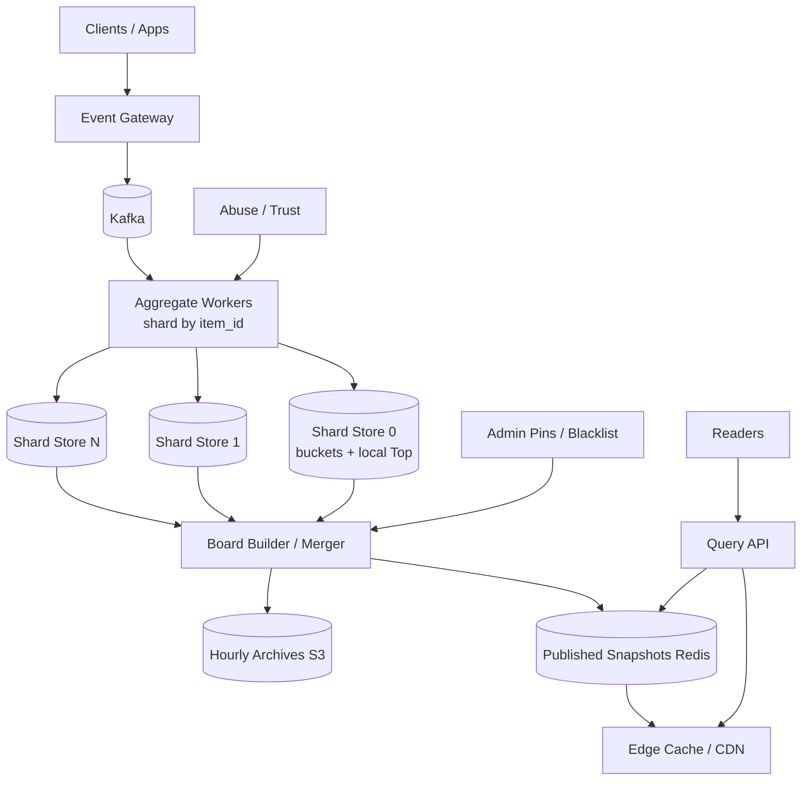
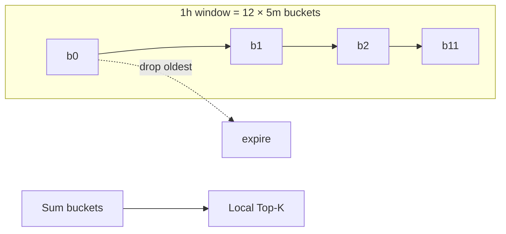

# System Design: Top-K / Trending Items Service

> **Focus areas:** Sliding windows · Count-Min / heaps · Sharded aggregation · Freshness · Anti-abuse · Fanout  
> **Style:** End-to-end product design with progressive scale (10× → 100× → 1,000×)  
> **Quality bar:** Correct arithmetic, explicit invariants, honest MVP vs extreme-scale paths, failure-first reasoning  
> **Interview theme:** Social / commerce / media — “what’s trending now” under write storms

---

## Table of Contents

1. [Clarify Requirements (Interview Q&A)](#1-clarify-requirements-interview-qa)
2. [Back-of-the-Envelope Estimation](#2-back-of-the-envelope-estimation)
3. [High-Level Design](#3-high-level-design)
4. [Architecture Diagram](#4-architecture-diagram)
5. [Design Deep Dive](#5-design-deep-dive)
6. [Wrap-Up](#6-wrap-up)
7. [Deeper / Related Interview Questions](#7-deeper--related-interview-questions)

---

## 1. Clarify Requirements (Interview Q&A)

Design a service that maintains **Top-K trending items** over recent time windows (global, per-category, per-region), with bounded error under extreme write rates.

### 1.0 What this is / is not

| Dimension | This is | This is not |
|-----------|---------|-------------|
| Job | Rank items by recent engagement velocity | Full personalized feed ranking |
| Query | Top-K lists + item score/rank approx | Arbitrary historical OLAP |
| Freshness | Seconds to low minutes | Only daily batch |
| Accuracy | Exact at small scale; approx OK at huge | Financial ledger exactness |
| Users | App surfaces, editors, ads | Warehouse analysts primarily |

### 1.1 Functional Requirements

| # | Question to ask | Expected / typical interviewer answer | Design implication |
|---|-----------------|----------------------------------------|--------------------|
| F1 | What is an “item”? | Posts, products, videos, search queries, hashtags | Opaque `item_id` + type |
| F2 | What events count? | Views, likes, shares, purchases — weighted | Event → score delta mapping |
| F3 | Windows? | 15m, 1h, 24h, 7d | Multi-window structures or rollups |
| F4 | K? | Top 100 default; up to 1000 | Bound heap sizes; cache lists |
| F5 | Dimensions? | Global + category + geo | Key = `(window, dim_type, dim_id)` |
| F6 | Exact vs approximate? | Exact until it hurts; approx OK with error bound | CMS + heap / SpaceSaving |
| F7 | Trending vs popular? | Trending = velocity / z-score / EWMA not lifetime count | Store recent + baseline |
| F8 | Anti-abuse? | Yes — blocklist, rate limit, trust weights | Pre-agg filters |
| F9 | Personalization? | Not in MVP; optional rerank later | Serve global lists; client/edge rerank |
| F10 | Admin controls? | Pin / bury / blacklist | Overlay layer on serving |
| F11 | API consumers? | Edge CDN + app BFF | Aggressive caching of Top-K payloads |
| F12 | Historical trending? | Archive hourly snapshots | Cold store; not hot path |
| F13 | Soft delete items? | Remove from boards quickly | Invalidate + tombstone |
| F14 | Multi-tenant? | Yes if platform; else single app | Tenant prefix in keys |

**MVP scope:**

1. Ingest engagement events (at-least-once) with weights.
2. Maintain Top-K for global + few categories over 1h and 24h.
3. `GET /trending` returns list with scores; p99 < 50ms from cache.
4. Basic abuse: per-user rate limit + item blacklist.
5. Admin pin/bury.
6. Metrics: freshness lag, update QPS, cache hit rate.

**Out of MVP:**

- Full personalization / follow-graph trending
- Exact global ranks for millions of items on every query
- Complex ML trend prediction (hooks only)
- Cross-region strongly consistent boards

### 1.2 Non-Functional Requirements

| # | Question | Expected answer | Target |
|---|----------|-----------------|--------|
| N1 | Read latency | Homefeed module | p99 < 20–50ms cached |
| N2 | Write ack | Async OK | Ingest p99 < 100ms to log |
| N3 | Freshness | “Live enough” | Visible in Top-K within 5–30s |
| N4 | Availability | Degrade to slightly stale | 99.9% reads; stale > down |
| N5 | Accuracy | Relative ordering of head | Head exact-ish; tail approx OK |
| N6 | Durability | Rebuild from log | Loss of RAM OK if log retained |
| N7 | Multi-region | Read replicas / regional boards | Regional compute; merge carefully |
| N8 | Cost | RAM for sketches/heaps | Bound memory per board |

### 1.3 Cases

**Happy paths**

1. Viral item receives burst of likes → climbs 1h board within seconds.
2. Client fetches Top-100 global 1h from CDN/edge cache.
3. Editor pins item #1 → overlay forces position.
4. Abusive user spam → rate limited; contributions dampened.
5. Item deleted → disappears from boards on next publish cycle.

**Edge / failure cases**

| Case | Behavior |
|------|----------|
| Celebrity flood / hot partition | Shard by item; tree-aggregate Top-K |
| Botnets inflate trends | Trust scores; anomaly detection; human review queue |
| Clock skew on event time | Use server receive time for MVP; event time later with watermarks |
| Negative events (unlike) | Allow decrements with floor 0; or ignore in MVP |
| Board stampede on cache miss | Singleflight / request coalescing |
| Approx error surfaces wrong #3 | Accept bound; periodically reconcile exact for head |
| Region split brain | Regional boards; global = merge of regional Top-K candidates |
| Seasonality (Prime Day) | Pre-scale; widen shards; raise cache TTL slightly |

### 1.4 Scales

| Metric | Baseline | 10× | 100× | 1,000× |
|--------|----------|-----|------|--------|
| Event ingest/s | 100K | 1M | 10M | 100M |
| Distinct items / window | 5M | 20M | 100M | 500M+ |
| Boards (dims×windows) | 200 | 2K | 20K | 200K |
| Read QPS Top-K | 20K | 200K | 2M | 20M |
| K | 100 | 100–1K | 100–1K | 100 |
| Freshness target | 10s | 10s | 15–30s | 30–60s |
| Memory (hot) | 50 GB | 300 GB | multi-TB fleet | sketches mandatory |

**What each jump forces:**

- **10×:** Shard aggregators; Redis heaps; CDN cache lists.
- **100×:** Count-Min / SpaceSaving; hierarchical Top-K merge; regional cells.
- **1,000×:** Heavy approx; sample low-value events; edge hold lists; offline exact for editors.

### 1.5 Etc.

- **Weights:** like=1, share=3, purchase=10 — product-defined.
- **Trending formula:** `score = w_recent - α * w_baseline` or EWMA velocity.
- **Privacy:** no user ids in serving lists.

**Scope repeat-back:**

> Design a **Top-K trending service**: ingest weighted engagement, maintain multi-window multi-dimension boards with bounded memory, serve cached Top-K with seconds-level freshness, and degrade gracefully from exact heaps to sketch-based aggregation as scale grows 1,000×.

---

## 2. Back-of-the-Envelope Estimation

### 2.1 Ingest

```text
Baseline 100K events/s × 200B ≈ 20 MB/s
1,000×: 100M/s × 200B ≈ 20 GB/s → regional ingestion mandatory
```

### 2.2 Naive exact cost (deal-breaker)

```text
Track count per item in 1h window for 100M items:
100M × 16B ≈ 1.6 GB per board counter alone
Many boards × windows → hundreds of GB–TBs
Exact sliding window with per-event storage worse by 10–100×
```

### 2.3 Heap / Top-K memory

```text
Per board: store HashMap of counts for “active” + heap of size K
If only Top-K needed and use SpaceSaving(m=10K):
10K × 32B ≈ 320 KB / board
20K boards × 320KB ≈ 6.4 GB  ← feasible
```

### 2.4 Count-Min Sketch sizing

```text
CMS width w=2^20 (~1M), depth d=4, int64 counters
Memory ≈ 1M × 4 × 8 ≈ 32 MB / sketch
Error ~ n/w ; for n=1e8 events, error ~ 100 — OK if scores large for head
```

### 2.5 Read path

```text
Top-K payload ~100 × 40B = 4 KB
20K QPS × 4KB = 80 MB/s egress — trivial with CDN
Cache TTL 2–5s → origin QPS collapses by 10–50×
```

### 2.6 Load classes

| Class | What | Baseline | 1,000× |
|-------|------|----------|--------|
| A | Event ingest | 100K/s | 100M/s |
| B | Aggregate updates | 100K/s | 100M/s |
| C | Board publish | every 1–5s / board | sampled |
| D | Read origin | 1–2K/s after cache | still cached |
| E | Snapshot archive | hourly | hourly |

---

## 3. High-Level Design

### 3.1 Score model

```text
event: {item_id, type, user_id, ts, dim_keys[]}
delta = weight(type) * trust(user) * abuse_multiplier

boards updated:
  for each dim in dim_keys ∪ {global}:
    for each window in [1h, 24h]:
      update(board_key, item_id, delta, ts)
```

**Trending score options:**

| Formula | Pros | Cons |
|---------|------|------|
| Raw window count | Simple | Popular ≠ trending |
| EWMA velocity | Smooth | Param tuning |
| z-score vs baseline | True “spike” | Needs baseline store |
| Gravity (HN-like) | Time decay | Less “right now” |

**MVP:** sliding window counts; **Phase 2:** subtract baseline / use velocity.

### 3.2 Algorithms

#### A. Exact sharded counters + heap (baseline → 10×)

- Per shard: `item → count` in Redis HASH or local map.
- Maintain local Top-K heap.
- Query merges shard heaps (size `shards × K`) → global Top-K.

#### B. Space-Saving / StreamSummary (100×)

- Fixed `m` counters; guarantees on heavy hitters.
- Mergeable with care; good for Top-K heavy hitters.

#### C. Count-Min + heap of candidates (100×–1,000×)

- CMS estimates frequency; heap tracks potential heavy hitters.
- Periodically re-verify head against more exact shard counters.

**Deal-breaker:** single global Redis `ZSET` of all items at 100× — hot key + memory + O(log N) storms.

### 3.3 Sliding window techniques

| Technique | Mechanism | Trade-off |
|-----------|-----------|-----------|
| Tumbling buckets | N buckets of width W/N; sum | Approx; simple |
| Sliding ring | Circular buckets | Good MVP |
| Exponential decay | score *= e^{-λΔt} | No hard window |
| Exact window | per-event store | Memory blowup |

**Choice:** time buckets (e.g. 1h window = 12 × 5m buckets); drop oldest bucket.

### 3.4 APIs

| Method | Path | Purpose |
|--------|------|---------|
| POST | `/events` | Ingest (or via Kafka only) |
| GET | `/v1/trending?window=1h&dim=global&k=100` | Top-K |
| GET | `/v1/items/{id}/score?window=1h` | Approx score |
| POST | `/admin/boards/{id}/pin` | Pin overlay |
| POST | `/admin/blacklist` | Block item |
| GET | `/internal/boards/{id}/debug` | Shard stats |

### 3.5 Components

```text
Clients → Event Gateway → Kafka
              ↓
     Aggregate Workers (sharded by item_id)
              ↓
     Board Builders (per dim) → merge → Published Lists (Redis/CDN)
              ↓
     Query API → Cache → Published Lists
              ↓
     Admin Overlay + Abuse Services
```

### 3.6 Serving merge

```text
every T seconds:
  for each board:
    gather top-K from each shard (or sketch digest)
    merge by score
    apply blacklist / bury
    apply pins
    publish snapshot version++
```

Readers only see published snapshots — **not** partial merges.

### 3.7 Option analysis

| Storage for published Top-K | Pros | Cons | Deal-breaker |
|-----------------------------|------|------|--------------|
| **Redis STRING/JSON + version** | Fast | Rebuild on loss | Storing all counters only here |
| CDN object | Mega read scale | Invalidation delay | Sub-second global consistency need |
| Postgres | Durable | Too slow at 2M QPS | Hot path SQL |

| Aggregation | Pros | Cons | Deal-breaker |
|-------------|------|------|--------------|
| **Sharded exact buckets** | Accurate head | Memory | 1,000× all boards exact |
| Sketches | Bounded mem | Error | Money ranking |
| Single ZSET | Simple | Hotspot | 100× writes |

### 3.8 Anti-abuse

- Per-user contribution caps per item per window.
- Device / IP clustering dampeners.
- New-item velocity anomaly → holds before entering Top-10.
- Human review for #1–#10 candidates in sensitive apps.

---

## 4. Architecture Diagram





---

## 5. Design Deep Dive

### 5.1 Reliability

| Risk | Mitigation |
|------|------------|
| Lost RAM counters | Rebuild from Kafka within retention; publish lag alert |
| Duplicate events | Dedup id short TTL or idempotent additive with exactly-once-ish sink |
| Poison item_id flood | Schema validation; max dims; rate limits |
| Bad publish | Versioned snapshots; atomic swap; rollback pointer |
| Abuse takeover | Caps + quarantine + admin bury |

**Degradation order:** stale lists (extend TTL) → hide velocity, show last good → category boards off → global only.

### 5.2 Scalability

#### Hierarchical Top-K

```text
item shards → local Top-K
             → regional merge Top-K
             → global merge Top-K
```

Merging Top-K from each shard yields correct global Top-K **if** each shard returns Top-K (classic property). For approximate shards, merge candidates then re-score.

#### Scale jumps

| Jump | Move |
|------|------|
| 10× | Kafka + sharded Redis buckets; CDN |
| 100× | Sketches; more dims via lazy boards; regional |
| 1,000× | Sample events (views 1%); separate purchase path exact; edge |

#### Hot items

Hot `item_id` shard: local combine before remote write; write coalescing every 50–100ms.

### 5.3 Maintainability

**Metrics:** ingest lag, board freshness (`now - snapshot_ts`), approx error samples, abuse rejects, cache hit, publish failures.

**Config:** weights, windows, K, pin lists — dynamic with careful rollout.

**Multi-tenant:** key prefix; noisy tenant isolation on dedicated workers.

**Migrations:** changing weights mid-window — either reset window or dual-score until buckets rotate.

---

## 6. Wrap-Up

### 6.1 Decisions

| Area | Choice |
|------|--------|
| Window | Bucketed sliding rings |
| Agg | Sharded exact → SpaceSaving/CMS at scale |
| Serve | Published snapshots + CDN |
| Abuse | Caps + blacklist + quarantine |
| Consistency | Eventual; freshness SLO over global exact |

### 6.2 Phased rollout

1. Global+category, 1h/24h, Redis shards, exact buckets.
2. Admin overlay, abuse caps, archives.
3. Sketches, regional merge, baseline velocity scoring.
4. Sampling + edge hold + ML candidate boost (optional).

### 6.3 One-liner

> **Shard the writes, approximate the long tail, publish atomic Top-K snapshots, and never put a single global ZSET in the blast radius.**

---

## 7. Deeper / Related Interview Questions

**Q1. Why not `SORT BY count DESC LIMIT K` in SQL each read?**  
Write amplification and read latency explode; no multi-window in-memory efficiency.

**Q2. Prove shard merge of Top-K works.**  
Any global Top-K item must be in some shard’s Top-K; collect ≤ `shards×K` candidates; pick best K.

**Q3. Count-Min error for ranking?**  
Absolute error can reorder close scores; mitigate with larger width, candidate re-verification, or only trust large gaps.

**Q4. Sliding vs tumbling?**  
Tumbling cheaper; sliding smoother. Buckets approximate sliding.

**Q5. Memory for exact 24h unique users per item (hyperloglog)?**  
HLL ~12KB/item → 1M items ≈ 12GB; use only for “unique engagers” boards selectively.

**Q6. Consistent hashing for item shards?**  
Yes; virtual nodes; on rehash, dual-write or rebuild from log.

**Q7. Cache stampede?**  
Singleflight; stale-while-revalidate; jittered TTL.

**Q8. Personalized trending?**  
Retrieve global candidates (500) + user features rerank — don’t maintain per-user boards.

**Q9. Multi-region global board?**  
Merge regional Top-K candidates every T seconds; accept brief divergence.

**Q10. How to handle unlike / revoke?**  
Decrement in current buckets; can’t easily fix expired buckets — accept or store signed events.

**Q11. Load balancer for aggregators?**  
Prefer Kafka partition assignment over LB; query API is LB’d.

**Q12. Data structure for local Top-K?**  
Min-heap of size K + hash count map; or Redis `ZSET` per shard board limited with eviction of non-candidates periodically.

**Q13. When is sampling OK?**  
High-volume low-weight views; never sample rare high-weight purchases if they drive commerce trending.

**Q14. Gravity score vs window?**  
Gravity needs continuous decay ops; windows need bucket churn — pick based on product language (“last hour” vs “hot now”).

**Q15. Hot key item_id?**  
Coalesce; dedicated hot shard; hierarchical counters.

**Q16. Exactly-once updates?**  
Prefer additive idempotency keys short TTL; or accept at-least-once with rare double count (bounded).

**Q17. Indexing archives?**  
Hive/Partition `date/hour/board_id` Parquet; not serving path.

**Q18. Security?**  
Admin authZ; signed ingest; prevent score injection from clients (server-side weights only).

**Q19. Deal-breakers?**  
One global ZSET; per-user trending materialization; exact per-event window store at 100M/s.

**Q20. How do apps like Twitter/Reddit approximate?**  
Heavy hitters algorithms, hierarchical aggregation, aggressive caching, human/editorial overlays.

**Q21. Failure of board builder?**  
Readers keep last snapshot; alert on freshness SLO; active-standby builders with leader election.

**Q22. K=1,000,000?**  
That’s a search problem, not Top-K trending — refuse or approximate differently.

**Q23. Cold start new category board?**  
Lazy create on first event; publish when min volume threshold hit.

**Q24. A/B test weights?**  
Parallel boards with experiment id; careful about user-visible inconsistency.

**Q25. Interaction with recommendation systems?**  
Trending is a candidate source; ranking models re-rank with personalization.

**Q26. Bloom filters role?**  
Blacklist membership; “seen in window” approx — not primary scoring.

**Q27. Time sync?**  
NTP; prefer broker timestamp; document skew impact on buckets.

**Q28. Cost/RAM governance?**  
Quota boards per tenant; max dimensions; sketch-first for free tier.

---

*End of doc — Top-K / trending items.*

## Appendix — Deep dive notes for Top-K or trending-items service

### Hardest invariants
- Define the correctness property that must not break under retries, partial failures, or overload.
- Define multi-tenant isolation boundaries if applicable.
- Define delete/TTL/privacy semantics across primary + cache + search + logs.

### Likely bottlenecks
1. Hot keys / hot partitions for core entity ids
2. Synchronous dependency latency tails (p99)
3. Write amplification from secondary indexes / fanout
4. Compaction / GC / backfill stealing cluster IO
5. Cross-region chatty patterns

### Suggested metrics (RED + business)
| Metric | Why |
|--------|-----|
| Request rate / error / duration | Golden signals |
| Saturation (CPU, pool, queue lag) | Leading indicator |
| Idempotency conflict rate | Client retry health |
| Cache hit ratio | Origin protection |
| Business SLI for Top-K or trending-items service | Product truth |

### Migration & rollout
- Expand/contract schema changes
- Dual-write or shadow reads for store migrations
- Feature-flagged cutover; canary on error budget
- Backfill with checkpoints and replayable logs

### What interviewers poke next
- Memory footprint of your cache/index choice
- Exact concurrency control (locks vs OCC vs ledger)
- Cost model at 100×
- Abuse cases unique to Top-K or trending-items service

## Appendix A — Interview execution checklist

1. **Repeat scope** in one sentence; list out-of-scope.
2. **Write NFRs as numbers** (QPS, p99, RPO/RTO).
3. **Draw** clients → edge → svc → store → async.
4. **Call the hardest invariant** early.
5. **Pick consistency** deliberately; do not say “strong everywhere.”
6. **Show scale jumps** at 10× / 100× / 1,000× with architecture changes.
7. **Name failure modes** and degraded behavior.
8. **Close** with metrics, rollout, and residual risks.

## Appendix B — Trade-off flashcards

| Topic | Prefer | Avoid |
|-------|--------|-------|
| Sync vs async | Sync for money/authz ack | Sync for fanout/email/indexing |
| SQL vs KV | Multi-row invariants | Ultra-high simple point ops |
| Cache | Read-heavy + tolerable stale | Incorrect money reads |
| Queue | Spike absorb + retry | Hidden request/response bus |
| Multi-region | Home cell single-writer | Multi-writer without merge rules |

## Appendix C — Reliability patterns to name drop correctly

- Idempotency keys + request hash
- Outbox / transactional messaging
- Leases + fencing tokens
- Quorum / consensus (Raft) for coordination—not for every data path
- Bulkheads + circuit breakers + deadlines
- Load shedding + admission control
- Canary + automatic rollback on SLO burn
- Backup restore drills (backup ≠ restore tested)

## Appendix D — Scalability patterns

- Consistent hashing with virtual nodes
- Hierarchical sharding (cell → shard → partition)
- CQRS / projections for read models
- Hot-key splitting and salting
- Tiered storage + compaction budgets
- Consumer parallelization by partition
- Edge caching with purge/surrogate keys

## Appendix E — Sample capacity dialogue

```text
Interviewer: Assume 10M DAU.
You: 10M DAU × 5 key actions/day ≈ 50M events/day ≈ 580 QPS avg.
Peak 15× ⇒ ~9K QPS. With 70% cache hit on reads, origin ~2.7K QPS.
At 100×, origin ~270K QPS ⇒ shard + edge mandatory.
```

Customize the action rate to this problem; do not reuse social-feed numbers for a ledger.


*Enriched for interview drill · `topk-trending-items`*
