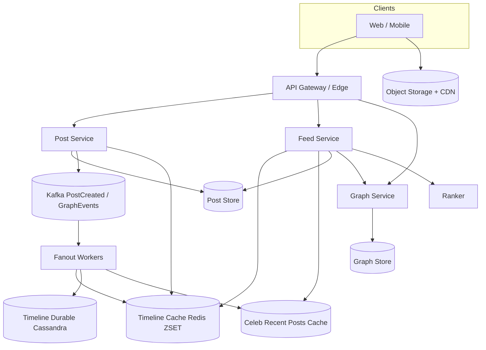

# System Design: Twitter / Facebook / LinkedIn News Feed

> **Focus areas:** Fanout-on-write vs fanout-on-read · Home timeline · Ranking · Celebrity / hybrid fanout · Graph + timeline stores · Cache · Progressive scale  
> **Style:** Senior/staff interview prep with progressive scale (10× → 100× → 1,000×)  
> **Product orientation:** Home feed of posts from accounts you follow (Twitter/X, Facebook News Feed, LinkedIn Feed)

---

## Table of Contents

1. [Clarify Requirements (Interview Q&A)](#1-clarify-requirements-interview-qa)
2. [Back-of-the-Envelope Estimation](#2-back-of-the-envelope-estimation)
3. [High-Level Design](#3-high-level-design)
4. [Architecture Diagram](#4-architecture-diagram)
5. [Design Deep Dive](#5-design-deep-dive)
6. [Wrap-Up](#6-wrap-up)
7. [Deeper / Related Interview Questions](#7-deeper--related-interview-questions)

---

## 1. Clarify Requirements (Interview Q&A)

The goal of this phase is to **bound the problem**: timeline semantics, ranking depth, celebrity handling, and at what scale pure push or pure pull breaks.

### 1.0 What this is / is not

| This is | This is not |
|---------|-------------|
| Home timeline: posts from followed accounts (and some ranked suggestions) | Full Twitter/X product (DMs, Spaces, ads auction, Trends as a product) |
| Publish → fanout → ranked read path | Search index design (mention, but defer) |
| Social graph for follows + mute/block | Mutual-friends graph product (separate problem) |
| Soft-realtime freshness (seconds–minutes) | Strict transactional feeds or financial ledgers |

### 1.1 Functional Requirements

| # | Question to ask | Expected / typical interviewer answer | Design implication |
|---|-----------------|----------------------------------------|--------------------|
| F1 | What is a “post”? | Text + optional media refs; max ~280–2000 chars depending on product | Post store separate from timeline pointers; media via object storage + CDN |
| F2 | Chronological or ranked? | **MVP:** chronological-or-light-rank. **Staff:** ranked home with relevance + freshness | Ranking service optional at MVP; interface as pluggable scorer |
| F3 | Follow graph semantics? | Directed follow (Twitter) or undirected friends (FB/LinkedIn). Assume **directed follows** unless told otherwise | Adjacency lists: `following` + `followers`; fanout uses followers |
| F4 | Who sees a new post? | Followers’ home timelines; optionally “For You” candidates later | Push to follower timelines and/or pull at read |
| F5 | Celebrity / mega-influencer handling? | Yes — some users have 10M–100M followers | **Hybrid fanout** required; pure push explodes |
| F6 | Mute, block, soft-delete, edit? | Mute/block must hide; delete eventually removes; edit is soft (versioned) | Filter at read; tombstones; never rely only on push copies |
| F7 | Pagination / infinite scroll? | Cursor-based, stable under inserts | Opaque cursor = `(score_or_ts, post_id)`; no offset pagination |
| F8 | Realtime push to open clients? | Nice-to-have; polling/long-poll OK for MVP | Optional fanout to push gateway; not on critical publish path |
| F9 | Retweets / shares / quote posts? | Phase 1.5; model as new post with pointer | Pointer + original_post_id; ranking may boost engagement |
| F10 | Ads / promoted posts? | Out of MVP; leave injection hook | Ranked list merges organic + ads via slots |
| F11 | Multi-device consistency? | Eventual OK within ~1–5s; read-your-writes for publisher | Publisher sees own post immediately via write-through |
| F12 | Visibility (private accounts)? | MVP public; private = followers-only later | ACL check at pull / fanout filter |
| F13 | Notifications on new posts? | Separate notification system; mention only | Publish emits event; notifications consume asynchronously |

**MVP functional scope (lock this with interviewer):**

1. User follows/unfollows accounts.
2. User creates a post (text + media refs).
3. Home feed returns recent posts from followed accounts (chronological or light-ranked).
4. Cursor pagination; pull-to-refresh.
5. Mute/block filters applied on read.
6. Soft-delete post eventually disappears from feeds.
7. Hybrid handling for high-follower accounts.

**Out of MVP (explicitly defer):**

- Full ML ranking / For You exploration
- Ads auction and pacing
- Live Spaces / video rooms
- Full-text search and hashtag trends product
- Cross-post editing history UI
- Strong multi-region active-active timelines

### 1.2 Non-Functional Requirements

| # | Question | Expected answer | Target |
|---|----------|-----------------|--------|
| N1 | Feed read latency? | Feels instant | p50 < 100ms, p99 < 300ms (cached home) |
| N2 | Publish latency to followers? | Soft realtime | p50 < 1s for normal accounts; celebrities eventual via pull |
| N3 | Availability? | Feed is core product | 99.95% read path; publish 99.9% |
| N4 | Durability? | No lost posts | Posts durable before ACK; fanout async with at-least-once |
| N5 | Consistency? | Read-your-writes for author; eventual for followers | Author write-through; followers within seconds |
| N6 | Multi-region? | Home region writable; global reads | Cell / user-home region for graph + timeline shards |
| N7 | Hot-key tolerance? | Celebrity posts must not melt Redis | Hybrid fanout + pull cache for celebs |
| N8 | Cost? | Storage of timelines dominates at scale | Cap timeline length; cold tier older posts |

### 1.3 Cases (User Flows & Edge Cases)

**Happy paths**

1. Follow A → A’s future posts appear in home feed.
2. Publish post → durable store → fanout workers push into followers’ timeline caches → followers see on next refresh.
3. Scroll feed → cursor page of hydrated posts (author, text, media URLs, like counts).
4. Unfollow → stop receiving new posts; historical entries optionally pruned lazily.
5. Mute author → posts filtered on read even if still in timeline cache.

**Edge / failure cases**

| Case | Behavior |
|------|----------|
| Celebrity with 50M followers posts | Do **not** push to all 50M; mark as pull-on-read; cache post + merge at read |
| Fanout worker crash mid-push | At-least-once via Kafka offset + idempotent timeline insert (`user_id, post_id`) |
| User with empty follow graph | Show ranked suggestions / onboard; don’t return empty forever |
| Post deleted after fanout | Tombstone in post store; hydrate step drops; async cleanup of timeline pointers |
| Block after follow | Remove from follow edges; filter residual timeline entries on read |
| Thundering herd on celebrity post | Singleflight hydrate; CDN for media; timeline merge uses cached celeb recent posts |
| Clock skew across regions | Use snowflake / HLCs for post IDs; don’t sort purely on wall clock from clients |
| Extremely active user (bot) | Rate-limit publish; quarantine; don’t amplify fanout |
| Timeline cache miss | Fall back to fanout-on-read merge of recent posts from following list |
| Partial ranking outage | Degrade to chronological merge of timeline + celeb pull |

### 1.4 Scales (Progressive)

| Metric | Baseline | 10× | 100× | 1,000× |
|--------|----------|-----|------|--------|
| MAU | 10M | 100M | 1B | 10B (global multi-app) |
| DAU | 2M | 20M | 200M | 2B |
| Avg following / user | 200 | 200 | 250 | 300 |
| Avg followers / user | 200 | 200 | 250 | 300 |
| Posts / day | 5M | 50M | 500M | 5B |
| Peak publish QPS | 200 | 2K | 20K | 200K |
| Home feed reads / day | 200M | 2B | 20B | 200B |
| Peak feed read QPS | 10K | 100K | 1M | 10M |
| Celebrity accounts (>1M followers) | 1K | 10K | 50K | 200K |
| Timeline entries retained / user (hot) | 800 | 800 | 1K | 1K |
| Fanout writes / day (if naive push) | ~1T | — | — | **infeasible** |

**Naive fanout explosion (why hybrid is mandatory):**

```text
Baseline: 5M posts/day × 200 followers avg = 1B timeline inserts/day
If 0.1% of posts are from 10M-follower celebs: already dominates.
At 100×: pure push becomes multi-trillion inserts/day → architecture break.
```

**What each jump forces architecturally:**

- **10×:** Redis/Cassandra timeline caches; async fanout via Kafka; post + user shards.
- **100×:** Hybrid fanout (push normal, pull celebs); ranking service; cell architecture by `user_id`.
- **1,000×:** Segmented fanout (online vs offline users); multi-tier timeline storage; ML rankers with feature stores; global directory for home cells.

### 1.5 Etc. (Constraints & Assumptions)

- **Product flavor:** Default to Twitter-style directed follows + home timeline; call out FB/LinkedIn ranking differences.
- **Media:** Store refs only; Instagram-style photo pipeline is a sibling problem.
- **Counters:** Likes/views eventual; approximate OK for feed cards.
- **Compliance:** Soft-delete + GDPR erasure jobs across post, timeline, search, caches.

**Scope statement to repeat back:**

> Design a home news feed for a Twitter/Facebook/LinkedIn-scale social network: publish posts, maintain follow graph, deliver ranked/chronological home timelines with hybrid fanout for celebrities, starting ~2M DAU and evolving to 1000×. MVP is soft-realtime, read-your-writes for authors, eventual for followers. Ads and full For-You ML are phase 2.

---

## 2. Back-of-the-Envelope Estimation

### 2.1 Traffic

```text
Baseline DAU 2M
Home opens: ~100/user/day → 200M feed reads/day
÷ 86400 ≈ 2.3K QPS avg → peak ~10K QPS (4–5×)

Publish: 5M/day → ~60 QPS avg → ~200–400 QPS peak
```

At **1,000×:** feed reads ~10M QPS peak — must be almost entirely cache hits with cheap merges.

### 2.2 Fanout write amplification

```text
Normal account (≤10K followers): push fanout
Post → N timeline inserts

Celebrity (≥1M followers): pull
Post → 0 timeline inserts; readers merge from celeb recent-post cache

Mixed model:
Assume 99% of posts are normal with avg 50 effective online fanouts (not 200 offline)
→ 5M × 50 = 250M timeline writes/day baseline (manageable)
vs naive 1B+
```

**Staff point:** fanout to *online* or *recently active* users first; offline catch-up on login.

### 2.3 Storage

**Posts:**

```text
Avg post record: ~1 KB (text + metadata; media out of band)
5M/day × 1 KB ≈ 5 GB/day raw
× 365 ≈ 1.8 TB/year raw → ~5–10 TB with indexes/replication
1,000× → multi-PB post store with cold tiering
```

**Timeline pointers (hot):**

```text
2M DAU × 800 entries × 32 B ≈ 50 GB hot timeline memory/disk
10× → 500 GB; 100× → 5 TB; 1,000× → 50 TB hot tier
```

Use Redis for hottest active users; Cassandra/DynamoDB for durable timelines.

### 2.4 Bandwidth (API)

```text
Hydrated feed page: 20 posts × ~2 KB JSON ≈ 40 KB
200M reads × 40 KB ≈ 8 TB/day egress baseline
Media dominates separately via CDN (not counted in API)
```

### 2.5 Cache memory

| Cache | Contents | Baseline size | Notes |
|-------|----------|---------------|-------|
| Home timeline | `user_id → zset(post_id, score)` | tens of GB | Cap 800–1000 |
| Post objects | hot posts | tens of GB | TTL + write-through |
| User cards | author display | few GB | high hit rate |
| Celeb recent posts | last K posts / celeb | small | critical for pull merge |
| Follow graph hot | following lists | large | shard; don’t load 10M followers into one key |

**Hot-key rule:** never store `followers(celeb)` as one giant Redis list used synchronously on publish.

### 2.6 Ranking CPU (if light rank)

```text
10K QPS × 500 candidates × 5 µs/feature ≈ 25 CPU-cores equivalent
→ Precompute partial scores; limit candidate set; cache ranked pages briefly
```

---

## 3. High-Level Design

### 3.1 Core insight: fanout-on-write vs fanout-on-read

| Approach | How it works | Pros | Cons | When |
|----------|--------------|------|------|------|
| **Fanout-on-write (push)** | On publish, write `post_id` into each follower’s timeline | Fast reads; simple home GET | Write amplification; celeb melt | Normal users, <~10K–100K followers |
| **Fanout-on-read (pull)** | On read, fetch recent posts from each followee, merge | Cheap publish | Slow/expensive reads; huge fan-in | Celebs; inactive users; cold start |
| **Hybrid** | Push for normal; pull for celebs / inactive | Best of both | Merge logic complexity | **Production default** |

**Deal-breaker:** promising pure push at Twitter scale without celebrity exception.

### 3.2 Domain model

```text
User
  ├── following[] / followers[]   # graph edges
  ├── mute / block sets
  └── home_timeline[]             # materialized pointers (push path)

Post
  ├── post_id (snowflake)
  ├── author_id
  ├── created_at
  ├── text / media_refs
  ├── visibility
  ├── reply_to / quote_of (optional)
  └── soft_deleted / tombstone

TimelineEntry
  ├── user_id                     # timeline owner
  ├── post_id
  ├── score / created_at
  └── source (push | pull_merge)
```

### 3.3 APIs

| Method | Path | Purpose |
|--------|------|---------|
| POST | `/v1/posts` | Create post (Idempotency-Key) |
| DELETE | `/v1/posts/{id}` | Soft-delete |
| GET | `/v1/feed/home?cursor=&limit=` | Home timeline page |
| POST | `/v1/graph/follow` | Follow |
| DELETE | `/v1/graph/follow/{id}` | Unfollow |
| POST | `/v1/graph/mute` | Mute |
| POST | `/v1/graph/block` | Block |
| GET | `/v1/posts/{id}` | Hydrate single post |

**Create post:**

```http
POST /v1/posts
Idempotency-Key: idem_...
{
  "text": "hello world",
  "media_ids": ["m_1"],
  "visibility": "public"
}
```

**Home feed response:**

```json
{
  "items": [
    {
      "post_id": "p_...",
      "author": {"id":"u_...","name":"...","handle":"..."},
      "text": "...",
      "media": [{"url":"https://cdn/...","w":1200,"h":800}],
      "stats": {"likes": 12, "replies": 2},
      "created_at": 1720000000
    }
  ],
  "next_cursor": "eyJ0cyI6...," 
}
```

### 3.4 Publish path

```text
Client
  → API Gateway (auth, rate limit)
  → Post Service
       1. Validate + assign snowflake post_id
       2. Durable write Post Store (Cassandra/MySQL shard by author)
       3. Write-through author timeline / “self” view
       4. Emit PostCreated to Kafka (key=author_id)
       5. ACK client

Fanout Workers (consume PostCreated)
  → Lookup author follower count / celebrity flag
  → If normal: enqueue chunked fanout jobs (followers in pages of 1K)
       → Timeline Service ZADD user_timeline post_id score
  → If celebrity: update celeb recent-posts cache only
  → Emit analytics / search index events
```

**Idempotency:** `(timeline_user_id, post_id)` unique; Kafka at-least-once safe.

### 3.5 Read path (hybrid merge)

```text
GET /feed/home
  1. Load candidate pointer list from user timeline cache (push)
  2. Load following list; identify celebrity followees
  3. Pull last K posts from each celeb (cached)
  4. Merge by score/time; dedupe post_id
  5. Apply mute/block/tombstone filters
  6. Optional light ranker re-order top N
  7. Hydrate posts + authors (batch multi-get)
  8. Return page + cursor
```

**Why hydrate late?** Timeline stores pointers only — keeps fanout payloads tiny.

### 3.6 Storage choices

| Data | Store | Key | Why |
|------|-------|-----|-----|
| Posts | Cassandra / DynamoDB | `post_id` | High write, simple PK lookup |
| Author recent posts | Cassandra | `(author_id, post_id)` clustering | Pull path / profile |
| Timelines | Redis ZSET + Cassandra backup | `user_id` | Hot reads; durable fallback |
| Graph | Graph DB or sharded adjacency (Cassandra) | `user_id` | Fanout source of truth |
| Counters | Redis | `post_id` | Eventual; rebuild from log |
| Media | Object storage + CDN | `media_id` | Blob off path |

**Trade-off table: timeline store**

| Option | Pros | Cons | Deal-breaker if… |
|--------|------|------|------------------|
| Redis ZSET only | Ultra fast | Memory cost; persistence ops | You need cheap long retention for all users |
| Cassandra only | Durable, cheap | Higher p99 than Redis | p99 < 100ms without cache |
| Redis + Cassandra | Hot/cold | Dual-write complexity | Team can’t operate two systems |

### 3.7 Ranking (MVP → staff)

**MVP light rank score:**

```text
score = created_at_ms
      + w1 * log(1 + likes)
      + w2 * affinity(viewer, author)
      - w3 * seen_penalty
```

**Staff ranked feed:**

1. **Candidate generation:** timeline pointers + celeb pull + optional exploration.
2. **Lightweight ranker:** heuristic / logistic model on CPU.
3. **Heavy ranker (optional):** neural model on top 200 candidates.
4. **Diversity / author spacing:** avoid 10 posts from same author.
5. **Filters:** mute, block, NSFW policy, already-seen.

Persist **ranking experiment assignment** on response for offline eval.

### 3.8 Celebrity threshold

```text
if followers > T (e.g. 100K) OR author.flagged_celebrity:
    pull_mode = true
else:
    push_mode = true
```

Tune `T` by fanout capacity. Some systems use multiple tiers (push to online only even for mid-tier).

### 3.9 Why not SQL join at read?

```sql
-- does not scale
SELECT posts.* FROM follows
JOIN posts ON posts.author_id = follows.followee_id
WHERE follows.follower_id = ?
ORDER BY posts.created_at DESC LIMIT 20;
```

At 200 followees × millions of posts, this becomes fan-in merge without materialization — OK for tiny scale, death at 100×.

---

## 4. Architecture Diagram



**C4-ish runtime notes:**

- Stateless Post/Feed/Graph services behind LB.
- Fanout workers autoscaled on Kafka lag.
- Redis cluster sharded by `user_id`.
- CDN terminates media; API never proxies blobs.

---

## 5. Design Deep Dive

### 5.1 Reliability

**Data loss prevention**

- Post ACK only after durable quorum write.
- Fanout is async: losing fanout ≠ losing post; rebuild from author recent index + follower graph.
- Timeline dual-write: Redis + Cassandra; Redis miss rebuilds from Cassandra or pull merge.

**Retries & idempotency**

- `Idempotency-Key` on create post.
- Fanout insert idempotent on `(user_id, post_id)`.
- Graph follow edges idempotent; unfollow is delete with version.

**Rate limits & backpressure**

- Per-user publish QPS; per-IP; per-app.
- Kafka lag → slow publish admission for non-critical; never drop durable post writes.
- Fanout chunk queues with per-author isolation so one celeb misfire can’t starve others (celebs shouldn’t be in push path).

**Delete / GDPR**

- Tombstone post; hydrate filters.
- Async job removes timeline pointers in batches.
- Erasure pipeline across search, caches, analytics (eventual).

### 5.2 Scalability

**Sharding**

| Entity | Shard key | Notes |
|--------|-----------|-------|
| Posts | `post_id` or `author_id` | Author_id helps profile queries |
| Timelines | `user_id` | Natural |
| Graph followers | `followee_id` | Fanout scans pages of followers |
| Graph following | `follower_id` | Feed pull / celeb detection |

**Scale jumps**

- **10×:** Introduce Redis timelines + Kafka fanout; stop sync fanout in request path.
- **100×:** Celebrity pull; online-only push; ranker service; cells by user home region.
- **1,000×:** Segmented fanout (push early to online, lazy for dormant); timeline cold storage; feature store for ML; maybe separate “For You” candidate service.

**Parallelization**

- Fanout: partition followers into tasks of 500–2000 users.
- Hydration: batch `MGET` posts/users.
- Ranker: score candidates in parallel; cap N.

**Storage tiers**

```text
Hot: last 7 days / last 800 timeline entries in Redis
Warm: 30–90 days Cassandra
Cold: object/parquet for analytics; not on home path
```

### 5.3 Maintainability

**Observability**

- Metrics: publish success, fanout lag, timeline hit ratio, feed p99, celeb merge cost, ranker latency.
- Traces: `post_id` / `request_id` across Post → Kafka → Fanout → Timeline.
- Alerts: fanout lag > 30s, Redis CPU, celebrity misclassified as push.

**Migrations**

- Graph schema changes via dual-write / expand-contract.
- Ranker models via experiment framework; shadow traffic.

**Multi-tenant / cells**

- User home cell sticky; cross-cell follows via graph federation or global graph with regional timeline caches.
- Avoid worldwide synchronous fanout.

**Operability knobs**

- Celebrity threshold `T`
- Timeline max length
- Fanout chunk size
- Ranker on/off kill switch → chronological degrade

---

## 6. Wrap-Up

### Decision summary

| Decision | Choice | Why |
|----------|--------|-----|
| Fanout | Hybrid push/pull | Celebs break pure push; pure pull breaks read SLO |
| Timeline | Pointers in Redis ZSET + durable store | Fast home reads |
| Post store | Separate from timelines | Single source of truth; hydrate late |
| IDs | Snowflake | Sortable, shard-friendly |
| Ranking | Pluggable; light MVP | Don’t block MVP on ML |
| Consistency | Author RYW; followers eventual | Matches product expectation |

### Phased rollout

1. **Phase 0:** Post store + graph + pull-merge feed (simplest correct).
2. **Phase 1:** Push fanout for normal users + Redis timelines.
3. **Phase 2:** Celebrity pull + mute/block filters + soft-delete.
4. **Phase 3:** Light ranking + diversity.
5. **Phase 4:** Cells, online-only fanout, ML ranker, ads slot API.

### Interview closing line

> “I’d start with durable posts and a pull merge, add push fanout for normal accounts, carve out celebrities for pull, and keep ranking behind an interface so we can go from chronological to ML without rewriting storage.”

---

## 7. Deeper / Related Interview Questions

**Q1. Why not fanout synchronously in the publish request?**  
A: Publish latency becomes O(followers). One slow Redis cluster makes celebrities fail. Async Kafka + ACK after durable post is the staff answer.

**Q2. How do you page a ZSET timeline stably when new posts arrive?**  
A: Cursor = `(score, post_id)`. Next page queries strictly less than cursor. New higher scores appear on refresh, not mid-page duplication if client uses the cursor correctly.

**Q3. What if Redis loses a shard of timelines?**  
A: Rebuild from Cassandra timeline or re-fanout recent posts for affected users; meanwhile degrade those users to pull-merge. Never treat Redis as sole durability without a rebuild plan.

**Q4. How do you detect celebrities dynamically?**  
A: Follower count thresholds + manual flags + velocity (sudden viral). Cache flag on author profile; fanout workers read it. Reclassification job can stop push and leave pull.

**Q5. Unfollow performance when timelines already contain posts?**  
A: Stop future fanout immediately (edge delete). Lazy filter on read using following set; optional async scrub. Don’t synchronously rewrite millions of timeline entries.

**Q6. How does LinkedIn differ from Twitter here?**  
A: Stronger ranking, professional graph, fewer mega-celebs but large 2nd-degree. More pull/candidate-generation + ranker; still hybrid.

**Q7. Memory estimate for 100M users × 800 ZSET entries?**  
A: 100M × 800 × ~40B ≈ 3.2 TB raw pointers — too big for all-in-Redis. Keep Redis for **active** users only; cold users on Cassandra/pull.

**Q8. Consistent hashing for timeline shards — virtual nodes?**  
A: Yes — vnodes reduce imbalance when adding cache nodes. Store shard map in config/service discovery; migrating timelines is copy + dual-read.

**Q9. How do you prevent the “same author spam” problem?**  
A: Diversity rules in ranker: max K consecutive / sliding window per author; session-level seen set.

**Q10. Exact vs approximate like counts on cards?**  
A: Approximate (Redis + periodic reconcile) is fine. Exact on post detail if needed. Don’t join counters transactionally on publish.

**Q11. Fanout to inactive users — wasteful?**  
A: Yes. Maintain `last_active_at`; push only if active within N days; on return, backfill via pull or catch-up job.

**Q12. Double-write Redis and Cassandra — ordering?**  
A: Write Cassandra first (or outbox), then Redis; or write Redis and async durable. Prefer outbox from post transaction → consumer writes both. Document the rebuild source of truth (Cassandra).

**Q13. How do blocks interact with fanout?**  
A: Prefer not to push to blocked users (check on fanout). Always filter on read as safety net — graph changes race with in-flight fanout.

**Q14. Snowflake IDs vs UUID v4?**  
A: UUIDs kill locality and time sort. Snowflake gives rough time order and datacenter bits for debugging.

**Q15. Feed stampede when a celeb posts during a big event?**  
A: Singleflight on celeb recent-post cache fill; coalesce hydrate; CDN for media; rate-limit client refresh; merge path must be O(celebs_followed) not O(all_followers).

**Q16. Should timeline entries store denormalized text?**  
A: No for MVP — edits/deletes/tombstones become nightmares. Pointers + hydrate. Tiny denorm (author_id, ts) OK.

**Q17. How would you support “Following” tab vs “For You”?**  
A: Following = hybrid timeline merge. For You = candidate services (in-network + out-of-network) + heavy ranker. Separate pipelines, shared post store.

**Q18. Load balancer strategy for Feed service?**  
A: L7 LB, connection draining, power-of-two-choices. Sticky sessions unnecessary if cache is shared Redis. Avoid LB affinity as a correctness crutch.

**Q19. What algorithms for merging K sorted celeb streams + timeline?**  
A: Min-heap merge by `(ts, post_id)` — classic K-way merge. Cap K (number of celeb followees) and per-stream prefetch.

**Q20. How do you test fanout correctly?**  
A: Idempotency tests; chaos kill workers; lag SLOs; verify celebrity never enters push path; rebuild drills.

**Q21. Multi-region: where does fanout run?**  
A: Prefer fanout in the **follower’s home region** via cross-region event replication, or write regional timeline replicas. Global single fanout cluster is a latency/blast-radius smell at 1000×.

**Q22. Graph partition imbalance (Taylor Swift shard)?**  
A: Don’t put all followers of one celeb in one physical partition for push — celebs aren’t pushed. For graph storage, shard follower lists into buckets: `(followee_id, bucket)`.

**Q23. Can Kafka ordering guarantee global feed order?**  
A: No. Partition by `author_id` for per-author order. Global order is approximate via timestamps/IDs at merge time.

**Q24. What’s the biggest footgun in interviews?**  
A: Drawing only push fanout, ignoring celebrities, and claiming p99 < 100ms at billion-user scale without hybrid + cache math.

**Q25. How do soft-deletes race with in-flight fanout?**  
A: Fanout may insert after delete. Hydrate must check tombstone. Optional compare `post_version` / `deleted_at` before ZADD.

**Q26. Indexing for “posts by author recent”?**  
A: `(author_id, created_at DESC)` or clustering columns in Cassandra. Essential for pull and profile.

**Q27. Why ZSET score = timestamp rather than rank score?**  
A: Push path often uses time; rank reorders at read. If you push rank scores, you’d need constant rewrites as engagement changes — expensive. Compute rank at read/candidate stage.

**Q28. Handling quote-retweets in fanout?**  
A: Treat as new post by sharer; hydrate includes nested original. Fanout sharer’s followers, not original author’s (unless product says amplify).

**Q29. Cost control lever #1?**  
A: Don’t materialize timelines for dormant users; cap ZSET length; celebrity pull; CDN media; compress cold posts.

**Q30. If interviewer insists on pure pull for all?**  
A: Accept for small N following; show math: 300 followees × post fetch × 10M QPS is impossible without massive caching — which reinvents push for hot authors. Land on hybrid.

---

*End of news-feed system design prep doc.*
