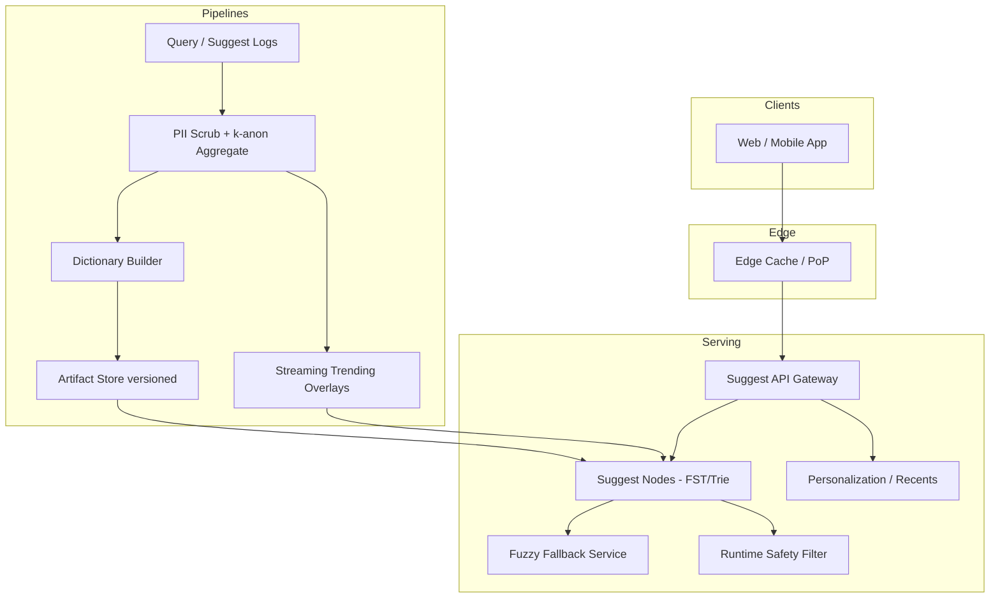

# System Design: Typeahead / Autocomplete

> **Focus areas:** Prefix retrieval · trie/FST · ranking by popularity · personalization · fuzzy tolerance · edge cache · real-time query logs · abuse  
> **Style:** End-to-end product design with progressive scale (10× → 100× → 1,000×)  
> **Quality bar:** Senior/staff; sub-100ms UX; explicit data structures and update pipelines

---

## Table of Contents

1. [Clarify Requirements (Interview Q&A)](#1-clarify-requirements-interview-qa)
2. [Back-of-the-Envelope Estimation](#2-back-of-the-envelope-estimation)
3. [High-Level Design](#3-high-level-design)
4. [Architecture Diagram](#4-architecture-diagram)
5. [Design Deep Dive](#5-design-deep-dive)
6. [Wrap-Up](#6-wrap-up)
7. [Deeper / Related Interview Questions](#7-deeper--related-interview-questions)

---

## 1. Clarify Requirements (Interview Q&A)

Goal: design a **typeahead / autocomplete** system that suggests completions as the user types—optimized for ultra-low latency, high QPS, and relevance from popularity + context—not full search results pages.

### 1.0 What this is / is not

| Dimension | This doc | Not this |
|-----------|----------|----------|
| Job | Query / term suggestions as you type | Full SERP search engine |
| Input | Short prefixes (1–N chars) | Full document retrieval |
| Output | Top-K suggestion strings (+ metadata) | Ranked web documents |
| Success | Latency, relevance, freshness of trends | Perfect semantic search |
| Typical product | Search box autocomplete | IDE code completion (related but different corpus) |

### 1.1 Functional Requirements

| # | Question to ask | Expected / typical interviewer answer | Design implication |
|---|-----------------|----------------------------------------|--------------------|
| F1 | What is suggested? | Past popular queries / phrases; optionally docs/products | Query-log mining + curated |
| F2 | Prefix only or mid-string? | **MVP:** prefix; infix later | Trie/FST prefix; n-grams for infix |
| F3 | How many suggestions? | Top 5–10 | Small K; precompute top-K per node optional |
| F4 | Ranking signals? | Popularity, recency, personalization light | Score = f(freq, time, user) |
| F5 | Personalization? | Recent user searches + locale MVP | Client cache + user history service |
| F6 | Typo tolerance? | Yes after length ≥3 | Edit-distance / fuzzy layer |
| F7 | Languages / locales? | Per-locale suggestion sets | Partition by locale |
| F8 | Trending boost? | Yes for newsy terms | Time-decay counters |
| F9 | Safety / blocked terms? | Adult, illegal, hate filtered | Blocklist + classifier |
| F10 | Empty prefix / landing? | Trending / personalized homepage suggestions | Separate trending API |
| F11 | Analytics? | Impression/click on suggestions | Logging pipeline |
| F12 | Multi-tenant? | Single product MVP; SaaS mode optional | Namespace dictionaries |
| F13 | Exact product names / entities? | Optional entity channel | Blend channels |
| F14 | Rate of dictionary update? | Minutes for trends; seconds for viral optional | Nearline builder + push |
| F15 | Mobile vs desktop? | Same API; bandwidth-sensitive | Compact response; HTTP cache |

**MVP functional scope:**

1. `GET /suggest?q=pre&locale=en-US&limit=8` → ranked suggestions.
2. Prefix match on normalized query phrases.
3. Rank by popularity with time decay; filter blocklist.
4. Basic fuzzy for longer prefixes.
5. Locale-specific dictionaries.
6. Ingest query logs → aggregate → rebuild/update suggest index.
7. Edge cache for head prefixes.
8. Metrics: suggest latency, CTR, coverage.

**Out of MVP:**

- Full semantic vector suggest-only (can add hybrid later)
- Perfect personalization ML per keystroke
- Infix search for all languages
- Voice ASR integration
- Collaborative document autocomplete (Google Docs-style)

### 1.2 Non-Functional Requirements

| # | Question | Expected answer | Target |
|---|----------|-----------------|--------|
| N1 | Latency | Critical UX (per keystroke) | p50 < 20–30ms, p99 < 50–100ms end-to-end |
| N2 | Availability | High; degrade to stale | 99.9%+; cached fallbacks |
| N3 | Durability | Suggestions rebuildable from logs | Logs durable; suggest index regenerable |
| N4 | Consistency | Eventual OK | Trends lag minutes acceptable |
| N5 | Multi-region | Serve from edge/region | Replicated dictionaries per region |
| N6 | Security | No PII leakage in suggestions | Privacy filters; k-anonymity on logs |
| N7 | Cost | QPS enormous vs tiny payloads | Aggressive caching; compact RAM indexes |
| N8 | Throughput | Keystroke amplification | Cache + L1 trie memory |

### 1.3 Cases

**Happy paths**

1. User types `amaz` → suggestions Amazon, Amazing Spiderman, …  
2. User selects suggestion → navigate/search; log click.  
3. Viral event → nearline pipeline boosts phrase within minutes.  
4. Locale `fr-FR` → French dictionary, not English.  
5. Blocked term prefix → suppressed; no offensive completions.

**Edge / failure cases**

| Case | Behavior |
|------|----------|
| 1-char prefix | Limit to trending/personalized; heavy cache; cost control |
| Empty query | Trending / recents |
| All-blocked top results | Backfill next candidates |
| Hot prefix stampede | Edge cache + singleflight origin |
| Rare prefix | Fuzzy / fallback; or empty gracefully |
| PII in query logs (`ssn`, email) | Scrub before aggregate; never promote |
| Script injection in suggestion string | Encode/escape at UI; sanitize at index |
| Dictionary deploy bad | Versioned rollback; canary locales |
| Personalization service down | Fall back to global popular |
| Bot keystroke flood | Rate limit per IP/device |

### 1.4 Scales (Progressive)

| Metric | Baseline | 10× | 100× | 1,000× |
|--------|----------|-----|------|--------|
| DAU | 10M | 100M | 1B | 10B (global multi-app) |
| Suggest QPS peak | 50K | 500K | 5M | 50M |
| Avg keystrokes / session search | 8 | 8 | 8–10 | 8–10 |
| Distinct phrases in dictionary | 50M | 200M | 1B | 5B |
| Locales | 20 | 50 | 100 | 200+ |
| Query log events / day | 500M | 5B | 50B | 500B |
| Edge cache hit rate goal | 60% | 70% | 80% | 85%+ |
| Dictionary RAM / region | ~20 GB | ~100 GB | ~1 TB | multi-TB sharded |
| Update publish frequency | 15 min | 5 min | 1 min | seconds (streaming head) |

**What each jump forces:**

- **10×:** Edge CDN/cache mandatory; in-memory FST/trie per locale; async log aggregation.
- **100×:** Shard dictionaries by locale + prefix; streaming top-k updates; personalization service isolation; privacy k-anon at scale.
- **1,000×:** Global edge PoPs; hierarchical indexes; learned ranking models; real-time trending pipeline; multi-channel blend (query, product, entity).

### 1.5 Etc.

- **Client:** debouncing (e.g. 20–50ms) + in-flight cancel; still design server for worst-case QPS.
- **Normalization:** Unicode NFKC, lowercase, trim, collapse spaces; locale-aware where needed.
- **Legal:** EU privacy on logs; retention limits.

**Scope repeat-back:**

> Design a low-latency typeahead service returning top-K prefix suggestions from mined query phrases, with locale, safety, light personalization, and fuzzy fallback—serving ~50K→50M QPS via edge cache and in-memory indexes, updated from privacy-safe aggregated logs.

---

## 2. Back-of-the-Envelope Estimation

### 2.1 QPS from keystrokes

```text
10M DAU; 20% search/day; 2 searches; 8 suggest calls each
= 10M × 0.2 × 2 × 8 = 32M suggest calls/day
≈ 370 QPS average; peak 10–20× ⇒ ~4–8K? (too low for big products)

Adjust for large search products:
Assume 50K peak baseline as table (mobile typing parallel worldwide)
```

Interview move: **derive from DAU assumptions**, then accept interviewer numbers.

### 2.2 Payload / bandwidth

```text
Response ~500 B–1 KB JSON for 8 suggestions
50K QPS × 1 KB = 50 MB/s ≈ 400 Mbps (fine)
5M QPS × 1 KB = 5 GB/s → edge termination essential
```

### 2.3 Dictionary memory (trie / FST)

```text
50M phrases; avg length 20 chars; naive trie wasteful
FST / radix compressed: often ~10–50+ bytes per phrase + score payloads
50M × 40 B ≈ 2 GB base + scores/postings
With 20 locales sparsely overlapping ⇒ tens of GB / region
```

Precomputing top-K at each trie node accelerates response but multiplies memory—use for head, compute on fly for tail.

### 2.4 Aggregation pipeline

```text
500M log events/day × 100 B = 50 GB/day raw logs
Aggregate to (locale, phrase) → count sketches
Top phrases cut: keep phrases with count ≥ t (k-anonymity)
```

### 2.5 Cache

```text
Prefix space: for English lowercase, length≤3 → 26^3 ≈ 17K; length≤4 → 456K
Head prefixes cache extremely well
Zipf: tiny fraction of prefixes → majority QPS
```

### 2.6 Ranking compute

```text
Per request: walk trie O(|prefix|) + heap top-K among candidates
Budget ≪ 1 ms in-process if memory-resident
Network/TLS/edge dominates if origin hop needed
```

---

## 3. High-Level Design

### 3.1 High-level components

```text
Clients → Edge Cache / PoP → Suggest API
                              ↓
                     Suggest Index (FST/Trie RAM)
                              ↓
                     Ranker (popularity, decay, personalization)
                              ↑
Query Logs → Scrub → Aggregate → Dictionary Builder → Publish
```

### 3.2 API

```http
GET /v1/suggest?q=amazo&locale=en-US&limit=8&device_id=...
Authorization: Bearer ... (optional for personalized)
```

```json
{
  "q": "amazo",
  "suggestions": [
    {"text": "amazon", "type": "query", "score": 0.93},
    {"text": "amazon prime", "type": "query", "score": 0.88}
  ],
  "ts": 1710000000,
  "dict_version": "v2026-08-06t01"
}
```

Also: `POST /v1/suggest/impression` and click beacons (or bundled in search logs).

### 3.3 Data structures (core interview topic)

#### Option A — Prefix Trie + top-K at nodes

| Pros | Cons |
|------|------|
| O(length) lookup; fast top-K | Memory heavy if all nodes store heaps |
| Easy to reason | Updates awkward |

#### Option B — Finite State Transducer (FST)

| Pros | Cons |
|------|------|
| Very compact; Lucene uses for terms | Harder to update incrementally |
| Fast prefix iteration | Rebuild-friendly |

#### Option C — Sorted array + binary search prefix range

| Pros | Cons |
|------|------|
| Simple | Slower; worse for fuzzy |
| Compact phrases list | |

#### Option D — Redis ZSET per prefix

| Pros | Cons |
|------|------|
| Easy incremental scores | Cardinality explosion of keys |
| | Costly at 100× |

**Choice:** **FST or compressed radix trie per locale** in memory on suggest nodes; rebuild/publish periodically. Redis ZSET OK for small MVP / trending overlay only.

**Fuzzy:** BK-tree / n-gram inverted index / Levenshtein automata (Lucene fuzzy)—invoke only when exact prefix candidates < K and `|q|≥3`.

### 3.4 Ranking

```text
score = popularity_ewma × recency_boost × personalization_boost × safety_weight
      × length_penalty_optional
```

- **Popularity:** count of searches selecting that phrase (not raw impressions alone)
- **Recency:** EWMA / hour buckets; trending spike detection
- **Personalization:** user recent queries prefix-match boost; cohort (geo)
- **Diversity:** avoid near-duplicate suggestions (`amazon`, `amazon `, `Amazon`)

**Channels to blend:**

1. Popular query phrases  
2. Sponsored / promoted (disclose; optional)  
3. Entity / product titles  
4. User recents  

MVP: channel (1)+(4).

### 3.5 Offline / nearline pipeline

```text
Search/suggest logs (scrub PII)
   → validate, normalize phrase
   → aggregate counts by locale + time window
   → apply min_count (k-anon), blocklist, classifier
   → select top M phrases globally + long-tail sampling
   → build FST/trie artifacts
   → canary publish → full publish via versioned artifacts (S3)
   → suggest nodes pull/reload
```

**Incremental path (100×):** update counters in Redis/streaming; adjust scores for head phrases without full rebuild; full rebuild daily for compaction.

### 3.6 Caching strategy

| Layer | What | TTL |
|-------|------|-----|
| Client | Last suggestions for prefix | seconds; cancel stale |
| Edge CDN | Anonymous global suggests | 10–60s for head |
| Local node LRU | Computed top-K | seconds–minutes |
| Negative cache | Empty rare prefixes | short |

**Cache key:** `hash(locale, normalized_q, limit, dict_version, personalization_bucket?)`  
Personalized responses: **bypass shared edge cache** or cache by coarse cohort only.

### 3.7 Normalization & tokenization

- Unicode normalize + case fold  
- Strip control chars  
- Collapse whitespace  
- Optional punctuation policy (`c++` kept)  
- Max length cap (e.g. 100 chars)

### 3.8 Safety & privacy

- Blocklist + ML toxicity on phrases before index  
- Never suggest phrases that match PII patterns  
- Aggregate with **k-anonymity** (e.g. min 50 unique users)  
- Don't echo rare user-typed private strings into global dict  

### 3.9 Option analysis summary

| Decision | Choose | Over | Why |
|----------|--------|------|-----|
| Index | FST/trie RAM | DB LIKE | Latency |
| Updates | Periodic artifact + streaming head | Sync write path per search | Scale |
| Fuzzy | Conditional secondary | Always fuzzy | CPU/latency |
| Cache | Edge for anonymous | Origin only | QPS |
| Personalization | Light + fallback | Heavy ML every keystroke | p99 |

**Deal-breakers:**

- Hitting SQL `LIKE 'pre%'` at 500K QPS  
- Putting PII-rich raw queries into global suggestions  
- Skipping debounce discussion + designing for infinite QPS without cache  
- One giant unsharded dictionary for all locales at 1,000×  

---

## 4. Architecture Diagram



---

## 5. Design Deep Dive

### 5.1 Reliability

**Data loss**

- Suggestions are derived data; **source of truth = privacy-safe aggregates + curated lists**
- Log pipeline durable (Kafka); builder checkpoints
- Artifact versions immutable; pointers in control store

**Retries / idempotency**

- Suggest GETs idempotent  
- Builder jobs idempotent per `dict_version`  
- Client retries safe  

**Backpressure**

- Shed personalized enrichments first  
- Serve stale dictionary if builder fails  
- Rate limit abusive clients  

**Failure modes**

| Failure | Behavior |
|---------|----------|
| Suggest node OOM reload | Staged reload; keep old mapped |
| Bad dictionary | Canary metrics (CTR, complaint rate) → auto rollback |
| Edge outage | Origin regional; higher latency |
| Log pipeline delay | Stale popularity; still serve |

### 5.2 Scalability

**Horizontal suggest nodes:** stateless w.r.t. requests; load dictionary replicas.

**Sharding dictionaries:**

```text
shard_key = locale + first_N_chars(prefix)   # or locale only until memory forces
```

Route by locale first; split heavy locales (`en`) by prefix ranges.

**Scale jumps**

| Jump | Change |
|------|--------|
| 10× | Edge cache + in-memory FST; log aggregation |
| 100× | Prefix sharding; streaming trending; cohort cache |
| 1,000× | Global PoPs; multi-channel rankers; learned models; real-time overlays |

**Hot keys:** prefixes `a`, `t`, `w` — 100% edge cached; precompute.

**Parallelization:** builder map-reduce by locale; serving trivial parallel.

**Memory management:** mmap FST files; hugepages optional; avoid per-request alloc.

### 5.3 Maintainability

**Ops**

- Dashboards: QPS, p99, cache hit, empty rate, CTR, dict age  
- Kill switch: disable fuzzy; disable personalization; freeze dict  
- Blocklist hot-reload  

**Observability**

- Trace only sampled (volume!)  
- Per-locale CTR  
- Safety suppression rates  

**Migrations**

- Dual-publish dict formats  
- Schema for suggestion metadata evolution  

**Multi-tenant SaaS mode**

- Namespace per customer app_id  
- Separate artifacts; noisy-neighbor quotas  
- Shared infra with placement  

**Experimentation**

- Ranker A/B via `experiment_id` in cache key carefully (fragmentation!)  
- Prefer session sticky experiment assignment  

---

## 6. Wrap-Up

### Decision summary

| Area | Decision |
|------|----------|
| Structure | In-memory FST/trie per locale |
| Rank | Popularity EWMA + recency + light personalization |
| Updates | Aggregated logs → versioned artifacts (+ streaming head) |
| Latency | Edge cache + RAM index; fuzzy conditional |
| Privacy | Scrub + k-anonymity + blocklists |
| Scale | Locale/prefix shards + PoPs |

### Phased rollout

1. **MVP:** Periodic top phrases → trie; suggest API; edge cache; blocklist.  
2. **Quality:** Time decay, fuzzy, user recents, CTR logging.  
3. **Scale:** FST compression, locale shards, canary publish.  
4. **Realtime:** Streaming trending overlays.  
5. **1000×:** Multi-channel learned ranker, global edge, SaaS namespaces.

### Closing line

> Typeahead is a **latency product**: mine privacy-safe popular phrases into compact prefix indexes at the edge, rank with decaying popularity and light personalization, and keep fuzzy/ML off the default path so p99 stays under a keystroke budget as QPS grows 1000×.

---

## 7. Deeper / Related Interview Questions

**Q1. Trie vs hash map of prefixes?**  
**A:** Hash of all prefixes explodes memory (`amazon` → `a`,`am`,…). Trie/FST shares prefixes; natural top-K storage.

**Q2. How do you store top-K at each node efficiently?**  
**A:** Limit to head nodes / deep enough prefixes; or store only phrase terminal scores and compute bounded beam at query time; hybrid.

**Q3. Why debounce on client if server is fast?**  
**A:** Cuts QPS and wasted work on intermediate prefixes; server still must survive bursts.

**Q4. How to handle Unicode / emoji?**  
**A:** Consistent normalization; decide if emoji phrases allowed; locale-aware case folding (Turkish i).

**Q5. Edit distance fuzzy at scale?**  
**A:** Expensive; restrict to `|q|≥3`, max ed=1 or 2; use Levenshtein automaton or n-gram candidate generation then verify.

**Q6. How does Google-like instant search differ?**  
**A:** Instant search may prefetch full SERP; typeahead returns suggestions only. Different cost model.

**Q7. Preventing suggestion of breaking news misinformation?**  
**A:** Trend detection + trust/safety review queues for spikes; dampen untrusted phrases; human-in-loop for sensitive categories.

**Q8. Cache stampedes on dict_version flip?**  
**A:** Overlap versions; probabilistic early expire; singleflight; gradual traffic shift.

**Q9. How to measure success?**  
**A:** Suggestion CTR, time-to-query, reformulation rate, abandon rate; online A/B.

**Q10. Min heap vs pre-sorted lists for top-K?**  
**A:** If candidates few, sort; if many, heap size K; pre-sorted posting of phrases by score under node is fastest.

**Q11. Personalization privacy?**  
**A:** Recents stored per-user encrypted; don't merge rare recents into global; on-device recents option.

**Q12. Why k-anonymity on phrases?**  
**A:** Prevents unique private queries becoming globally suggested / identifiable.

**Q13. Infix / contains match?**  
**A:** Index character n-grams or word-suffix tries; cost↑; use for product SKUs selectively.

**Q14. Load balancing suggest nodes?**  
**A:** Anycast/edge; consistent hash by locale for cache locality optional; health checks; preload dict before join.

**Q15. How big is too big for one FST?**  
**A:** When reload time / RAM / failure domain hurts—split by prefix. Reload 100GB synchronously is an outage waiting to happen.

**Q16. Click injection inflating popularity?**  
**A:** Fraud detection on suggest clicks; rate limit; trust signals; downweight anomalous sessions.

**Q17. Relationship to full-text search completion suggesters?**  
**A:** ES completion suggester = FST-based in-engine; similar ideas; separate service wins at global edge+privacy pipeline control.

**Q18. Cold start new locale?**  
**A:** Editorial seeds; bilingual transfer carefully; lower min_count thresholds initially with safety review.

**Q19. Consistent hashing for prefix shards?**  
**A:** Yes for distributing prefix ranges; virtual nodes; migrate artifacts before cutting traffic.

**Q20. Memory vs CPU tradeoff precompute?**  
**A:** Precompute top-K everywhere → RAM↑ CPU↓; compute on fly → RAM↓ CPU↑. Hybrid by depth.

**Q21. What breaks at 50M QPS?**  
**A:** Origin; TLS; logging every request; dict reload; cache key fragmentation from over-personalization.

**Q22. Should suggest use ANN embeddings?**  
**A:** Optional semantic channel for recall; don't replace prefix index for latency/determinism; blend carefully.

**Q23. How to rollback a poisonous suggestion?**  
**A:** Hot blocklist minutes-level; publish emergency dict; purge edge cache for affected prefixes.

**Q24. Scoring ties?**  
**A:** Stable secondary keys (phrase lexicographic) for deterministic UI.

**Q25. Capstone: relevance vs privacy vs latency?**  
**A:** Aggregate with k-anon (privacy), serve from edge FST (latency), rank with decay+CTR (relevance)—drop personalization and fuzzy first under degradation. Explicit priority order is the staff answer.

---

*End of typeahead autocomplete system design.*
