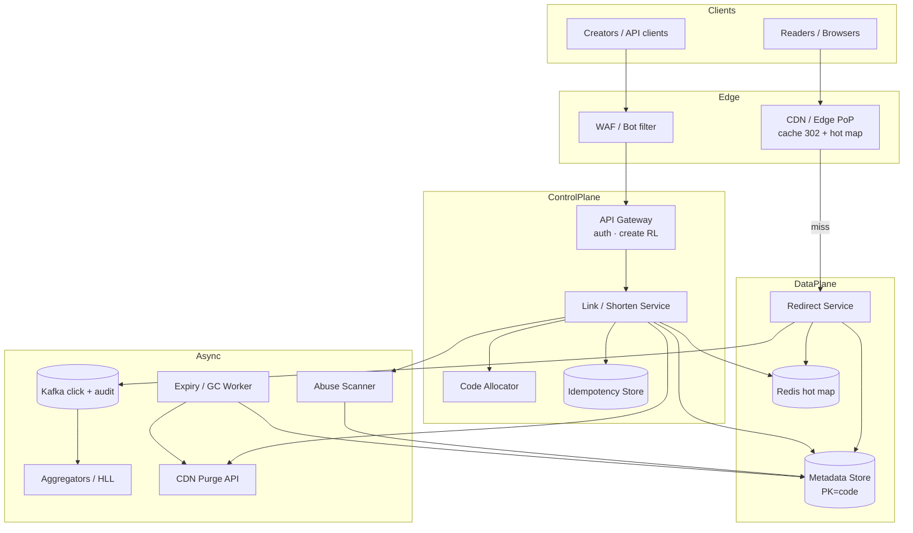

<!-- Adapted into Fundamentals bank from Amazon/tinyurl-url-shortener-system-design.md for cross-company prep. -->

# System Design: TinyURL / URL Shortener

> **Focus areas:** Short-key generation · Redirect hot path · Idempotency · Custom aliases · Expiry · Analytics · Abuse/spam · Cache · Multi-region · Read-heavy scale
> **Style:** End-to-end product design with progressive scale (10× → 100× → 1,000×)
> **Quality bar:** p99 redirect latency; key uniqueness; deal-breaker: centralized DB on every redirect; clear abuse story
> **Interview theme:** Amazon SDE III / L6 — classic distributed systems with **Amazon lens** (internal link shortener / campaign / affiliate / retail share links)

---

## Table of Contents

1. [Clarify Requirements (Interview Q&A)](#1-clarify-requirements-interview-qa)
2. [Back-of-the-Envelope Estimation](#2-back-of-the-envelope-estimation)
3. [High-Level Design](#3-high-level-design)
4. [Architecture Diagram](#4-architecture-diagram)
5. [Design Deep Dive](#5-design-deep-dive)
6. [Wrap-Up](#6-wrap-up)
7. [Deeper / Related Interview Questions](#7-deeper--related-interview-questions)
8. [Appendices](#8-appendices)

---

## 1. Clarify Requirements (Interview Q&A)

Goal: design a **URL shortener** (TinyURL-class) that creates short links, redirects with low latency at huge read/write asymmetry, supports optional extras (aliases, expiry, analytics), and resists abuse—usable as a public product or Amazon-internal/campaign short links.

### 1.0 What this is / is not

| Dimension | This | Not |
|-----------|------|-----|
| Job | short↔long map + redirect | Full CDN for page content |
| Hot path | Redirect 301/302 | Heavy JS app |
| Analytics | Counts/aggregates async | Real-time BI warehouse sync on redirect |
| Amazon lens | Campaign integrity, abuse, availability, cost | Only toy Base62 explanation |

### 1.1 Functional Requirements

| # | Question | Typical answer | Implication |
|---|----------|----------------|-------------|
| F1 | Who creates links? | Auth users + apps + internal services | API keys / IAM |
| F2 | Key form? | 7–8 char Base62; optional custom alias | Generator + reservation |
| F3 | Redirect type? | 302 default (analytics); 301 optional | Cache semantics |
| F4 | Expiry? | Optional TTL; default none/long | Sweeper / TTL store |
| F5 | Update long URL? | Owner can update / deactivate | Version + authz |
| F6 | Analytics? | Click counts, coarse geo/UA | Async pipeline |
| F7 | Custom domains? | Phase 2 | Tenant domain map |
| F8 | Preview / interstitial? | Optional for untrusted | Safety UX |
| F9 | Bulk create? | Campaign APIs | Batch + idempotency |
| F10 | Password / gated? | Optional | Extra lookup |
| F11 | QR? | Client-side from URL | Not core |
| F12 | Delete? | Soft delete / tombstone | Redirect 410/404 |

**MVP:**

1. `POST /shorten` → short URL (idempotent).  
2. `GET /{code}` → redirect to long URL.  
3. Unique codes; collision handling.  
4. Optional expiry.  
5. Basic click counter (async).  
6. Auth for write APIs; public redirect.  
7. Abuse rate limits + malware URL checks (hook).

**Out of MVP:** full marketing suite, A/B multi-destination intelligence beyond simple rules, global anycast perfection day one, user-facing dashboard richness.

### 1.2 Non-Functional Requirements

| # | NFR | Target |
|---|-----|--------|
| N1 | Redirect p99 | < 10–50ms at edge/cache hit; < 100ms origin |
| N2 | Create p99 | < 100–300ms |
| N3 | Availability | 99.99% redirect |
| N4 | Durability | No lost mapping once ACK'd |
| N5 | Consistency | Read-your-writes for creator; redirects tolerate brief replica lag if versioned carefully |
| N6 | Scale | Read:write often 100:1 to 1000:1+ |
| N7 | Security | No open redirect to malware; authz on mutate |

### 1.3 Cases

**Happy:** create → share → many redirects → analytics bump.  
**Edges:** collision; duplicate create same long URL; custom alias taken; expired; deactivated mid-campaign; thundering herd popular code; cache stampede; malicious target URL; hot key celebrity link; unicode homograph alias; bots hammering creates.

| Case | Behavior |
|------|----------|
| Idempotent recreate | Same idempotency key → same code |
| Alias taken | 409 |
| Expired | 410/404; cache negative short TTL |
| Malware flagged | Block create / break redirect to warning |
| Cache stale after update | Versioned cache keys / short TTL + purge |
| DB down | Edge cache still serves hot redirects |

### 1.4 Progressive scale

| Metric | Base | 10× | 100× | 1,000× |
|--------|------|-----|------|--------|
| New links / day | 1M | 10M | 100M | 1B |
| Peak create QPS | ~50 | ~500 | ~5K | ~50K |
| Redirects / day | 100M | 1B | 10B | 100B |
| Peak redirect QPS | ~5K | ~50K | ~500K | ~5M |
| Unique active codes | 100M | 1B | 10B | 100B |
| Cache hit rate | 70% | 85% | 92% | 95%+ |
| Analytics events / s | 5K | 50K | 500K | 5M |

**Jumps:** 10× cache + range range; 100× cells + edge; 1,000× anycast + keyspace hierarchy + bloom/negative cache craft.

### 1.5 Scope statement

> Design a URL shortener with unique short codes, ultra-fast redirects via multi-layer cache, durable mappings, optional aliases/expiry/analytics, abuse controls—from millions to billions of redirects/day with progressive architecture jumps.

---

## 2. Back-of-the-Envelope Estimation

### 2.1 Keyspace

```text
Base62 length 7: 62^7 ≈ 3.5e12 — plenty for 100B with low collision if random/range-allocated
Length 8: 62^8 ≈ 2.2e14
Custom aliases: separate namespace constraints
```

### 2.2 Storage

```text
Record: code (8) + long URL (avg 100–300 B) + metadata (50–100 B) ≈ 200–500 B
1B codes × 300 B ≈ 300 GB (+ indexes/replicas)
100B codes ≈ 30 TB — shardable
```

### 2.3 Bandwidth

```text
Redirect response tiny (300–600 B headers)
5M QPS × 500 B = 2.5 GB/s egress → edge/CDN essential
```

### 2.4 Memory cache

```text
Hot set 1% of 1B = 10M × 300 B ≈ 3 GB per region (fits)
Celebrity keys replicated widely
```

### 2.5 Bottleneck ranking

(1) Redirect cache hit rate (2) hot key (3) create uniqueness (4) abuse writes (5) analytics volume (6) not fancy encoding theory alone.

### 2.6 Latency budget

```text
Edge cache hit: 1–5ms
Regional Redis: 1–3ms
Origin DB: 5–20ms
Total miss path < 50–100ms p99
```

---

## 3. High-Level Design

### 3.1 Components

1. **API Gateway / Edge** — TLS, WAF, rate limit.  
2. **Shorten Service** — auth, validate URL, generate/reserve code, persist.  
3. **Redirect Service** — resolve code → URL; emit analytics event.  
4. **Key Generator** — range allocator / Snowflake-like / pre-minted pool.  
5. **Metadata Store** — durable mapping (SQL/NoSQL).  
6. **Cache tiers** — edge + Redis.  
7. **Analytics Pipeline** — Kafka/Kinesis → aggregates.  
8. **Abuse / Safety** — URL reputation, spam velocity.  
9. **Admin / Owner API** — update, deactivate, stats.  
10. **TTL Sweeper** — expire / compact.

### 3.2 APIs

```text
POST /v1/links
  Idempotency-Key
  {long_url, alias?, ttl_sec?, redirect_code?}
  → {code, short_url}

GET /{code} → 302 Location: long_url

PATCH /v1/links/{code}  (owner)
DELETE /v1/links/{code}  (soft)

GET /v1/links/{code}/stats  (owner)
```

### 3.3 Key generation strategies (compare)

| Strategy | Pros | Cons |
|----------|------|------|
| Hash(long)[:n] | Deterministic | Collisions; similar URLs; hard unique custom |
| Random Base62 + retry | Simple | Retry under load; need strong RNG |
| Counter → Base62 | Compact | Predictable; hotspot counter |
| Range allocator (preferred) | Unique without central hot counter per req | Need allocator HA |
| Pre-minted pool | Fast creates | Pool refill ops |

**Recommendation:** range-allocated monotonic IDs encoded Base62 (+ optional salt/permutation for unguessability), separate path for custom aliases with unique constraint.

### 3.4 Trade-offs

| Topic | Choice | Why |
|-------|--------|-----|
| 301 vs 302 | Default 302 | Observability; app updates |
| Cache | Multi-tier | Cost + p99 |
| Analytics | Async | Protect redirect |
| Unguessable | Permute IDs | Avoid scraping sequential |
| Idempotency | Required on create | Mobile retries |

---

## 4. Architecture Diagram



```text
Client → Edge/CDN → Redirect Service → Redis → (miss) Metadata DB
                         | async
                         v
                   Analytics Stream → Aggregates

Creator → API → Shorten Service → Key Gen → Metadata DB → Cache warm
                         |
                         v
                   Abuse checks (URL reputation)
```

### 4.1 Redirect sequence

```text
GET /abc123
Edge cache? hit → 302
else Redis? hit → 302 + async click
else DB → fill caches → 302
not found → negative cache → 404
```

### 4.2 Create sequence

```text
Auth → normalize URL → abuse gate →
  if alias: insert unique
  else: alloc id → encode → insert
ACK → optionally warm cache
```

---

## 5. Design Deep Dive

### 5.1 Reliability invariants

1. ACK create ⇒ durable mapping.  
2. Codes unique (DB constraint ultimate backstop).  
3. Idempotent create by key.  
4. Deactivate/expiry honored (cache TTL ≤ remaining; purge on kill).  
5. Analytics loss tolerable; redirect correctness not.  
6. Authz on mutate.  
7. Malware policy fail-closed on create when reputation service times out? **Product call**—often fail-open with async break for availability; say it.

### 5.2 Scalability

| Scale | Moves |
|-------|-------|
| 1× | Monolith + PG + Redis |
| 10× | Redirect/shorten split; range allocator; Kafka analytics |
| 100× | Shard by code hash; edge PoPs; cell per region |
| 1000× | Anycast; hot-key replication; hierarchical analytics; zoned keyspace |

### 5.3 Maintainability

- Encoding library single-sourced.  
- Policy packs for blocklists.  
- Cache purge tooling.  
- Replay-safe analytics (dedupe event ids loosely).

### 5.4 Progressive scale

**1×:** PG `links(code PK, url, ...)`; Redis; counter table ranges.  
**10×:** Separate redirect fleet; CDN in front; async clicks.  
**100×:** Shards; regional homes for writes; global read cache.  
**1000×:** Multi-CDN; compute at edge (Workers) for redirect; key directory; bloom filters for DNE.

### 5.5 Hot key

Celebrity campaign: replicate value to all edges; stickiness irrelevant; protect origin with request coalescing; capacity is bandwidth/edge.

### 5.6 Cache coherence on update

- Short TTL (e.g., 60–300s) + explicit purge on mutate.  
- Include `version` in cached object; ignore older.  
- For 301, warn owners updates may be sticky at clients—product.

### 5.7 Abuse

| Vector | Control |
|--------|---------|
| Spam create | Auth + rate limit + CAPTCHA/risk |
| Malware targets | Reputation API; break links |
| Phishing aliases | Homograph detect; reserved words |
| Scraping codes | Unguessable permutation; rate limit 404 |
| Click fraud | Analytics anomaly; not on critical path |

### 5.8 Deal-breakers

| Temptation | Failure |
|------------|---------|
| DB hit every redirect | Won't scale / costly |
| Hash-only without uniqueness | Collisions → wrong destination SEV |
| Sync analytics write on redirect | Outage amplifier |
| Sequential guessable IDs | Scraping / privacy |
| Mute cache on update forever | Stale phishing target remains |

---

## 6. Wrap-Up

### 6.1 Designed

Short-code generation with uniqueness, multi-tier cached redirects, durable metadata, async analytics, abuse hooks, progressive global scale.

### 6.2 Decisions

1. Range-allocated IDs + Base62 (+ permute)  
2. Edge + Redis caching  
3. Async analytics  
4. Idempotent creates  
5. 302 default  
6. Shard by code  
7. Explicit purge on deactivate  
8. Abuse rate limits + reputation

### 6.3 Risks

- Stale cache after takedown  
- Reputation false positives  
- Hot campaigns  
- Alias squatting  
- Analytics cost explosion

### 6.4 45-minute plan

| Min | Focus |
|-----|-------|
| 0–5 | Scope MVP APIs |
| 5–15 | Key gen uniqueness |
| 15–25 | Redirect path + cache |
| 25–35 | Analytics + expiry + update |
| 35–45 | Abuse, multi-region, scale jumps |

### 6.5 Closer

> **TinyURL**: unique durable codes, edge-fast redirects, async analytics, abuse resistance, progressive 10×–1000× with cache-first design and clear deal-breakers.

---

## 7. Deeper / Related Interview Questions

### 7.1 Key generation

**Q: Why not MD5(long)[:7]?**  
A: Collisions; non-unique across policies; same URL always same code may/may not be desired—product. Uniqueness must be enforced.

**Q: Counter hotspot?**  
A: Allocate ranges of 1M ids per app server; renew via HA allocator (ZooKeeper/etcd/Dynamo).

**Q: Base62 vs Base64?**  
A: Base62 URL-safe without encoding; Base64 needs URL-safe variant.

**Q: How unguessable?**  
A: Feistel/permute id bits before encode; still unique bijection.

### 7.2 Redirect performance

**Q: Where to put cache?**  
A: CDN/edge first, Redis regional, DB last.

**Q: Negative caching?**  
A: Yes short TTL for 404 to protect DB from scrapers.

**Q: Connection overhead?**  
A: Keep-alive; HTTP/2; anycast.

### 7.3 Consistency

**Q: Create then immediately redirect elsewhere?**  
A: Warm cache on create; RY W for creator via sticky region; global others may miss briefly—acceptable with retry.

**Q: Multi-region write?**  
A: Home region per code or global append-only with conflict-free codes (ranges per region prefix).

### 7.4 Analytics

**Q: Exactly-once clicks?**  
A: At-least-once enough; approximate counts; HyperLogLog unique optional.

**Q: Store every click raw forever?**  
A: Sample + aggregate; cold raw short retention.

### 7.5 Expiry & delete

**Q: How expire at scale?**  
A: TTL in cache; lazy expire on read + async sweeper by `expires_at` index partitions.

**Q: Legal takedown?**  
A: Immediate DB flag + purge edge; measure purge lag SLO.

### 7.6 Security

**Q: Open redirect abuse?**  
A: Validate URL schemes (https mostly); block javascript:; reputation.

**Q: SSRF via create?**  
A: Don't fetch user URL from privileged network on create without sandbox—metadata fetch careful.

**Q: Auth for APIs?**  
A: SigV4/IAM internal; API keys external.

### 7.7 Amazon-specific

**Q: Why Amazon asks this?**  
A: Tests fundamentals: hashing/ids, caches, read-heavy, abuse—also maps to internal shorteners/campaigns/affiliate.

**Q: Frugality?**  
A: Cache hit rate is the cost knob; don't run redirect through heavy service mesh hops.

### 7.8 Interview traps

**Q: Spend 20 minutes on Base62 only?**  
A: Weak—pivot to cache/scale/abuse.  
**Q: SQL JOIN analytics on redirect?**  
A: Deal-breaker.  
**Q: Perfect global linearizability every redirect?**  
A: Overkill; define softer model.

### 7.9 Metrics

| Metric | Why |
|--------|-----|
| Redirect p99 | CX |
| Cache hit rate | Cost/latency |
| Create success / collisions | Generator health |
| 404 rate | Scraping / bugs |
| Takedown purge lag | Trust |
| Abuse block rate | Safety |

### 7.10 Progressive drill

**10×:** Redis + CDN.  
**100×:** sharding + regional.  
**1000×:** edge compute + hot-key + analytics hierarchy.

### 7.11 Custom aliases

**Q: Race on alias?**  
A: Unique constraint; 409 loser.  
**Q: Reserved words?**  
A: Deny-list (`login`, brand names).

### 7.12 Encoding math check

**Q: How many days until 7-char exhaust at 1B/day?**  
A: 3.5e12 / 1e9 = 3500 days ~ 9+ years—still plan length 8 / expand.

---

## 8. Appendices

### 8.1 Schema

```text
links(code PK, long_url, owner_id, created_at, expires_at, status, version, redirect_type)
aliases(alias PK, code)  -- optional 1:1
idempotency(owner_id, key, code, request_hash)
click_aggregates(code, day, count, ...)
range_leases(allocator_id, start_id, end_id, ts)
```

### 8.2 API checklist

- [ ] Idempotent POST  
- [ ] Redirect GET  
- [ ] Patch/delete authz  
- [ ] Stats  
- [ ] Admin takedown  

### 8.3 Oncall

- [ ] Redirect p99  
- [ ] Cache hit  
- [ ] DB error rate  
- [ ] Create QPS / throttle  
- [ ] Purge lag  
- [ ] Reputation service dependency  

### 8.4 Glossary

| Term | Meaning |
|------|---------|
| Base62 | 0-9A-Za-z encoding |
| Range allocator | Hands out ID blocks |
| Negative cache | Cache of misses |
| Hot key | Disproportionate traffic code |
| Tombstone | Soft-deleted marker |

### 8.5 Deal-breakers

- Redirect → DB always  
- Sync analytics on GET  
- No uniqueness constraint  
- Guessable sequential public IDs without care  

### 8.6 Capacity sketch

| Scale | Sketch |
|-------|--------|
| 1× | 2 API, PG, Redis 16GB |
| 10× | CDN, redirect autoscaling, Kafka |
| 100× | 16 shards, multi-region |
| 1000× | Edge workers, global cache, hierarchical agg |

### 8.7 Failure injection

1. Redis down — edge still; origin protect with shed.  
2. Duplicate create — idempotent.  
3. Shard outage — partial codes fail; others work.  
4. Reputation timeout — documented fail policy.  
5. Purge failure — TTL max bound risk.

### 8.8 Sample records

```text
code: aZ3kQ9m
url: https://www.amazon.com/dp/B00EXAMPLE?...
status: ACTIVE
version: 3
```

### 8.9 Encoding snippet (conceptual)

```text
id = alloc()
id_perm = permute(id, key)
code = base62(id_perm)
```

### 8.10 Ownership

| Surface | Owner |
|---------|-------|
| Redirect path | Serving |
| Shorten/API | Links API |
| Abuse | Trust |
| Analytics | Data |
| Edge config | Traffic eng |

### 8.11 Related

CDN design, distributed ID generators, rate limiter, pastebin (similar), DNS/anycast.

### 8.12 Interview closer checklist

- [ ] APIs  
- [ ] Key gen uniqueness  
- [ ] Cache tiers  
- [ ] Numbers  
- [ ] Analytics async  
- [ ] Abuse  
- [ ] Scale jumps  
- [ ] Deal-breakers  

### 8.13 Security checklist

- [ ] HTTPS only short domain  
- [ ] Scheme allow-list  
- [ ] Rate limits  
- [ ] Authz mutate  
- [ ] Homograph aliases  
- [ ] Takedown runbook  

### 8.14 Cost narrative

Cache hit +1% can save enormous origin cost at 1000×. Prefer edge TTLs tuned with purge.

### 8.15 LP hooks

Frugality via hit rate; Ownership of phishing SEVs; Dive Deep on purge lag; Bias for Action MVP without fancy dashboard.

### 8.16 301 caution

Browser-cached 301 makes updates/takedowns hard—default 302 for mutable campaign links.

### 8.17 Bulk create

```text
POST /v1/links:batch {items[]}
partial success reporting; per-item idempotency
```

### 8.18 Geo routing

Resolve at nearest PoP; metadata replicated; writes to home.

### 8.19 Bloom filter optional

Shard-local bloom to cut DB 404s; false positives OK (extra DB check).

### 8.20 Click event schema

```text
{event_id, code, ts, edge_pop, ua_hash, country, version_seen}
```

---

## Deep Technical Notes — TinyURL

### Normalization

Trim, lowercase host carefully (don't break paths), reject credentials in URLs, max length (e.g. 2KB), unicode punycode hosts.

### Idempotency

Same owner + key + body hash → same code; body mismatch → 409.

### Cache object

```text
{long_url, status, version, expires_at, redirect_type}
```

### Allocator HA

Keep lease in DynamoDB conditional write; heartbeat; fencing tokens so expired allocator can't mint.

### Sharding

`shard = hash(code) % N` or embed shard prefix in code for easier routing.

### Regional prefix IDs

High bits = region; ensures uniqueness without global counter.

### Analytics hierarchy

Edge local counters flush every 1s → regional → global; lose small under failure OK.

### SLA for takedown

Purge p99 < 60s worldwide; monitor.

### SSRF note

If generating previews, isolated renderer; not on redirect path.

### Feature flags

Force interstitial; kill switch for creates; read-only mode.

---

## Interview Cards — TinyURL

### Card 1: Range allocator

Unique IDs without per-request global lock.

**Follow-ups:** 10×? Pager? Fallback? Metric?  
**Ownership:** Links platform; failure = create outage / collisions.

### Card 2: Cache-first redirect

Edge → Redis → DB.

**Follow-ups:** 10×? Pager? Fallback? Metric?  
**Ownership:** Serving; p99 is the job.

### Card 3: Async analytics

Never block redirect on Kafka.

**Follow-ups:** 10×? Pager? Fallback? Metric?  
**Ownership:** Data; lossy OK.

### Card 4: Permute IDs

Unguessable yet unique.

**Follow-ups:** 10×? Pager? Fallback? Metric?  
**Ownership:** Security + platform.

### Card 5: Takedown purge

DB flag + edge purge + TTL bound.

**Follow-ups:** 10×? Pager? Fallback? Metric?  
**Ownership:** Trust SEV.

### Card 6: Hot key

Replicate; coalesce; edge bandwidth.

**Follow-ups:** 10×? Pager? Fallback? Metric?  
**Ownership:** Traffic eng.

### Card 7: Alias uniqueness

DB constraint; 409.

**Follow-ups:** 10×? Pager? Fallback? Metric?  
**Ownership:** API.

### Card 8: Negative cache

Protect from scrapers.

**Follow-ups:** 10×? Pager? Fallback? Metric?  
**Ownership:** Serving.

### Card 9: 302 default

Mutable campaigns.

**Follow-ups:** 10×? Pager? Fallback? Metric?  
**Ownership:** Product+serving.

### Card 10: Shard by code

Horizontal metadata.

**Follow-ups:** 10×? Pager? Fallback? Metric?  
**Ownership:** Storage.

### Card 11: Abuse rate limits

Create storms.

**Follow-ups:** 10×? Pager? Fallback? Metric?  
**Ownership:** Trust.

### Card 12: Idempotent create

Mobile retries.

**Follow-ups:** 10×? Pager? Fallback? Metric?  
**Ownership:** API.

### Card 13: Expiry sweeper

Lazy + batch.

**Follow-ups:** 10×? Pager? Fallback? Metric?  
**Ownership:** Platform.

### Card 14: Deal-breaker

DB every redirect; sync analytics; hash collisions ignored.

**Follow-ups:** 10×? Pager? Fallback? Metric?  
**Ownership:** L6 signal.

### Card 15: Metrics

p99, hit rate, purge lag, create collisions.

**Follow-ups:** 10×? Pager? Fallback? Metric?  
**Ownership:** Dashboards.

### Card 16: Multi-region codes

Prefix ranges per region.

**Follow-ups:** 10×? Pager? Fallback? Metric?  
**Ownership:** Directory.

---

## Scenario Runbooks

### R1 — Viral link
Pre-warm edges; raise origin protection; watch bandwidth cost.

### R2 — Phishing campaign
Bulk takedown API; purge; block owner; law enforcement process.

### R3 — Redis outage
Edge cache TTL carry; degrade stats; scale origin carefully with shed.

### R4 — Allocator failure
Failover leases; freeze creates if unsafe; redirects OK.

### R5 — Analytics lag
Redirect unaffected; catch up; don't replay duplicates wildly without dedupe keys.

---

## Extended Rapid Q&A

**Q: Same long URL → same short?**  
A: Product choice; often no (campaign attribution). Offer `dedupe` flag.

**Q: Max URL length?**  
A: Enforce; 2048 common.

**Q: HTTP → HTTPS upgrade?**  
A: Short domain HTTPS; target validation prefer https.

**Q: QR codes?**  
A: Encode short URL; caching images optional CDN.

**Q: GraphQL?**  
A: Unnecessary for MVP REST.

**Q: Bloom false positive?**  
A: Extra DB get; OK.

**Q: Why not DNS shortener?**  
A: Different product (CNAME per link impractical).

**Q: Click counts in Redis INCR?**  
A: OK as buffer; flush durable aggregates.

**Q: Who pages redirect 5xx?**  
A: Serving oncall.

**Q: First optimization?**  
A: Measure hit rate & p99—not new encoding.

---

## Alternatives to Kill

| Alt | Why |
|-----|-----|
| Central MySQL every GET | Scale/cost |
| Client-side only shortening | No durable redirect control |
| Blockchain links | Latency/ops theater |
| Perfect global TX on clicks | Unnecessary |

---

## LLD Touch

Classes: `Link`, `KeyGenerator`, `LinkRepository`, `RedirectHandler`, `CacheFacade`, `AbuseGate`, `AnalyticsPublisher`. Patterns: Idempotency, Cache-aside, Range allocation.

---

## 60-second Narrative

"We allocate unique IDs in ranges, encode Base62 with a permutation for unguessability, persist durable mappings, and serve redirects cache-first from edge/Redis. Creates are idempotent and abuse-gated. Analytics are async. Updates/takedowns purge caches with a TTL bound. We scale by sharding codes and pushing hot keys outward. Deal-breakers are DB-on-every-redirect and synchronous click writes."

---

## Extra Depth: Edge Worker Redirect

At 1000×, run resolve in edge KV (CloudFront Functions / Workers-class): code→URL at PoP; async beacon for analytics; origin for misses/writes. Consistency via version + purge API.

---

## Extra Depth: Campaign Multi-dest

Rules: geo/device → different long URLs; keep rules small & cached; complexity tax—phase 2.

---

## Extra Depth: Observability

Metrics: `redirect_latency`, `cache_hit`, `origin_miss`, `create_collision`, `purge_lag`. Logs without storing full PII URLs at edge if sensitive—hash.

---

## Extra Depth: Load test

Real Zipf key popularity; include 404 scrapers; create bursts; purge storms; multi-region failover.

---

## Extra Depth: Compliance

GDPR: owner delete; click logs retention; no silent sale of browse data—policy.

---

## Closing Cheat Sheet

| Topic | Answer |
|-------|--------|
| IDs | Range + Base62 + permute |
| Redirect | Edge cache first |
| Analytics | Async |
| Uniqueness | DB constraint backstop |
| Scale | Shard code; hot-key |
| Kill | DB every GET |

---

*End of TinyURL / URL Shortener design notes (Amazon SDE III prep).*


---

## Appendix Extension — Redirect Status Matrix

| Status | When | Cache |
|--------|------|-------|
| 302 | Default active | TTL mid |
| 301 | Immutable owner opt-in | Long; warn |
| 404 | Unknown code | Negative short |
| 410 | Gone/expired | Negative short |
| 307/308 | Rare method preserve | As policy |

---

## Appendix Extension — Create Validation Pipeline

1. Authn/authz  
2. Schema validate JSON  
3. URL parse + scheme allow-list  
4. Length + charset checks  
5. Optional reputation  
6. Alias policy  
7. Idempotency lookup  
8. Persist + ACK  

Fail fast with typed error codes for clients.

---

## Appendix Extension — Interview Whiteboard Order

Draw: Client → Edge → Redirect → Cache → DB; side pipe Analytics; write path Shorten → KeyGen → DB. Narrate numbers next. Then uniqueness. Then abuse. Then multi-region. Leave LLD classes if time.

---

## Appendix Extension — Common Math Mistakes

- Forgetting peak ≠ average for QPS  
- Using Base64 length math with Base62 alphabet  
- Claiming 62^7 "infinite" without comparing to create rate  
- Ignoring egress GB/s at millions QPS  

---

*Extended appendix end.*
