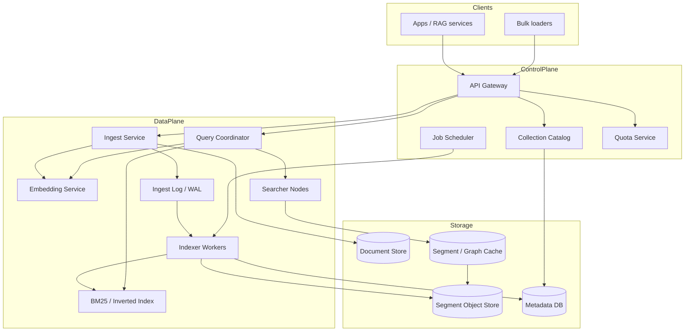
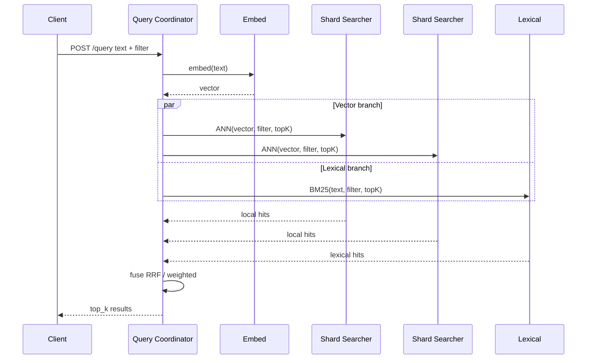

# System Design: Vector / Semantic Search

> **Focus areas:** Embeddings · ANN indexes · Hybrid retrieval · Freshness · Multi-tenant isolation · Ranking  
> **Style:** End-to-end data-platform design with progressive scale (10× → 100× → 1,000×)  
> **API orientation:** Index + Query APIs over collections; not a full RAG product (RAG is a consumer)

---

## Table of Contents

1. [Clarify Requirements (Interview Q&A)](#1-clarify-requirements-interview-qa)
2. [Back-of-the-Envelope Estimation](#2-back-of-the-envelope-estimation)
3. [High-Level Design](#3-high-level-design)
4. [Architecture Diagram](#4-architecture-diagram)
5. [Design Deep Dive](#5-design-deep-dive)
6. [Wrap-Up](#6-wrap-up)
7. [Deeper / Related Interview Questions](#7-deeper--related-interview-questions)

---

## 1. Clarify Requirements (Interview Q&A)

The goal of this phase is to **bound the problem**: what we build, what we defer, and at what scale we must succeed.

### 1.0 What this is / is not

| This is | This is not |
|---------|-------------|
| A **vector / semantic search platform**: ingest documents → embed → index → ANN (+ optional hybrid) query | A full **RAG product** (prompting, citations UI, agent loops) |
| Multi-tenant **collections** with filters, namespaces, and ACLs | A general-purpose relational warehouse |
| Online query path with p99 latency SLOs + async index build | Training infrastructure for embedding models |
| Versioned embedding models + reindex workflows | Lexical-only search (though hybrid is in scope) |

### 1.1 Functional Requirements

| # | Question to ask | Expected / typical interviewer answer | Design implication |
|---|-----------------|----------------------------------------|--------------------|
| F1 | Who are the primary users? | Product teams building RAG, recommendations, semantic product search; platform team operates the service | Multi-tenant SaaS control plane + high-QPS data plane |
| F2 | What is a document? | Text/PDF/HTML chunks + metadata (tenant, product_id, tags, ACL); optional image/multimodal Phase 2 | Chunk as first-class unit; store raw blob separately; vector + payload |
| F3 | Who embeds? | Platform provides managed embed API; tenants may bring precomputed vectors | Dual ingest: `text` (embed-for-me) vs `vector` (BYO); store `model_id` + dim |
| F4 | Query modes? | kNN / ANN by vector or text query; metadata filters; hybrid (BM25 + vector) with fusion | Query planner: filter → ANN → (optional lexical) → fusion → rerank hook |
| F5 | Freshness? | Near-real-time: new docs searchable in seconds–minutes; full reindex for model changes | Streaming upsert path + background compaction/rebuild |
| F6 | Deletes / GDPR? | Soft delete + hard purge; tombstones must hide from search immediately | Tombstone in filter bitset before async vector removal |
| F7 | Multi-tenancy? | Soft isolation by `tenant_id` + `collection_id`; noisy-neighbor quotas | Shard by collection; per-tenant QPS/storage quotas |
| F8 | Filtering? | Equality, ranges, tags; pre-filter preferred over post-filter | Payload indexes (inverted / columnar) co-located with vectors |
| F9 | Ranking beyond distance? | Optional cross-encoder rerank on top-K; score fusion with lexical | Pluggable rerank stage; keep ANN topK larger than final N |
| F10 | Consistency? | Read-your-writes for upsert within a collection eventually (seconds); no global linearizability | Per-shard sequence / generation; query sees committed segments |
| F11 | Batch vs online ingest? | Both: bulk load (millions) and online upserts | Separate bulk indexer path; avoid poisoning online QPS |
| F12 | Exact vs approximate? | Approximate by default; exact for small collections / eval | Index type per collection; recall SLOs + eval harness |
| F13 | Multi-region? | Active-passive or read replicas; writes in home region | Collection home cell; query routing by region affinity |
| F14 | AuthZ on results? | Document-level ACL filters must not leak | Filter at index or post-filter with overfetch; never return denied ids |

**MVP functional scope (lock this with interviewer):**

1. Create / configure collections (dim, metric, embedding model, retention).
2. Upsert / delete documents (text or precomputed vector) with metadata.
3. Query: ANN top-K by text or vector + metadata filters.
4. Hybrid search (BM25 + vector) with RRF or weighted fusion.
5. Index status, freshness lag metrics, reindex job for model upgrade.
6. Multi-tenant quotas, API keys, audit of admin ops.
7. Soft delete with immediate search exclusion.

**Out of MVP (explicitly defer):**

- Multimodal embeddings (image/audio) as first-class
- Graph / multi-hop retrieval
- Learned sparse embeddings (SPLADE) beyond BM25
- Cross-region active-active writes
- Tenant-supplied custom ANN algorithms
- Full RAG orchestration (chunking policies can be hooks only)

### 1.2 Non-Functional Requirements

| # | Question | Expected answer | Target |
|---|----------|-----------------|--------|
| N1 | Query latency? | Interactive search / RAG retrieve | p50 < 30ms, p99 < 100ms in-region (excl. embed + rerank) |
| N2 | Embed latency? | Separate from ANN | p99 < 200ms for short text; batch embed async for ingest |
| N3 | Availability? | Search is product-critical for many tenants | 99.9% query; 99.5% ingest |
| N4 | Durability? | No silent loss of committed upserts | WAL / object-store segment durability; RPO ≈ 0 for acknowledged writes |
| N5 | Recall@K? | Approx index must meet SLA | Recall@10 ≥ 0.95 vs exact on eval set (configurable) |
| N6 | Consistency? | Eventual within collection | Upsert visible ≤ 5s p99 (MVP); ≤ 1s at scale with streaming segments |
| N7 | Multi-region? | DR + regional read | RPO < 5 min async; RTO < 30 min failover |
| N8 | Security? | Tenant isolation, encryption, PII in payloads | TLS, encryption at rest, ACL filters, no cross-tenant cache keys |
| N9 | Cost? | Memory dominates ANN | Quantization, disk-backed HNSW/IVF, tier hot/cold collections |

### 1.3 Cases (User Flows & Edge Cases)

**Happy paths**

1. Create collection (dim=1536, cosine) → bulk upsert 1M chunks → query by text → top-K with scores + payloads.
2. Online upsert → within seconds appears in search for that collection.
3. Hybrid query: lexical candidates + vector candidates → RRF → return N.
4. Soft-delete doc → subsequent queries exclude it; purge job removes vector later.
5. Embedding model upgrade → create new index version → dual-write / backfill → cutover → drop old.

**Edge / failure cases**

| Case | Behavior |
|------|----------|
| Dimension mismatch on upsert | Reject `400`; never silently pad/truncate |
| Filter selectivity extreme (1 in 1e9) | Prefilter graph walk or bitmap AND; overfetch; degrade to filtered brute-force shard-local |
| Hot collection (celebrity tenant) | Isolate to dedicated shard set; rate limit; fair scheduler |
| Embedding service outage | Fail text-ingest/query-by-text; allow BYO-vector upsert/query |
| Index build OOM | Spill / quantize / shard split; never mark READY if incomplete |
| Duplicate upsert same id | Idempotent replace; bump version; old vector tombstoned |
| Query during reindex cutover | Pin query to index generation; dual-read only if explicitly configured |
| ACL change mid-flight | Filter uses latest ACL source or denormalized ACL tokens on doc; document policy |
| Huge payload (1 MB metadata) | Cap payload size; store large blobs in object store; index pointer only |
| ANN recall cliff after deletes | Compaction / rebuild threshold; monitor fragmentation |

### 1.4 Scales (Progressive)

| Metric | Baseline | 10× | 100× | 1,000× |
|--------|----------|-----|------|--------|
| Tenants | 100 | 1K | 10K | 100K |
| Collections | 500 | 5K | 50K | 500K |
| Vectors (total) | 100M | 1B | 10B | **100B** |
| Dim (typical) | 768–1536 | same | same | mixed 256–3072 |
| Upserts / day | 10M | 100M | 1B | 10B |
| Query QPS (peak) | 1K | 10K | 100K | **1M** |
| Avg top-K | 50 | 50 | 50–100 | 50–100 |
| Hot working set (vectors in RAM) | 20M | 100M | 500M | multi-tier |
| Filter fields / doc | 10 | 10–20 | 20 | 20–50 |
| Reindex jobs concurrent | 2 | 10 | 50 | 200 |

**What each jump forces architecturally:**

- **10×:** Shard collections across nodes; separate embed fleet; Redis for tiny metadata caches; segment-based index.
- **100×:** Disk-backed / memory-mapped indexes; PQ/SQ quantization; query scatter-gather; dedicated bulk ingest cluster; collection placement service.
- **1,000×:** Cell architecture by tenant tier; hierarchical navigable graphs sharded; GPU optional for embed only; cold collections on object-store + cache; global control plane, regional data planes.

### 1.5 Etc. (Constraints & Assumptions)

- **Single cloud vs multi-cloud?** One primary cloud, multi-AZ; multi-region DR.
- **Build ANN or buy?** Design as if building platform atop open algorithms (HNSW / IVF-PQ); interview focuses on system, not paper math.
- **Metric?** Cosine / IP / L2 — normalize for cosine at ingest.
- **Chunking?** Client or separate ingest service owns chunking; vector search stores chunks.
- **Rerankers?** Optional external model; latency budget separate.

**Scope statement to repeat back:**

> Design a multi-tenant **vector / semantic search** platform: collection management, embed-or-BYO ingest, ANN (+ hybrid) query with metadata filters and ACL-safe results, near-real-time freshness, and a reindex story for embedding-model changes—from ~100M vectors to 1000× with clear tiering and sharding.

---

## 2. Back-of-the-Envelope Estimation

### 2.1 Vector storage (raw)

```text
float32 vector: dim × 4 bytes
1536-d → 6 KB / vector
100M vectors → 600 GB raw vectors alone

With replication (×3) + graph links (HNSW ~1–2×) + payloads:
  operational footprint often 2–4× raw → ~1.2–2.4 TB at baseline
```

At **100B vectors** without compression: **~600 PB** raw float32 — impossible. Quantization and tiering are mandatory.

### 2.2 Quantization impact

```text
PQ 64 bytes / vector (example) vs 6144 bytes float32
→ ~96× compression on vector body
100B × 64 B = 6.4 PB compressed vectors (still huge; shard + cold tiers)
Product quantization + disk ANN + hot LRU of graphs is the 1000× design
```

### 2.3 Query QPS and fanout

```text
Baseline peak: 1K QPS
Each query: embed (if text) + scatter to S shards + merge top-K

If collection spans 8 shards:
  shard QPS ≈ 1K × 8 = 8K (plus replicas)

1,000×: 1M QPS → need aggressive caching of hot queries,
  collection-local routing (not global scatter), and tenant fairness
```

### 2.4 Ingest bandwidth

```text
Baseline: 10M upserts/day ≈ 115 upserts/s avg; peak ~1–2K/s
Each upsert: vector 6 KB + payload 1 KB ≈ 7 KB
Peak ingest: 2K × 7 KB ≈ 14 MB/s (easy)

100×: 1B/day → ~12K/s avg, ~100K/s peak
Peak: 100K × 7 KB ≈ 700 MB/s → dedicated ingest + batched WAL
```

### 2.5 Memory (HNSW hot set)

```text
HNSW in RAM rough: vector + neighbors
Often 8–16 KB effective / vector for 1536-d float32

20M hot vectors × 12 KB ≈ 240 GB RAM across fleet
At 100× hot set, must mmap + PQ or split collections
```

### 2.6 Embedding compute

```text
Assume 1K tokens/s / GPU for embedding model (illustrative)
Bulk embed 10M chunks × 500 tokens = 5B tokens
@ 1K tok/s/GPU → need parallel GPU batch jobs (hours with fleet)
Online query embed: batch size 1–8; separate latency-optimized replicas
```

### 2.7 Cache

| Data | Size | TTL | Hit goal |
|------|------|-----|----------|
| Collection config + index gen | tiny | 30s + push invalidation | ~100% |
| Hot query results (optional) | medium | 5–60s | only for identical public queries |
| Embedding of repeated queries | small | minutes | medium (privacy-aware) |
| ACL tokens / group membership | small | seconds | high |

**Do not** cache personalized ACL results without including ACL version in key.

---

## 3. High-Level Design

### 3.1 Core domain model

```text
Tenant
  └── Collection
        ├── Config { dim, metric, model_id, index_type, shards, replicas }
        ├── IndexGeneration { gen, state: BUILDING|READY|DRAINING|DEAD }
        ├── Document / Chunk
        │     ├── id, version
        │     ├── vector (or ref), model_id
        │     ├── payload (JSON), acl_tokens[]
        │     └── lexical text (for BM25)
        └── Tombstones
```

**Document state machine (logical):**

```text
upserted → searchable
         → tombstoned (hidden) → purged (storage reclaimed)
```

**Index generation state machine:**

```text
BUILDING → READY → DRAINING (after cutover) → DEAD
```

### 3.2 API shape

| Method | Path | Purpose |
|--------|------|---------|
| POST | `/v1/collections` | Create collection |
| GET/PATCH | `/v1/collections/{id}` | Config / status |
| POST | `/v1/collections/{id}/upsert` | Batch upsert (text or vector) |
| POST | `/v1/collections/{id}/delete` | Soft delete by ids / filter |
| POST | `/v1/collections/{id}/query` | ANN / hybrid query |
| POST | `/v1/collections/{id}/reindex` | Start new generation |
| GET | `/v1/jobs/{id}` | Bulk / reindex job status |

**Query request (conceptual):**

```json
{
  "query": { "text": "wireless noise cancelling headphones" },
  "top_k": 20,
  "filter": { "brand": "acme", "price": {"$lte": 200} },
  "hybrid": { "alpha": 0.6, "lexical_top_k": 50 },
  "rerank": false,
  "include_payload": true
}
```

**Idempotency:** upsert with `(collection_id, doc_id, version)` or Idempotency-Key for batches.

### 3.3 Why choose A over B

| Decision | Prefer | Over | Why | Deal-breaker if wrong |
|----------|--------|------|-----|------------------------|
| Index | HNSW for mid-size / high recall | Pure IVF | Better latency/recall for interactive | HNSW RAM blowup at 100B without PQ/disk |
| Filter | Pre-filter / constrained search | Post-filter only | Extreme filters return empty after ANN | Post-filter alone fails sparse predicates |
| Embed | Sidecar embed service | In-process in query node | Scale independently; GPU pool | Coupling causes query meltdown |
| Storage | Segment files on object store + local cache | Only block devices | Rebuild / rebalance easier | Object store latency without cache kills p99 |
| Hybrid | Separate BM25 + vector fusion | Single magic score | Debuggable; tunable | Opaque score can't fix bad lexical |
| Multi-tenant | Collection placement + quotas | One giant shared index | Isolation + blast radius | Noisy neighbor / data leak risk |
| Deletes | Tombstone bitset first | Immediate graph surgery | Instant correctness | Deleted docs keep appearing |

### 3.4 Write path

1. API validates dim, tenant quota, payload size.
2. If text: enqueue embed (online small-batch or async for bulk).
3. Append to durable WAL / ingest log (Kafka or equivalent) keyed by `collection_id`.
4. Indexer workers write to **mutable segment** (memtable-like); flush to immutable segment.
5. Update payload inverted indexes / columnar filter structures.
6. Acknowledge when durability bar met (replica fsync or quorum).
7. Searcher loads new segment via generation notification (pubsub).

### 3.5 Read path

1. Resolve collection → placement (shards, index gen READY).
2. AuthZ: inject ACL constraints into filter.
3. If query text: embed (cache optional).
4. Planner: choose ANN params (ef/probes) from latency class; compute filter bitmap if selective.
5. Scatter query to shard replicas (hedged requests optional).
6. Each shard: filtered ANN → local top-K.
7. Coordinator: merge by score; optional lexical branch + RRF; optional rerank.
8. Truncate to `top_k`; return ids, scores, payloads.

### 3.6 Hybrid fusion

```text
RRF(d) = Σ 1 / (k + rank_list(d))
Weighted: s = α * norm(sim_vec) + (1-α) * norm(bm25)
```

Prefer **RRF** when score scales differ; weighted when calibrated. Always retrieve `vector_top_k` and `lexical_top_k` > final N.

### 3.7 Reindex / model change

1. Create IndexGeneration N+1 with new `model_id` / dim.
2. Backfill: read docs from source of truth (doc store), re-embed, build segments offline.
3. Dual-write new upserts to N and N+1.
4. Eval recall/latency on shadow traffic.
5. Atomic cutover pointer READY → queries use N+1.
6. Drain N; reclaim storage.

**Source of truth:** document store (object/DB), not the ANN graph alone—graphs are derived.

---

## 4. Architecture Diagram





---

## 5. Design Deep Dive

### 5.1 Reliability

**Data loss prevention**

- Acknowledge upsert only after WAL quorum / object-store segment commit.
- Document store is SoT; ANN segments are rebuildable.
- Checksums on segment files; reject corrupt loads.

**Retries & idempotency**

- Upsert idempotent on `(doc_id, version)` — higher version wins; same version no-op.
- Bulk jobs checkpoint by offset / primary-key ranges.
- Query path: hedged retries on straggler shards with cancellation.

**Rate limits & backpressure**

- Per-tenant QPS and ingest bytes/s; 429 with `Retry-After`.
- WAL consumer lag → slow ingest ACK or reject new bulk jobs.
- Embed queue depth → shed text-query embeds first; prefer BYO vector if allowed.

**Deletes & GDPR**

- Immediate tombstone in filter structure (must be sync path).
- Async purge from graphs; compaction removes vectors.
- Prove deletion with audit log + verification query.

**Failure modes**

| Failure | Mitigation |
|---------|------------|
| Searcher crash | Replicas; reload segments from object store |
| Partial segment publish | Generation fencing; readers only see sealed segments |
| Split brain cutover | Single-writer catalog CAS on `ready_gen` |
| Poison vector (NaN) | Validate at ingest; quarantine |

### 5.2 Scalability

**Sharding**

- Default: hash(`doc_id`) within collection across N shards.
- Large tenants: dedicated shard sets; small tenants: pack many collections per node with memory caps.
- Avoid global queries across all tenants.

**Scale up/down**

- Add searcher replicas for QPS; add shards for vector count / RAM.
- Split shard when segment size or RAM exceeds threshold (online rebalance via segment move).

**Storage tiers**

| Tier | Technique | Use |
|------|-----------|-----|
| Hot | float16/float32 HNSW in RAM/mmap | Active product search |
| Warm | PQ + disk graph | Large corpora, softer latency |
| Cold | Object store + on-demand load | Compliance archives, rare collections |

**Parallelization**

- Bulk index: partition by id range; deterministic segment naming.
- Query: scatter-gather with early termination when bounds prove merge safe (optional).

**Hot keys**

- Identical popular queries: short TTL result cache keyed by `(collection, gen, query_hash, filter_hash, acl_ver)`.
- Hot documents: not usually a problem for ANN; hot **collections** need isolation.

### 5.3 Maintainability

**Ops**

- SLOs: query p99, recall proxy (sample exact), ingest lag, tombstone lag, segment load errors.
- Dark launch new index gens with shadow traffic.

**Observability**

- Per-collection metrics (cardinality carefully aggregated).
- Trace: embed → shard fanout → merge.
- Index health: fragmentation ratio, deleted%, graph degree stats.

**Migrations**

- Dim / model change = new generation only (never in-place mutate dim).
- Metric change (L2 ↔ cosine) requires re-normalize + rebuild.

**Multi-tenant**

- Hard caps on vectors, payload bytes, QPS.
- Placement service encodes isolation tier (shared / dedicated).
- Security reviews on filter injection and payload exfiltration.

---

## 6. Wrap-Up

### Decision summary

| Area | Choice |
|------|--------|
| SoT | Document store + WAL; ANN derived |
| Index | HNSW / IVF-PQ by collection size; quantized at scale |
| Query | Coordinator scatter-gather; hybrid RRF; ACL in filter |
| Freshness | Mutable → sealed segments; seconds-level visibility |
| Model change | Index generations + dual-write + atomic cutover |
| Isolation | Collection placement, quotas, no shared result cache across ACL |

### Phased rollout

1. **MVP:** single-region, HNSW, text+vector upsert, filtered ANN, soft delete.
2. **Phase 1.5:** hybrid BM25, bulk jobs, reindex generations, quotas.
3. **Phase 2:** disk/PQ tiers, multi-region read, hedged queries, dedicated large tenants.
4. **Phase 3:** 100B-vector cell architecture, cold tier, advanced filtered ANN.

---

## 7. Deeper / Related Interview Questions

**Q1. Why not put all vectors in one giant HNSW graph?**  
Memory, blast radius, multi-tenant QoS, and reindex cost. Collection/shard isolation wins; cross-collection search is rare and can fan out explicitly.

**Q2. Pre-filter vs post-filter — when does each fail?**  
Post-filter fails when predicate matches ≪ K (you may get 0 after scanning M candidates). Pre-filter / bitmap-guided search is required for sparse filters; pure pre-filter can hurt connectivity in graphs—use constrained search or overfetch adaptively.

**Q3. How do you estimate RAM for HNSW?**  
`n × (dim × bytes + M × 2 × edge_ptr_size × layers_factor)` plus allocator overhead. Interview: show dim×4×n as lower bound and state graph overhead can double it.

**Q4. Product quantization trade-off?**  
Big memory win, asymmetric distance compute, recall loss. Compensate with higher `nprobe` / rerank with full-precision vectors for top candidates.

**Q5. How does delete work without destroying recall?**  
Tombstones for correctness; periodic compaction rebuilds graphs. High delete ratios without compaction → memory bloat + recall holes.

**Q6. Exact search for evaluation?**  
Brute-force on sample or shard-local exact; never claim global exact on 100B. Maintain golden sets per collection class.

**Q7. Consistent hashing for shards?**  
Yes for doc placement; virtual nodes to reduce imbalance. Rebalance moves sealed segments, not point updates one-by-one.

**Q8. What breaks p99: embed or ANN?**  
Often embed + cold segment load + straggler shard. Split budgets; cache segments; hedge; make embed optional via BYO vector.

**Q9. Hybrid fusion: RRF vs learned ranker?**  
RRF is robust without labels; learned ranker needs training data and careful online/offline parity. Start RRF; add rerank later.

**Q10. How do you prevent cross-tenant leakage via cache?**  
Cache keys include `tenant_id`, `collection_id`, and `acl_version`. Prefer no shared cache for authenticated personalized results.

**Q11. IVF vs HNSW at 10B vectors?**  
IVF-PQ often better memory/ops for huge sets; HNSW better latency/recall at mid scale. Many systems tier: HNSW hot, IVF cold.

**Q12. Streaming upsert vs batch rebuild?**  
Streaming for freshness; batch rebuild for model change and defragmentation. Both exist—don't pick only one.

**Q13. How to handle changing ACLs?**  
Denormalize group tokens onto docs at write, or query-time expand groups into filter. Token expansion must be bounded; watch hot groups.

**Q14. Why store lexical text separately?**  
BM25 needs terms; vectors lose keyword precision (SKUs, codes). Hybrid fixes complementary failure modes.

**Q15. Can Kafka be the vector store?**  
No—Kafka is the ingest log. Vectors live in segment store + searcher cache. Kafka retains for replay/rebuild window.

**Q16. Load balancer algorithm for searchers?**  
Power-of-two choices or least-outstanding-requests on replicas of same shard; **not** naive RR across different shards (coordinator owns shard set).

**Q17. How do you cap fanout cost?**  
Limit shards per collection; adaptive `top_k` per shard; reject huge `top_k`; coalesce identical shard queries.

**Q18. Float16 vs int8 embeddings?**  
Store compressed; compute may upcast. Be explicit about recall impact and whether query vectors use same quantization.

**Q19. Multi-region active-active writes?**  
Hard: conflicting upserts/versions. Prefer home-region writes + async replicate segments; or CRDT-ish last-writer-wins with version vectors.

**Q20. How is this different from a vector DB product pitch?**  
Interview wants control-plane/data-plane split, SoT vs derived index, failure modes, multi-tenant economics—not only “we use HNSW.”

**Q21. Memory vs disk ANN — what changes in SLO?**  
Disk: p99 dominated by I/O; need readahead, cached hot graph layers, PQ to reduce bytes/probe. Memory: capacity planning dominates.

**Q22. How do you test recall in production?**  
Shadow exact/near-exact on samples; pairwise overlap metrics; alert on sudden drops after deploys/reindexes.

**Q23. Batch upsert atomicity?**  
Per-doc atomic; batch is best-effort with per-id status. Don't fake multi-doc transactions across shards unless required.

**Q24. Why generation numbers on indexes?**  
Fence readers/writers during cutover; prevent mixing dim/model; enable rollback by pointer flip.

**Q25. Straggler mitigation?**  
Hedged requests, replica selection by EWMA latency, cancel losers, isolate GC-heavy nodes.

**Q26. Can you ANN-search across multiple collections?**  
Fan-out queries and merge—expensive. Prefer unified collection with namespace field, or explicit multi-collection API with limits.

**Q27. Cost attribution?**  
Track RAM-hours, query units, embed tokens per tenant. Memory is the scarce resource—charge for reserved vector capacity.

**Q28. Security: can filters inject?**  
Structured filter AST only—never string-concatenated query DSLs from clients into internal engines.

**Q29. What if dim=3072 and RAM explodes?**  
Mandatory Matryoshka truncations / PQ / lower-dim projection models; product conversation on quality vs cost.

**Q30. Relationship to RAG system design?**  
This platform is the retrieval substrate. RAG adds chunking, orchestration, citation, and answer generation—keep boundaries clean in the interview.

---

*End of Vector / Semantic Search system design.*

## Appendix — Deep dive notes for Vector or semantic search

### Hardest invariants
- Define the correctness property that must not break under retries, partial failures, or overload.
- Define multi-tenant isolation boundaries if applicable.
- Define delete/TTL/privacy semantics across primary + cache + search + logs.

### Likely bottlenecks
1. Hot keys / hot partitions for core entity ids
2. Synchronous dependency latency tails (p99)
3. Write amplification from secondary indexes / fanout
4. Compaction / GC / backfill stealing cluster IO
5. Cross-region chatty patterns

### Suggested metrics (RED + business)
| Metric | Why |
|--------|-----|
| Request rate / error / duration | Golden signals |
| Saturation (CPU, pool, queue lag) | Leading indicator |
| Idempotency conflict rate | Client retry health |
| Cache hit ratio | Origin protection |
| Business SLI for Vector or semantic search | Product truth |

### Migration & rollout
- Expand/contract schema changes
- Dual-write or shadow reads for store migrations
- Feature-flagged cutover; canary on error budget
- Backfill with checkpoints and replayable logs

### What interviewers poke next
- Memory footprint of your cache/index choice
- Exact concurrency control (locks vs OCC vs ledger)
- Cost model at 100×
- Abuse cases unique to Vector or semantic search

## Appendix A — Interview execution checklist

1. **Repeat scope** in one sentence; list out-of-scope.
2. **Write NFRs as numbers** (QPS, p99, RPO/RTO).
3. **Draw** clients → edge → svc → store → async.
4. **Call the hardest invariant** early.
5. **Pick consistency** deliberately; do not say “strong everywhere.”
6. **Show scale jumps** at 10× / 100× / 1,000× with architecture changes.
7. **Name failure modes** and degraded behavior.
8. **Close** with metrics, rollout, and residual risks.

## Appendix B — Trade-off flashcards

| Topic | Prefer | Avoid |
|-------|--------|-------|
| Sync vs async | Sync for money/authz ack | Sync for fanout/email/indexing |
| SQL vs KV | Multi-row invariants | Ultra-high simple point ops |
| Cache | Read-heavy + tolerable stale | Incorrect money reads |
| Queue | Spike absorb + retry | Hidden request/response bus |
| Multi-region | Home cell single-writer | Multi-writer without merge rules |

## Appendix C — Reliability patterns to name drop correctly

- Idempotency keys + request hash
- Outbox / transactional messaging
- Leases + fencing tokens
- Quorum / consensus (Raft) for coordination—not for every data path
- Bulkheads + circuit breakers + deadlines
- Load shedding + admission control
- Canary + automatic rollback on SLO burn
- Backup restore drills (backup ≠ restore tested)

## Appendix D — Scalability patterns

- Consistent hashing with virtual nodes
- Hierarchical sharding (cell → shard → partition)
- CQRS / projections for read models
- Hot-key splitting and salting
- Tiered storage + compaction budgets
- Consumer parallelization by partition
- Edge caching with purge/surrogate keys

## Appendix E — Sample capacity dialogue

```text
Interviewer: Assume 10M DAU.
You: 10M DAU × 5 key actions/day ≈ 50M events/day ≈ 580 QPS avg.
Peak 15× ⇒ ~9K QPS. With 70% cache hit on reads, origin ~2.7K QPS.
At 100×, origin ~270K QPS ⇒ shard + edge mandatory.
```

Customize the action rate to this problem; do not reuse social-feed numbers for a ledger.


*Enriched for interview drill · `vector-semantic-search`*
