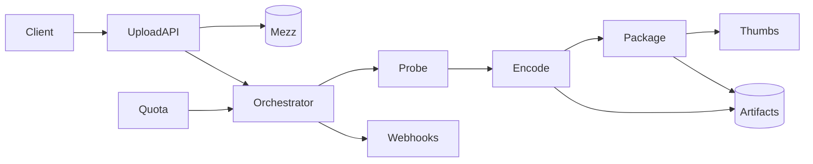

# System Design: Video Upload and Transcoding

> **Focus areas:** Resumable upload · Mezzanine · Probe · Ladder encode · Package HLS/DASH · Thumbnails · Priority queues · DRM optional · QC
> **Style:** End-to-end product design with progressive scale (10× → 100× → 1,000×)
> **Quality bar:** Domain-specific numbers and failure modes; explicit trade-offs; deal-breakers; CDN / ABR / encoding / DRM where relevant
> **Interview theme:** Senior / Staff — **Video upload & transcoding pipeline**

---

## Table of Contents

1. [Clarify Requirements (Interview Q&A)](#1-clarify-requirements-interview-qa)
2. [Back-of-the-Envelope Estimation](#2-back-of-the-envelope-estimation)
3. [High-Level Design](#3-high-level-design)
4. [Architecture Diagram](#4-architecture-diagram)
5. [Design Deep Dive](#5-design-deep-dive)
6. [Wrap-Up](#6-wrap-up)
7. [Deeper / Related Interview Questions](#7-deeper--related-interview-questions)
8. [Appendices](#8-appendices)

---

## 1. Clarify Requirements (Interview Q&A)

Goal: design the **video upload and transcoding pipeline** used under YouTube/Netflix-like products: resumable ingest, durable mezzanine, multi-rung encode, packaging, thumbnails, status, retries.

### 1.0 What this is / is not

| Dimension | This doc | Not this |
|---|---|---|
| Job | Ingest→process→artifacts READY | Full consumer watch app UI |
| Lens | Jobs, idempotency, ladders, cost | Feed ranking |

### 1.1 Functional Requirements

| # | Question | Expected interviewer answer | Design implication |
|---|---|---|---|
| F1 | Upload? | Resumable multipart | Upload service |
| F2 | Probe? | ffprobe metadata | Probe step |
| F3 | Ladder? | Multi bitrate/codec | Encode graph |
| F4 | Package? | HLS/DASH/CMAF | Packager |
| F5 | Thumbs? | Sprites/posters | Thumb job |
| F6 | DRM? | Optional CENC | Key service |
| F7 | Priority? | Interactive vs batch | Queues |
| F8 | Notify? | Webhooks/status API | Callbacks |
| F9 | QC? | Black frames, loudness | QC gates |
| F10 | Re-encode? | New codec rollout | Replay from mezz |
| F11 | Malware? | Scan uploads | Scanner |
| F12 | Quotas? | Per-tenant minutes | Quota service |
| F13 | Multi-region? | Upload local | Regional intake |
| F14 | Partial publish? | Min rung first | Progressive enhance |

**MVP scope:**

1. Resumable upload
2. Mezz store
3. Probe+ladder H.264
4. Package HLS
5. Thumbs
6. Job status API
7. Retries/idempotency
8. Min-rung publish signal

**Out of MVP:**

- Perfect perceptual shot-based everywhere
- Full studio QC suite

### 1.2 Non-Functional Requirements

| # | NFR | Target |
|---|---|---|
| N1 | Upload resume | Flaky network OK |
| N2 | Time-to-first-rung | Minutes for short video |
| N3 | Durability mezz | 11 9s class |
| N4 | Exactly-once publish effect | CAS |
| N5 | Tenant isolation | No noisy neighbor starve |
| N6 | Observability | Per-job traces |
| N7 | Cost | CPU/GPU hours tracked |
| N8 | Security | Signed upload URLs |

### 1.3 Cases

**Happy:** Upload complete → DAG runs → artifacts → READY webhook.  
**Edges:** corrupt file; huge 4K; codec unknown; worker OOM; thundering reencode; tenant flood; packager mismatch.

| Case | Behavior |
|---|---|
| Chunk retry | Idempotent ETag |
| One rung fail | Retry rung; publish others if policy |
| Re-drive | Same output keys overwrite safely |
| Quota exceed | Reject or queue defer |
| Poison | Quarantine |

### 1.4 Progressive scale

| Metric | Baseline | 10× | 100× | 1,000× |
|---|---|---|---|---|
| Jobs/day | 10K | 100K | 1M | 10M |
| Avg duration min | 5 | 5 | 8 | 10 |
| Peak jobs/s | 2 | 20 | 200 | 2K |
| GPU workers | 10 | 100 | 1K | 10K |
| Storage TB/day | 5 | 50 | 500 | 5K |
| Tenants | 10 | 100 | 1K | 10K |
| Webhook QPS | 10 | 100 | 1K | 10K |
| Reencode backlog hrs | 1 | 5 | 20 | 100 |

**Jumps:** 10× queue+autoscaling; 100× shard orchestrator+spot GPUs; 1,000× codec fleet efficiency+per-tenant fairness.

### 1.5 Etc. constraints + scope repeat-back

Constraints: ffmpeg versions, patent codecs, GPU availability, customer SLA tiers.

> Upload/transcode platform: resumable bytes, durable mezz, idempotent ladder+package DAG, priorities/quotas, webhooks—mezz is source of truth for re-drives.

---

## 2. Back-of-the-Envelope Estimation

### 2.1 CPU hours

```text
100K jobs/day × 10 min media × 4× realtime encode ≈ huge — need parallel rungs + efficient presets.
```

### 2.2 Storage

```text
Mezz + packaged multiplier; lifecycle policies.
```

### 2.3 Queue depth

```text
Peak 10× avg; SLO on wait time per tier.
```

### 2.4 GPU vs CPU

```text
AV1 GPU; H.264 CPU; schedule by type.
```

### 2.5 Webhook storms

```text
Backoff + idempotent customer endpoints.
```

### 2.N Bottleneck ranking

1. Egress / edge bandwidth and hit ratio
2. Hot keys (viral titles, celebrity metadata)
3. Processing fleets (encode/ASR/ML)
4. Control-plane fanout (manifests, licenses, personalization)
5. Cold retrieval / long-tail

### 2.N+1 Cost intuition

```text
Storage << egress at watch scale.
Cache hit ratio and codec efficiency are executive levers.
Processing ($GPU/CPU-hours) matters for UGC firehose and ML pipelines.
```

---

## 3. High-Level Design

### 3.1 Planes (critical split)

| Plane | Responsibility | Consistency |
|---|---|---|
| Upload | Bytes in | Idempotent chunks |
| Orchestration | DAG state | Strong job state |
| Workers | Encode/package | At-least-once |
| Artifact store | Outputs | WORM/versioned |
| Control | Quotas/keys | Strong |

**Why this split:** Workers are fungible and crashy; job state machine must be authoritative.

### 3.2 Components

1. Upload API
2. Object Store Mezz
3. Orchestrator/Workflow
4. Probe Workers
5. Encode Workers
6. Package Workers
7. Thumb Workers
8. QC Workers
9. KMS/DRM
10. Quota
11. Status/Webhook
12. Artifact Index
13. Priority Queues
14. Autoscaler
15. Admin Replay

### 3.3 APIs (sketch)

```text
POST /uploads → upload_id, urls
PUT  /uploads/{id}/parts/{n}
POST /uploads/{id}/complete → job_id
GET  /jobs/{id}
POST /jobs/{id}/retry
POST /webhooks/config
GET  /artifacts/{asset_id}
```

### 3.4 Data model (core)

```text
Upload{id, tenant, size, status}
Job{id, asset_id, dag_version, state, priority}
Task{id, job_id, type, attempt, output_keys}
Artifact{asset_id, kind, path, checksum, codec, bitrate}
```

### 3.5 Trade-offs

| Topic | Choice | Why |
|---|---|---|
| DAG engine | Temporal/Step Functions/custom | Ops vs control |
| Spot GPUs | Yes with checkpoints | Cost vs restarts |
| Min publish | Yes | UX |
| Preset quality | Speed vs VMAF | SLA tiers |

### 3.6 Deal-breakers

| Temptation | Failure |
|---|---|
| Non-deterministic output paths | Duplicate waste / broken publish |
| No mezz retention | Cannot reencode |
| Fairness ignored | Enterprise tenants melt |
| Sync encode in upload HTTP | Timeouts |

---

## 4. Architecture Diagram

### 4.1 C4-ish / flow



### 4.2 Happy DAG

```text
complete() → create job → probe → parallel encodes → package → thumbs → QC → CAS READY → webhook.
```

### 4.3 Retry

```text
Task fails → attempt++ → same output key → success → continue DAG.
```

---

## 5. Design Deep Dive

### 5.1 Reliability (data loss prevention, retries, idempotency, rate limits, backpressure)

1. Chunk checksums
2. Deterministic keys
3. CAS READY
4. Poison quarantine
5. Tenant rate limits
6. Dead letter queues
7. Checkpoint long encodes
8. Webhook signed + retry
9. Multi-AZ state store
10. Idempotent admin replay

### 5.2 Scalability (scale up/down, sharding, storage tiers, parallelization)

| Scale | Architecture moves |
|---|---|
| 1× | Redis queue + worker pool |
| 10× | Sharded queues; autoscale |
| 100× | Workflow service; spot GPU; regional intake |
| 1,000× | Cell per tenant tier; global reencode program |

### 5.3 Maintainability (ops, observability, migrations, multi-tenant)

- Pin ffmpeg/image versions
- Canary presets with VMAF
- Migration: dual package versions
- Cost attribution per tenant

### 5.4 DAG design

Tasks: probe, audio, video rungs parallel, package, thumbs, fingerprint hook, QC.


### 5.5 Priority/fairness

WFQ across tenants; interactive lane.


### 5.6 Packaging

CMAF; HLS+DASH; encryption optional.


### 5.7 Re-encode campaigns

Replay mezz with new codec; progressive %.


### 5.8 Progressive scale

1× workers → 10× queues → 100× workflow cells → 1,000× fleet efficiency.


---

## 6. Wrap-Up

### 6.1 Designed

Resumable upload + durable mezz + idempotent transcode/package DAG with quotas, webhooks, progressive publish.

### 6.2 Decisions to defend

1. Mezz source of truth
2. Deterministic artifact keys
3. Min-rung publish
4. WFQ fairness
5. Pinned toolchains
6. Signed webhooks
7. Spot+checkpoint
8. CAS READY

### 6.3 Risks

- OOM on 8K
- Preset regression
- Queue poison
- Webhook downtime
- GPU shortage

### 6.4 45-minute plan

| Min | Focus |
|---|---|
| 0–5 | Scope pipeline not app |
| 5–15 | Upload+mezz |
| 15–25 | DAG+idempotency |
| 25–35 | Packaging/DRM/QC |
| 35–45 | Fairness/scale/cost |

### 6.5 Closer

> **Upload/transcode**: resumable ingest, mezz truth, deterministic DAG artifacts, fairness, progressive READY.

---

## 7. Deeper / Related Interview Questions

### Q1. Why mezzanine kept?

Re-encode, new codecs, recover from bad presets.

### Q2. How parallelize encode?

Per-rung tasks; chunked encoding for long GOP segments with care.

### Q3. Workflow engine choice?

Managed vs custom — durability, timers, visibility.

### Q4. Tenant fairness algorithm?

Weighted fair queuing / token budgets on encode minutes.

### Q5. Detect corrupt media?

Probe + decode smoke; quarantine.

### Q6. Package before all rungs?

Publish subset; update manifests carefully/versioned.

### Q7. GPU bin packing?

Pack similar jobs; avoid fragmentation; migration.

### Q8. Checksum strategy?

Per-part upload + per-artifact content hash.

### Q9. DRM key per asset?

Key rotation policy; KMS envelopes.

### Q10. SLA tiers?

Separate queues + different presets.

### Q11. Where is strong consistency mandatory?

ACL/publish/entitlement and private media access; not counters.

### Q12. Signed URLs vs CDN cache?

Don't put per-user uniqueness into segment cache keys; use cookies/tokens.

### Q13. HLS vs DASH vs CMAF?

Dual manifests over shared CMAF segments when possible.

### Q14. #1 cost lever at watch scale?

Edge hit ratio / offload; then codec efficiency.

### Q15. Premiere stampede controls?

Pre-warm, shield, coalesce, scale license/playback, shed noncritical work.

### Q16. Idempotent jobs?

Deterministic output keys + CAS publish.

### Q17. ABR oscillation?

Dwell + asymmetric thresholds + buffer hysteresis.

### Q18. Consistent hashing where?

Shard stateful workers/comments—not static CDN GETs.

### Q19. QoE vs QPS?

Talk rebuffer/startup/bitrate; QPS alone is weak.

### Q20. Multi-CDN when?

~100× for resilience/pricing; needs steering.

### Q21. Offline + DRM?

Persistent licenses, windows, secure storage, online renew.

### Q22. Hot metadata?

Cache + cell isolation; decouple from byte paths.

### Q23. Encode backpressure?

Priority queues; shed archival reencodes.

### Q24. Manifest personalization risk?

Can kill cache hit ratio—keep media manifests stable.

### Q25. Deal-breaker example?

Serving one giant progressive file without ABR at global scale.

---

## 8. Appendices

### A1. Transcode notes

Loudness targets; HDR path; audio language tracks; SSAI markers optional.


### A-Z. Interview checklist

- [ ] Clarified product shape and non-goals
- [ ] Progressive scale jumps that change architecture
- [ ] Control plane vs data/bytes plane
- [ ] CDN / ABR / ladder / DRM called out where relevant
- [ ] Hot-key and failure modes
- [ ] Idempotency and publish gates
- [ ] QoE / domain SLOs not just QPS
- [ ] Cost levers
- [ ] Security / abuse / compliance
- [ ] Phased rollout + kill switches


---

## Appendix: Cross-cutting media patterns (interview ammunition)

### Encoding ladder reference

| Rung | Resolution | H.264 bitrate band | Typical role |
|------|------------|--------------------|--------------|
| L0 | 256×144 | 100–200 kbps | Extreme constrained |
| L1 | 426×240 | 300–500 kbps | Poor mobile |
| L2 | 640×360 | 600–1000 kbps | Mobile floor |
| L3 | 854×480 | 1.0–1.8 Mbps | SD |
| L4 | 1280×720 | 2.5–5 Mbps | HD |
| L5 | 1920×1080 | 4.5–9 Mbps | FHD |
| L6 | 2560×1440 | 8–14 Mbps | QHD optional |
| L7 | 3840×2160 | 12–35 Mbps | 4K (HEVC/AV1) |

Dual-codec (H.264 + AV1/HEVC); packaged ≈ 1.6–2.8× mezzanine.

### ABR loop

```text
throughput_EMA + buffer → downswitch if danger; upswitch with dwell/hysteresis
QoE: startup, rebuffer ratio, avg bitrate, switches, abandon
```

### CDN hierarchy

```text
PoP → mid-tier → origin shield → object store
Immutable versioned segments; personalization in control plane only
```

### DRM

```text
CENC packager; license = entitlement + device level; offline persistent TTL
```

### Scale jumps

| Jump | Moves |
|------|-------|
| 10× | Multi-AZ, queues, shield, caches |
| 100× | Multi-region, cells, multi-CDN, dedicated planes |
| 1,000× | Codec economics, edge experiments, compliance cells |

### Reliability checklist

Idempotent chunks/jobs; publish CAS gate; no orphan manifests; encode backpressure; poison quarantine; key rotation; immutable segments.

### Cost levers

Hit ratio; codec bits; ladder density; cold tiering; prefetch discipline.

### Consistency

Strong: ACL/publish/entitlement. Eventual: counters/search/recs. WORM: segments.

### Deal-breakers

Progressive-only MP4 globally; user-specific segment URLs; sync ML on upload path; DB BLOBs for media; skip DRM on licensed premium.

### Algorithms

Consistent hash shards; Bloom dup; fingerprints/MinHash; WFQ encode; EMA ABR; ANN recs.

### Math templates

```text
cdn_egress ≈ watch_hours * 3600 * bitrate / 8
origin ≈ cdn_egress * (1 - hit_ratio)
mezz/day ≈ uploads/day * dur_s * mezz_bitrate / 8
```

### Reusable closer

> Bytes plane (CDN) ≠ control plane (entitlement/metadata/processing). Atomic publish. QoE. Egress. Idempotent pipelines. Progressive cells/shields.
