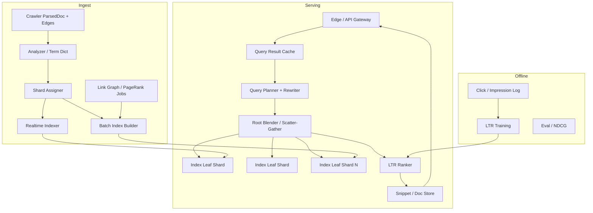

# System Design: Web Search Engine

> **Focus areas:** Crawl ingest · indexing · inverted index · ranking · query serving · spelling/autocomplete hooks · freshness · multi-tier retrieval  
> **Style:** End-to-end product design with progressive scale (10× → 100× → 1,000×)  
> **Quality bar:** Senior/staff interview depth; explicit retrieval/ranking split; scale jumps that force architecture changes

---

## Table of Contents

1. [Clarify Requirements (Interview Q&A)](#1-clarify-requirements-interview-qa)
2. [Back-of-the-Envelope Estimation](#2-back-of-the-envelope-estimation)
3. [High-Level Design](#3-high-level-design)
4. [Architecture Diagram](#4-architecture-diagram)
5. [Design Deep Dive](#5-design-deep-dive)
6. [Wrap-Up](#6-wrap-up)
7. [Deeper / Related Interview Questions](#7-deeper--related-interview-questions)

---

## 1. Clarify Requirements (Interview Q&A)

Goal: design a **web search engine** that turns a crawled corpus into low-latency, relevant results for user queries—covering indexing, retrieval, ranking, and serving—not just a single Lucene node.

### 1.0 What this is / is not

| Dimension | This doc | Not this |
|-----------|----------|----------|
| Job | Web search: index + query + rank + SERP | Site search only (see full-text-search) |
| Crawl | Consumes crawler output | Deep crawl internals (see distributed-web-crawler) |
| Ranking | Web signals: text + links + freshness + user | Ads auction (mention only) |
| UX | Query box → ranked results + snippets | Full social/discover feed |
| Success | Relevance, latency, freshness, cost | Perfect NLP research demo |

### 1.1 Functional Requirements

| # | Question to ask | Expected / typical interviewer answer | Design implication |
|---|-----------------|----------------------------------------|--------------------|
| F1 | Web search or vertical? | General web search MVP | Need link graph + large inverted index |
| F2 | Languages? | English MVP; multilingual later | Analyzer pipeline per locale |
| F3 | Query types? | Keywords; phrase; site:; basic operators MVP | Query parser + posting list ops |
| F4 | Result page? | Title, URL, snippet, favicon; 10 organic | Snippet generation + doc store |
| F5 | Freshness? | News/recent docs matter | Real-time / nearline index tier |
| F6 | Personalization? | Light MVP (locale/safe search); deep later | Region + safe-search flags first |
| F7 | Spelling correction? | Yes “Did you mean” | Query rewriter + dict |
| F8 | Autocomplete? | Separate system OK; hook API | Call typeahead service |
| F9 | SafeSearch / spam? | Required | Spam scores at index + query time |
| F10 | Index freshness SLA? | Important pages minutes–hours; long-tail days | Tiered indexing pipelines |
| F11 | Knowledge panels? | Out of MVP | Hooks for entity store later |
| F12 | Images/video tabs? | Out of MVP | Universal search later |
| F13 | Geo-localized results? | Locale + optional geo bias | Country index slices / ranking features |
| F14 | Clicks / evaluation? | Log impressions/clicks for training | Experiment + logging pipeline |
| F15 | Ads? | Acknowledge; separate auction system | Don't mix ad rank into organic design |

**MVP functional scope:**

1. Ingest parsed docs + link edges from crawler.
2. Build/serve inverted index + forward/doc store for snippets.
3. Query: tokenize → retrieve candidates → rank → return top-K with snippets.
4. Basic operators: phrase, site:, OR/AND (default AND).
5. Spelling suggestions; SafeSearch filter.
6. Nearline updates for changed/deleted docs.
7. Metrics: latency, zero-result rate, index lag.

**Out of MVP:**

- Full multilingual morphology for 100+ locales
- Neural dense retrieval as sole path (hybrid later)
- Complete knowledge graph panels
- Voice search
- Perfect real-time index of entire web
- Ad system internals

### 1.2 Non-Functional Requirements

| # | Question | Expected answer | Target |
|---|----------|-----------------|--------|
| N1 | Query latency | Feels instant | p50 < 100ms, p99 < 300–500ms organic |
| N2 | Availability | Critical consumer | 99.9%+ query path; degrade with stale replicas |
| N3 | Index durability | Don't lose committed docs | Multi-replica shards; backup generations |
| N4 | Consistency | Search eventual OK | New page visible in minutes–hours by tier |
| N5 | Multi-region | Serve near users | Replicated indexes per region; local query |
| N6 | Security | No SSRF via `site:`; abuse QPS | Auth for admin; query rate limits; injection-safe parser |
| N7 | Cost | Index size + serving RAM dominate | Compression, tiered posting, cold shards |
| N8 | Throughput | Progressive QPS table | Cache + fanout control |

### 1.3 Cases

**Happy paths**

1. User query → rewrite → retrieve → rank → snippets → SERP.
2. Crawl update → index pipeline → searchable within tier SLA.
3. 404/gone from crawler → delete from index.
4. “Did you mean” → optional auto-rewrite if confidence high.
5. `site:example.com foo` → restrict to host postings.

**Edge / failure cases**

| Case | Behavior |
|------|----------|
| Zero results | Suggest rewrite / relax operators; log |
| Hot query (celebrity death) | Result cache + query cache; index flood control |
| Huge OR / expensive query | Cost budget; reject/simplify |
| Spam / doorway flood | Index-time spam score; query-time demotion |
| Shard down | Replica failover; partial results only if policy allows (prefer full) |
| Snippet PII / malware page | Safe snippet sanitizer; SafeSearch |
| Duplicate near-same results | Site diversity / host crowding |
| Stale cache vs fresh index | Short TTL + generation fencing |
| Bot scrapers | Rate limit, CAPTCHA, token auth for API |

### 1.4 Scales (Progressive)

| Metric | Baseline | 10× | 100× | 1,000× |
|--------|----------|-----|------|--------|
| Indexed docs | 1B | 10B | 100B | 1T |
| Unique terms | 100M | 300M | 1B | 3B+ |
| Queries / day | 100M | 1B | 10B | 100B |
| Peak QPS | 5K | 50K | 500K | 5M |
| Avg posting list touch / query | 3–10 terms | same | same | same |
| Index size on disk | ~50 TB | ~500 TB | ~5 PB | ~50 PB |
| Serving RAM working set | ~5–10 TB | ~50–100 TB | ~0.5–1 PB | multi-PB fleet |
| Docs updated / day | 50M | 500M | 5B | 50B |
| Indexing ingest docs/s | ~1K | ~10K | ~100K | ~1M |
| Regions | 1–2 | 3–5 | 10+ | global edge |

**What each jump forces:**

- **10×:** Sharded inverted index mandatory; separate root/blender; doc store vs postings; query cache.
- **100×:** Tiered index (realtime / day / batch); early termination; posting compression; multi-region replicas; learning-to-rank features store.
- **1,000×:** Multi-phase retrieval (cheap lexical → expensive rankers); dense ANN hybrid; index cells by language/geo; continuous training; cost-based query planning.

### 1.5 Etc.

- **Assume crawler exists** and emits `ParsedDoc` + link graph.
- **Web UI + API** both use same Query Service.
- **Eval:** human ratings + online A/B; offline nDCG on sets.
- **Legal:** DMCA/takedown pipeline hooks.

**Scope repeat-back:**

> Design a web search engine that indexes a billion-to-trillion-scale crawled corpus, serves keyword queries at ~100ms p50 with ranked results and snippets, handles freshness via tiered indexing, and scales query and index planes from baseline to 1000×—organic search only; ads and crawl internals are dependencies.

---

## 2. Back-of-the-Envelope Estimation

### 2.1 Query traffic

```text
Baseline: 100M queries/day ≈ 1,157 QPS average
Peak 4–5× ⇒ ~5K QPS

1,000×: 100B/day ≈ 1.2M QPS avg, ~5M QPS peak globally
```

Regionalize: no single cluster takes 5M QPS.

### 2.2 Index size (order-of-magnitude)

```text
1B docs × ~500 tokens indexed / doc (after stopwords) ≈ 500B postings
Posting entry compressed ~6–12 B (docID delta + TF + positions optional)
500B × 8 B ≈ 4 TB postings (positions blow this up 3–10×)

With positions for phrases/snippets proximity:
~20–50 TB postings at 1B docs is a common interview ballpark depending on compression

Doc store (URL, title, text for snippets): 1B × 5–10 KB ≈ 5–10 TB
Link / rank features: 1B × 100–200 B ≈ 100–200 GB
```

At **100B docs**, think **PB-class** index; compression + tiering mandatory.

### 2.3 Retrieval work per query

```text
Query 3 terms; each term df varies
Naive: intersect 3 posting lists
Hot terms (df huge): use skip lists / blocks / WAND / BMW early exit
Budget: tens of millions of postings scored max, not full intersection materialization
```

### 2.4 Bandwidth (serving)

```text
SERP JSON ~5–20 KB
5K QPS × 10 KB ≈ 50 MB/s ≈ 400 Mbps (easy)
5M QPS × 10 KB ≈ 50 GB/s → edge/CDN + regional serving
```

### 2.5 Cache

```text
Head queries Zipf: top 1% queries may be 20–40% traffic
Query-result cache: 1–5 min TTL for head; bypass for personalized
Posting list cache in RAM for ultra-hot terms
```

### 2.6 Indexing write path

```text
50M updates/day ≈ 580 docs/s avg; peak 2–5K docs/s baseline
Must not rebuild entire 50 TB index each time → incremental segments + merges
```

### 2.7 Memory vs disk

Serving leaf nodes keep **hot posting blocks** in page cache / explicit RAM; cold long-tail on SSD. HDD only for deep cold archive generations—not live p99.

---

## 3. High-Level Design

### 3.1 Major planes

```text
1) Ingest / Indexing plane   (crawl → analyze → shard assign → segments)
2) Serving plane             (query → retrieve → rank → snippet)
3) Offline signals plane     (PageRank, spam, embeddings, LTR training)
4) Experiment / logging      (impressions, clicks, A/B)
```

### 3.2 Document model

```text
Document {
  doc_id, url, canonical_url, host, lang,
  title, body_text, anchors[],
  fetch_time, content_hash,
  noindex, spam_score, quality_score,
  pagerank, country_affinity,
  outbound_links_count, ...
}
```

`doc_id` dense integers per shard for delta-compressible postings (map from `url_hash` via docID dictionary).

### 3.3 Analysis pipeline

1. Charset / lang detect  
2. Tokenize + lowercase  
3. Unicode normalize  
4. Stopwords (careful—don't kill recall for rare queries)  
5. Stemming / lemmatization (locale)  
6. Optional n-grams / compounds  
7. Term dictionary assign `term_id`

Same analyzer **must** run at query time (versioned `analyzer_version`).

### 3.4 Inverted index

```text
term → posting list: (doc_id, tf, [positions...], payload?)
```

**Shard strategy:**

| Strategy | Pros | Cons |
|----------|------|------|
| **Document-sharded** | Easy index build; query fans out to all shards | Fanout cost; merge top-K |
| Term-sharded | Less fanout for rare terms | Hot terms imbalance; hard joins |
| Hybrid | Complex | — |

**Choice for web search MVP→scale:** **document-partitioned shards** with query fanout + root merger. Term-shard is rare as sole strategy at Google-like scale historically moved around—stick to doc-shard unless interviewer pushes.

**Segmented index (Lucene-style):**

- Immutable segments on disk
- Near-real-time (NRT) refresh for hot tier
- Background merges; deletes via tombstones + merge purge

### 3.5 Index tiers

| Tier | Content | Latency to searchable | Store |
|------|---------|----------------------|-------|
| Realtime | News / hot domains | seconds–minutes | Memory + NRT segments |
| Day | Important / changed | hours | SSD segments |
| Batch | Full web recompute signals | daily/weekly | Bulk rebuild features |

Query service searches **realtime ∪ main**; blend by score + freshness features.

### 3.6 Query path

```text
Client → Edge/CDN → API Gateway → Query Planner
   → Query Rewriter (spell, synonyms, locale)
   → Retriever (fanout to index leaves)
   → Candidate set (top few thousand)
   → Ranker (LTR / layered)
   → Diversity / crowding
   → Snippet Service (doc store)
   → Response assembler
```

**APIs:**

```http
GET /v1/search?q=...&hl=en&gl=us&safe=active&num=10&offset=0
```

Response: `results[] {rank, url, title, snippet, sitelinks?}`, `rewritten_query`, `cursor`, `took_ms`.

Admin: index stats, force delete URL, kill switch.

### 3.7 Retrieval algorithms (say out loud)

- **Boolean** intersection/union of postings
- **TF-IDF / BM25** scoring while intersecting
- **WAND / Block-Max WAND** for safe early termination
- **Phrase**: positional postings or next-doc with position checks
- **site:**: special posting or doc-value filter on host_id

### 3.8 Ranking layers

| Layer | Signals | Cost |
|-------|---------|------|
| L0 Retrieve | BM25 + static quality | Cheap |
| L1 Lightweight LTR | ~50 features | Medium |
| L2 Heavy LTR / neural | Cross-encoder on top 50–200 | Expensive |

**Features (examples):** BM25, PageRank, spam, freshness decay, URL depth, HTTPS, click prior (aggregated), query-title match, geo match.

**Host crowding:** max N results per host in top-10.

### 3.9 Snippets

Doc store holds forward text. Highlight: match query terms in windows; prefer semantic sentences later. Cap CPU; cache snippets for head queries.

### 3.10 Offline graph signals

Link edges → PageRank / reputation (batch). Anchor text → weighted terms for target docs (classic web IR). Spam classifiers offline; attach scores to docs.

### 3.11 Option analysis

#### A. Build vs Elasticsearch / Lucene

| Option | Pros | Cons | Deal-breaker |
|--------|------|------|--------------|
| **Managed OpenSearch/ES** | Fast MVP | Hard at true web scale + custom rank | OK baseline; say limits |
| Custom Lucene leaf + blender | Control | Ops heavy | Common staff answer |
| Fully custom postings | Max control | Years of work | Only if scale demands |

**Interview choice:** Lucene-like leaves + custom root/ranker; or ES for “startup MVP” then call evolution.

#### B. Dense retrieval

| Option | When |
|--------|------|
| Lexical only | MVP |
| Hybrid BM25 + ANN embeddings | 100× quality push |
| Dense-only | Risky for rare terms / precision ops |

#### C. Cache layers

| Cache | Key | TTL |
|-------|-----|-----|
| Full SERP | normalized query + locale + safe | 30–300s |
| Posting blocks | term_id | memory resident hot |
| Doc snippets | doc_id + query terms hash | minutes |

**Deal-breakers:**

- Single global unsharded index at 10B+ docs
- Scoring entire posting lists without early termination at scale
- Ranking with only BM25 and no spam/abuse plan
- Ignoring deletes/`noindex`

---

## 4. Architecture Diagram



---

## 5. Design Deep Dive

### 5.1 Reliability

**Data loss prevention**

- Index segments replicated (RF=2–3) across racks/AZs
- Ingest WAL / Kafka before ack to crawler handoff
- Generation numbers: query only serves committed generation
- Deletes: tombstones durable before acknowledging takedown SLAs

**Retries & idempotency**

- Index upsert keyed by `doc_id` + `content_hash` / version
- At-least-once ingest; last-writer-wins by `fetch_time`/`version`
- Query path: idempotent reads; hedged requests to replicas on slow shard

**Backpressure**

- Indexing lag metrics; shed low-priority updates first
- Query cost budgets; reject pathological queries (`*:*` equivalents)

**Rate limits**

- Per-IP / API key QPS
- Separate bots from humans (token bucketing)

**Failure modes**

| Failure | Mitigation |
|---------|------------|
| Leaf shard outage | Serve from replica; alert |
| Ranker timeout | Fall back to L0 BM25 order |
| Doc store miss | Return without snippet / fetch repair |
| Cache stampede | Singleflight + soft TTL |

### 5.2 Scalability

**Query fanout control**

```text
P shards; each query hits all shards in doc-partitioned design
5K QPS × 100 shards = 500K shard-QPS
⇒ size shards so per-leaf QPS healthy; add replicas for read scale
```

**Vertical vs horizontal**

- Scale leaves by splitting docs (more shards)
- Scale reads by replicas
- Root/blender horizontally scalable (stateless)

**Storage tiers**

- Hot terms/postings in RAM
- Warm SSD
- Cold: rarely queried long-tail shards compacted harder; possible slower pool

**Parallelization**

- Scatter-gather inherent
- Ranker batch inference on GPU pool for L2 (100×+)
- Indexing pipeline parallel by shard

**Progressive jumps**

| Jump | Force |
|------|-------|
| 10× | Many shards + root; result cache; separate doc store |
| 100× | Tiered index; WAND; multi-region; LTR; posting compression |
| 1,000× | Hybrid ANN; geo/lang cells; continuous training; query planning; dedicated news cluster |

**Hot keys**

Ultra-common terms (`the` if not stopped, `www`) — stopwords / skip lists / impact-ordered postings. Celebrity queries — SERP cache.

### 5.3 Maintainability

**Ops**

- Index lag by tier; segment merge IO; heap; query p99 by shard
- Canary ranker models; dual scoring sample
- Dark launch new analyzer versions on shadow traffic

**Observability**

- Per-phase timings: rewrite, retrieve, rank, snippet
- Relevance dashboards: zero-result, reformulation rate, click metrics (careful bias)
- TraceId through fanout

**Migrations**

- Rolling segment format upgrades
- DocID renumbering avoided; use stable `url_hash`→doc_id map carefully
- Reindex: blue/green index generations; atomic pointer flip

**Multi-tenant**

If SaaS search: separate indexes per tenant; web search is usually one corpus with privacy/legal partitions (country takedown sets).

---

## 6. Wrap-Up

### Decision summary

| Area | Decision |
|------|----------|
| Sharding | Document-partitioned inverted index |
| Index structure | Immutable segments + NRT hot tier |
| Retrieval | BM25 + WAND early exit; phrase positions |
| Ranking | Multi-layer LTR + web signals |
| Freshness | Realtime ∪ main index blend |
| Serving | Stateless query + cached SERP + replicated leaves |
| Scale | Fanout math → multi-region → hybrid retrieval |

### Phased rollout

1. **MVP:** Single-region sharded Lucene/ES, BM25, snippets, basic spell, SafeSearch.
2. **Quality:** PageRank/anchors, spam, LTR L1, host diversity.
3. **Scale:** Query cache, WAND, index tiers, multi-AZ replicas.
4. **Global:** Multi-region indexes, locale analyzers.
5. **1000×:** Hybrid dense+lexical, cells, continuous LTR, cost-based planner.

### Closing line

> We separate indexing from serving, shard documents for build simplicity, retrieve with early-terminated lexical scorers, rank with layered models fed by offline web signals, and keep a realtime tier for freshness—then replicate regionally and add hybrid retrieval as corpus and QPS grow.

---

## 7. Deeper / Related Interview Questions

**Q1. Why document sharding over term sharding?**  
**A:** Simpler indexing and updates; phrase/AND are local to shard candidates then merged. Term sharding complicates multi-term joins and creates hot shards on common terms.

**Q2. How does WAND work at a high level?**  
**A:** Keep upper bounds on remaining score per term; skip documents that cannot beat current top-K threshold—safe early termination.

**Q3. How do you assign doc_ids?**  
**A:** Per-shard dense IDs for compression; global `url_hash` as stable external id; mapping table. Avoid renumbering frequently.

**Q4. How are deletions handled?**  
**A:** Tombstone bitset per segment; filtered at retrieve; purged on merge. Takedowns need low-latency tombstone publish.

**Q5. How to compute snippets without storing full HTML?**  
**A:** Store extracted text + offsets; or store compressed forward index; generate windows around matches. Don't re-fetch live web on query path (latency/reliability).

**Q6. What's the tradeoff of stemming?**  
**A:** Improves recall (`running`→`run`), can hurt precision. Use locale-aware; sometimes search both stemmed and exact.

**Q7. How do you prevent one site from dominating results?**  
**A:** Host crowding / site diversity constraints in blender; demote near-dup clusters.

**Q8. Query cache invalidation when index updates?**  
**A:** Short TTL; version stamp cache entries with index generation; invalidate head queries on realtime publish if needed.

**Q9. How does PageRank get into the query path?**  
**A:** Precompute offline; store as doc feature/column; combine in score/LTR—not computed per query on the graph.

**Q10. Estimate posting list size for term with df=1e8.**  
**A:** 1e8 × ~8 B ≈ 800 MB compressed ballpark; must be block-encoded with skips; never linear-scan fully for every query.

**Q11. How to support phrase queries efficiently?**  
**A:** Positional postings; after doc candidate via terms, verify positions. Alternative: indexed n-grams for common phrases (space cost).

**Q12. What is index packing / compression?**  
**A:** DocID deltas (varint/FOR/PFOR), TF codecs, separate position streams; block-max scores for BMW.

**Q13. Load balancing leaves?**  
**A:** Replica sets per shard; power-of-two-choices; hedged requests; avoid sticky unless caching locality helps.

**Q14. How to A/B test rankers safely?**  
**A:** Experiment framework hashes user/query to buckets; identical retrieval candidate sets when possible; guardrail metrics (p99, zero-result).

**Q15. Multilingual index: one index or many?**  
**A:** Often per-language or per-script shards/analyzers; query lang detect routes. Mixing analyzers in one field is painful.

**Q16. How do you handle `site:` at scale?**  
**A:** Host doc-values/bitset filter after cheap term retrieve, or maintain per-host posting for operators; don't full-scan corpus.

**Q17. Why not SQL LIKE for web search?**  
**A:** No inverted index → full scan; no ranking/IR features; cannot hit web scale latency.

**Q18. Consistency: search shows deleted page.**  
**A:** Eventual; bound with deletion pipeline SLO; for legal takedown, special high-priority purge + cache bust.

**Q19. Memory of term dictionary?**  
**A:** 100M–1B terms; use FST/compact dictionaries; not naive HashMap of strings on every leaf without care.

**Q20. Hybrid search fusion?**  
**A:** Retrieve top-K lexical + top-K ANN; fuse via RRF or learned fusion; then LTR. Watch latency budget.

**Q21. How to size number of shards?**  
**A:** Target segment size / heap / p99 retrieve; `shards ≈ index_size / target_shard_size`; also QPS×fanout CPU. Re-shard rarely—plan growth.

**Q22. Bot traffic vs user traffic?**  
**A:** Separate pools; aggressive caching for bots or block; protect capacity for humans.

**Q23. What breaks first at 100× QPS?**  
**A:** Root fanout CPU, hot shard leaves, ranker, cache stampede, logging pipeline—not “DNS” typically.

**Q24. How do anchors help ranking?**  
**A:** Other sites' link text describes target; index as additional field with weights; spam-prone → need trust weighting.

**Q25. Capstone: relevance vs latency vs freshness?**  
**A:** Multi-tier index + layered rank with deadlines (e.g., L2 abort at 50ms); degrade gracefully; measure nDCG under latency caps—staff answers with explicit budgets.

---

*End of web search engine system design.*

## Appendix — Deep dive notes for Web search engine

### Hardest invariants
- Define the correctness property that must not break under retries, partial failures, or overload.
- Define multi-tenant isolation boundaries if applicable.
- Define delete/TTL/privacy semantics across primary + cache + search + logs.

### Likely bottlenecks
1. Hot keys / hot partitions for core entity ids
2. Synchronous dependency latency tails (p99)
3. Write amplification from secondary indexes / fanout
4. Compaction / GC / backfill stealing cluster IO
5. Cross-region chatty patterns

### Suggested metrics (RED + business)
| Metric | Why |
|--------|-----|
| Request rate / error / duration | Golden signals |
| Saturation (CPU, pool, queue lag) | Leading indicator |
| Idempotency conflict rate | Client retry health |
| Cache hit ratio | Origin protection |
| Business SLI for Web search engine | Product truth |

### Migration & rollout
- Expand/contract schema changes
- Dual-write or shadow reads for store migrations
- Feature-flagged cutover; canary on error budget
- Backfill with checkpoints and replayable logs

### What interviewers poke next
- Memory footprint of your cache/index choice
- Exact concurrency control (locks vs OCC vs ledger)
- Cost model at 100×
- Abuse cases unique to Web search engine

## Appendix A — Interview execution checklist

1. **Repeat scope** in one sentence; list out-of-scope.
2. **Write NFRs as numbers** (QPS, p99, RPO/RTO).
3. **Draw** clients → edge → svc → store → async.
4. **Call the hardest invariant** early.
5. **Pick consistency** deliberately; do not say “strong everywhere.”
6. **Show scale jumps** at 10× / 100× / 1,000× with architecture changes.
7. **Name failure modes** and degraded behavior.
8. **Close** with metrics, rollout, and residual risks.

## Appendix B — Trade-off flashcards

| Topic | Prefer | Avoid |
|-------|--------|-------|
| Sync vs async | Sync for money/authz ack | Sync for fanout/email/indexing |
| SQL vs KV | Multi-row invariants | Ultra-high simple point ops |
| Cache | Read-heavy + tolerable stale | Incorrect money reads |
| Queue | Spike absorb + retry | Hidden request/response bus |
| Multi-region | Home cell single-writer | Multi-writer without merge rules |

## Appendix C — Reliability patterns to name drop correctly

- Idempotency keys + request hash
- Outbox / transactional messaging
- Leases + fencing tokens
- Quorum / consensus (Raft) for coordination—not for every data path
- Bulkheads + circuit breakers + deadlines
- Load shedding + admission control
- Canary + automatic rollback on SLO burn
- Backup restore drills (backup ≠ restore tested)

## Appendix D — Scalability patterns

- Consistent hashing with virtual nodes
- Hierarchical sharding (cell → shard → partition)
- CQRS / projections for read models
- Hot-key splitting and salting
- Tiered storage + compaction budgets
- Consumer parallelization by partition
- Edge caching with purge/surrogate keys

## Appendix E — Sample capacity dialogue

```text
Interviewer: Assume 10M DAU.
You: 10M DAU × 5 key actions/day ≈ 50M events/day ≈ 580 QPS avg.
Peak 15× ⇒ ~9K QPS. With 70% cache hit on reads, origin ~2.7K QPS.
At 100×, origin ~270K QPS ⇒ shard + edge mandatory.
```

Customize the action rate to this problem; do not reuse social-feed numbers for a ledger.


*Enriched for interview drill · `web-search-engine`*
