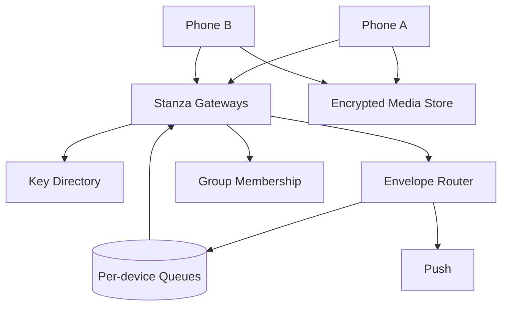

# System Design: WhatsApp

> **Focus areas:** Phone identity · 1:1 + groups · E2EE messaging · Offline queue · Multi-device · Media · Push · Presence · Hybrid fan-out  
> **Style:** End-to-end product design with progressive scale (10× → 100× → 1,000×)  
> **Quality bar:** E2EE constraints honest; fan-out math; device sessions; progressive scale  
> **Interview theme:** Senior / Staff — **WhatsApp-class consumer messenger**

---

## Table of Contents

1. [Clarify Requirements (Interview Q&A)](#1-clarify-requirements-interview-qa)
2. [Back-of-the-Envelope Estimation](#2-back-of-the-envelope-estimation)
3. [High-Level Design](#3-high-level-design)
4. [Architecture Diagram](#4-architecture-diagram)
5. [Design Deep Dive](#5-design-deep-dive)
6. [Wrap-Up](#6-wrap-up)
7. [Deeper / Related Interview Questions](#7-deeper--related-interview-questions)
8. [Appendices](#8-appendices)

---

## 1. Clarify Requirements (Interview Q&A)

Goal: design a **WhatsApp-like** messenger: phone-number identity, 1:1 and groups, end-to-end encryption, reliable offline delivery, multi-device, media, and global scale.

### 1.0 What this is / is not

| Dimension | This doc | Not this |
|-----------|----------|----------|
| Job | Consumer E2EE messenger | Slack workspaces / email |
| Identity | Phone numbers + device keys | Email-only accounts |
| Encryption | E2EE for content (Signal-style) | Server-readable chat MVP |
| Groups | Tens–hundreds typical; large carefully | 100k channels without hybrid |

### 1.1 Functional Requirements

| # | Question | Expected answer | Design implication |
|---|----------|-----------------|--------------------|
| F1 | Identity? | Phone + SMS/verify | Directory; privacy of number |
| F2 | Chat types? | 1:1, groups, optional broadcast lists | Different fan-out |
| F3 | E2EE? | Yes for messages | Server stores ciphertext; key directory |
| F4 | Multi-device? | Primary + linked devices | Sender keys / device sessions |
| F5 | Offline? | Queue until device fetches | Server ciphertext mailbox |
| F6 | Receipts? | Sent/delivered/read (privacy settings) | Encrypted receipts where needed |
| F7 | Media? | Encrypted blobs; CDN pointers | Upload + keys to recipients |
| F8 | Voice/video? | Phase 1.5 calls | Separate media plane |
| F9 | Groups size? | Up to ~1024 (product cap) | Sender keys / fan-out |
| F10 | Push? | Opaque push often | Wake + sync |
| F11 | Status/stories? | Out of MVP | Ephemeral broadcast later |
| F12 | Backup? | Encrypted cloud backup optional | Client-side key |
| F13 | Block/report? | Yes | Abuse without reading content |
| F14 | Web client? | Linked device | QR pairing |

**MVP scope:**

1. Register phone; device identity keys.  
2. 1:1 encrypted messages; offline store-and-forward ciphertext.  
3. Groups with membership + encrypted send.  
4. Multi-device basic (or explicitly single-device MVP then link).  
5. Media encrypted upload.  
6. Push wakeup.  
7. Delivery receipts.  
8. Block; rate limits.

**Out of MVP:** Channels/communities mega-scale, payments, full status product, perfect global calls.

### 1.2 Non-Functional Requirements

| # | NFR | Target |
|---|-----|--------|
| N1 | Online latency | p50 < 200–300ms perceived |
| N2 | Durability ciphertext | Until delivered or TTL |
| N3 | E2EE | Server cannot read content |
| N4 | Availability | 99.9%+ |
| N5 | Ordering | Per-chat session order |
| N6 | Multi-region | Edge stanzas; storage cells |
| N7 | Metadata minimization | Honest limits (servers see envelopes) |
| N8 | Scale | 100M–1B users class |

### 1.3 Cases

| Case | Behavior |
|------|----------|
| Recipient offline days | Queue ciphertext; push; expire policy |
| New device link | Rekey / history transfer rules |
| Group member add | Membership change + sender key distribution |
| Key change safety number | Client warning |
| Media decrypt fail | Retry fetch keys; error UI |
| Spam from unknown | Folders/limits; block |
| Server compromise | Content safe; metadata not |
| Multi-device race | Per-device session queues |
| Push with preview off | Opaque “New message” |

### 1.4 Progressive scale

| Metric | Baseline | 10× | 100× | 1,000× |
|--------|----------|-----|------|--------|
| MAU | 10M | 100M | 1B | — |
| DAU | 3M | 30M | 300M | — |
| Peak connections | 1M | 10M | 100M | — |
| Msgs / day | 500M | 5B | 50B | — |
| Peak ingest / s | 10K | 100K | 1M | — |
| Group msgs share | 30% | 30% | 35% | — |
| Media % | 20% | 20% | 25% | — |
| Avg group size | 15 | 15 | 20 | — |

**Jumps:** 10× = conn fleet + ciphertext queues; 100× = cells + hybrid groups; 1,000× = extreme metadata plane optimization.

### 1.5 Scope repeat-back

> Design **WhatsApp-like** E2EE messaging: phone identity, 1:1 + groups, server store-and-forward of ciphertext, multi-device sessions, media, push—scaled with connection fleets and careful group key/fan-out design.

---

## 2. Back-of-the-Envelope Estimation

```text
500M msgs/day ≈ 5.8K/s avg; peak ×8 ⇒ ~50K/s
Offline queue depth: depends on offline population
Ciphertext ~200–500 B + media pointers
Connections 10M × 20KB ≈ 200 GB RAM fleet-wide
Group fan-out: 50K ingest × 30% groups × avg online members notified
Naive write amp to each member inbox at large N is deadly → encrypted sender keys + multicast-ish fan-out of one ciphertext envelope per device session carefully
```

### Metadata reality

Even with E2EE, server sees approximate graph, timestamps, sizes—minimize retention; don’t pretend zero metadata.

### Hot keys

Large groups; viral forwards; reconnect storms; media CDN spikes.

---

## 3. High-Level Design

### 3.1 Planes

| Plane | Role |
|-------|------|
| Identity / key directory | Users, devices, prekeys |
| Message relay | Ciphertext envelopes |
| Group membership | Roster + roles |
| Media | Encrypted blob store |
| Push / conn | Delivery wake |

### 3.2 Components

1. **Registration / Attestation**  
2. **Key Directory** (identity, signed prekeys, one-time prekeys)  
3. **Session/Conn Gateways** (chat protocol stanzas)  
4. **Message Router** — envelope to device queues  
5. **Device Offline Queues** — ciphertext  
6. **Group Service** — membership  
7. **Sender Key Service** (group E2EE)  
8. **Media Store** — encrypted objects  
9. **Push Service**  
10. **Abuse / Report** (metadata + client reports)  
11. **Receipt Relays**

### 3.3 Envelope API (logical)

```text
{
  "to_device": "...",
  "msg_id": "...",
  "type": "ciphertext",
  "ratchet_header": "...",
  "body": "<opaque>",
  "timestamp": ...
}
Server routes; does not parse body
```

### 3.4 Trade-offs

| Topic | Choice | Why |
|-------|--------|-----|
| E2EE | Signal Double Ratchet 1:1; sender keys groups | Industry standard |
| Server history | Ciphertext until ack/TTL | Offline support |
| Large groups | Sender keys | Avoid O(N) encrypt cost client-side old style |
| Sealed sender | Phase 2 | Metadata privacy |
| Calls in MVP | Defer | Different plane |

**Deal-breaker:** claiming server can moderate text content while also being E2EE without client-side scanners.

---

## 4. Architecture Diagram



### Group send (sender keys)

```text
Each member shares sender key with group
Sender encrypts once; server fans out same ciphertext envelope to member devices
Membership changes trigger key reset distribution
```

---

## 5. Design Deep Dive

### 5.1 Reliability

**Invariants**

1. Opaque envelopes durable in recipient device queues until ACK or TTL.  
2. Idempotent msg_id per sender.  
3. Online push at-least-once; client decrypt/dedupe.  
4. Ordering: per-sender ratchet / session; UI conversation sort by timestamp+id with gaps filled.  
5. Push never required for correctness.  
6. Key directory authenticated (identity keys); MITM hardened via safety numbers.  
7. Media keys sent inside E2EE messages; blobs useless alone.

**Offline:** long queues with size caps; notify via push; web linked devices have own queues.

**Delivery guarantees:** at-least-once ciphertext delivery; E2EE integrity via crypto; no server-side exactly-once display.

### 5.2 Scalability

| Scale | Moves |
|-------|-------|
| 1× | Gateway + Redis queues |
| 10× | Kafka/sharded queues; multi-region gateways |
| 100× | User/device cells; group shard; media CDN |
| 1000× | Extreme conn; sealed sender; metadata minimization |

**Hybrid fan-out:** for very large groups/channels, don’t maintain huge offline fan-out—product splits “communities/channels” with different sync model (announce WhatsApp Channels-like).

### 5.3 Maintainability

- Protocol versioning for clients.  
- Crypto library upgrades with care.  
- Queue TTL tooling.  
- Abuse ML on metadata graph only.

### 5.4 Multi-device E2EE

Each device has keys; sender encrypts to each device session (1:1) or uses sender keys (groups). Linking: QR pairs companion; history transfer optional encrypted.

### 5.5 Deal-breakers

1. Server-readable messages while marketing E2EE.  
2. Per-member plaintext fan-out DB copies.  
3. Push-only transport.  
4. Unbounded offline queues.  
5. Ignoring group membership revocation (still decrypt forever)—need key rotation.

---

## 6. Wrap-Up

| Decision | Choice |
|----------|--------|
| Content | E2EE ciphertext relay |
| Offline | Per-device queues |
| Groups | Sender keys + membership service |
| Scale | Conn fleet + sharded queues |

**Phases:** 1:1 E2EE → groups → multi-device → calls/channels.

> “WhatsApp is an **E2EE envelope relay** with device queues and group sender keys; servers route ciphertext, not chat text.”

---

## 7. Deeper / Related Interview Questions

**Q1. Double Ratchet vs TLS?**  
TLS protects hop; E2EE protects against server/compromise.

**Q2. What does server store?**  
Ciphertext, routing ids, timestamps, group roster, device list—not plaintext.

**Q3. How do receipts work under E2EE?**  
Clients send encrypted receipt messages; server relays.

**Q4. Group add member attack?**  
Admin authz; sender key redistribution; clients show membership changes.

**Q5. Offline forever?**  
TTL/quota; sender sees not delivered.

**Q6. Spam without reading content?**  
Graph features, rates, user reports, payment friction, phone reputation.

**Q7. Media CDN exposure?**  
Unpredictable URLs + encryption; auth tokens.

**Q8. Sealed sender?**  
Hides sender from server on deliver; complex certificate blind tokens—Phase 2.

**Q9. Backup vs E2EE?**  
Cloud backup needs user key; otherwise plaintext risk.

**Q10. Multi-region queue?**  
Home cell for device queue; gateways global.

**Q11. Ordering across devices?**  
Each device session independent; conversation UI merges.

**Q12. Why sender keys?**  
Encrypt once per group message vs O(N) pair sessions.

**Q13. Fan-out 256-member group online?**  
Router writes/pushes N device envelopes; ciphertext body shared reference optional.

**Q14. Push payload?**  
Usually no content; sometimes encrypted if OS supports.

**Q15. Key directory compromise?**  
Safety numbers; certificate transparency-like ideas; pin.

**Q16. Web client threat?**  
Companion linked; steal session = steal decrypt—device security.

**Q17. Message retries?**  
Client resend same msg_id; server dedupe to device queue.

**Q18. Calls?**  
Separate signaling + media relay (TURN); E2EE call keys.

**Q19. Communities/channels?**  
Different fan-out; often not full E2EE history for mega audiences.

**Q20. Metrics without content?**  
Online rates, queue depth, send→deliver time, decrypt error rates from clients.

**Q21. Consistent hashing?**  
Device_id → queue shard.

**Q22. Legal intercept?**  
E2EE prevents content; metadata may be scoped by law—product/policy.

**Q23. Contact discovery privacy?**  
Hashing/PSI techniques—mention tradeoffs.

**Q24. Rate limits?**  
Per phone send; new account limits; group create limits.

**Q25. DB choices?**  
High write KV for queues; durable log; membership SQL/KV.

**Q26. Sync after reinstall?**  
New device keys; history from encrypted backup or empty.

**Q27. Forward secrecy?**  
Ratchet provides; compromised key doesn’t expose past.

**Q28. Relation to 1:1 doc?**  
Same delivery patterns without crypto constraints.

**Q29. Relation to group-chat doc?**  
Group doc may omit E2EE; WhatsApp requires crypto plan.

**Q30. Staff signal?**  
Honest metadata limits + sender keys + device queues + conn scale.

---

## 8. Appendices

### A. Device queue ACK

```text
deliver envelope → client decrypt → ACK remove from queue
at-least-once: redelivery if ACK lost → client dedupe msg_id
```

### B. Group membership events

```text
add/remove/promote → signed membership change → clients update sender keys
```

### C. Scale narrative

**1×:** single region relay.  
**10×:** gateway fleets + sharded queues.  
**100×:** cells, media CDN, group optimizations.  
**1B users:** metadata minimization, regionalization, product splits for mega broadcast.

### D. Latency budget

```text
Persist envelope to recipient queue: <50ms p50
Notify online gateway: <50ms
Decrypt client-side: device bound
```

### E. Failure drills

1. Queue shard down — failover replicas; durable writes.  
2. Key directory down — cannot start new sessions; existing ratchets continue.  
3. Push down — online OK; offline delayed wakeup.  
4. Poison oversized envelope — reject; don’t block partition.  
5. Membership revoke lag — crypto rotation deadlines.

### F. Security checklist

- Identity key authenticity  
- Prekey replenishment  
- Safety number UX  
- Blob encryption  
- Rate limits / spam graph  
- No server plaintext analytics on message bodies  

### G. Extended Qs

**Q31. Prekey exhaustion?**  
Clients refill one-time prekeys; server alerts low.  
**Q32. Clocks?**  
Server timestamp for ordering UI; crypto has its own counters.  
**Q33. Multi-device sender?**  
Encrypt to each recipient device; echo to own other devices.  
**Q34. Why not email for transport?**  
Latency/UX; offline queues purpose-built.  
**Q35. Biggest myth?**  
“E2EE means server knows nothing”—metadata remains.

### H. Closing checklist

- Ciphertext device queues  
- Signal-style 1:1 + sender keys groups  
- Push wakes / queues heal  
- Conn fleet scale  
- Honest metadata  
- Membership-driven key rotation  

### I. Capacity worksheet

```text
queue_shards ≈ peak_envelope_writes / shard_capacity
gateway_nodes ≈ peak_conns / 100k
media_egress dominates cost at scale — encrypt-then-CDN
prekey_store QPS spikes on mass reinstall days (careful)
```

### J. Progressive narrative (say aloud)

**Baseline:** regional stanza gateways, device queues, 1:1 ratchet.  
**10×:** sharded queues, multi-region edge, group sender keys.  
**100×:** cells, media CDN, abuse graph ML, linked devices at share.  
**1B MAU:** metadata minimization, sealed sender experiments, channel product split.

### K. Worked offline example

```text
A sends to B offline:
1. A encrypts to B's device sessions (or fetches prekeys)
2. Server enqueues ciphertext for B's devices
3. APNs opaque push
4. B online → download envelopes → ACK → decrypt → delivered receipt encrypted to A
```

### L. Group sender key rotation triggers

- Member added/removed  
- Admin demote (policy)  
- Suspected compromise  
- Periodic rotation optional  

### M. Comparison table

| Concern | WhatsApp choice |
|---------|-----------------|
| Content privacy | E2EE |
| Offline | Device ciphertext queues |
| Groups | Sender keys |
| Spam | Metadata + reports |
| Mega broadcast | Separate channels product |

### N. Failure drills

1. Queue replica loss — quorum writes prevent loss.  
2. Mass prekey depletion — throttle new session creation; clients refill.  
3. Gateway region down — clients reconnect elsewhere; queues home sticky.  
4. Media store outage — text still works.  
5. Push outage — online delivery unaffected.

### O. Extended Qs

**Q36. Why phone numbers?** Network effects; privacy downside—username later.  
**Q37. Session hijack?** Device attestation + PIN; companion revoke.  
**Q38. Message timers / disappearing?** Client-enforced + encrypted instructions; server TTL on ciphertext.  
**Q39. Cross-platform emoji reactions?** Encrypted reaction events referencing msg_id.  
**Q40. Staff close?** Envelope relay + device queues + sender keys + honest metadata.

### P. Closing checklist

- E2EE ratchets + sender keys  
- Per-device offline queues  
- Conn fleet  
- Opaque push  
- Membership key rotation  
- Abuse without plaintext  

### Z. Interview 45-minute timebox

| Min | Focus |
|-----|-------|
| 0–5 | Scope, is/is-not, MVP lock |
| 5–12 | Estimation + fan-out/delivery math |
| 12–22 | HLD components + mermaid |
| 22–35 | Reliability: guarantees, offline, ordering, idempotency |
| 35–40 | Scale jumps 10×/100×/1000× |
| 40–45 | Deeper traps + wrap-up |

### Z2. Explicit delivery guarantee card (say this)

```text
Producer ACK  => durable intent/log
Transport     => at-least-once to devices/providers
Display       => client dedupe / inbox idempotency
Order         => per conversation/group/mailbox — not global
Offline       => sync cursor is source of healing; push is wakeup
```

### Z3. Operability golden signals

- Accept/persist latency & errors  
- Fan-out / provider lag  
- Queue depth by priority  
- Sync catch-up lag after reconnect  
- Invalidation / bounce / membership error rates  
- Cost proxies (SMS, media egress, push)

### Z4. Kill switches

- Disable typing/presence  
- Shed marketing/push previews  
- Freeze hot group / tenant  
- Force sync-only mode (no realtime)  
- Pause GC only with storage alarm (disposable)

### Z5. Final one-liner bank

- Notifications: priority lanes + preference snapshots  
- Push: wakeup fabric + token hygiene  
- Email ESP: reputation + suppression  
- Gmail: hostile MX + user-sharded mailbox  
- Disposable: TTL GC is the product  
- 1:1: single-writer seq log  
- WhatsApp: E2EE envelope relay  
- Groups: hybrid fan-out math  
