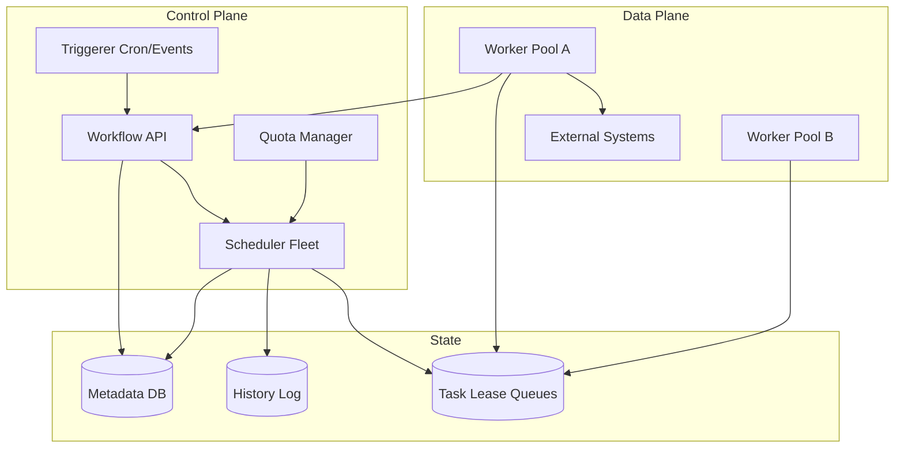
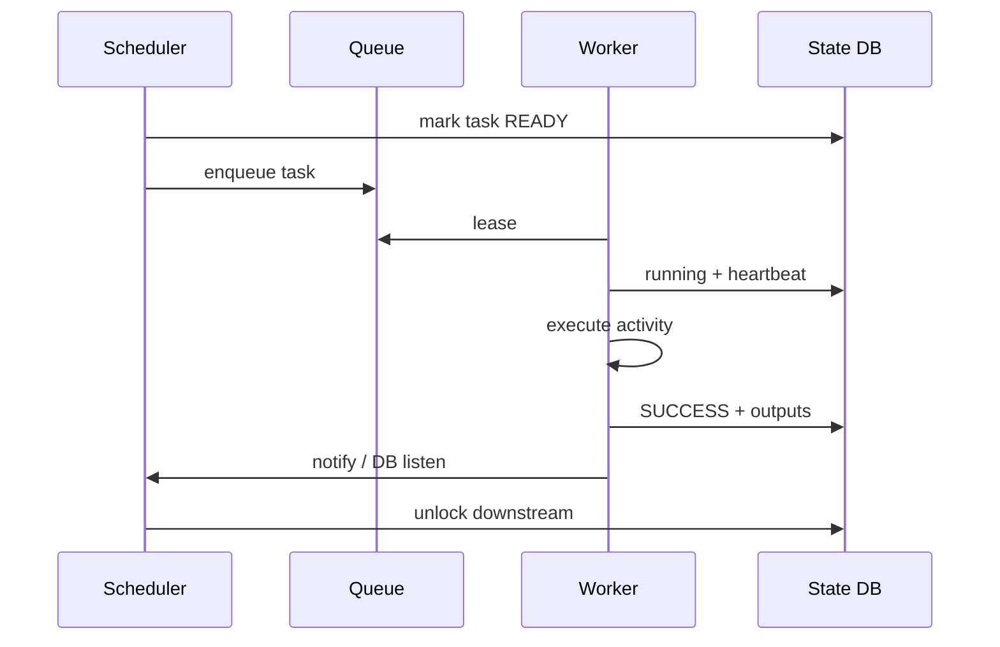

# System Design: Workflow / DAG Execution Engine

> **Focus areas:** DAG definition · Scheduling · Task workers · Retries & idempotency · State machine · Exactly-once effects · Fair multi-tenant queues · Progressive scale  
> **Style:** End-to-end infrastructure design with progressive scale (10× → 100× → 1,000×)  
> **Interview theme:** Airflow / Temporal / Step Functions / Cadence-class orchestration — not a generic job queue alone  
> **Quality bar:** Explicit run/task state machines, recovery semantics, and scale limits of schedulers

---

## Table of Contents

1. [Clarify Requirements (Interview Q&A)](#1-clarify-requirements-interview-qa)
2. [Back-of-the-Envelope Estimation](#2-back-of-the-envelope-estimation)
3. [High-Level Design](#3-high-level-design)
4. [Architecture Diagram](#4-architecture-diagram)
5. [Design Deep Dive](#5-design-deep-dive)
6. [Wrap-Up](#6-wrap-up)
7. [Deeper / Related Interview Questions](#7-deeper--related-interview-questions)

---

## 1. Clarify Requirements (Interview Q&A)

Design a **workflow / DAG execution engine**: users define directed acyclic graphs of tasks; the system schedules, runs, retries, and tracks them to completion with durable state and operable recovery.

### 1.0 What this is / is not

| Dimension | This doc | Not this |
|-----------|----------|----------|
| Product | Orchestrator for multi-step workflows | Single distributed task queue (component of this) |
| Unit | Workflow run + task attempts | Fire-and-forget cron only |
| Graph | DAG (no cycles); optional dynamic fan-out | Arbitrary Turing-complete embedded scripts as core |
| Execution | Workers pull/lease tasks; side effects in activities | Scheduler runs heavy business logic in-process |
| History | Durable event/state log per run | Best-effort in-memory status |

### 1.1 Functional Requirements

| # | Question to ask | Expected / typical interviewer answer | Design implication |
|---|-----------------|----------------------------------------|--------------------|
| F1 | Who authors workflows? | Data eng / backend via code or YAML/JSON | Versioned definitions; immutability per version |
| F2 | Triggers? | Cron, manual, event/API, dependency sensors | Trigger service + deduped fire |
| F3 | Task types? | Container jobs, HTTP activities, SQL, Spark submit | Pluggable executors |
| F4 | Dependencies? | Success/fail gates; fan-out/fan-in | DAG scheduler advances ready tasks |
| F5 | Retries? | Configurable backoff, max attempts | Attempt records; poison handling |
| F6 | Timeouts? | Per-task + workflow SLA | Lease + heartbeat |
| F7 | Idempotency? | Required for safe retries | Idempotency keys on side effects |
| F8 | Signals / human approval? | Phase 1.5 pause/resume | External events to run |
| F9 | Parameters / secrets? | Run params; secret refs not inline | Injection at worker |
| F10 | Observability? | Gantt of tasks, logs deep links | History service |
| F11 | Multi-tenant? | Teams share cluster with quotas | Queues + concurrency caps |
| F12 | Catch/rollback? | Compensating tasks optional | Saga patterns documented |
| F13 | Dynamic mapping? | Map over N inputs → N tasks | Runtime fan-out nodes |
| F14 | Priority? | SLA classes | Multi-queue weights |

**MVP functional scope:**

1. Register workflow definition versions (DAG of task specs).
2. Start run with params; persist run+task state durably.
3. Schedule ready tasks to workers via leased queue.
4. Worker heartbeat; succeed/fail with structured error.
5. Retries with exponential backoff; mark run failed/succeeded.
6. Cron + API triggers with idempotent trigger keys.
7. UI/API: list runs, task attempts, logs pointer.
8. Per-tenant concurrency limits.

**Out of MVP:**

- Full BPMN / long-running human workflows product surface
- Cross-region active-active same run
- Embedded distributed transactions across DBs
- Infinite dynamic graph without bounds

### 1.2 Non-Functional Requirements

| # | Question | Expected answer | Target |
|---|----------|-----------------|--------|
| N1 | Scheduling latency (ready→lease)? | Snappy for online workflows | p50 < 100ms, p99 < 1s |
| N2 | Throughput | Many small tasks | Baseline 1K tasks/s; scale to 100K+/s |
| N3 | Durability | No lost run state | Quorum DB / log; RPO=0 for state |
| N4 | Availability | Control plane HA | 99.9%+ API; workers elastic |
| N5 | Exactly-once effects? | At-least-once tasks + idempotent activities | Document |
| N6 | Scale of history | Millions runs/day | Partition history; archive |
| N7 | Fairness | Noisy neighbor isolation | Queues + quotas |
| N8 | Security | Tenant isolation; secret refs | mTLS workers; RBAC |

### 1.3 Cases (User Flows & Edge Cases)

**Happy paths**

1. Deploy workflow v3 → cron fires → run created → tasks A then B∥C then D → success.
2. Task fails once → retry attempt 2 succeeds → run continues.
3. Manual re-run from failed task with same idempotency lineage.
4. Dynamic map 100 shards → fan-in join → finalize.
5. Pause on approval signal → resume → complete.
6. Worker dies mid-task → lease expires → another worker retries attempt.

**Edge / failure cases**

| Case | Behavior |
|------|----------|
| Scheduler crash | Another scheduler instance resumes from durable state |
| Duplicate trigger | Idempotency key → same run id |
| Skewed DAG (1 long task) | Parallelism limited; show critical path |
| Thundering cron (:00) | Jitter schedules; queue backlog OK |
| Non-idempotent activity retry | Duplicate side effect risk — require keys / claim check |
| Poison task | Max attempts → failed; optional DLQ queue |
| Clock skew | Use server monotonic deadlines; NTP |
| Huge fan-out 1M map | Bound map size; chunked scheduling |
| Definition deleted mid-flight | Pin definition version immutably on run start |
| Circular dependency submitted | Reject at validate time |

### 1.4 Scales (Progressive)

| Metric | Baseline | 10× | 100× | 1,000× |
|--------|----------|-----|------|--------|
| Workflow runs / day | 100K | 1M | 10M | 100M |
| Task executions / day | 1M | 10M | 100M | 1B |
| Peak ready-task schedule / s | 1K | 10K | 100K | 1M |
| Concurrent running tasks | 10K | 100K | 1M | 10M |
| Workers | 100 | 1K | 10K | 100K |
| Avg tasks / DAG | 10 | 10 | 15 | 20 |
| Tenants / queues | 50 | 200 | 2K | 20K |
| History retention hot | 30d | 30d | 14d + archive | Cell archives |

**What each jump forces:**

- **10×:** HA schedulers; sharded queues; separate history store.
- **100×:** Shard by tenant/run_id; partition scheduler ownership; event-sourced history.
- **1,000×:** Cell architecture; per-cell schedulers; cold history in object store; avoid single global DB.

### 1.5 Etc. (Constraints & Assumptions)

- **Code workflows vs declarative?** Support both; engine stores canonical JSON DAG.
- **Where does business logic run?** In workers/activities, **not** inside scheduler process.
- **Stateful workflows (Temporal-style)?** Optional event-history replay model as advanced design; MVP can be explicit state table machine.

**Scope statement to repeat back:**

> Design a **DAG workflow engine**: versioned definitions, durable runs/tasks, leased workers, retries/timeouts, cron/API triggers, multi-tenant fair queues — at-least-once task execution with idempotent activities — scaling from ~1K tasks/s toward cell-sharded 1M tasks/s.

---

## 2. Back-of-the-Envelope Estimation

### 2.1 Scheduling QPS

```text
Baseline: 1M tasks/day ≈ 12 tasks/s average; peak 20–50× → ~250–600/s
Interview baseline peak 1K tasks/s ready transitions
Each transition: read state, write new state, enqueue → ~3–5 DB ops
→ 3–5K DB QPS peak — single primary OK with indexes
100× → 100K transitions/s → must shard state
```

### 2.2 Worker fleet

```text
Concurrent tasks 10K; avg task duration 30s
Workers needed ≈ concurrent / (tasks per worker)
If 50 threads/worker → 10K/50 = 200 workers (order)
Heartbeats every 10s → 10K/10 = 1K heartbeat QPS
```

### 2.3 History storage

```text
Per task attempt event ~500 B; 1M tasks/day × 2 attempts avg × 500 B ≈ 1 GB/day events
100M runs/day at 1,000× with 20 tasks → huge → archive aggressively
```

### 2.4 Queue depth memory

```text
Ready queue 100K tasks × 200 B ≈ 20 MB — fine
1M deep backlog → still OK in Redis/Kafka; durability matters more
```

### 2.5 Cron spike

```text
10K workflows schedule at minute 0 → 10K run creates in 1s
Need: jitter, create-rate limiter, bulk insert path
```

### 2.6 Hot workflow definition

```text
Popular DAG started 5K/s → definition cache hit must be ~100%; pin version bytes in memory
```

### 2.7 Fan-out map memory

```text
Map 100K children: do not materialize all task rows synchronously in one TX
→ chunked creation (e.g. 1K at a time) with parent checkpoint
```

---

## 3. High-Level Design

### 3.1 Core domain model

```text
WorkflowDefinition (workflow_id, version, dag_json, created_at)  # immutable version
Run (run_id, workflow_id, version, params, status, parent_run_id?)
Task (run_id, task_id, type, status, retries, queue, timeout)
Attempt (attempt_id, task_id, worker_id, lease_exp, started, ended, error)
Trigger (trigger_key, workflow_id, cron/event, last_fire)
```

**Run state machine:**

```text
PENDING → RUNNING → SUCCEEDED
                  → FAILED
                  → CANCELLED
                  → TIMED_OUT
```

**Task state machine:**

```text
PENDING → READY → LEASED/RUNNING → SUCCESS
                                → FAILED → (retry) READY
                                → FAILED_FINAL
         → SKIPPED (upstream failed / branch)
```

### 3.2 Architecture components

| Component | Role |
|-----------|------|
| API / Control | Start/cancel/signal; CRUD definitions |
| Validator | Acyclic check; bound sizes; schema |
| Scheduler | Advances DAG; enqueues READY tasks |
| Queue / Broker | Leases tasks to workers (Redis/SQS/Kafka+claim) |
| Workers | Execute activities; heartbeat; report result |
| History | Append-only events for audit/UI |
| Triggerer | Cron/event → start run idempotently |
| Quota | Per-tenant concurrency / rate |

### 3.3 Why Temporal-style vs Airflow-style?

| Model | Pros | Cons | Pick when |
|-------|------|------|-----------|
| Airflow-like (scheduler + DB state + executors) | Familiar batch/data | Scheduler can bottleneck; coarse heartbeats | Data DAGs MVP |
| Temporal-like (event history + workflow workers replay) | Strong for long-running / signals | Harder mental model | Durable execution interviews |
| Step Functions-like managed state machine | Simple ops | Less flexible / cost | Cloud-only constraint |

**Default interview answer:** durable state machine + leased workers (Airflow/SWF hybrid); mention Temporal event-sourcing as scale/correctness upgrade for long-running.

### 3.4 Scheduling algorithm

```text
On task terminal SUCCESS:
  for each downstream dep:
    if all upstreams success → mark READY → enqueue
On FAIL_FINAL:
  fail run (or trigger failure branch if defined)
Periodically:
  reclaim expired leases → increment attempt → requeue
```

**Determinism:** scheduler decisions from durable state only (no wall-clock randomness except recorded jitter seeds).

### 3.5 Leasing protocol

```text
1. Worker: Lease(queue, visibility_timeout=T)
2. Run activity; Heartbeat extend lease
3. Complete(attempt_id, result) or Fail(...)
4. If lease expires without complete → another worker may retry
```

**Deal-breaker:** completing without checking attempt generation → double success handlers.

### 3.6 Idempotent activities

```text
activity_id = hash(run_id, task_id, attempt_or_stable_key)
Side effect stores (idempotency_key=activity_id)
Retries with same key → same effect
```

Prefer **stable task key** (not attempt) for “effectively once” business ops; use attempt for logging.

### 3.7 APIs

```text
POST /workflows/{id}/definitions      # register version
POST /runs                            # {workflow_id, version?, params, idempotency_key}
POST /runs/{id}/cancel
POST /runs/{id}/signal                # Phase 1.5
GET  /runs/{id}
GET  /runs/{id}/tasks
POST /workers/lease
POST /workers/heartbeat
POST /workers/complete
```

### 3.8 Data stores

| Data | Store | Why |
|------|-------|-----|
| Definitions / run state | Postgres (sharded later) | Strong TX for DAG advance |
| Ready queue | Redis / SQS | Fast lease |
| History events | Append log / Cassandra / object+index | High write |
| Logs blobs | Object storage | Large |
| Locks / leases | Redis or queue visibility | TTL |

**Anti-pattern:** storing large task payloads inline in Postgres forever — store refs.

### 3.9 Trade-offs

| Choice | Prefer when | Avoid when |
|--------|-------------|------------|
| Push schedule vs pull lease | Pull for backpressure | Push storms to dead workers |
| Coarse DAG DB vs event source | MVP simplicity | Ultra long-running chatty workflows |
| Separate queues per tenant | Isolation | Too many queues — weight fair share |
| Sync start API waits for finish | Never for long DAGs | Only short workflows < few seconds |

---

## 4. Architecture Diagram



### 4.1 Task lifecycle sequence



---

## 5. Design Deep Dive

### 5.1 Reliability

**No lost runs**

- Create run + initial tasks in one DB transaction with outbox enqueue (or transactional queue).
- Scheduler leadership via lease/lock; multiple schedulers shard by `run_id % N`.

**Retries**

- Record every attempt; backoff `min(cap, base * 2^attempt + jitter)`.
- Distinguish retryable (HTTP 503) vs fatal (validation).

**Idempotency**

- Trigger idempotency keys; activity idempotency keys; fence tokens on leases (`attempt_gen`).

**Backpressure**

- Queue depth metrics; tenant concurrency caps; reject new runs with 429 when cluster saturated (or degrade low-priority queues).

**Rate limits**

- Start-run rates per tenant; task dispatch rates; external API call budgets inside workers.

**Failure modes**

| Failure | Mitigation |
|---------|------------|
| Worker death | Lease timeout → retry |
| Scheduler split brain | Mutual exclusion / shard ownership |
| DB failover | RTO minutes; reconnect; no dual-commit |
| Poison message | Max attempts + dead letter queue |
| Stuck RUNNING | Timeout sweeper |
| Duplicate complete | CAS on attempt status |

### 5.2 Scalability

**Sharding**

- Shard runs by `tenant_id` or `run_id` to DB shards / cells.
- Scheduler instances own shard ranges.
- Queues per shard or consistent hash.

**Scale workers independently** from schedulers — classic control/data plane split.

**History tiering**

| Tier | Retention | Store |
|------|-----------|-------|
| Hot | 7–30 days | Indexed DB/log |
| Cold | 1+ year | Parquet/object + run_id index |

**Parallelization**

- Ready tasks across runs parallel; within run respect DAG.
- Map tasks bounded and chunk-scheduled.

**Progressive**

| Scale | Change |
|-------|--------|
| 10× | HA scheduler; Redis queues; history separation |
| 100× | Sharded DB; scheduler ownership; archive |
| 1,000× | Cells; per-cell stacks; global directory of runs |

### 5.3 Maintainability

**Observability**

- Run success rate, task retry rate, schedule lag, lease expirations, queue age, tenant concurrency.
- Distributed tracing: `run_id` / `task_id` as correlation.

**Migrations**

- Definition versions immutable; migrate workers before deprecating task types.
- DB online migrations with expand/contract.

**Multi-tenant**

- Namespaces; RBAC; encrypted params; worker pools tagged by sensitivity (PII).

**Ops**

- Kill switch per workflow; drain queues; replay from history for Temporal-style; re-run failed from UI for Airflow-style.

---

## 6. Wrap-Up

### 6.1 Decisions

| Decision | Choice |
|----------|--------|
| Model | Durable DAG state + leased workers |
| Effects | At-least-once + idempotency keys |
| Scheduler | Sharded HA fleet |
| Queues | Lease/visibility timeout |
| History | Append + archive |
| Scale | Cells at 100×+ |

### 6.2 Phased rollout

1. MVP definitions, runs, retries, cron, workers, UI  
2. Signals/approvals; dynamic map; fair weighted queues  
3. Event-sourced history option; multi-cell  
4. Autoscale schedulers; SLO-based admission  

### 6.3 Closing line

> **Scheduler decides, workers do, state is durable.** Lease + heartbeat for crashes, idempotent activities for retries, shard by run/tenant before the metadata DB melts.

---

## 7. Deeper / Related Interview Questions

**Q1. How do you detect cycles?**  
Kahn topological sort / DFS colors during validation; reject publish.

**Q2. Why leases not ack-delete immediately?**  
Crash between pull and finish would lose work; visibility timeout redelivers.

**Q3. Exactly-once workflow?**  
Engine can be effectively-once on state transitions via CAS; **side effects** need idempotency — say this split clearly.

**Q4. Airflow scheduler bottleneck?**  
Central scheduler parsing DAGs; mitigate with HA schedulers, fewer giant DAG files, defer to event-driven.

**Q5. Temporal workflow replay?**  
History events drive deterministic replay to recover state; activities are nondeterministic boundaries.

**Q6. How to implement join (fan-in)?**  
Counter of remaining upstreams or set of unfinished parents; last success flips child READY.

**Q7. Fairness algorithm?**  
Weighted fair queuing across tenant queues; deficit round-robin.

**Q8. Storing payloads?**  
Externalize to S3; pass URIs; size-cap inline params (256KB).

**Q9. Cron idempotency?**  
Fire key = `workflow_id + scheduled_ts`; unique constraint.

**Q10. Heartbeat vs long polling?**  
Heartbeat extends lease for long tasks; choose interval ≪ timeout (e.g. 10s vs 60s).

**Q11. Cancellation races?**  
CAS run to CANCELLED; workers check token; in-flight activity should cooperative-cancel.

**Q12. Multi-region?**  
Active-passive for control; workers regional near data; don’t split one run across regions without sticky home.

**Q13. Priority inversion?**  
Separate high-SLA queues; cap low-priority starvation with aging.

**Q14. Testing?**  
Deterministic fake clock; fault inject worker kill; assert attempt counts and no double apply with idempotent sink.

**Q15. Map over 1M items?**  
Hierarchical map (batches of batches); or submit to data system (Spark) as one task.

**Q16. Secrets handling?**  
Workers fetch from vault at runtime; never persist secret values in history.

**Q17. Backfill 90 days?**  
Rate-limited trigger generator; separate backfill queue with low priority.

**Q18. DB schema for ready scan?**  
Index `(status, queue, next_run_at)`; avoid `WHERE status='READY'` full scans without partition.

**Q19. Outbox vs dual-write enqueue?**  
Transactional outbox from state DB to queue — prevents lost or ghost tasks.

**Q20. Compensating transactions?**  
Define compensate tasks on failure path; not automatic 2PC.

**Q21. Memory blow-up in scheduler?**  
Page ready runs; don’t load entire DAG population; cache definitions.

**Q22. Consistent hashing for schedulers?**  
Assign `run_id` → scheduler shard; virtual nodes; rebalance with care (drain).

**Q23. Why DAG not cyclic graph?**  
Cycles need termination conditions; MVP forbids; use loops via new runs or explicit iterate constructs.

**Q24. SLA monitoring?**  
Record expected end; alert on `now - start > sla`; page owners.

**Q25. Deal-breakers?**  
Business logic in scheduler; no leases; no idempotency; single global mutex scheduler at 100×; unbounded map fan-out.

---

*End of workflow / DAG execution engine system design.*

---

## Appendix — Operational and Interview Depth


### A.1 Definition validation checklist

Acyclic; max tasks; max map expansion; required task fields; secret refs; timeout defaults;
queue names exist; retry policies bounded; estimated critical path recorded for SLA.


### A.2 Outbox pattern for enqueue

```text
BEGIN;
  UPDATE tasks SET status='READY' WHERE ...;
  INSERT INTO outbox(event_type, payload);
COMMIT;
-- publisher relays outbox to Redis/SQS
```

Prevents "DB says READY but never queued" and the dual-write inverse ghost task.


### A.3 Worker sandboxing

Run untrusted containers with CPU/memory limits, egress allowlists, and non-root. Pass params
via files; capture logs to object store with size caps. HTTP activities enforce timeout and
response size limits.


### A.4 Priority and aging

High/med/low queues; aging boosts low-priority tasks that waited beyond T to avoid starvation.
Tenant concurrency caps apply after priority selection.


### A.5 Signals and human tasks

Run enters WAITING_SIGNAL; external POST resumes with payload; scheduler records the event then
unlocks. Human approval is a durable wait with reminders -- not thread.sleep in a worker.


### A.6 Saga compensation example

Book flight, book hotel, charge card. On fail after hotel: compensate cancel hotel, cancel flight.
Compensations must be idempotent and often best-effort with a manual ops queue for hard failures.


### A.7 History query patterns

Index (workflow_id, created_at desc) and (status, updated_at). Large attempt payloads become
object pointers. Export to an analytics lake nightly.


### A.8 Scheduler sharding algorithm

```text
owner = consistent_hash(run_id, scheduler_nodes)
Only owner advances that run.
On node loss, ring remaps; new owner loads RUNNING runs and reconciles leases.
```


### A.9 Comparison: managed vs self-built

Managed Step Functions: less ops, pay per transition, vendor limits. Self-built: deeper
integration and better unit cost at huge scale, but you own HA. Pick self-built in interview
unless told to use cloud primitives.


### A.10 Staff talking points

State machines + leases; idempotent activities; outbox; shard schedulers; bound dynamic maps;
archive history; fairness queues; never run business logic inside the scheduler process.

