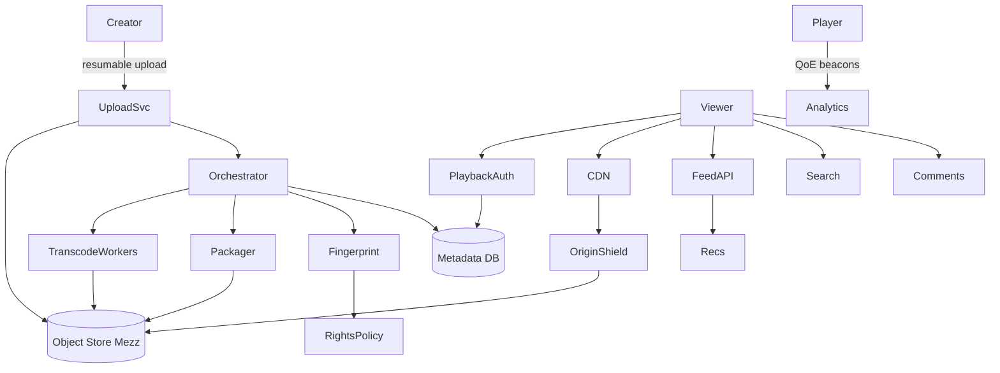

# System Design: YouTube

> **Focus areas:** UGC upload · Resumable ingest · Transcode ladders · ABR/HLS/DASH · CDN · Feed/search · Comments · Live · Copyright · Recommendations
> **Style:** End-to-end product design with progressive scale (10× → 100× → 1,000×)
> **Quality bar:** Domain-specific numbers and failure modes; explicit trade-offs; deal-breakers called out; CDN / ABR / encoding / DRM covered where relevant
> **Interview theme:** Senior / Staff — **YouTube-scale video platform**

---

## Table of Contents

1. [Clarify Requirements (Interview Q&A)](#1-clarify-requirements-interview-qa)
2. [Back-of-the-Envelope Estimation](#2-back-of-the-envelope-estimation)
3. [High-Level Design](#3-high-level-design)
4. [Architecture Diagram](#4-architecture-diagram)
5. [Design Deep Dive](#5-design-deep-dive)
6. [Wrap-Up](#6-wrap-up)
7. [Deeper / Related Interview Questions](#7-deeper--related-interview-questions)
8. [Appendices](#8-appendices)

---
## 1. Clarify Requirements (Interview Q&A)

Goal: design a **YouTube-like** video platform: creators upload video; viewers watch with ABR over CDN; discovery via search/home; comments; copyright; progressive live support.

### 1.0 What this is / is not

| Dimension | This doc | Not this |
|-----------|----------|----------|
| Job | UGC video hosting + watch + discovery | Full Google Search / Ads exchange |
| Media | VOD primary; live as extension | Zoom-style conferencing |
| Rights | Content ID / copyright pipeline hooks | Music label ERP |
| Lens | QoE, cost/egress, virality, abuse | Academic codec paper only |

### 1.1 Functional Requirements

| # | Question | Expected interviewer answer | Design implication |
|---|----------|----------------------------|--------------------|
| F1 | Upload? | Resumable chunked upload to blob store | Upload service + multipart |
| F2 | Processing? | Transcode multi-bitrate ladder + thumbnails + previews | Job queue + workers |
| F3 | Playback? | HLS/DASH ABR via CDN | Packager + CDN |
| F4 | Metadata? | Title, desc, tags, visibility, channel | Metadata DB + search index |
| F5 | Discovery? | Home feed, search, related | Recsys + search |
| F6 | Social? | Likes, comments, subs | Fanout + counters |
| F7 | Privacy? | Public/unlisted/private | AuthZ on watch + list |
| F8 | Copyright? | Fingerprint match + claim actions | Async Content ID |
| F9 | Live? | Ingest RTMP/WebRTC → packager → CDN | Live plane separate |
| F10 | Monetization? | Ads + membership hooks (MVP stub ok) | Ad insertion points |
| F11 | Analytics? | Views, watch time, creator studio | Event pipeline |
| F12 | Moderation? | Reports, automated + human | Safety queues |
| F13 | Devices? | Mobile/TV/web players | Client diversity in ABR |
| F14 | Scale? | Billions of views/day aspirational | CDN-first design |

**MVP scope:**

1. Resumable upload; store original/mezzanine
2. Transcode ladder (H.264 + optional AV1); thumbnails; storyboard
3. Publish when min renditions ready; progressive enhance
4. Watch page: signed CDN URLs / cookies; HLS/DASH
5. Channel + video metadata CRUD; visibility
6. Search + basic related; view counting
7. Comments + like counters
8. Copyright fingerprint queue (basic)
9. Creator notifications on processing state

**Out of MVP:**

- Full ads exchange / SSAI complexity
- Perfect Content ID legal workflow
- Shorts-only product (can mention)
- Active-active multi-writer metadata globally day one

### 1.2 Non-Functional Requirements

| # | NFR | Target |
|---|-----|--------|
| N1 | Upload resume | Survives flaky mobile networks |
| N2 | Time-to-first-playable | Minutes for short; longer OK for 4K |
| N3 | Startup latency | p50 < 1–2s on warm CDN |
| N4 | Availability watch | 99.9%+ via CDN; origin shielded |
| N5 | Durability originals | 11 9s class object storage |
| N6 | Consistency publish | Viewer never sees broken manifest |
| N7 | Multi-region | Watch global; upload regional |
| N8 | Security | Private videos unguessable; signed access |
| N9 | Cost | Egress + encode dominate; cache hit ratio sacred |
| N10 | Abuse | Upload rate limits; malware scan |

### 1.3 Cases

**Happy:** Upload → process → publish → CDN watch → engage → analytics.  
**Edges:** Huge file; corrupt upload; viral spike; copyright claim mid-viral; private leak; live disconnect; region outage; codec unsupported on device.

| Case | Behavior |
|------|----------|
| Partial upload crash | Resume by chunk ETag; no re-upload whole file |
| Transcode fail one rung | Publish with available rungs; retry failed |
| Viral 100× traffic | CDN absorbs; origin shield; throttle metadata |
| Copyright match | Block/monetize/mute per policy; appeal queue |
| Private URL leak | AuthZ every playback session; token TTL |
| Hot comment spike | Shard counters; async fanout |

### 1.4 Progressive scale

| Metric | Baseline | 10× | 100× | 1,000× |
|--------|----------|-----|------|--------|
| MAU | 50M | 500M | 2B | 2B+ global |
| Videos uploaded/day | 100K | 1M | 10M | 100M |
| Watch hours/day | 10M | 100M | 1B | 10B+ |
| Peak watch Gbps | 50 | 500 | 5K | 50K+ |
| Catalog size | 50M | 500M | 5B | 10B+ |
| Avg video size mezz | 500MB | 500MB | 1GB | 1GB+ |
| Transcode jobs/day | 100K | 1M | 10M | 100M |
| CDN hit ratio hot | 90% | 95% | 98% | 99%+ |

**Jumps:** 10× = multi-region CDN + packager fleet; 100× = shard metadata/search, Content ID scale, live plane; 1,000× = codec fleet efficiency (AV1), edge compute, extreme QoE/cost optimization.

### 1.5 Etc. constraints + scope repeat-back

Constraints to surface early: multi-region, cost of egress/CDN, DRM/licensing where relevant, cold-start vs hot content, device diversity, and abuse/copyright.

> YouTube-like UGC platform: resumable upload, durable mezzanine, multi-rung ABR packaging, CDN delivery, metadata/search/feed, comments, copyright hooks—optimized for QoE and egress cost under virality.

---
## 2. Back-of-the-Envelope Estimation

### 2.1 Traffic math

```text
Peak concurrent viewers: assume 5M watching @ 3 Mbps avg ABR
⇒ 15 Tbps aggregate egress (CDN-handled)
Origin should see <<1% of that with good hit ratio + shields

Views/day 1B × 5 min avg × 3 Mbps ≈ enormous bit-seconds
Interview: convert carefully; emphasize CDN absorbs watch plane
```

### 2.2 Storage math

```text
Uploads/day 1M × 500 MB mezz ≈ 500 PB/day raw? Wait — calibrate:
Realistic mid-scale: 100K uploads/day × 200 MB = 20 TB/day mezz
Ladder expands ~1.5–2.5× packaged footprint depending codecs
Thumbnails/storyboards add small %; audio stems small
Retention: never delete mezz without legal hold rules
```

### 2.3 Transcode capacity

```text
100K jobs/day ≈ 1.2/s average; peak 5–10×
Each job: multi-rung; CPU-hours vary with duration × complexity
Priority queues: short-form interactive creators vs long archive
GPU for AV1; CPU for H.264 compatibility fleet
```

### 2.4 Metadata / QPS

```text
Watch page API: 10K–100K QPS at scale (cached heavily)
Search: lower QPS, heavier fanout
View count updates: write-heavy → aggregate asynchronously
Comments write: bursty around premieres
```

### 2.5 Hot key math

```text
One premiere: 1M concurrent
Manifest polls + segment fetches dominate
Segment size 2–6s; many parallel connections per client still OK
Protect: packager cache, CDN, origin shield, pre-warm popular rungs
```

### 2.N Bottleneck ranking (interview signal)

State bottlenecks as a ranked list, not "scale with microservices":

1. **Egress / CDN** — usually the largest $ and failure blast radius for media.
2. **Hot keys** — viral / premiere titles; origin and metadata hotspots.
3. **Transcode / encode fleet** — GPU/CPU queue depth and priority fairness.
4. **Control-plane fanout** — manifests, license servers, personalization APIs.
5. **Cold storage retrieval** — rarely watched long-tail objects.

### 2.N+1 Cost intuition

```text
Storage is cheap relative to egress at scale.
One viral video watched 100M× at 4 Mbps ≈ 50 PB transferred.
At $0.01–0.08/GB blended CDN, that is mid–high seven figures for a single title wave.
Hence: aggressive edge caching, packaging efficiency, ABR ladders that avoid overserving bits.
```

---
## 3. High-Level Design

### 3.1 Planes (critical split)

| Plane | Responsibility | Consistency |
|-------|----------------|-------------|
| Ingest / Upload | Resumable bytes to object store | Strong per object; idempotent chunks |
| Media processing | Transcode, package, thumbnails, fingerprints | At-least-once jobs; exactly-once publish effect |
| Catalog / Metadata | Videos, channels, ACLs | Strong per video row; searchable eventually |
| Delivery / CDN | Segments + manifests | Cacheable; signed access |
| Discovery | Search, home, related | Eventually consistent indices |
| Safety / Rights | Moderation + Content ID | Async with blocking publish gates |
| Engagement | Comments, likes, subs | Eventual counters OK |

**Why this split:** Watch plane must not share fate with processing plane; metadata publish is the atomic 'go live' switch after artifacts exist.

### 3.2 Components

1. **API Gateway** — authn, rate limits, upload tickets
2. **Upload Service** — resumable sessions, virus scan hooks
3. **Object Store** — mezzanine + packaged renditions
4. **Transcode Orchestrator** — DAGs, retries, priority
5. **Packager** — HLS/DASH CMAF, encryption
6. **CDN + Origin Shield** — global edge
7. **entitlement / Playback Auth** — signed cookies/URLs
8. **Metadata Service** — video/channel CRUD
9. **Search Indexer** — text + vectors later
10. **Feed / Recs** — candidate + rank
11. **Comment Service** — threads, ranking
12. **View / QoE Analytics** — beacons
13. **Copyright Fingerprint** — match + policy actions
14. **Live Ingest** — RTMP/WHIP → transcoder → packager
15. **Moderation** — reports + classifiers
16. **Notification** — processing ready, replies
17. **Creator Studio API** — status, analytics
18. **KMS / DRM (optional Widevine/FairPlay for premium)** — KMS / DRM (optional Widevine/FairPlay for premium)

### 3.3 APIs (sketch)

```text
POST /v1/uploads {channel_id, filename, size, content_type} → upload_id, chunk_urls
PUT  /v1/uploads/{id}/chunks/{n}  (idempotent)
POST /v1/uploads/{id}/complete → video_id PROCESSING
GET  /v1/videos/{id} → metadata + playback session mint
POST /v1/playback/sessions {video_id, device} → manifest_url, license_url?, exp
GET  /v1/search?q=
POST /v1/videos/{id}/comments
POST /v1/videos/{id}/reports
```

### 3.4 Data model (core)

```text
Video {video_id, channel_id, title, description, visibility, status, duration, created_at, ...}
Rendition {video_id, codec, height, bitrate, object_key, status}
PlaybackPolicy {video_id, drm?, geo?, age?}
FingerprintJob {video_id, status, matches[]}
Comment {id, video_id, user_id, parent_id, text, created_at}
Subscription {user_id, channel_id}
ViewAggregate {video_id, window, count}  // not per-view row at scale
```

### 3.5 Trade-offs

| Topic | Choice | Why |
|-------|--------|-----|
| Publish gate | Min ladder ready before public | Avoid broken playback |
| Protocol | CMAF + HLS/DASH dual | Device coverage |
| View counts | Async aggregated | Write amplification |
| Comments | Shard by video_id | Hot video contention |
| Copyright | Async but can block monetization | Legal risk vs creator UX |
| Storage | Object store not DB BLOBs | Cost + throughput |
| CDN | Multi-CDN optional later | Reliability vs complexity |

### 3.6 Deal-breakers

| Temptation | Failure |
|------------|---------|
| Serve mezzanine directly | Cost explosion + no ABR |
| Put user_id in cache key | 0% hit ratio |
| Sync Content ID on upload request path | Tail latency death |
| Strong consistency global view counter | Unnecessary & expensive |
| Single region origin for world | Latency + outage blast |
| No resumable upload | Creator churn on mobile |

---
## 4. Architecture Diagram

### 4.1 C4-ish / flow



### 4.2 Upload → playable sequence

```text
1. Creator requests upload ticket (authZ channel)
2. Client uploads chunks with retries; complete()
3. Orchestrator DAG: probe → ladder encode → package → thumbs → fingerprint
4. When min renditions + manifest ready: status=READY; notify
5. Viewer mints playback session; fetches manifest from CDN
6. ABR segments from edge; license if DRM
```

### 4.3 Viral watch path

```text
Edge HIT for segments (ideal)
Miss → origin shield → object store
Metadata cached at edge/PoP for watch page shell
View aggregates batched; no sync write per segment
```

---
## 5. Design Deep Dive
### 5.1 Reliability (data loss prevention, retries, idempotency, rate limits, backpressure)

1. Upload chunks idempotent by (upload_id, chunk_n, checksum).
2. Transcode jobs at-least-once with output keys deterministic; safe retry.
3. Publish transaction: artifacts exist → metadata READY (compare-and-set).
4. Never delete last good rendition set on failed re-encode.
5. Playback tokens short-lived; refresh path separate from CDN cache keys.
6. Rate-limit uploads per channel; quarantine malware scanners.
7. Backpressure: encode queue priority + shed archival re-encodes under surge.
8. Multi-CDN failover for major outages; health-based steering.
9. Poison message handling for corrupt mezzanine (manual retry / reject).
10. Live disconnect: DVR window + reconnect tokens; slate on gap policy.

### 5.2 Scalability (scale up/down, sharding, storage tiers, parallelization)

| Scale | Architecture moves |
|-------|--------------------|
| 1× | Single region; managed object store; CPU transcoder pool; CloudFront-like CDN; Postgres metadata |
| 10× | Multi-region upload intake; origin shield; sharded comments; search cluster; priority encode queues |
| 100× | Cell-based metadata; Content ID fleet; multi-CDN; AV1 partial fleet; live dedicated plane |
| 1,000× | Edge packaging experiments; codec efficiency program; extreme cache hierarchy; per-country compliance cells |

### 5.3 Maintainability (ops, observability, migrations, multi-tenant)

- Job DAG as data/config; canary new encoder versions on % of traffic.
- QoE dashboards primary (rebuffer, startup) not only CPU.
- Schema migrations for metadata online; dual-write search carefully.
- Chaos: kill packager; ensure CDN TTL + stale-while-revalidate policies.
- Cost attribution per channel for encode+egress (internal).
- Runbooks: viral event, bad encoder push, copyright false positive storm.

### 5.4 Encoding ladder & packaging

Use CMAF segments shared across HLS/DASH where possible. Ladder spacing should avoid large quality cliffs. Cap top rung by source resolution. Store per-rendition checksums. For Shorts-like content, fewer rungs + faster ladder.

**Trade-off:** more rungs → better QoE on heterogeneous networks but more storage and encode cost.

### 5.5 CDN & cache hierarchy

PoP → regional mid-tier → origin shield → object store. Pre-warm on premiere. Negative caching careful for 404 during publish race. Immutable segment URLs with content-addressed or versioned paths enable long TTL.

### 5.6 Copyright / Content ID

Fingerprint at ingest; match against reference corpus; policy engine (block, track, mute audio, share revenue). Appeals workflow. False positives are a trust SEV—human review lanes for popular creators.

### 5.7 Recommendations (home/related)

Candidate generation (collab + content + co-watch) → ranker (watch time, satisfaction, diversity) → filters (policy, already watched). Feature store for user/video. Fallbacks when personalization fails (trending/popular).

### 5.8 Comments at premiere scale

Shard by video_id; separate hot celebrity videos to dedicated cells. Rank by relevance/likes with abuse filters. Don't fan out comments into per-follower feeds—pull model on watch page.

### 5.9 Progressive scale narrative

**1×:** Monolith API + worker pool + single CDN distribution.  
**10×:** Split upload/processing/metadata/playback auth; multi-AZ.  
**100×:** Cells, multi-region, rights + live planes, multi-CDN.  
**1,000×:** Global QoE/cost optimization as first-class product; codec wars matter.

---
## 6. Wrap-Up

### 6.1 Designed

YouTube-like system covering resumable UGC ingest, durable mezzanine, ladder encode + ABR packaging, CDN delivery, metadata/discovery, engagement, and copyright/moderation hooks.

### 6.2 Decisions to defend

1. Control plane (metadata publish) separate from data plane (CDN bytes)
2. Resumable idempotent upload
3. Min-ladder publish + progressive enhance
4. CDN/origin shield as primary scalability mechanism for watch
5. Async view aggregates and Content ID
6. Hot-video isolation for comments/counters
7. QoE-first SLOs
8. Deterministic job outputs for safe retries

### 6.3 Risks

- Encoder regression harming QoE globally
- Viral origin storms if cache keys wrong
- Copyright false positives
- Private video authorization bugs
- Cost blowups from low hit ratio or over-encoding

### 6.4 45-minute plan

| Min | Focus |
|-----|-------|
| 0–5 | Scope UGC VOD; clarify live/DRM |
| 5–15 | Upload + processing pipeline |
| 15–25 | Playback ABR + CDN |
| 25–35 | Metadata, search, comments, views |
| 35–45 | Copyright, scale jumps, QoE/cost |

### 6.5 Closer

> **YouTube**: resumable ingest, ladder+ABR, CDN-first watch plane, careful publish gates, async rights & analytics, progressive cells—defend QoE and egress.

---
## 7. Deeper / Related Interview Questions

### Q1. Why not store videos in MySQL/S3-only without CDN?

DB BLOBs choke; S3 alone is high latency globally and costly without edge cache. CDN is non-negotiable for watch.

### Q2. HLS vs DASH vs smooth?

HLS widest device reach; DASH common on Android/web; CMAF unifies segments. Serve both manifests over shared segments.

### Q3. How do you prevent cache stampedes on premiere?

Origin shield, request coalescing, pre-warm, staggered client retries, long TTL on immutable segments.

### Q4. Where is strong consistency required?

Publish status and ACL checks for private video; not for view counts.

### Q5. How to count views without melting DB?

Client beacons → stream → aggregate by video_id in windows; approximate OK; reconcile overnight.

### Q6. Design Content ID matching at scale?

Audio/video fingerprints; sharded reference index; ANN + exact verify; policy async.

### Q7. How do signed URLs interact with CDN caching?

Prefer signed cookies or CDN tokens excluded from cache key; never unique query per user on segment URLs.

### Q8. What breaks when average bitrate doubles?

Egress cost and CDN capacity; ABR ladder and codec efficiency become executive issues.

### Q9. Live vs VOD architecture differences?

Live has low-latency packagers, short segments, DVR windows, different failure (ingest disconnect); VOD emphasizes VOD storage tiers.

### Q10. How to handle device that can't play AV1?

Multi-codec manifests; player picks; server can filter by device capability hints.

### Q11. Idempotent complete upload called twice?

Same video_id returned; processing DAG not duplicated if keyed by upload_id.

### Q12. Consistent hashing for what?

Shard comments, fingerprint workers, maybe metadata cells—not CDN path selection (anycast/geo).

### Q13. Rate limit strategy?

Per-user/channel upload Mbps and daily count; separate watch API limits; CDN handles byte flood.

### Q14. How do thumbnails work?

Sample frames; select aesthetic score; storyboard sprites for hover scrub.

### Q15. Search indexing lag OK?

Yes seconds–minutes; watch by URL must work immediately via metadata primary.

### Q16. Multi-region metadata?

Read replicas global; writes regional with video_id locality; careful ACL caching TTLs.

### Q17. What is a deal-breaker in interview?

Serving one giant MP4 progressively without ABR at YouTube scale.

### Q18. How to degrade under encode backlog?

Prioritize short/recent; lower max rung temporarily; notify creators of delay.

### Q19. Comments ranking abuse?

Shadowrate spam; ML + reports; rate limits; don't chronologically amplify bots.

### Q20. Offline downloads?

Separate entitlement + encrypted persistent license; storage quota on device; covered in offline-media doc.

### Q21. Why storyboard sprites?

Scrubbing without fetching video; CDN-friendly small images.

### Q22. Manifest personalization?

Usually same media manifests; ads/ssai may personalize; cache carefully.

### Q23. How to test QoE?

Synthetic players globally; cohort metrics; canary encoder.

### Q24. Partition videos table?

By video_id hash; secondary indices for channel timelines.

### Q25. What about 8K?

Niche; separate ladder; most devices capped; cost/benefit.

---
## 8. Appendices

### A1. Sample SLO table

| SLO | Target |
|-----|--------|
| Upload success after resume | 99% |
| Time to first playable <10min video | <5–15 min p50 |
| Rebuffer ratio | <0.5–1% watch time |
| Playback auth availability | 99.95% |
| Wrong ACL exposure | ~0 (SEV0) |

### A2. Ownership map

| Area | Owning team example |
|------|---------------------|
| Upload/resume | Ingest |
| Encode/package | Media processing |
| CDN/QoE | Delivery |
| Metadata/ACL | Catalog |
| Content ID | Rights |
| Recs | Discovery ML |

### A3. Failure injection drills

- Kill origin shield in one region
- Push bad encoder binary to 1% 
- Flood fingerprint false positives
- Expire all playback signing keys (emergency rotation test)


### A-Z. Interview checklist

- [ ] Clarified UGC vs catalog, live vs VOD, DRM needs
- [ ] Stated progressive scale jumps that change architecture
- [ ] Separated control plane vs data plane vs media processing
- [ ] Named CDN / ABR / ladder / packaging choices with trade-offs
- [ ] Called out hot-key and viral failure modes
- [ ] Idempotency on upload/transcode/publish
- [ ] Observability: QoE (rebuffer, startup, bitrate), not just QPS
- [ ] Cost: egress and encode hours dominate
- [ ] Security: signed URLs, license servers, abuse
- [ ] Rollout phases with kill switches

---

*End of doc — senior/staff media system design prep.*
