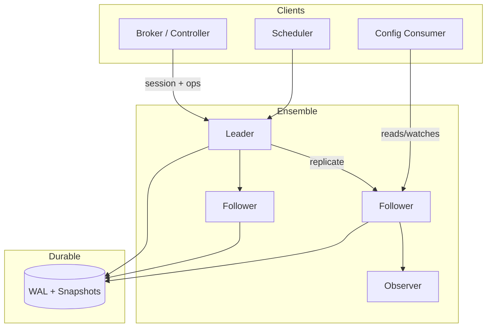
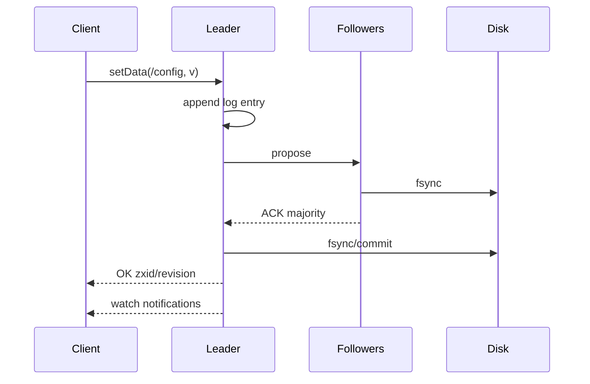

# System Design: ZooKeeper / Chubby-Style Coordination Service

> **Focus areas:** Linearizable metadata · Hierarchical znodes/files · Sessions & ephemeral nodes · Watches · Quorum consensus · Leader leases · Small-data CP store  
> **Style:** End-to-end platform design with progressive scale (10× → 100× → 1,000×)  
> **Quality bar:** Coordination ≠ data plane; watch semantics; session expiry; ensemble sizing; anti-patterns (storing large blobs)

---

## Table of Contents

1. [Clarify Requirements (Interview Q&A)](#1-clarify-requirements-interview-qa)
2. [Back-of-the-Envelope Estimation](#2-back-of-the-envelope-estimation)
3. [High-Level Design](#3-high-level-design)
4. [Architecture Diagram](#4-architecture-diagram)
5. [Design Deep Dive](#5-design-deep-dive)
6. [Wrap-Up](#6-wrap-up)
7. [Deeper / Related Interview Questions](#7-deeper--related-interview-questions)

---

## 1. Clarify Requirements (Interview Q&A)

Bound a **coordination service**: a small, strongly consistent, highly available (within CP limits) system for locks, leader election, membership, and dynamic configuration—not a general database.

### 1.0 What this is / is not

| Dimension | This design | Not this |
|-----------|-------------|----------|
| Job | Linearizable coordination metadata + notifications | General-purpose KV / object store |
| Data size | KB-scale znodes/files | Multi-MB values (anti-pattern) |
| Consistency | CP (linearizable writes; sequential consistency variants per API) | AP eventually consistent cache |
| Examples | Apache ZooKeeper, Google Chubby, etcd | Redis-as-DB, Consul-without-care, Kafka |
| Clients | Control planes, brokers, schedulers | End-user product reads at millions QPS |

### 1.1 Functional Requirements

| # | Question to ask | Expected / typical interviewer answer | Design implication |
|---|-----------------|----------------------------------------|--------------------|
| F1 | Primary use cases? | Leader election, distributed locks/leases, membership, config, barriers | APIs: durable + ephemeral nodes, sessions, watches |
| F2 | Data model? | Hierarchical tree (`/app/shard-1/leader`) like ZK/Chubby | Path-based ACL + watches on nodes/children |
| F3 | Ephemeral nodes? | Yes — deleted on session loss | Session heartbeats critical |
| F4 | Watches? | One-shot or persistent; notify on change | Exact semantics must be specified (ZK one-shot vs etcd watch) |
| F5 | Consistency? | Linearizable writes; reads may be linearizable or sequential | Raft/Zab; read index / leader reads |
| F6 | Transactions? | Multi-op compare-and-set (ZK multi / etcd txn) | Atomic check-and-set for lock recipes |
| F7 | Auth? | Mutual TLS + path ACLs | Multi-tenant prefixes |
| F8 | Client language? | Official clients with session state machine | Opaque session id + timeout |
| F9 | Size limits? | e.g. 1 MB/node hard cap; soft 1–10 KB | Enforce; redirect large data to object store |
| F10 | Ensemble size? | 3 or 5 servers typical | Odd size; majority quorum |
| F11 | Observability? | Latency, proposal rate, watch count, fsync | First-class ops |
| F12 | Backup/restore? | Snapshot + WAL | Periodic snapshots |
| F13 | Multi-datacenter? | Observer/learners or separate regional clusters | Avoid sync cross-region quorum for latency |

**MVP functional scope:**

1. Hierarchical nodes: create / delete / set / get / list children.
2. Persistent + ephemeral + sequential modes (ZK-like) **or** lease keys (etcd-like)—pick one model and be consistent.
3. Client sessions with heartbeat; ephemeral cleanup on expiry.
4. Watches (document one-shot vs continuous).
5. Conditional updates (`version` / `mod_revision`).
6. Quorum ensemble (3–5), leader-based replication (Zab/Raft).
7. Snapshot + WAL recovery.
8. ACL on paths; TLS.

**Out of MVP:**

- Storing application bulk data / large configs (> tens of KB)
- Global multi-region linearizable active-active
- SQL / secondary indexes
- Byzantine tolerance
- Replacing Kafka for event streaming

### 1.2 Non-Functional Requirements

| # | Question | Expected answer | Target |
|---|----------|-----------------|--------|
| N1 | Write latency? | Control-plane OK | p50 < 5–15 ms in-region (fsync bound) |
| N2 | Read latency? | Fast local/follower policy | p50 < 1–3 ms sequential; linearizable higher |
| N3 | Availability? | Survive 1 failure in 3, 2 in 5 | 99.95%+ with careful ops |
| N4 | Durability? | Committed = majority fsynced | RPO 0 for acknowledged writes |
| N5 | Consistency? | Linearizable committed writes | No silent divergence |
| N6 | Scale of data? | Millions of nodes, GB not TB | Memory-resident working set preferred |
| N7 | Watch fanout? | Bounded | Explicit caps / hierarchy |
| N8 | Security? | AuthN/Z; no anonymous write | mTLS, ACL |
| N9 | Cost? | Small ensemble, expensive correctness | Prefer few powerful nodes |

### 1.3 Cases

**Happy paths**

1. Client creates ephemeral `/locks/job-9` → holds lock → deletes / session ends → waiters notified.
2. Leader election via lowest sequential ephemeral child; watches on children.
3. Config update `SET /config/feature` → watchers re-read.
4. Rolling restart: followers catch up via WAL/snapshot; leader transfer.

**Edge / failure cases**

| Case | Behavior |
|------|----------|
| Leader crash | New leader election in ensemble; clients reconnect; sessions may expire if timeout breached |
| Client GC pause > session timeout | Session expired; ephemerals deleted; client must rebuild state |
| Network partition minority | Minority cannot commit; clients should fail / redirect |
| Watch storm on hot parent | Thundering herd; use deeper hierarchy / sharded paths |
| Fat znode (MBs) | Reject or severe latency; anti-pattern |
| Disk full on leader | Quorum write fail → cluster read-only / unavailable |
| Clock skew | Consensus uses terms/epochs not wall clock; session timeouts still need care |
| Split brain ensembles | Prevented by quorum; never run two independent ensembles with same clients |
| ACL misconfig | Deny by default on sensitive prefixes |
| Snapshot corruption | Retain multiple snapshots + WAL segments; verify checksums |

### 1.4 Scales (Progressive)

| Metric | Baseline | 10× | 100× | 1,000× |
|--------|----------|-----|------|--------|
| Nodes (znodes/keys) | 100K | 1M | 10M | 100M |
| Avg node size | 1 KB | 1 KB | 0.5–1 KB | 0.5 KB |
| Working set RAM | ~1–2 GB | ~10–20 GB | ~50–100 GB | sharded / multi-cluster |
| Write QPS (commit) | 1K | 10K | 50–100K | multi-ensemble |
| Read QPS | 20K | 200K | 1M+ | local caches + followers |
| Concurrent sessions | 5K | 50K | 200K | 1M+ (many clusters) |
| Watches armed | 20K | 200K | 1M | hierarchical / proxy |
| Ensemble count | 1 | 1–2 | many by cell | hundreds of cells |

**What each jump forces:**

- **10×:** Tune snapshots; more watchers; dedicated SSD; connection limits.
- **100×:** **Namespace sharding** across ensembles/cells; client-side caching with revisions; forbid fat nodes.
- **1,000×:** Coordination mesh: many small clusters per cell; proxies; never one global ZK for all company metadata.

### 1.5 Etc.

- Model choice: **ZK-style** (znodes, ephemeral, sequential, one-shot watches) vs **etcd-style** (flat keys with lease, MVCC revision, continuous watch). Interview: pick one, map recipes.
- Observers/learners for read scale without voting weight.
- **Scope repeat-back:**

> Design a Chubby/ZooKeeper-style **CP coordination service**: hierarchical small metadata, sessions & ephemerals, watches, quorum consensus, strong durability for commits—optimized for locks/election/config, scaling via multiple ensembles rather than one giant cluster.

---

## 2. Back-of-the-Envelope Estimation

### 2.1 Memory

```text
100K nodes × (1 KB value + 200 B meta) ≈ 120 MB
+ watches, sessions, trees indexes → ~0.5–2 GB baseline

10M nodes × 1 KB ≈ 10 GB raw → 30–50 GB with overheads → still one beefy ensemble
100M nodes → do not put on one ensemble; shard by path prefix / cell
```

### 2.2 Write path (Raft/Zab)

```text
Commit latency ≈ RTT_to_majority + fsync
Same AZ SSD: 2–10 ms typical p50
Cross-region quorum: 50–150 ms+ → avoid for interactive locks
```

Write QPS bound by:

```text
proposals/s × avg payload × fsync batching
1K writes/s × 1 KB ≈ 1 MB/s log — easy
50K writes/s → need batching, pipelining, careful SSD, or shard ensembles
```

### 2.3 Session heartbeats

```text
50K sessions × heartbeat every 1/3 of timeout (timeout 10s → ~3s)
≈ 50K / 3 ≈ 17K heartbeats/s
Lightweight; still connection & CPU non-trivial at 1M sessions
```

### 2.4 Watch notifications

```text
Hot key: 10K watches fire → 10K messages spike
Design: shallow fanout; client libraries coalesce; prefer children watches on sharded paths
```

### 2.5 Disk

```text
WAL growth: 10K writes/s × 500 B ≈ 5 MB/s → ~400 GB/day raw before compaction
Snapshots every N minutes / GBs of state keep recovery bounded
```

### 2.6 Comparison: why not use the data DB?

| | Coordination service | Primary DB |
|--|----------------------|------------|
| Latency for lock | Low ms, specialized | Higher, contended |
| Ephemeral/session | Built-in | DIY triggers |
| Watch | Built-in | CDC/polling |
| Data volume | Tiny | Huge |
| Wrong use | Large blobs | Fine |

---

## 3. High-Level Design

### 3.1 Data model (ZK-flavored; map to etcd in interview)

```text
/ (root)
 ├── service-a/
 │    ├── config          # persistent, small JSON
 │    ├── members/
 │    │    ├── host-1     # ephemeral
 │    │    └── host-2
 │    └── locks/
 │         └── lock-00042 # ephemeral sequential
 └── service-b/
```

**Node fields:** `path`, `data`, `version`/`czxid`/`mzxid`, `ephemeral_owner`, `children_count`, `ACL`, `TTL/lease` (etcd).

### 3.2 API surface

| Op | Semantics |
|----|-----------|
| `create(path, data, mode)` | Persistent / ephemeral / sequential |
| `delete(path, version)` | Conditional |
| `exists` / `getData` / `setData` | Versioned |
| `getChildren` | List |
| `multi` / `txn` | Atomic multi-op |
| `addWatch` | One-shot or persistent |
| session `connect` / `keepalive` | Timeout negotiated |

**Lock recipe (ZK):** create ephemeral sequential under `/lock`; if lowest, hold; else watch predecessor; on delete, retry. Always handle session loss.

**Leader recipe:** same as lock or dedicated “election” node with fencing token stored in data = session/epoch.

### 3.3 Consensus & roles

| Role | Duty |
|------|------|
| Leader | Orders writes, proposes to quorum |
| Follower | Accepts proposals, serves sequential reads (policy) |
| Observer | Non-voting catch-up for read scale |

**Zab vs Raft (interview-level):** both provide total order broadcast / replicated log for the state machine. Implementation detail matters less than: majority commit, leader election, log durability, snapshot install.

### 3.4 Session & ephemeral lifecycle

```text
Client connect → session_id, timeout T
Heartbeat ≤ T/3
If no heartbeat by T → session expired
  → delete all ephemeral nodes owned
  → fire watches
  → client must create new session (state rebuild)
```

**Deal-breaker:** treating ephemeral deletion as “maybe” — clients must assume loss and revalidate.

### 3.5 Watch semantics (be precise)

| Model | Behavior | Pitfall |
|-------|----------|---------|
| ZK one-shot | Fire once; client re-arms | Miss events between fire and re-arm if not careful with version |
| etcd continuous | Stream revisions | Need compaction awareness; don't lag forever |
| Chubby | Eventual poll + cache | Different product history |

**Correct ZK pattern:** `getData(path, watch=true)` then on event re-read and re-watch; use version/zxid to detect gaps.

### 3.6 Why A over B

| Choice | Choose | Reject when |
|--------|--------|-------------|
| ZK/Chubby-style CP store | Locks, election, membership | High QPS bulk data |
| etcd | K8s-style lease+MVCC | Need ZK sequential children recipes already |
| Consul | Service discovery + KV | Need pure linearizability nuance clarity |
| Redis | Cache / fast AP structures | Coordination safety under partition |
| Dynamo/Cassandra | Large AP data | Linearizable lock |

---

## 4. Architecture Diagram



**Write path sequence:**



---

## 5. Design Deep Dive

### 5.1 Reliability

**Data loss prevention**

- Commit only after **majority** persist.
- Snapshots checksummed; retain last N.
- Quorum membership changes via joint consensus / reconfiguration protocol (careful ops).

**Retries & idempotency**

- Client requests carry xid; leader dedupes in-session.
- Recipes (locks) must be idempotent: re-create ephemeral if session renewed incorrectly — usually **new session ⇒ new ephemeral**.

**Session expiry vs GC pauses**

- Set timeouts with p99 pause in mind OR isolate coordination clients from heavy GC heaps.
- Prefer sidecars / separate processes for ZK clients in latency-sensitive services.

**Rate limits & backpressure**

- Max connections, max watches, max bytes/sec per client.
- Global write throttle to protect fsync latency SLO.
- Reject oversized nodes.

**Split-brain**

- Strict majority; fencing via zxid/revision in recipes.
- Never manually “start a second cluster” with same client bootstrap list without reconfig protocol.

### 5.2 Scalability

**Vertical first:** coordination clusters are often 3–5 large nodes with fast disks—not hundreds of tiny voters.

**Horizontal strategies**

| Strategy | Use |
|----------|-----|
| Path-prefix sharding | `/cell-a/**` → ensemble A |
| Application cell | Each cell has own etcd/ZK |
| Observers | Scale sequential reads |
| Client cache | Cache with revision; watch invalidate |
| Hierarchical config | Avoid 1M children under one parent |

**Anti-patterns at scale**

- Listing 1M children.
- Storing MB payloads.
- One company-wide ZK for all use cases.
- Persistent watches on root.

**Storage tiers**

| Data | Store |
|------|-------|
| Hot tree | RAM |
| WAL | SSD |
| Snapshots | SSD + remote backup |
| Audit of changes | Optional stream to Kafka (async) |

### 5.3 Maintainability

**Ops**

- Rolling restart followers first; leader last with transfer.
- Disk/latency alerts on fsync p99.
- Four-letter / metrics endpoints (ZK) or Prometheus (etcd).

**Observability**

| Metric | Meaning |
|--------|---------|
| `commit_latency` | Client SLO |
| `leader_changes` | Stability |
| `watch_count` | Memory risk |
| `approximate_data_size` | Capacity |
| `session_expired_total` | Client health |
| `proposals_pending` | Overload |

**Migrations**

- Moving a subtree to a new ensemble: dual-write / read redirect / freeze window.
- Compaction (etcd): clients must not hold huge revision lag.

**Multi-tenant**

- Prefix quotas (`/tenant-id/...` max nodes, max watches).
- Separate ensembles for noisy neighbors when needed.

---

## 6. Wrap-Up

### Decision summary

| Decision | Choice | Why |
|----------|--------|-----|
| Consistency | CP linearizable writes | Correct locks/election |
| Data size | Small metadata only | Latency & memory |
| Scale | Many ensembles / cells | One quorum won’t 1000× |
| Sessions | Heartbeat + ephemeral | Membership & locks |
| Watches | Explicit semantics | Avoid missed updates |

### Phased rollout

1. **MVP:** 3-node ensemble, core CRUD, sessions, watches, ACLs.
2. **Phase 1.5:** Snapshots/backup, observers, quotas, runbooks.
3. **Phase 2:** Cell sharding, client caching standards, chaos tests.
4. **Phase 3:** Fleet of ensembles; self-service namespace provisioning.

### Interview close

Say clearly: **ZooKeeper/Chubby is a coordination primitive**, not a data store. Success = correct recipes + small data + operable quorum—not maximizing QPS.

---

## 7. Deeper / Related Interview Questions

**Q1. Why odd ensemble sizes (3, 5)?**  
**A:** Majority quorum: 3 tolerates 1 failure; 5 tolerates 2. Even sizes don’t improve fault tolerance vs next lower odd size and can complicate quorum.

**Q2. What happens if you store 5 MB configs in ZK?**  
**A:** Inflates snapshots/WAL, slows commits, hurts all tenants. Put blob in object storage; store pointer + hash in ZK.

**Q3. ZK watch one-shot gap — how do clients not miss events?**  
**A:** On notification, re-read state and re-register watch; compare versions. Libraries encode this. Blind re-arm without read can race.

**Q4. etcd revision compaction — why do watchers fail?**  
**A:** Slow watchers requesting compacted revisions get errors; they must resync from current store state.

**Q5. Linearizable vs sequential read?**  
**A:** Linearizable read sees latest committed (leader or read-index). Sequential may be slightly stale on follower but still monotonic per client session (ZK model).

**Q6. How do ephemeral nodes enable membership?**  
**A:** Each member creates ephemeral child; on crash/session loss children vanish; watchers update membership views.

**Q7. Is ZK suitable as a job queue?**  
**A:** Poorly. Limited write throughput, watch herds, not designed for high churn large data. Use Kafka/SQS.

**Q8. Chubby vs ZooKeeper differences (high level)?**  
**A:** Chubby is Google’s coarse-grained lock service with file-like API and client caching; ZK is open-source hierarchical coordination with watches. Same niche: small CP metadata.

**Q9. How does leader election in the ensemble differ from app leader election?**  
**A:** Ensemble elects Zab/Raft leader to order metadata. Apps use ephemeral recipes to elect **application** leaders, stored as znodes.

**Q10. What is herd effect?**  
**A:** Many clients watch same node; one change notifies all → thundering reconnect/read. Mitigate with sequential predecessor watches (lock recipe) or sharding.

**Q11. Why fsync on commit?**  
**A:** Durability of acknowledged writes across power loss. Batching fsync improves throughput at latency cost.

**Q12. Can you run ZK across regions?**  
**A:** Possible but commit latency tracks cross-region RTT; usually regional clusters + higher-level failover.

**Q13. How to backup safely?**  
**A:** Snapshot on follower; copy snapshot+needed WAL; periodic restore drills. Avoid locking leader heavily.

**Q14. Security: what if ACLs are world-open?**  
**A:** Any client can steal locks or rewrite config. Default deny; bootstrap credentials; mTLS.

**Q15. Compare etcd lease vs ZK ephemeral.**  
**A:** Both bind key lifetime to client liveness. etcd leases can attach many keys; ZK ephemeral is per-node ownership by session.

**Q16. What’s a safe distributed lock recipe requirement?**  
**A:** Mutual exclusion + fencing token (zxid/session/version) checked by the resource, + handling of session loss.

**Q17. Why not use MySQL for coordination?**  
**A:** Can for small scale (`GET_LOCK` / row leases) but lacks first-class watches, ephemeral semantics, and typically worse ops for this niche. Also easy to get fencing wrong.

**Q18. How do observers help?**  
**A:** Serve reads without voting; reduce load on quorum; do not improve write availability.

**Q19. Memory vs disk for the tree?**  
**A:** ZK traditionally keeps working set in memory for speed; disk is WAL/snapshot. Plan RAM for node count.

**Q20. Thundering herd on session reconnect after outage?**  
**A:** Client jittered reconnect; server connection rate limits; avoid synchronized timeouts.

**Q21. How does this relate to Kubernetes?**  
**A:** etcd is the coordination/store for k8s API objects—same class of system; scale limits are why large clusters shard / use separate etcd for events.

**Q22. What consistency does `multi` / txn give?**  
**A:** Atomic check-and-mutate of several keys/nodes—critical for “create lock only if not exists” style recipes.

**Q23. Failure detector for sessions vs consensus heartbeats?**  
**A:** Separate layers: ensemble heartbeats keep Raft/Zab healthy; client session timeouts govern ephemerals. Tuning both incorrectly causes flaps or slow failover.

**Q24. Can coordination service be AP?**  
**A:** If you weaken to AP, locks lie under partition. Then it’s a cache/discovery hint, not a lock service.

**Q25. 100M znodes — design response?**  
**A:** Multiple ensembles by cell/prefix; archival of dead paths; forbid wide fanout directories; reconsider if data belongs elsewhere.

**Q26. How to do reconfig (add node to ensemble)?**  
**A:** Dynamic reconfiguration protocols (ZK reconfig, etcd member add) with care; prefer planned maintenance; avoid minority confusion.

**Q27. Why sequential nodes for locks?**  
**A:** Total order of waiters; watch only predecessor → O(1) notifications per release instead of herd on parent.

**Q28. What metrics indicate overload?**  
**A:** Rising commit latency, outstanding requests, fsync p99, truncated watches, session timeouts spiking.

**Q29. Deal-breaker answer in interviews?**  
**A:** “We’ll put all user posts in ZooKeeper for strong consistency.” Wrong tool.

**Q30. How do you fence a lock holder?**  
**A:** Store fencing token (zxid / etcd mod_revision / lease id) in lock node; resource rejects lower tokens even if old holder still alive.

---

*End of doc — ZooKeeper / Chubby Coordination*

## Appendix — Deep dive notes for ZooKeeper/Chubby-style coordination service

### Hardest invariants
- Define the correctness property that must not break under retries, partial failures, or overload.
- Define multi-tenant isolation boundaries if applicable.
- Define delete/TTL/privacy semantics across primary + cache + search + logs.

### Likely bottlenecks
1. Hot keys / hot partitions for core entity ids
2. Synchronous dependency latency tails (p99)
3. Write amplification from secondary indexes / fanout
4. Compaction / GC / backfill stealing cluster IO
5. Cross-region chatty patterns

### Suggested metrics (RED + business)
| Metric | Why |
|--------|-----|
| Request rate / error / duration | Golden signals |
| Saturation (CPU, pool, queue lag) | Leading indicator |
| Idempotency conflict rate | Client retry health |
| Cache hit ratio | Origin protection |
| Business SLI for ZooKeeper/Chubby-style coordination service | Product truth |

### Migration & rollout
- Expand/contract schema changes
- Dual-write or shadow reads for store migrations
- Feature-flagged cutover; canary on error budget
- Backfill with checkpoints and replayable logs

### What interviewers poke next
- Memory footprint of your cache/index choice
- Exact concurrency control (locks vs OCC vs ledger)
- Cost model at 100×
- Abuse cases unique to ZooKeeper/Chubby-style coordination service

## Appendix A — Interview execution checklist

1. **Repeat scope** in one sentence; list out-of-scope.
2. **Write NFRs as numbers** (QPS, p99, RPO/RTO).
3. **Draw** clients → edge → svc → store → async.
4. **Call the hardest invariant** early.
5. **Pick consistency** deliberately; do not say “strong everywhere.”
6. **Show scale jumps** at 10× / 100× / 1,000× with architecture changes.
7. **Name failure modes** and degraded behavior.
8. **Close** with metrics, rollout, and residual risks.

## Appendix B — Trade-off flashcards

| Topic | Prefer | Avoid |
|-------|--------|-------|
| Sync vs async | Sync for money/authz ack | Sync for fanout/email/indexing |
| SQL vs KV | Multi-row invariants | Ultra-high simple point ops |
| Cache | Read-heavy + tolerable stale | Incorrect money reads |
| Queue | Spike absorb + retry | Hidden request/response bus |
| Multi-region | Home cell single-writer | Multi-writer without merge rules |

## Appendix C — Reliability patterns to name drop correctly

- Idempotency keys + request hash
- Outbox / transactional messaging
- Leases + fencing tokens
- Quorum / consensus (Raft) for coordination—not for every data path
- Bulkheads + circuit breakers + deadlines
- Load shedding + admission control
- Canary + automatic rollback on SLO burn
- Backup restore drills (backup ≠ restore tested)

## Appendix D — Scalability patterns

- Consistent hashing with virtual nodes
- Hierarchical sharding (cell → shard → partition)
- CQRS / projections for read models
- Hot-key splitting and salting
- Tiered storage + compaction budgets
- Consumer parallelization by partition
- Edge caching with purge/surrogate keys

## Appendix E — Sample capacity dialogue

```text
Interviewer: Assume 10M DAU.
You: 10M DAU × 5 key actions/day ≈ 50M events/day ≈ 580 QPS avg.
Peak 15× ⇒ ~9K QPS. With 70% cache hit on reads, origin ~2.7K QPS.
At 100×, origin ~270K QPS ⇒ shard + edge mandatory.
```

Customize the action rate to this problem; do not reuse social-feed numbers for a ledger.


*Enriched for interview drill · `zookeeper-chubby-coordination`*
