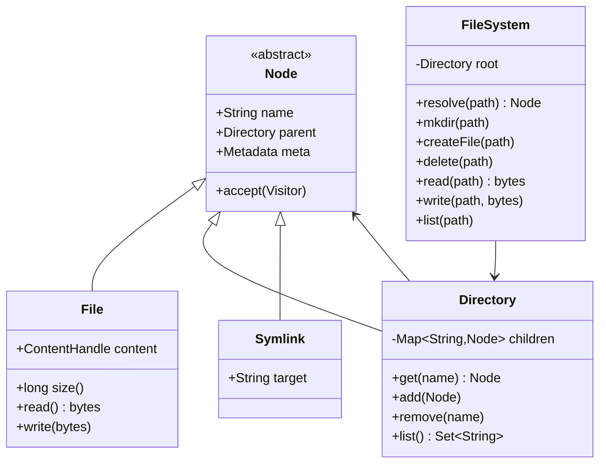

# LLD: File-System Class Model (Node, File, Directory, Symlink)

> **Focus areas:** Tree hierarchy · Node/File/Directory/Symlink · Path resolution · Cycles · Permissions hooks · Traversal · Soft/hard links · Concurrency · Persistence sketch  
> **Style:** LLD / OOD interview (clarify → scale → classes → algorithms → concurrency → reliability → progressive scale → wrap-up → Q&A)  
> **Quality bar:** Correct path resolve including `..` and symlinks, cycle detection, clear polymorphism, no God-object “FileSystem” dumping all logic without structure  
> **Interview theme:** Microsoft — classic LLD; sometimes coded; related to distributed FS HLD but **this doc is the in-memory/object model**; Baseline → 10× → 100× → 1,000×

---

## Table of Contents

1. [Clarify Requirements (Interview Q&A)](#1-clarify-requirements-interview-qa)
2. [Complexity & Scale](#2-complexity--scale)
3. [Class Diagrams & Responsibilities](#3-class-diagrams--responsibilities)
4. [Key Algorithms & Code Sketches](#4-key-algorithms--code-sketches)
5. [Concurrency & Edge Cases](#5-concurrency--edge-cases)
6. [Persistence & Schema Notes](#6-persistence--schema-notes)
7. [Reliability](#7-reliability)
8. [Scalability](#8-scalability)
9. [Wrap-Up](#9-wrap-up)
10. [Deeper / Related Interview Questions](#10-deeper--related-interview-questions)
11. [Appendices](#11-appendices)

---

## 1. Clarify Requirements (Interview Q&A)

Goal: design classes for a **hierarchical file system**: directories contain nodes; files hold bytes/metadata; symlinks point to paths; support resolve, mkdir, create, delete, list, traverse—with safe symlink handling.

### 1.0 What this is / is not

| Dimension | This | Not |
|-----------|------|-----|
| Job | Object model + path algorithms | Full GFS/HDFS HLD |
| Storage | Bytes as `byte[]` / blob ref | Block allocator / inode disk layout deep dive (optional appendix) |
| OS fidelity | Unix-like path semantics subset | Full POSIX |
| Microsoft lens | Clean OOP, edge cases, symlink cycles | NTFS MFT forensics |

### 1.1 Clarifying questions

| # | Question | Typical answer | Implication |
|---|----------|----------------|-------------|
| F1 | Tree rooted? | Single root `/` | `FileSystem` holds root |
| F2 | Names unique per dir? | Yes | Child map by name |
| F3 | Symlinks? | Yes — soft links | `Symlink` node |
| F4 | Hard links? | Optional Phase 2 | Inode refcount |
| F5 | Path API? | Absolute + relative | Resolve with cwd |
| F6 | Permissions? | Owner/mode hooks MVP | `Permission` VO |
| F7 | File content? | In-memory bytes or `ContentStore` port | Split metadata/content |
| F8 | Case sensitivity? | Sensitive MVP | Policy flag |
| F9 | Max path/symlink depth? | Yes (e.g. 40) | Cycle/DoS guard |
| F10 | Move/rename? | Yes | Same FS atomicity |
| F11 | Watchers? | Out of MVP | — |
| F12 | Mounts? | Out of MVP | Multiple roots later |

**MVP scope:**

1. `Node` hierarchy: `File`, `Directory`, `Symlink`.  
2. `FileSystem` operations: create/mkdir/delete/list/read/write/resolve.  
3. Path normalization + `..` / `.`.  
4. Symlink resolution with max depth + cycle detection.  
5. Unique child names; metadata (size, timestamps).  
6. Concurrency discussion (per-node locks / FS lock).

**Out of MVP:** ACLs full model, mmap, journaling on disk, distributed replicas.

### 1.2 Scope repeat-back

> In-memory Unix-like FS object model with Directory/File/Symlink nodes, robust path resolution (including symlink cycles), CRUD on the tree, and clear separation of metadata vs content—extensible to hard links and persistence.

---

## 2. Complexity & Scale

### 2.1 Operation complexity

| Op | Average | Notes |
|----|---------|-------|
| resolve path | O(components × lookup) | HashMap children → O(1) per level |
| list dir | O(entries) | |
| create/delete | O(path + 1) | |
| tree size | O(nodes) | DFS/BFS |
| symlink resolve | O(depth) bounded | |

### 2.2 Scale contexts

| Context | Nodes | Design |
|---------|-------|--------|
| Interview toy | 10^3–10^5 | In-memory maps |
| Single host FS | 10^6–10^8 | Persistence + caches |
| Distributed | 10^9+ | Different problem (metadata service) |

Mention: this LLD is the **metadata tree**; large content out-of-line.

---

## 3. Class Diagrams & Responsibilities

### 3.1 Responsibility table

| Class | Responsibility |
|-------|----------------|
| `Node` | Abstract: name, parent, metadata, type |
| `File` | Content ref + size; read/write |
| `Directory` | Children map; add/remove/list |
| `Symlink` | Target path string (absolute or relative) |
| `Metadata` | owner, mode, ctime/mtime/atime |
| `Path` | Parse/normalize components |
| `FileSystem` | Root, cwd (optional), public API |
| `ContentStore` | Optional port for bytes |
| `PermissionChecker` | canRead/Write/Execute |

### 3.2 Class diagram



### 3.3 Invariants

```text
I1: root.parent == null; root.name == "" or "/"
I2: For non-root, node.parent.children[node.name] == node
I3: No two siblings share same name
I4: Directory cannot be its own ancestor (tree, except via symlink loops in path space)
I5: delete non-empty dir fails unless recursive flag
I6: Symlink is a node; its target may be dangling
```

### 3.4 Name rules

```text
Forbidden in name: '/' and empty (and maybe NUL)
'.' and '..' are not real children — path syntax only
```

---

## 4. Key Algorithms & Code Sketches

### 4.1 Path normalization

```python
def split_path(path: str) -> list[str]:
    if path == "/":
        return []
    parts = []
    for p in path.split("/"):
        if p == "" or p == ".":
            continue
        if p == "..":
            if parts:
                parts.pop()
            # else stay at root
        else:
            parts.append(p)
    return parts
```

Absolute vs relative: if not `path.startswith("/")`, prepend cwd components.

### 4.2 Resolve with symlinks

```python
class FileSystem:
    MAX_SYMLINKS = 40

    def resolve(self, path: str, *, follow_final=True) -> Node:
        parts = self._abs_parts(path)
        node = self.root
        i = 0
        hops = 0
        while i < len(parts):
            if not isinstance(node, Directory):
                raise NotADirectoryError()
            child = node.get(parts[i])
            if child is None:
                raise FileNotFoundError("/" + "/".join(parts[:i+1]))
            # follow symlink if not final or follow_final
            if isinstance(child, Symlink) and (i < len(parts) - 1 or follow_final):
                hops += 1
                if hops > self.MAX_SYMLINKS:
                    raise ELOOP("symlink cycle or too deep")
                target = child.target
                # relative symlink: resolve against child.parent
                if target.startswith("/"):
                    prefix = split_path(target)
                else:
                    # path to parent + relative
                    prefix = self._node_parts(child.parent) + split_path(target)
                parts = prefix + parts[i+1:]
                node = self.root
                i = 0
                continue
            node = child
            i += 1
        return node

    def resolve_parent(self, path: str):
        parts = self._abs_parts(path)
        if not parts:
            raise Invalid("cannot create root")
        parent = self.resolve("/" + "/".join(parts[:-1]), follow_final=True)
        return parent, parts[-1]
```

**`follow_final=False`:** needed for `ln -s`, `rm` symlink itself, `lstat`.

### 4.3 mkdir / create

```python
    def mkdir(self, path: str):
        parent, name = self.resolve_parent(path)
        if not isinstance(parent, Directory):
            raise NotADirectoryError()
        if parent.get(name) is not None:
            raise FileExistsError()
        d = Directory(name)
        parent.add(d)

    def create_file(self, path: str):
        parent, name = self.resolve_parent(path)
        if parent.get(name) is not None:
            raise FileExistsError()
        f = File(name)
        parent.add(f)
        return f
```

### 4.4 Directory add/remove

```python
class Directory(Node):
    def __init__(self, name):
        super().__init__(name)
        self.children = {}

    def add(self, node: Node):
        if node.name in self.children:
            raise FileExistsError()
        node.parent = self
        self.children[node.name] = node
        self.meta.touch_mtime()

    def remove(self, name: str):
        node = self.children.pop(name)
        node.parent = None
        return node
```

### 4.5 Delete (non-recursive / recursive)

```python
    def delete(self, path: str, recursive=False):
        node = self.resolve(path, follow_final=False)
        if isinstance(node, Directory) and node.children and not recursive:
            raise DirectoryNotEmpty()
        if recursive and isinstance(node, Directory):
            for name in list(node.children):
                self.delete(self._join(path, name), recursive=True)
        if node.parent is None:
            raise Invalid("delete root")
        node.parent.remove(node.name)
```

### 4.6 Traversal visitors

```python
class Visitor(Protocol):
    def visit_file(self, f: File): ...
    def visit_dir_enter(self, d: Directory): ...
    def visit_dir_exit(self, d: Directory): ...
    def visit_symlink(self, s: Symlink): ...

def walk(node: Node, v: Visitor, *, follow_symlinks=False, seen=None):
    seen = seen or set()
    if id(node) in seen:
        return
    seen.add(id(node))
    if isinstance(node, File):
        v.visit_file(node)
    elif isinstance(node, Symlink):
        v.visit_symlink(node)
        if follow_symlinks:
            # resolve carefully...
            pass
    elif isinstance(node, Directory):
        v.visit_dir_enter(node)
        for c in node.children.values():
            walk(c, v, follow_symlinks=follow_symlinks, seen=seen)
        v.visit_dir_exit(node)
```

### 4.7 Hard links (Phase 2 sketch)

```text
Inode { id, content, nlink, meta }
FileNode { name, parent, inode }   // multiple names → same inode
delete: nlink--; free content when nlink==0
Directories typically not hard-linked (Unix)
```

### 4.8 Permissions hook

```python
def check(user, node, op):
    mode = node.meta.mode
    # owner/group/other bits — simplified
    if not allowed(user, mode, op):
        raise PermissionError()
```

---

## 5. Concurrency & Edge Cases

### 5.1 Concurrency strategies

| Strategy | Pros | Cons |
|----------|------|------|
| Global FS lock | Simple | Low throughput |
| Per-directory lock | Better | Rename locking order |
| Path lock from root | Avoid deadlock with consistent order | Complex |

**Rename deadlock:** always lock ancestors in depth order (root → leaf) or lock by `inode_id` sorted.

### 5.2 Edge cases

| Case | Behavior |
|------|----------|
| Dangling symlink | resolve fails FileNotFound; lstat OK |
| Symlink cycle | ELOOP after max hops |
| `..` from root | stay root |
| Delete busy file | refcount / deny if open handles (optional) |
| Move dir into itself | Detect ancestor; reject |
| Replace file with dir | delete+create or atomic replace policy |
| Very deep trees | Stack overflow on recursion → iterative |
| Huge directory | HashMap OK; list pagination later |
| Concurrent create same name | One wins; other FileExists |
| Symlink to absolute outside | OK in single tree |
| Empty name / slash in name | Reject |

### 5.3 Move into descendant

```python
def is_ancestor(a: Directory, b: Node) -> bool:
    cur = b
    while cur is not None:
        if cur is a:
            return True
        cur = cur.parent
        if isinstance(cur, Symlink):  # parent chain shouldn't be symlink
            break
    return False
```

Before `mv a b` where `a` is dir: reject if `a` is ancestor of destination parent.

---

## 6. Persistence & Schema Notes

### 6.1 In-memory vs durable

Interview MVP is in-memory. Persistence options:

1. **Serialize tree** to JSON/protobuf snapshot.  
2. **Inode table** relational/KV:

```sql
nodes (
  id UUID PK,
  parent_id UUID NULL,
  name TEXT,
  type TEXT, -- FILE|DIR|SYMLINK
  mode INT,
  size BIGINT,
  symlink_target TEXT,
  content_id UUID NULL,
  UNIQUE(parent_id, name)
)
```

3. **Content** in object store keyed by `content_id`.

### 6.2 Consistency

Rename as transaction: update `parent_id` + name uniqueness.

### 6.3 Journaling (mention)

WAL of ops (create/delete/write) for crash recovery—bridge to real FS design.

---

## 7. Reliability

File-system LLD reliability is about **tree integrity**, **atomic-enough mutations**, and **recoverable metadata**—not RAID.

### 7.1 Structural invariants

1. Unique child names per directory.  
2. Exactly one parent for each non-root node (soft-link model); hard links elevate to inode refcounts in Phase 2.  
3. No directory cycles via `mv` (ancestry check).  
4. Symlink resolve terminates (`max_hops`) or fails `ELOOP`.  
5. Deletes unlink from parent map; no orphan reachable from root (except explicitly detached).

### 7.2 Races & locking

| Race | Symptom | Mitigation |
|------|---------|------------|
| Concurrent `create` same path | Duplicate name / lost node | Lock parent dir (or global) around lookup+insert |
| `rename` A↔B interlocking | Deadlock | Lock by sorted inode ids or ancestor order root→leaf |
| Resolve vs delete | TOCTOU dangling | Hold locks during resolve+mutate, or retry on missing |
| Concurrent `mkdir -p` | Partial trees | Idempotent create-if-absent per component |
| Open handle + delete | Use-after-free conceptually | Refcount / deny delete while open (optional phase) |

**Idempotency:** `mkdir` on existing dir → success (POSIX `-p`) or `EEXIST`—pick and document. `unlink` missing → error or no-op for idempotent clients. Prefer **operation ids** in journaled persistence for replay.

### 7.3 Data loss

| Layer | Loss mode | Mitigation |
|-------|-----------|------------|
| In-memory only | Process crash loses tree | Expected for toy LLD; say so |
| Content blobs | Orphan blobs if metadata commits first | Order: write blob → commit inode pointer; GC orphans |
| Metadata | Partial rename after crash | Journal / txn: prepare + commit |
| Recursive delete mid-way | Partial tree removed | Make recursive delete restartable or transactional |

### 7.4 Crash recovery (persistence path)

```text
WAL record: {op_id, type, args, checksum}
On boot: replay committed ops; skip duplicates by op_id
Snapshot + truncate WAL periodically
Content store: content-addressed hash → natural idempotent put
```

Interview bridge: “Same idea as real FS journaling; our classes are the VFS object model.”

### 7.5 Permissions & safety hooks

- Check `mode`/ACL on every mutating path after resolve.  
- Refuse following symlink in sticky/dir write races if modeling `O_NOFOLLOW`.  
- Soft delete / trash can be a reliability UX layer (recover user mistakes)—optional.

---

## 8. Scalability

The object model stays; **storage and locking** change with scale.

### 8.1 Progressive scale

| Stage | Nodes / ops | Design | LLD implication |
|-------|-------------|--------|-----------------|
| **Baseline** | 10³–10⁵ nodes, single process | In-memory `Directory.children` HashMap | Polymorphism + path resolve + cycles |
| **10×** | 10⁶ nodes, multi-threaded API | Per-dir locks; content out-of-line; page cache | Avoid global lock; iterative traversal |
| **100×** | Single-host large FS | Inode table on disk + caches; directory B-trees/hash | Persistence schema; dentry cache classes |
| **1,000×** | Distributed / multi-tenant | Metadata service sharded by inode/path prefix; separate chunk servers | This LLD becomes **client + vnode model**; HLD owns placement |

### 8.2 Jump cards

**10×:** “Fine-grained directory locks + content store port; keep resolve pure.”  
**100×:** “Inode ids, WAL, block/object content; hot dentry cache in front of classes.”  
**1,000×:** “Don’t scale one tree lock—shard metadata; symlink/ACL still local to inode RPC.”

### 8.3 Hot spots

- Huge directories (millions of children) → paginated list; sharded name index.  
- Deep symlink chains → hop limit + cache resolved paths carefully (invalidate on mutate).  
- Recursive size/delete → parallel workers with lease per subtree (advanced).

### 8.4 Microsoft framing

Maps to **NTFS / ReFS mental model**, OneDrive/SharePoint metadata (different product), and interview cousins of **Azure Files / DFS**. Stick to class model first; progressive scale explains when you stop being a single in-memory tree.

---

## 9. Wrap-Up

### 9.1 Summary

| Piece | Choice |
|-------|--------|
| Model | Polymorphic Node: File / Directory / Symlink |
| Children | Directory map name → Node |
| Paths | Normalize; resolve with symlink hop limit |
| Content | Out-of-line store port |
| Concurrency | Global lock MVP; ordered dir locks later |

### 9.2 30-second pitch

> Everything is a Node under a root Directory. Files hold content, directories hold a name map, symlinks hold a target path. APIs resolve paths component-wise, following symlinks with a hop limit to catch cycles. Mutations go through the parent directory with unique child names; moves check ancestry to avoid cycles in the real tree.

### 9.3 Trade-offs

1. Follow vs not follow final symlink (`stat` vs `lstat`).  
2. Soft vs hard links.  
3. Global lock vs fine-grained.  
4. In-memory content vs content-addressed blobs.

---

## 10. Deeper / Related Interview Questions

### 10.1 Core LLD

**Q1: `realpath` vs `readlink`?**  
A: `readlink` returns the stored target string; `realpath` fully resolves to a canonical absolute path with hop limits.

**Q2: How do you detect symlink cycles?**  
A: Hop counter and/or set of visited inode ids during resolve; fail `ELOOP`.

**Q3: Move directory into its descendant?**  
A: Walk parents of destination; if source appears, reject—prevents cycles.

**Q4: Hard link vs symlink in the model?**  
A: Symlink is a node with path string; hard link shares inode/content refcount—Phase 2.

**Q5: Why separate content store?**  
A: Keeps File small; enables dedup, large blobs, and persistence without bloating the tree.

### 10.2 Reliability & concurrency

**Q6: Make `mkdir -p` idempotent?**  
A: For each component, create-if-absent under parent lock; existing dir OK; existing file → error.

**Q7: Rename deadlock?**  
A: Lock inodes in global order (e.g., increasing id) or lock common ancestor then children consistently.

**Q8: Crash during rename with WAL?**  
A: Journal intent; recover to before or after; never leave two names or zero names for one inode.

**Q9: TOCTOU on permission check?**  
A: Authorize on resolved inode under lock just before mutate; don’t trust path string alone across awaits.

**Q10: Orphan content blobs?**  
A: Write-blob-then-link; GC unreferenced content_ids asynchronously.

### 10.3 Scale

**Q11: Baseline vs 10×?**  
A: Global lock → per-directory locks; iterative walk; out-of-line content.

**Q12: 100× single host?**  
A: Durable inode table + caches; same class responsibilities, different backing.

**Q13: 1,000× distributed?**  
A: Metadata RPCs; shard by inode/path; chunk servers for bytes—HLD territory.

**Q14: Huge directory listing?**  
A: Cursor/pagination API; don’t return entire HashMap over the wire.

**Q15: Watch/inotify object model?**  
A: `WatchService` registers path → callback; emit events on mutate under same locks.

### 10.4 Microsoft-flavored

**Q16: Case-insensitive Windows paths?**  
A: Collation policy on name lookup; store canonical case; warn on conflicts.

**Q17: ACL vs mode bits?**  
A: Mode is compact POSIX; ACL is list of entries—strategy/port on `Node`.

**Q18: How this differs from distributed FS HLD?**  
A: Here: object model & algorithms. There: replication, leases, chunk placement.

**Q19: Quotas?**  
A: Track bytes/inodes per user/dir on mutate; reject over quota atomically with create.

**Q20: Board order?**  
A: Node hierarchy → path resolve → mkdir/create → symlink cycles → locks → persistence/scale jumps.

---

## 11. Appendices

### 11.1 Public API surface

```text
resolve(path, follow_final=True) -> Node
exists(path) -> bool
mkdir(path), mkdirs(path)
create(path) -> File
write(path, bytes), read(path) -> bytes
listdir(path) -> [names]
delete(path, recursive=False)
move(src, dst)
symlink(target, path)
readlink(path) -> str
stat(path) / lstat(path)
```

### 11.2 Metadata VO

```python
@dataclass
class Metadata:
    owner: str
    mode: int  # e.g. 0o755
    ctime: float
    mtime: float
    atime: float
```

### 11.3 Error taxonomy

```text
FileNotFoundError, FileExistsError, NotADirectoryError,
DirectoryNotEmpty, PermissionError, ELOOP, InvalidPath
```

### 11.4 Sample tree

```text
/
├── home/
│   └── alice/
│       ├── notes.txt
│       └── link -> /home/alice/notes.txt
└── tmp/
```

### 11.5 Cycle example

```text
/a -> /b
/b -> /a
resolve(/a/x) → ELOOP
```

### 11.6 Open file handle (optional)

```text
class FileHandle:
  file: File
  offset: int
  flags: READ|WRITE
```

FS keeps `opens: dict[fd, FileHandle]`; delete may be deferred (POSIX).

### 11.7 Interview board order

1. Node hierarchy  
2. Directory children  
3. Path resolve  
4. Symlink + ELOOP  
5. mkdir/delete  
6. Concurrency  

### 11.8 Related Microsoft prompts

- Distributed file system HLD  
- Dropbox/iCloud  
- IDE editor (workspace files)  

### 11.9 Size computation

```python
def du(node: Node) -> int:
    if isinstance(node, File):
        return node.size()
    if isinstance(node, Symlink):
        return 0  # or length of target string
    return sum(du(c) for c in node.children.values())
```

### 11.10 Iterative resolve (stack-safe)

Use explicit stack/queue for walk; resolve already mostly iterative if `parts` rewritten carefully.

### 11.11 Testing checklist

- [ ] `..` chains  
- [ ] symlink relative/absolute  
- [ ] cycle  
- [ ] dangling  
- [ ] delete non-empty  
- [ ] move into self  
- [ ] concurrent creates  

### 11.12 Serialization sketch

```json
{"type":"dir","name":"","children":[
  {"type":"file","name":"a.txt","content_b64":"..."},
  {"type":"symlink","name":"l","target":"/a.txt"}
]}
```

### 11.13 Visitor for pretty print

Indent on dir enter/exit—classic demo.

### 11.14 Windows vs Unix paths

Mention `\` and drive letters as policy adapters—keep core abstract `Path`.

### 11.15 Final signal

Symlink resolution with hop limits + tree invariants (no directory cycles on move) separates strong candidates from UML-only answers.

---

*End of file-system classes LLD.*
