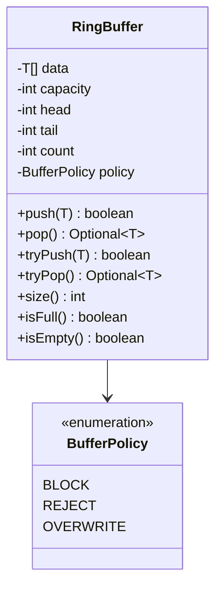

# LLD: Fixed-Size Buffer (Ring Buffer / Producer–Consumer)

> **Focus areas:** Circular buffer · Fixed capacity · Overwrite vs blocking policies · Producer/consumer sync · Lock-free notes · Batch I/O · Edge cases  
> **Style:** LLD interview (clarify → complexity → classes → algorithms/code → concurrency → reliability → progressive scale → wrap-up → Q&A)  
> **Quality bar:** Correct modular arithmetic, clear full/empty distinction, explicit overflow policy, thread-safe variants with happens-before  
> **Interview theme:** Microsoft — systems/LLD hybrid; appears in logging, audio, networking, job queues; progressive scale Baseline → 10× → 100× → 1,000×

---

## Table of Contents

1. [Clarify Requirements (Interview Q&A)](#1-clarify-requirements-interview-qa)
2. [Complexity & Scale](#2-complexity--scale)
3. [Class Diagrams & Responsibilities](#3-class-diagrams--responsibilities)
4. [Key Algorithms & Code Sketches](#4-key-algorithms--code-sketches)
5. [Concurrency & Edge Cases](#5-concurrency--edge-cases)
6. [Persistence & Integration Notes](#6-persistence--integration-notes)
7. [Reliability](#7-reliability)
8. [Scalability](#8-scalability)
9. [Wrap-Up](#9-wrap-up)
10. [Deeper / Related Interview Questions](#10-deeper--related-interview-questions)
11. [Appendices](#11-appendices)

---

## 1. Clarify Requirements (Interview Q&A)

Goal: design a **fixed-size buffer**—typically a **ring (circular) buffer**—that stores up to `N` elements (or bytes) and supports producers and consumers with a well-defined policy when full or empty.

### 1.0 What this is / is not

| Dimension | This | Not |
|-----------|------|-----|
| Job | In-memory fixed capacity buffer + sync | Distributed Kafka HLD |
| Shape | Ring / circular array | Growable `ArrayList` |
| Use cases | IO, audio, metrics, pipelines | General DB |
| Microsoft lens | Correct concurrency, API clarity | Premature MPI |

### 1.1 Clarifying questions

| # | Question | Typical answer | Implication |
|---|----------|----------------|-------------|
| F1 | Element type? | Generic `T` or byte buffer | Template API |
| F2 | Capacity? | Fixed at construct | Power-of-two optional opt |
| F3 | Full policy? | **Block**, **reject**, or **overwrite** oldest | Critical fork |
| F4 | Empty policy? | Block or return empty | Consumer wait |
| F5 | Single vs multi producer? | Start SPSC; discuss MPSC/MPMC | Sync design |
| F6 | Ordering? | FIFO | Ring invariant |
| F7 | Batch ops? | `read(n)` / `write(n)` nice | Wrap handling |
| F8 | Thread wake? | Condition variables / blocking queue | |
| F9 | Metrics? | dropped, high-watermark | Observability |
| F10 | Zero-copy? | Optional slices | Advanced |
| F11 | Persistence? | No MVP | mmap notes later |
| F12 | Contiguous read? | May need two memcpy on wrap | Document |

**MVP scope:**

1. Ring buffer capacity `N`.  
2. `push` / `pop` (or `write` / `read`) FIFO.  
3. Choose and implement **one** full policy (recommend: blocking + optional overwrite mode flag).  
4. Correct full vs empty.  
5. Thread-safe SPSC or mutex MPMC.  
6. Discuss lock-free SPSC.

**Out of MVP:** Kafka, disruptor full mechanical sympathy lecture (mention only), disk-backed journal.

### 1.2 Scope repeat-back

> Fixed-capacity ring buffer with FIFO semantics, explicit full/empty policies (block/reject/overwrite), producer–consumer synchronization, and clear complexity—SPSC first, then multi-threaded variants.

### 1.3 Policy matrix (say aloud)

| Mode | push when full | pop when empty | Typical use |
|------|----------------|----------------|-------------|
| **Blocking** | Wait | Wait | Thread handoff |
| **Reject** | false / exception | false | Non-blocking try |
| **Overwrite** | Advance read idx; drop oldest | — | Telemetry / audio jitter |

---

## 2. Complexity & Scale

### 2.1 Complexity

| Op | Time | Space |
|----|------|-------|
| push one | O(1) | O(capacity) |
| pop one | O(1) | |
| push/pop batch k | O(k) | |
| peek | O(1) | |

### 2.2 Progressive context

| Setting | Capacity | Producers | Notes |
|---------|----------|-----------|-------|
| Audio callback | 2^10–2^14 samples | SPSC | Low latency; overwrite or block carefully |
| Log staging | 64K–1M lines | MPSC | Drop or block under surge |
| Network NIC ring | pages | SPSC/MPSC | Often lock-free |
| App pipeline | 1K–100K tasks | MPMC | `BlockingQueue` equivalent |

### 2.3 Power-of-two capacity

If `capacity = 2^m`, index with `i & (capacity-1)` instead of `%` — micro-opt; correctness first.

---

## 3. Class Diagrams & Responsibilities

### 3.1 Responsibility table

| Class | Responsibility |
|-------|----------------|
| `RingBuffer<T>` | Storage, indices, size/policy |
| `BufferPolicy` | BLOCK / REJECT / OVERWRITE |
| `Producer` | Writes elements (role) |
| `Consumer` | Reads elements (role) |
| `Condition` / mutex | Coordination |
| `BufferStats` | drops, waits, watermarks |

### 3.2 Class diagram



### 3.3 Index convention

Pick one and stick to it:

```text
head = next read index
tail = next write index
count = number of elements  // simplest full/empty

OR (no count, power-of-two + one wasted slot):
  full when (tail+1) % N == head
  empty when head == tail
```

**MVP recommendation:** keep `count` (or `AtomicInteger`) for clarity in interview.

### 3.4 Invariants

```text
I1: 0 <= head, tail < capacity
I2: 0 <= count <= capacity
I3: FIFO order preserved among successful non-overwritten elements
I4: After overwrite push, oldest element discarded exactly once
I5: No reads of uninitialized slots
```

---

## 4. Key Algorithms & Code Sketches

### 4.1 Single-threaded / mutex core

```python
import threading
from collections import deque  # only if allowed; else array

class RingBuffer:
    def __init__(self, capacity: int, policy: str = "block"):
        if capacity <= 0:
            raise ValueError("capacity")
        self.capacity = capacity
        self.buf = [None] * capacity
        self.head = 0
        self.tail = 0
        self.count = 0
        self.policy = policy
        self.lock = threading.Lock()
        self.not_full = threading.Condition(self.lock)
        self.not_empty = threading.Condition(self.lock)
        self.dropped = 0

    def push(self, item, timeout=None) -> bool:
        with self.not_full:
            if self.policy == "reject" and self.count == self.capacity:
                return False
            if self.policy == "overwrite" and self.count == self.capacity:
                # drop oldest
                self.head = (self.head + 1) % self.capacity
                self.count -= 1
                self.dropped += 1
            while self.policy == "block" and self.count == self.capacity:
                if not self.not_full.wait(timeout=timeout):
                    return False
            self.buf[self.tail] = item
            self.tail = (self.tail + 1) % self.capacity
            self.count += 1
            self.not_empty.notify()
            return True

    def pop(self, timeout=None):
        with self.not_empty:
            while self.count == 0:
                if self.policy == "reject":
                    return None
                if not self.not_empty.wait(timeout=timeout):
                    return None
            item = self.buf[self.head]
            self.buf[self.head] = None  # GC help
            self.head = (self.head + 1) % self.capacity
            self.count -= 1
            self.not_full.notify()
            return item
```

### 4.2 Batch write with wrap

```python
def write_bytes(self, src: bytes) -> int:
    """Byte ring; returns bytes written (reject mode may short-write)."""
    n = len(src)
    # assume lock held, enough space checked for block/reject
    first = min(n, self.capacity - self.tail)
    self.buf[self.tail:self.tail + first] = src[:first]
    second = n - first
    if second:
        self.buf[0:second] = src[first:]
    self.tail = (self.tail + n) % self.capacity
    self.count += n
    return n
```

### 4.3 Full vs empty without count (wasted slot)

```text
capacity_logical = N-1 usable
push:
  next = (tail + 1) % N
  if next == head: full
  buf[tail] = x; tail = next
pop:
  if head == tail: empty
  x = buf[head]; head = (head + 1) % N
```

Trade-off: lose one slot; no ambiguous `head==tail`.

### 4.4 SPSC lock-free sketch (interview level)

```text
shared: buf[N], AtomicLong writeIdx, AtomicLong readIdx
producer:
  w = writeIdx
  r = readIdx  // acquire
  if w - r == N: full
  buf[w % N] = item
  writeIdx = w+1  // release
consumer:
  r = readIdx
  w = writeIdx
  if r == w: empty
  item = buf[r % N]
  readIdx = r+1
```

Need proper memory ordering (`volatile` / `Atomic` / C++ barriers). Mention: **one producer thread, one consumer thread only**.

### 4.5 Java `ArrayBlockingQueue` parallel

Say: production code often uses `ArrayBlockingQueue` / `Disruptor`; interview wants you to build the ring.

---

## 5. Concurrency & Edge Cases

### 5.1 Concurrency models

| Model | Sync | Notes |
|-------|------|-------|
| ST | none | Unit logic |
| SPSC lock-free | atomics + ordering | Fast path |
| MPSC | lock or Michael-Scott queue | Multiple producers |
| MPMC | mutex+conditions or LMAX Disruptor | Harder lock-free |

### 5.2 Condition variable pitfalls

- Always `while` (not `if`) around wait — spurious wakeup.  
- `notify` vs `notifyAll`: with single wait predicate per cond, `notify` OK; multiple predicates prefer `notifyAll` or separate conds.  
- Avoid holding locks during slow consumer business logic—pop copy out, process outside.

### 5.3 Edge cases

| Case | Behavior |
|------|----------|
| capacity 1 | Stress full/empty transitions |
| push null | Allow or reject—document |
| overwrite under readers | Consumer may skip; document loss |
| timeout 0 | try semantics |
| interrupt | Propagate / clear policy |
| batch larger than capacity | Reject or write partial—define |
| integer index overflow | Use masking with long counters in lock-free |
| false sharing | Pad atomics in high-perf (advanced) |
| GC of large objects | Null out slots on pop |
| Priority inversion | Not solved by ring alone |

### 5.4 Liveness

- Blocking mode: deadlock if same thread pushes to full and is only consumer.  
- Overwrite mode: consumer starvation if producer floods—monitor `dropped`.

### 5.5 Happens-before (say one sentence)

Consumer must see item writes before seeing updated index—atomic release/acquire or mutex unlock/lock.

---

## 6. Persistence & Integration Notes

### 6.1 Usually ephemeral

Ring buffers are **not** durable queues. On crash, contents lost.

### 6.2 mmap ring (advanced)

Shared-memory ring between processes: same layout + futex; careful with crash recovery (seqlocks).

### 6.3 Integration patterns

```text
[Producer threads] → RingBuffer → [Consumer thread] → DB/Kafka/disk
```

Use ring as **shock absorber**; durable system of record downstream.

### 6.4 Backpressure

Blocking push **is** backpressure. Overwrite **drops**. Reject lets caller apply load shedding.

### 6.5 Observability schema (logical)

```text
buffer_size, capacity, dropped_total, wait_ns_p99, push_rate, pop_rate
```

---

## 7. Reliability

A ring buffer’s reliability story is mostly about **not losing more than the policy allows**, and **never corrupting indices** under concurrency or crash.

### 7.1 Invariants

1. `0 ≤ size ≤ capacity` (count method) **or** empty/full distinguished via wasted slot.  
2. Valid items occupy exactly the logical range `[head, head+size)`.  
3. Push/pop that return success have published a complete element (happens-before).  
4. Overwrite path increments a `dropped`/`overwritten` counter atomically with the write.  
5. Shutdown: no permanent sleep on condvars (poison pill / closed flag).

### 7.2 Races & locking

| Race | Failure | Fix |
|------|---------|-----|
| Push and pop without sync | Torn reads, wrong size | Mutex, or SPSC atomics with correct order |
| Spurious wakeup | Pop empty / push full incorrectly | Always re-check predicate in `while` |
| Notify wrong side | Stuck producers/consumers | `notify`/`signal` the correct cond; broadcast on close |
| SPSC: write index before data | Consumer reads garbage | Store element, then release-store tail |
| MPMC lock-free DIY | Lost updates, ABA | Prefer mutex MVP; cite Disruptor/library if pressed |

**Idempotency:** rings are usually **not** idempotent—pushing twice enqueues twice. For at-least-once producers, put **sequence numbers** in payloads and dedupe downstream, not inside the ring (unless building a specialized dedupe buffer).

### 7.3 Data loss policies (make explicit)

| Policy | On full | Reliability meaning |
|--------|---------|---------------------|
| Block | Wait | No loss; may deadlock if no consumer |
| Reject | Return false | Caller must handle; no silent loss |
| Overwrite | Drop oldest | Bounded loss; **must** metric `overwritten` |
| Drop-newest | Discard push | Protect history; still metric |

Crash of process ⇒ **entire ring lost**. Reliability of the *system* comes from durable sinks (Kafka, disk) after the consumer—not from the ring itself.

### 7.4 Crash recovery

- **In-process:** recreate empty ring; replay from upstream if needed.  
- **mmap / shared-memory ring:** store monotonic sequence per slot; on attach, scan for contiguous valid seq range or reset if corrupt.  
- **Never** treat ring contents as committed business state.

### 7.5 Liveness & shutdown

```text
closed=true → wake all waiters
push after close → reject
pop after close + empty → empty/closed sentinel
Join consumer after poison-pill for clean drain
```

Deadlock classic: producer holds lock A waiting on full; consumer needs A to pop—avoid nested locks; keep critical sections tiny.

---

## 8. Scalability

Fixed-size buffers scale by **role** (shock absorber) and **concurrency model**, not by growing capacity unboundedly.

### 8.1 Progressive scale

| Stage | Context | Design | Implication |
|-------|---------|--------|-------------|
| **Baseline** | Single producer/consumer, teaching / audio callback | Mutex or SPSC array | Correct full/empty; pick policy |
| **10×** | Multi-thread producers, one consumer | MPSC with mutex+cond or per-producer shards → fan-in | Batch pop; metrics on wait/drop |
| **100×** | Service pipeline, many cores | Sharded rings per core / Disruptor-style; or bounded `BlockingQueue` pool | Avoid one global lock; NUMA-aware |
| **1,000×** | Fleet-wide ingest / log staging | Ring is **local only**; durable partitioned log (Kafka/Event Hubs) is the scale plane | Ring capacity stays small; scale partitions & consumers |

### 8.2 Jump cards

**10×:** “Batch `pushN`/`popN` to amortize locking; prefer overwrite+metrics for telemetry spikes.”  
**100×:** “One ring per CPU / connection; aggregate downstream—don’t enlarge one ring to millions.”  
**1,000×:** “Promote to distributed log; keep in-proc rings as NIC-to-thread or thread-to-IO staging only.”

### 8.3 Capacity sizing

```text
capacity ≈ peak_burst_rate × max_acceptable_lag
If overwrite: capacity ≈ window you can afford to lose under burst
If block: capacity trades memory for smoother backpressure
```

### 8.4 Microsoft framing

Appears in **logging pipelines**, **Azure networking** style packet rings, **media/audio**, and job queues inside services. Interview: nail modular arithmetic + policy, then say when you’d graduate to **Event Hubs / Service Bus** instead of a bigger array.

---

## 9. Wrap-Up

### 9.1 Summary

| Piece | Choice |
|-------|--------|
| Structure | Circular array + head/tail (+ count) |
| Policies | Block / reject / overwrite |
| Sync | Mutex+cond MVP; SPSC lock-free discussion |
| Complexity | O(1) element ops |
| Durability | None by default |

### 9.2 30-second pitch

> Fixed array used as a circle: tail writes, head reads, modulo capacity. We distinguish full and empty with a count (or wasted slot). When full we block, reject, or overwrite—product choice. Threads coordinate with conditions or, for SPSC, atomics with clear memory ordering.

### 9.3 Trade-offs

1. Overwrite (lose data) vs block (apply backpressure).  
2. Count field vs wasted slot.  
3. Strict MPMC locks vs approx high-perf rings.  
4. Batch copy vs per-element calls.

---

## 10. Deeper / Related Interview Questions

### 10.1 Correctness

**Q1: How do you distinguish full vs empty?**  
A: Explicit `count`, or waste one slot so `head==tail` means empty and `(tail+1)%n==head` means full.

**Q2: Why is `%` vs mask important?**  
A: Correctness identical if capacity any int; mask only if power-of-two—micro-opt after correctness.

**Q3: Prove no overrun under mutex.**  
A: Push checks `size<cap` under lock before write; pop checks `size>0`; size updated with indices in same critical section.

**Q4: Spurious wakeup bug?**  
A: Use `while (full) wait` not `if`; re-evaluate predicate after wake.

**Q5: Peek vs pop semantics?**  
A: Peek returns front without advancing head; must still synchronize; document empty behavior.

### 10.2 Concurrency & reliability

**Q6: SPSC memory ordering one-liner?**  
A: Producer writes slot then release-stores tail; consumer acquire-loads tail then reads slot.

**Q7: Why is MPMC lock-free hard?**  
A: Multiple producers contend on tail; need CAS loops, ABA hazards; interview MVP stays locked.

**Q8: Overwrite + sequence numbers?**  
A: Embed monotonic seq in each slot; consumer detects gaps ⇒ drops occurred.

**Q9: Idempotent producers into a ring?**  
A: Ring itself isn’t; dedupe by message id **after** pop, or use a set with TTL upstream.

**Q10: Crash of consumer mid-batch?**  
A: Ring may still hold items; if process dies, lost. Durable handoff requires ack after sink write.

### 10.3 Scale & systems

**Q11: Why not unbounded queue?**  
A: Unbounded hides backpressure until OOM; fixed-size forces policy.

**Q12: Kafka vs ring?**  
A: Kafka is durable, multi-consumer, replayable; ring is ephemeral, local, O(1) staging.

**Q13: 10× producers?**  
A: Shard rings or single MPSC with batching; measure lock hold time.

**Q14: 100× / 1,000×?**  
A: Don’t mega-size one buffer—partition pipelines; distributed log at fleet scale.

**Q15: LMAX Disruptor idea?**  
A: Preallocated ring + sequence barriers; mechanical sympathy; mention, don’t reimplement fully.

**Q16: Audio underrun strategy?**  
A: Prefer overwrite oldest or insert silence; never block real-time thread unboundedly.

**Q17: Shared-memory IPC ring?**  
A: mmap + futex; sequence validation on attach; treat crash as reset or rebuild.

**Q18: Fuzz / stress tests?**  
A: Random push/pop ratios; capacity 1/2; close mid-wait; assert size bounds and no duplicate pops.

### 10.4 Microsoft-flavored

**Q19: Where in a Microsoft stack?**  
A: Staging before Event Hubs / Service Bus; in-proc channels inside Azure services; media pipelines.

**Q20: What do you code first on the board?**  
A: Single-thread ring with count + overwrite/block → add mutex/cond → discuss SPSC atomics → scale-out story.

---

## 11. Appendices

### 11.1 API contract

```text
RingBuffer<T>(capacity, policy)
push(item) -> bool
tryPush(item) -> bool
pop() -> Optional<T>
tryPop() -> Optional<T>
peek() -> Optional<T>
size() / capacity() / clear()
```

### 11.2 State diagram

```text
EMPTY --push--> PARTIAL --push--> FULL
FULL --pop--> PARTIAL --pop--> EMPTY
FULL --overwrite push--> FULL (head advances)
```

### 11.3 Trace (capacity 3, block)

```text
push A B C → full
push D blocks
pop A → consumer gets A; producer unblocks; buffer B C D
```

### 11.4 Trace (overwrite)

```text
push A B C → full
push D → drop A; buffer B C D; dropped=1
pop → B
```

### 11.5 Power-of-two mask

```java
int idx = (int) (seq & mask); // mask = capacity - 1
```

### 11.6 Producer/consumer threads sketch

```python
def producer(buf):
    for i in range(1000):
        buf.push(i)

def consumer(buf, out):
    for _ in range(1000):
        out.append(buf.pop())
```

### 11.7 Comparison table

| Structure | Bounded | FIFO | Concurrency |
|-----------|---------|------|-------------|
| RingBuffer | Yes | Yes | DIY |
| ArrayBlockingQueue | Yes | Yes | Built-in |
| LinkedBlockingQueue | Optional | Yes | Linked nodes |
| Disruptor | Yes | Yes | Sequences |

### 11.8 Interview board order

1. Policy  
2. Draw array + head/tail  
3. Full/empty  
4. Code push/pop  
5. Threads  
6. Lock-free SPSC mention  

### 11.9 Memory layout

```text
| 0 | 1 | 2 | 3 | 4 | 5 | 6 | 7 |
          ^head      ^tail
count = 3
```

### 11.10 Related prompts

- LRU cache (bounded structure sibling)  
- Message queue HLD  
- Logging system  
- Rate limiter  

### 11.11 Dropped-sample algebra

```text
offer_rate > consume_rate for duration T
drops ≈ (offer - consume) * T   (overwrite mode)
```

### 11.12 Unit test ideas

- Fill then reject  
- Wrap indices 1000× capacity  
- Concurrent sum correctness  
- Timeout returns  

### 11.13 Clear() semantics

Under lock: head=tail=0; count=0; null slots; notify producers.

### 11.14 Peek vs pop

Peek returns head without advance; race if concurrent pop—document single consumer or lock.

### 11.15 Final signal

Correct modular indexing + explicit overflow policy + sound waiting beats buzzword lock-free claims.

### 11.16 Worked interview dialogue (condensed)

**Interviewer:** Design a fixed-size buffer for a metrics agent.

**You:** Ring of capacity N. Producers `tryPush` samples; if full we **overwrite** oldest because metrics prefer freshness over blocking the app. Consumer thread batches `pop` up to K into an HTTP flush. Expose `dropped` counter for SLO burn.

**Interviewer:** Make it multi-producer.

**You:** Add a mutex around push/pop, or shard into N SPSC rings by `hash(metric_name) % N` to reduce contention—accept per-shard ordering only.

**Interviewer:** Can we go lock-free MPMC?

**You:** Possible but error-prone; for an interview I’d ship mutex MPMC and cite Disruptor/JCTools for production. SPSC lock-free with atomics is the depth I’ll code live.

### 11.17 Sequence diagram (blocking)

```text
Producer                RingBuffer                 Consumer
   |                       |                          |
   | push(x)               |                          |
   |---- lock ------------>|                          |
   |    wait if full       |                          |
   |    write slot         |                          |
   |    notify not_empty   |                          |
   |<--- unlock -----------|                          |
   |                       |<---- pop() --------------|
   |                       | wait if empty            |
   |                       | read slot / notify       |
   |                       |---- item --------------->|
```

### 11.18 Overwrite vs block decision tree

```text
Is data loss acceptable?
  yes → overwrite (telemetry, audio jitter buffer with concealment)
  no  → Can producer block?
          yes → blocking (worker pools, pipeline stages)
          no  → reject + caller load-shed / retry / spill to disk
```

### 11.19 Byte-buffer API (I/O flavor)

```text
class ByteRing:
  capacity: int  # bytes
  write(src: bytes) -> int   # may short-write in reject mode
  read(dst: bytearray) -> int
  readable() -> int
  writable() -> int
```

Use in netty-like pipelines: socket → byte ring → frame decoder.

### 11.20 Frame decoder integration

```text
while readable() >= 4:
  len = peek_i32()
  if readable() < 4+len: break
  skip(4); frame = read_exact(len); dispatch(frame)
```

Ring must support **peek** without consume for length-prefix protocols.

### 11.21 Poison-pill shutdown

```text
producer done → push SENTINEL
consumer pops SENTINEL → exit loop
OR: separate closed flag + notifyAll
```

Avoid infinite block on empty after shutdown.

### 11.22 Comparison to `queue.Queue` / `BlockingQueue`

| Feature | Hand-rolled ring | std BlockingQueue |
|---------|------------------|-------------------|
| Bounded | Yes | Optional |
| Overwrite | DIY | Usually no |
| Batch / zero-copy | DIY | Limited |
| Interview value | High | Mention as prod default |

### 11.23 Formal full/empty table (`count` method)

| count | empty? | full? |
|------:|:------:|:-----:|
| 0 | Y | N |
| 1..N-1 | N | N |
| N | N | Y |

### 11.24 Common off-by-one bugs

1. Using `tail == head` for both full and empty.  
2. Advancing `tail` before writing slot (consumer sees garbage).  
3. `notify` without releasing consistent state.  
4. Waiting on wrong condition variable.  
5. Forgetting `% capacity` on one path only.

### 11.25 Perf checklist (if they ask “make it faster”)

- [ ] Power-of-two capacity + mask  
- [ ] Batch push/pop  
- [ ] SPSC lock-free  
- [ ] False-sharing padding on indices  
- [ ] Preallocate objects / flyweight events  
- [ ] Avoid touching slots with large object graphs on overwrite (null carefully)

### 11.26 Minimal C-like layout (systems flavor)

```c
struct ring {
  void **slots;
  size_t cap;
  size_t head, tail, count;
  mtx_t lock;
  cnd_t not_full, not_empty;
};
```

Same invariants as the Python sketch.

### 11.27 When *not* to use a ring

- Need persistence / multi-consumer durable log → Kafka.  
- Need priority ordering → heap / priority queue.  
- Need unbounded burst with disk spill → staged queue.  
- Need broadcast to many consumers → bus / disruptor multicast sequences.

---

*End of fixed-size buffer LLD.*
