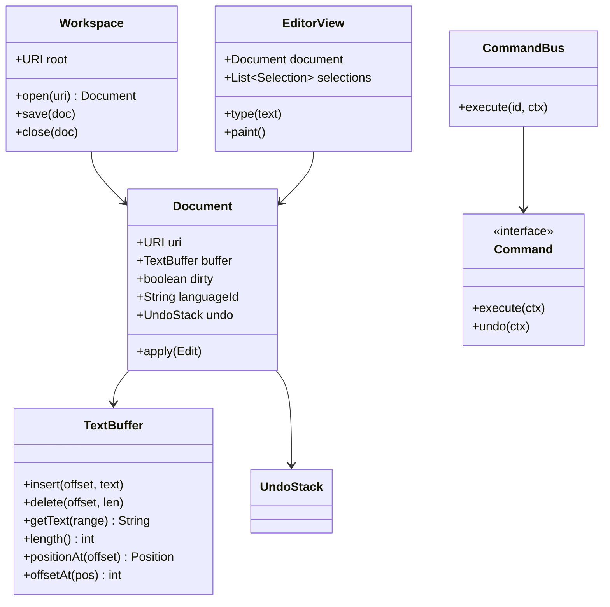

# LLD: IDE / Editor Class Model

> **Focus areas:** Document buffer · Cursors/selections · Workspace/project · Editors & panes · Commands · Extensions hooks · Undo/redo · Syntax/diagnostics ports · Concurrency  
> **Style:** LLD / OOD (clarify → scale → classes → algorithms → concurrency → reliability → progressive scale → wrap-up → Q&A)  
> **Quality bar:** Clear separation of buffer vs view vs workspace, undo as command pattern, extensibility without God-object `IDE`  
> **Interview theme:** Microsoft — Visual Studio / VS Code flavored; object model over full collaborative OT/CRDT HLD; Baseline → 10× → 100× → 1,000×

---

## Table of Contents

1. [Clarify Requirements (Interview Q&A)](#1-clarify-requirements-interview-qa)
2. [Complexity & Scale](#2-complexity--scale)
3. [Class Diagrams & Responsibilities](#3-class-diagrams--responsibilities)
4. [Key Algorithms & Code Sketches](#4-key-algorithms--code-sketches)
5. [Concurrency & Edge Cases](#5-concurrency--edge-cases)
6. [Persistence & Workspace Schema](#6-persistence--workspace-schema)
7. [Reliability](#7-reliability)
8. [Scalability](#8-scalability)
9. [Wrap-Up](#9-wrap-up)
10. [Deeper / Related Interview Questions](#10-deeper--related-interview-questions)
11. [Appendices](#11-appendices)

---

## 1. Clarify Requirements (Interview Q&A)

Goal: design the **core object model** of an IDE/editor: open files as editable documents, show them in editors with cursors, organize a workspace/project, run commands (edit, save, undo), and hook language features (diagnostics, completion) via ports.

### 1.0 What this is / is not

| Dimension | This | Not |
|-----------|------|-----|
| Job | Class model for editor/IDE shell | Full LSP protocol HLD |
| Editing | Single-user buffer + undo | Google Docs OT (Phase 2 note) |
| UI | Logical view/pane model | Pixel rendering engine |
| Microsoft lens | VS/VS Code concepts; extensibility | Eclipse plugin archaeology |

### 1.1 Clarifying questions

| # | Question | Typical answer | Implication |
|---|----------|----------------|-------------|
| F1 | Single file or project? | Workspace with many files | `Workspace` + `Document` |
| F2 | Multiple editors same file? | Yes — shared document | Document 1—\* EditorView |
| F3 | Undo? | Per-document stack | Command pattern |
| F4 | Multi-cursor? | Nice-to-have | Selection model |
| F5 | Tabs/splits? | Tab groups + split panes | `EditorGroup` |
| F6 | Language features? | Diagnostics + complete via port | LSP-like interface |
| F7 | Terminal/debug? | Stubs / out of deep MVP | Ports |
| F8 | Extensions? | Command + contribution points | Plugin API |
| F9 | Autosave? | Optional | Dirty flag + timer |
| F10 | Large files? | Mention piece table / rope | Buffer impl strategy |
| F11 | Collaborative? | Out of MVP | CRDT hook |
| F12 | VCS? | Status decoration port | Git port |

**MVP scope:**

1. `Workspace` opens folder; tracks documents.  
2. `Document` / `TextBuffer` with insert/delete.  
3. `EditorView` with cursor/selection bound to a document.  
4. `Command` + `CommandBus` (type, save, undo, redo).  
5. Dirty tracking + save to `FileSystemPort`.  
6. `DiagnosticService` port.  
7. Simple extension registry.

**Out of MVP:** full debug adapter protocol, remote SSH host, merge editor deep dive.

### 1.2 Scope repeat-back

> IDE object model: workspace-owned documents with efficient text buffers, multiple views/cursors, command-based edits with undo/redo, and language/extension ports—without implementing a full render pipeline or collaborative CRDT in MVP.

---

## 2. Complexity & Scale

### 2.1 Editing complexity

| Buffer structure | Index | Insert/delete | Notes |
|------------------|-------|---------------|-------|
| Gap buffer | O(1) near gap | Amortized good for cursor | Classic editors |
| Piece table | O(log) / O(pieces) | Great for undo | VS Code heritage |
| Rope | O(log n) | Balanced | Large texts |
| Plain string | O(n) | Interview OK for small | Say limits |

### 2.2 Scale

| Artifact | Order | Implication |
|----------|-------|-------------|
| Open documents | 10–100 | Fine in memory |
| File size | KB–10MB MVP; 100MB+ special | Virtualize UI |
| Extensions | 10–100 | Sandbox/activation events |
| Diagnostics | thousands markers | Interval tree / line index |

---

## 3. Class Diagrams & Responsibilities

### 3.1 Responsibility table

| Class | Responsibility |
|-------|----------------|
| `IDEApp` | Composition root; lifecycle |
| `Workspace` | Root folder, open docs, config |
| `Document` | Identity (URI), buffer, dirty, languageId |
| `TextBuffer` | Sequence of characters; edit API |
| `Edit` / `TextEdit` | Range + new text |
| `EditorView` | Projection: cursor, scroll, selections |
| `Selection` | Anchor + active positions |
| `Position` / `Range` | Line/column or offset |
| `EditorGroup` | Tabs / split cell |
| `WorkbenchLayout` | Groups arrangement |
| `Command` | Executable unit |
| `CommandRegistry` / `KeybindingMap` | Dispatch |
| `UndoStack` | Per-document history |
| `FileSystemPort` | read/write/watch |
| `LanguageServicePort` | complete, hover, diagnose |
| `Extension` | Activate; contribute commands |
| `Diagnostic` | Severity, range, message |
| `StatusBar` / `Panel` | UI chrome (light) |

### 3.2 Class diagram



### 3.3 Position model

```text
Position(line: int, character: int)  // 0-based
Range(start: Position, end: Position)
Offset: absolute index in normalized UTF-16 or UTF-8 — pick one & say it
```

VS Code uses UTF-16 code units—mention awareness of surrogate pairs if time.

### 3.4 Invariants

```text
I1: All EditorViews of same URI share one Document instance in a Workspace
I2: After apply(edit), dirty=true until save/clear
I3: Undo stack top inverse restores prior buffer (+ selections optional)
I4: Selection ranges always normalized start <= end (or anchor/active model)
I5: Closed document detaches views
I6: Offsets in [0, length]
```

---

## 4. Key Algorithms & Code Sketches

### 4.1 Gap buffer (teaching implementation)

```python
class GapBuffer:
    def __init__(self, text=""):
        self.buf = list(text) + [None] * 64
        self.gap_start = len(text)
        self.gap_end = len(self.buf)

    def _gap_size(self):
        return self.gap_end - self.gap_start

    def _move_gap(self, offset):
        # move gap so gap_start == offset
        if offset < self.gap_start:
            # move chars [offset, gap_start) to before gap_end
            n = self.gap_start - offset
            self.buf[self.gap_end - n:self.gap_end] = self.buf[offset:self.gap_start]
            self.gap_end -= n
            self.gap_start = offset
        elif offset > self.gap_start:
            n = offset - self.gap_start
            self.buf[self.gap_start:self.gap_start + n] = self.buf[self.gap_end:self.gap_end + n]
            self.gap_start += n
            self.gap_end += n

    def insert(self, offset, text: str):
        self._move_gap(offset)
        for ch in text:
            if self._gap_size() == 0:
                self._expand()
            self.buf[self.gap_start] = ch
            self.gap_start += 1

    def delete(self, offset, length: int):
        self._move_gap(offset)
        self.gap_end = min(len(self.buf), self.gap_end + length)

    def get_text(self) -> str:
        return "".join(ch for ch in self.buf if ch is not None)
```

### 4.2 Piece table sketch

```text
original: immutable string (file on open)
add: append-only string of inserts
pieces: linked list/array of {source: orig|add, start, len}
edit = split pieces + insert new piece
undo = restore previous piece table pointer (persistent version)
```

### 4.3 Apply edit + undo

```python
@dataclass
class TextEdit:
    offset: int
    length: int      # delete length
    text: str        # insert

class Document:
    def apply(self, edit: TextEdit, *, record_undo=True):
        deleted = self.buffer.get_text_offset(edit.offset, edit.length)
        self.buffer.delete(edit.offset, edit.length)
        self.buffer.insert(edit.offset, edit.text)
        self.dirty = True
        inverse = TextEdit(edit.offset, len(edit.text), deleted)
        if record_undo:
            self.undo.push(edit, inverse)
        self.events.publish(DocChanged(self.uri, edit))
        return inverse

    def undo(self):
        edit, inverse = self.undo.pop()
        self.apply(inverse, record_undo=False)
        self.undo.push_redo(edit)

    def redo(self):
        edit = self.undo.pop_redo()
        self.apply(edit, record_undo=True)
```

### 4.4 Typing through view

```python
class EditorView:
    def type_text(self, text: str):
        # multi-cursor: apply from bottom to top to keep offsets stable
        sels = sorted(self.selections, key=lambda s: -s.active_offset)
        for sel in sels:
            start, end = sel.normalized_offsets(self.document)
            self.document.apply(TextEdit(start, end - start, text))
            # update selection to caret after insert — via DocChanged mapper
```

### 4.5 Command pattern

```python
class TypeCommand:
    def __init__(self, view, text):
        self.view = view
        self.text = text
    def execute(self, ctx):
        self.view.type_text(self.text)

class SaveCommand:
    def execute(self, ctx):
        doc = ctx.active_document()
        ctx.workspace.save(doc)

class CommandBus:
    def __init__(self):
        self.registry = {}
    def register(self, id, factory):
        self.registry[id] = factory
    def execute(self, id, ctx):
        cmd = self.registry[id](ctx)
        cmd.execute(ctx)
```

### 4.6 Layout model

```text
Workbench
  └── EditorGroupContainer (splits tree: HSplit | VSplit | Leaf)
        └── EditorGroup (tabs)
              └── EditorView (active)
```

### 4.7 Diagnostics update

```python
class DiagnosticService:
    def on_doc_changed(self, ev):
        # debounce
        diags = self.language.diagnose(ev.uri, ev.document.get_text())
        self.model.set(ev.uri, diags)  # EditorViews observe
```

### 4.8 Extension activation

```python
class ExtensionHost:
    def activate(self, ext: Extension, ctx):
        for cmd in ext.contributes.commands:
            self.commands.register(cmd.id, cmd.handler)
        ext.activate(ctx)
```

---

## 5. Concurrency & Edge Cases

### 5.1 Threading model (typical)

```text
UI thread: edits, layout, commands
Background: FS watch, git status, language server RPC
Rule: buffer mutations only on UI/single editor thread; apply LS edits via marshaled commands
```

### 5.2 Edge cases

| Case | Behavior |
|------|----------|
| External file change while dirty | Prompt: reload / keep / diff |
| Undo after save | Still allowed; dirty may become true again |
| Close dirty tab | Prompt save |
| Same file two workspaces | Separate docs or shared—define |
| Huge paste | Chunk / async; disable UI freeze |
| Invalid UTF-8 | Replacement char policy |
| Selection inverted drag | anchor/active distinct |
| Language server crash | Restart; stale diagnostics clear |
| Extension throws | Isolate; disable contribution |
| Line ending CRLF/LF | Normalize on load; preserve policy |
| Atomic save | Write temp + rename |

### 5.3 Mapping selections across edits

When buffer changes, transform ranges:

```text
if edit entirely after range: unchanged
if edit entirely before: shift by delta
if overlap: collapse/coalesce policy
```

Critical for multi-cursor and diagnostics survival.

### 5.4 Reentrancy

`on_doc_changed` handlers must not synchronously re-enter unbounded edits—debounce LS.

---

## 6. Persistence & Workspace Schema

### 6.1 Files on disk

Documents persist via `FileSystemPort.write(uri, bytes)`.

### 6.2 Workspace state (JSON sketch)

```json
{
  "root": "file:///project",
  "openEditors": [
    {"uri": "file:///project/a.ts", "group": 0, "selections": [{"line": 10, "ch": 4}]}
  ],
  "layout": {"type": "vsplit", "children": [...]},
  "extensions": {"enabled": ["ms-python.python"]}
}
```

Store in `.vscode`-like or user data dir—not in git necessarily.

### 6.3 Logical tables (if indexed DB)

```sql
documents(uri PK, language_id, encoding, last_opened_at)
breakpoints(id, uri, line, enabled)  -- debugger stub
workspace_folders(uri PK)
```

### 6.4 Untitled buffers

`untitled:1` URIs; save-as assigns file URI.

---

## 7. Reliability

Editor reliability is **not losing user text**, keeping **undo coherent**, and surviving **extension/LSP crashes** without taking down the shell.

### 7.1 Invariants

1. Every mutation goes through `Document.apply` / `CommandBus`—no silent buffer writes from views.  
2. Undo stack matches applied edit history (compound edits atomic).  
3. Selections always clamped to valid offsets after edits.  
4. Dirty flag true iff buffer ≠ last saved snapshot (or version).  
5. Document version monotonically increases on each successful apply.

### 7.2 Races & locking

| Race | Symptom | Mitigation |
|------|---------|------------|
| UI thread + LSP edits | Corrupt buffer | Single writer: UI owns buffer; LSP suggests only |
| Dual views typing same doc | Interleaved edits OK if serialized | Serialize applies on doc lock / UI queue |
| Save vs type | Partial file on disk | Write temp + atomic rename; version check |
| External file change vs dirty | Silent overwrite | Detect mtime/etag; prompt reload/merge |
| Extension host crash mid-command | Partial UI update | Commands transactional; host restartable |

**Idempotency:** Replaying the same `TextEdit` at an old version must fail version check—not double-apply. Collaborative ops use transform (OT) or CRDT ids—mention as extension, don’t build in MVP.

### 7.3 Data loss prevention

| Risk | Mitigation |
|------|------------|
| Process kill | Hot exit / backup scratch files every N seconds |
| Failed save | Keep dirty; show error; don’t clear undo |
| Disk full | Atomic rename never swaps incomplete file |
| Undo stack truncated | Soft limit with warning; never drop without policy |
| Extension corrupts API misuse | Validate edits; sandbox; kill runaway host |

### 7.4 Crash recovery

```text
On startup: scan backup dir for unsaved untitled_* / dirty uri snapshots
Offer restore; compare to disk mtime
Workspace JSON restores open editors + selections (best effort)
LSP/extension host: crash → restart; documents untouched in main process
```

### 7.5 Microsoft framing

VS Code’s **extension host process isolation**, **hot exit**, and **piece table** history are the gold references. In interview: show class boundaries that make those reliability properties *possible*.

---

## 8. Scalability

Scale here means **larger files, more extensions, remote/multi-root**—not “shard the gap buffer across regions” unless collaboration is in scope.

### 8.1 Progressive scale

| Stage | Workload | Design | Implication |
|-------|----------|--------|-------------|
| **Baseline** | Small project, few docs, gap buffer | Document/View/Command | Clean OOP; undo; selections |
| **10×** | Large files (10–50MB), many tabs | Piece table / rope; virtualized view | Don’t layout all lines; lazy tokenization |
| **100×** | Big monorepo, 100+ extensions | Activation events; ExtensionHost process; multi-root | Isolate CPU; index outside UI thread |
| **1,000×** | Remote / Codespaces-class / collaborative | UI local, FS+language remote; OT/CRDT session | Same Document API; transport + authority change |

### 8.2 Jump cards

**10×:** “Virtualize rendering; piece table; incremental lexer; don’t String concatenate whole file.”  
**100×:** “Extension host + worker indexing; multi-root workspace folders; search via index not brute UI thread.”  
**1,000×:** “Remote agent owns file + LSP; local UI streams; collab is a separate consistency protocol.”

### 8.3 Hot paths

- Typing p99: apply edit + paint visible lines only.  
- Open large file: mmap / chunked load; defer full tokenize.  
- Workspace search: ripgrep-like process, not document loop on UI thread.

### 8.4 What not to do

Grow one in-memory `string` for 1GB logs; run all extensions in-process; block UI on `git status` of huge repos.

---

## 9. Wrap-Up

### 9.1 Summary

| Piece | Choice |
|-------|--------|
| Text | Document + TextBuffer (gap/piece table) |
| View | EditorView with selections |
| Structure | Workspace → Groups → Views |
| Mutations | Commands + per-doc undo |
| Extensibility | Ports + ExtensionHost |
| Language | Async diagnostic/complete ports |

### 9.2 30-second pitch

> A workspace owns documents; each document wraps a text buffer and undo stack. Multiple editor views can share one document but keep their own selections. All edits go through commands so undo/redo and keybindings stay consistent. Language intelligence and SCM hang off ports so the core doesn’t hardcode Python or Git.

### 9.3 Trade-offs

1. Gap buffer vs piece table vs rope.  
2. UTF-16 vs UTF-8 offsets.  
3. Single UI thread vs free-threaded buffer (hard).  
4. Monolithic IDE vs micro-extension host process (VS Code model).

---

## 10. Deeper / Related Interview Questions

### 10.1 Buffer & editing

**Q1: Gap buffer vs piece table?**  
A: Gap is great near cursor; piece table shines for undo/large inserts and VS Code lineage; rope for huge balanced edits.

**Q2: Why commands instead of `buffer.insert` from everywhere?**  
A: Single pipeline for undo, telemetry, keybindings, permissions, and macros.

**Q3: Map selections across an edit?**  
A: Adjust offsets by edit delta; clamp; multi-cursor apply high→low offsets.

**Q4: Compound undo?**  
A: `beginCompound`/`endCompound` groups multiple TextEdits as one undo frame (snippet insert).

**Q5: Offset vs (line, column)?**  
A: Store buffer as offsets; derive line/col via line index; beware CRLF and UTF-16.

### 10.2 Reliability

**Q6: Atomic save?**  
A: Write temp beside target → fsync → rename over; update saved version only after success.

**Q7: External change while dirty?**  
A: Compare etag/mtime on focus; prompt: reload / keep / diff.

**Q8: Extension host crash?**  
A: Main process keeps documents; restart host; re-activate extensions; show notification.

**Q9: Hot exit?**  
A: Periodically snapshot dirty buffers to user-data backup; restore on relaunch.

**Q10: Version check on apply?**  
A: Each edit carries base version; mismatch → reject/retry transform (collab) or ignore stale LSP edit.

### 10.3 Scale

**Q11: 100k-line file rendering?**  
A: Virtualize viewport; compute layout for visible range; cache line starts.

**Q12: 10× extensions?**  
A: Activation events (`onLanguage:python`); don’t load all at startup.

**Q13: 100× monorepo search?**  
A: External search process + excludes; never scan on UI thread.

**Q14: 1,000× remote/collab?**  
A: Document API stays; add transport, file watcher relay, OT/CRDT—separate design chapter.

**Q15: Multi-root workspaces?**  
A: `Workspace` holds multiple `WorkspaceFolder`s; relative paths scoped per folder.

### 10.4 Microsoft-flavored

**Q16: LSP message flow?**  
A: Editor → ExtensionHost → Language Server; diagnostics async onto `Document` markers.

**Q17: DAP?**  
A: Debug session port; breakpoints table; unrelated to text buffer core.

**Q18: VS Code mental map?**  
A: `TextDocument` ≈ Document; `TextEditor` ≈ View; `commands` ≈ CommandBus; `Extension Host` ≈ process isolation.

**Q19: Notebook model?**  
A: Document as sequence of cells each with own buffer/output—compose, don’t fork whole IDE.

**Q20: Board order?**  
A: Document/buffer → apply+undo → View/selection → Workspace/commands → ports → reliability/scale.

---

## 11. Appendices

### 11.1 Core APIs

```text
Workspace.open(uri) -> Document
Document.apply(TextEdit)
EditorView.set_selections([...])
CommandBus.execute("editor.action.formatDocument")
FileSystemPort.read/write/watch
LanguageServicePort.complete(uri, pos) -> [CompletionItem]
```

### 11.2 Event bus

```text
DocChanged, DocSaved, DocClosed, SelectionChanged, DiagsChanged, ExtensionActivated
```

### 11.3 Dirty / save state machine

```text
Clean --edit--> Dirty --save--> Clean
Dirty --revert--> Clean
```

### 11.4 Keybinding resolve

```text
Keychord → when-clause context (editorFocus && !suggestWidgetVisible) → command id
```

### 11.5 Completion flow

```text
type → debounce → LS.complete → suggest widget model → accept → TextEdit insert
```

### 11.6 Interview board order

1. Document vs View  
2. Buffer choice  
3. Undo commands  
4. Workspace/layout  
5. Extension/LSP ports  
6. External change edge case  

### 11.7 Related Microsoft prompts

- Visual Studio IDE HLD  
- File system classes  
- Chat/Copilot prompts (AI feature port)  

### 11.8 Minimal rope note

Binary tree of strings; split/concat O(log n); rebalance.

### 11.9 Multi-cursor offset trick

Apply edits from highest offset to lowest so earlier positions stay valid.

### 11.10 Testing ideas

- Undo/redo roundtrip random edits  
- Selection mapping fuzz  
- CRLF normalization  
- Dirty prompt on close  

### 11.11 Memory

```text
Piece table: O(original + adds + pieces)
Avoid duplicating full string per keystroke
```

### 11.12 Terminal stub

```text
class Terminal { id, cwd, write(data), onData }
Panel shows terminals — out of edit core
```

### 11.13 Settings cascade

```text
Default < User < Workspace < Folder < Language-override
```

### 11.14 Code sample: offset↔position

```python
def offset_at(buffer, pos: Position) -> int:
    # scan lines; cache line starts index for O(log) later
    ...

def position_at(buffer, offset: int) -> Position:
    ...
```

Line-start cache invalidated on edit—incremental update.

### 11.15 Final signal

Separate **Document (model)** from **EditorView (view/state)** and route mutations through **commands/undo**—that’s the IDE LLD spine interviewers want.

### 11.16 Worked interview dialogue (condensed)

**Interviewer:** Model Visual Studio / VS Code internals at class level.

**You:** Workspace owns Documents keyed by URI. Document owns TextBuffer + UndoStack + dirty bit. EditorViews are cheap projections (selections, scroll) onto documents—two tabs can share one Document. Commands mutate via Document.apply so undo works. LSP is a port behind LanguageServicePort; the core never imports a Python parser.

**Interviewer:** How do you handle a 200MB log file?

**You:** Don’t load full string into a naive buffer if avoidable; piece table / mmap chunks; UI virtualizes lines; disable expensive features (word wrap, some linters) via “large file mode.”

**Interviewer:** Undo after format-document?

**You:** Formatter produces a list of TextEdits; wrap as one CompoundEdit on the undo stack so one Ctrl+Z restores all.

### 11.17 Compound edits

```python
@dataclass
class CompoundEdit:
    edits: list[TextEdit]  # already ordered high→low or apply sequentially with mapping

class Document:
    def apply_compound(self, compound: CompoundEdit):
        inverses = []
        for e in compound.edits:
            inv = self.apply(e, record_undo=False)
            inverses.append(inv)
        self.undo.push_compound(compound, CompoundEdit(list(reversed(inverses))))
```

### 11.18 Find in file (incremental)

```text
SearchSession { query, caseSensitive, regex? }
next(): start from caret offset → scan buffer → select match
replace/replace_all → TextEdits + compound undo
```

Workspace search: parallel FS walk + ignore rules (`.gitignore`); results are `Location[]` not live buffers until opened.

### 11.19 Folding & decorations (view layer)

```text
Decoration { range, className, hoverMessage }
FoldingRange { startLine, endLine }
```

Computed by providers; **not** stored in TextBuffer. Invalidate on DocChanged via range mapping.

### 11.20 Untitled → Save As

```text
Document.uri = untitled:1
SaveAsCommand → pick path → FileSystemPort.write → uri = file:///...
Update Workspace maps; preserve undo stack (same Document identity)
```

### 11.21 Conflict with external change (detail)

```text
FS watcher mtime/etag change
  if !dirty → auto reload (or silent if unchanged hash)
  if dirty → modal: Keep / Overwrite / Diff
Keep: ignore disk; Overwrite: reload buffer, clear undo optional policy
```

### 11.22 Language id detection

```text
by extension → by shebang → by user override → plaintext
languageId drives: grammar, LS selector, settings overrides
```

### 11.23 Suggest widget model

```text
SuggestModel {
  items: CompletionItem[]
  selected: int
  accept() -> TextEdit at cursor
  filter(prefix) // client-side refine
}
```

### 11.24 Split / merge editor groups

```text
split(group, direction):
  create new EditorGroup; clone EditorView state (same Document)
merge:
  move tabs; dispose empty group; relayout tree
```

### 11.25 Why CommandBus beats “random methods on IDE”

- Keybindings, menus, palette, extensions all invoke same ids.  
- Telemetry: log command id.  
- when-clauses enable/disable.  
- Testing: execute commands headlessly.

### 11.26 Minimal sequence: user types ‘a’

```text
Keybinding → TypeCommand
  → EditorView.type_text("a")
    → Document.apply(TextEdit(caret, 0, "a"))
      → TextBuffer.insert
      → UndoStack.push
      → emit DocChanged
        → EditorView update caret
        → DiagnosticService debounce
        → Decorations remap
```

### 11.27 Collaborative hook (say, don’t build)

```text
Document.remoteAdapter: applies remote ops as TextEdits with record_undo=false
Presence: peer selections as decorations
OT/CRDT lives under adapter — core still Document/View
```

### 11.28 Comparison table: buffer structures

| Structure | Best for | Weakness |
|-----------|----------|----------|
| String concat | Toy demos | O(n²) typing |
| Gap buffer | Local typing | Poor random distant edits |
| Piece table | Undo + large paste | Many tiny pieces → compact |
| Rope | Huge texts | Implementation complexity |

### 11.29 VS Code mental mapping (impress interviewer)

| Our class | VS Code analogue |
|-----------|------------------|
| Workspace | Workspace |
| Document | TextModel |
| EditorView | TextEditor / code editor |
| CommandBus | commands API |
| ExtensionHost | extension host process |
| LanguageServicePort | LSP client |

### 11.30 Anti-patterns

- God object `IDE` with 200 methods.  
- Each tab owns a private string copy of the same file.  
- Undo implemented as full-buffer snapshots every keystroke.  
- Running LS directly on UI thread.  
- Mixing CRLF conversion into every insert without a policy object.

---

*End of IDE / editor class model LLD.*
