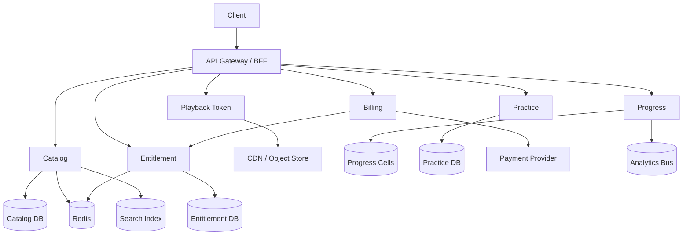

# System Design: Khan Academy / Byju’s–Style Content Platform (Paid + Free)

> **Focus areas:** Course catalog · Free vs paid entitlements · Video/CDN delivery · Progress tracking · Adaptive practice · Payments/subscriptions · Search · Offline/mobile · Abuse & DRM-lite  
> **Style:** End-to-end product HLD with progressive scale (10× → 100× → 1,000×)  
> **Differentiation:** EdTech content + learning loop — **not** generic Netflix (no binge recommendation as the core), **not** pure LMS admin tooling  
> **Quality bar:** Clear entitlement gates, durable progress, split read/write planes, correct money/subscription states, CDN + signed URLs, interview-ready trade-offs  
> **Interview theme:** Microsoft — product + platform thinking; multi-tenant content cells; security/compliance for minors; clean APIs

---

## Table of Contents

1. [Clarify Requirements (Interview Q&A)](#1-clarify-requirements-interview-qa)
2. [Back-of-the-Envelope Estimation](#2-back-of-the-envelope-estimation)
3. [High-Level Design](#3-high-level-design)
4. [Architecture Diagram](#4-architecture-diagram)
5. [Design Deep Dive](#5-design-deep-dive)
6. [Wrap-Up](#6-wrap-up)
7. [Deeper / Related Interview Questions](#7-deeper--related-interview-questions)
8. [Appendices](#8-appendices)

---

## 1. Clarify Requirements (Interview Q&A)

Goal: design a **Khan Academy / Byju’s–style learning platform** where learners consume **free and paid** courses (video, articles, exercises), track progress, practice adaptively, and optionally subscribe—correct under global CDN scale and entitlement rules.

### 1.0 What this is / is not

| Dimension | **This doc** | **Not this** |
|-----------|--------------|--------------|
| Primary user | Students / parents / teachers (prosumer) | Pure enterprise LMS admin console |
| Core loop | Learn → practice → mastery → next lesson | Social feed or live tutoring marketplace |
| Monetization | Freemium + subscription + course packs | Ad auction platform |
| Video | HLS/DASH via CDN + signed URLs | Full studio production pipeline |
| Microsoft lens | Identity, compliance (COPPA/GDPR), Azure-scale cells, API clarity | Only “put videos on Blob” |

**Scope statement:** Design the consumer learning platform (catalog, entitlement, playback, progress, practice, billing)—not a Zoom clone or grading LMS for every school district feature.

### 1.1 Functional Requirements

| # | Question to ask | Expected / typical answer | Design implication |
|---|-----------------|---------------------------|--------------------|
| F1 | Who uses it? | Learners (K–12 + adult), parents, teachers; free + paid tiers | Roles + guardianship; tiered entitlements |
| F2 | Content types? | Courses → units → lessons; video, text, quizzes, interactive | Hierarchical catalog; polymorphic assets |
| F3 | Free vs paid? | Many free lessons; premium courses / subscription unlock | Entitlement service; gate at play + download |
| F4 | Playback? | Adaptive bitrate video; resume position | CDN + player tokens; progress checkpoints |
| F5 | Progress? | Lesson complete, skill mastery, streaks | Write-heavy progress store; idempotent events |
| F6 | Practice? | Adaptive question banks; spaced repetition hooks | Practice engine + item bank; mastery model |
| F7 | Search? | By subject, grade, topic, title | Search index separate from OLTP |
| F8 | Offline? | Mobile download for paid/entitled content | Download grants; offline watermark; sync later |
| F9 | Auth? | Email/OAuth; child accounts with parent | Age gates; consent; soft IDOR checks |
| F10 | Payments? | Monthly/yearly sub + one-time course purchase | Billing service; webhooks; entitlement grants |
| F11 | Teachers? | Assignments / class codes Phase 1.5 | Class aggregate; share content refs |
| F12 | Recommendations? | “Next lesson” + weak-skill practice | Lightweight recommender; not Netflix-scale |

**MVP functional scope (lock with interviewer):**

1. Browse catalog (subjects → courses → lessons); free preview metadata always visible.  
2. Authenticated play of free lessons; **entitlement check** before paid media URLs.  
3. Video streaming via CDN with **short-lived signed URLs** / cookies.  
4. Progress: resume position, lesson completion, course % complete.  
5. Practice quizzes with scoring + mastery update.  
6. Subscription + one-time course purchase; webhook → entitlement.  
7. Search courses/lessons.  
8. Basic teacher class codes (optional Phase 1.5 if time).

**Out of MVP (explicitly defer):**

- Live 1:1 tutoring marketplace  
- Full school SIS/SSO for every district  
- AI tutor chat as primary (hooks only)  
- Perfect DRM / Widevine enterprise (mention watermark + token abuse)  
- Authoring studio collaboration (CMS hooks)

### 1.2 Non-Functional Requirements

| # | Question | Expected answer | Target |
|---|----------|-----------------|--------|
| N1 | Time-to-first-frame? | Feels instant | p50 < 1s edge; p99 < 3s |
| N2 | Catalog browse latency? | Snappy | p99 < 200ms cached |
| N3 | Progress durability? | Never lose completion after ACK | Durable before client success |
| N4 | Entitlement correctness? | No paid leakage | Fail closed on entitlement errors |
| N5 | Availability? | Global students | 99.9% control plane; CDN independent |
| N6 | Multi-region? | Yes | Active-active read; home cell for progress writes |
| N7 | Privacy / minors? | COPPA/GDPR-ish | Consent, retention, parental controls |
| N8 | Peak events? | Exam season / back-to-school | Autoscale + CDN; admission for practice API |

### 1.3 Cases (Flows & Edge Cases)

**Happy paths**

1. Anonymous browse → sign up → watch free lesson → progress saved.  
2. Subscribe → webhook → entitlement ACTIVE → play premium course.  
3. Resume video at last position across devices.  
4. Complete quiz → mastery up → “next recommended” lesson.  
5. Buy single course → lifetime grant → download for offline (mobile).  
6. Parent links child account → manages sub; child cannot buy.

**Edge / failure cases**

| Case | Behavior |
|------|----------|
| Signed URL expired mid-play | Player refreshes token via API; no full re-auth if session valid |
| Sub cancelled mid-course | Access until period end; then block media; keep progress read-only |
| Chargeback / fraud | Revoke entitlement; audit; allow dispute restore |
| Double purchase webhook | Idempotent grant by `payment_intent_id` |
| Progress spam (seek spam) | Throttle checkpoints; coalesce writes |
| Concurrent devices | Soft device limits for paid; revoke oldest token |
| Offline sync conflict | Last-write-wins on position; max(mastery) or CRDT-lite |
| Child account without consent | Block PII features; limited mode |
| Hot lesson viral | CDN absorbs; origin shield; progress shard by user |
| Search stale after publish | Near-real-time index; eventual OK for metadata |
| Teacher removes student | Lose class assignment; personal progress remains |
| Geo-restricted content | Entitlement + geo policy at token mint |

### 1.4 Scales (Progressive)

| Metric | Baseline | 10× | 100× | 1,000× |
|--------|----------|-----|------|--------|
| MAU | 20M | 200M | 2B-class | global mega |
| DAU | 5M | 50M | 500M | — |
| Peak concurrent video viewers | 200K | 2M | 20M | CDN-dominated |
| Lessons completed / day | 30M | 300M | 3B | cells |
| Progress events / day | 200M | 2B | 20B | partitioned |
| Catalog SKUs (lessons) | 500K | 2M | 10M | multi-tenant CMS |
| Search QPS peak | 5K | 50K | 500K | edge+index shards |
| Checkout / sub webhooks peak | 200/s | 2K/s | 20K/s | billing cells |
| Practice submits / s peak | 10K | 100K | 1M | practice fleet |
| Avg video bitrates | 2 Mbps | 2 Mbps | 2–4 | ABR mix |

**What each jump forces:**

- **10×:** CDN + origin shield mandatory; progress write path async; Redis session/entitlement cache.  
- **100×:** User home cells for progress; catalog read replicas / CQRS; billing isolation.  
- **1,000×:** Multi-region active-active catalog; sharded practice; content tenants; aggressive cold storage for old analytics.

### 1.5 Etc. (Constraints & Assumptions)

- Content bytes live in **object storage + CDN**, not in app DB.  
- **Entitlement is source of truth** for paid access; CDN tokens are short-lived derivatives.  
- Progress is **per-user**, strongly consistent within home cell; catalog is eventually consistent OK.  
- Web + iOS/Android; offline is mobile-first Phase 1.5.  
- Payments via Stripe/Adyen-like PSP; we own entitlement ledger.

**Scope statement to repeat back:**

> Design a freemium learning platform: hierarchical catalog, CDN video with signed access, durable progress and adaptive practice, subscription/course entitlements with fail-closed gates, search, and progressive scale from tens of millions MAU through 10×/100×/1,000× with user home cells—distinct from Netflix binge or full school LMS.

---

## 2. Back-of-the-Envelope Estimation

### 2.1 Split load classes (critical)

| Class | What | Baseline peak (order) | 10× | Store / plane |
|-------|------|------------------------|-----|---------------|
| **Catalog reads** | Browse/course tree | ~20–50K QPS | ~200–500K | CDN + Redis + read replicas |
| **Entitlement checks** | Before play/download | ~50–100K/s | ~0.5–1M | Redis + DB fallback |
| **Token mint** | Signed URL/cookie | ~20–50K/s | ~200–500K | Stateless + KMS |
| **Progress writes** | Checkpoints/completions | ~5–20K/s | ~50–200K | Progress cells (Postgres/Cassandra) |
| **Practice submits** | Quiz answers | ~10K/s | ~100K | Practice service |
| **Search** | Query | ~5K/s | ~50K | OpenSearch/ES |
| **Billing webhooks** | Sub lifecycle | ~200/s | ~2K | Billing + outbox |
| **CDN egress** | Video bits | ~400 Gbps | ~4 Tbps | CDN (not app) |
| **Analytics** | Events | ~progress rate | ×10 | Kafka → warehouse |

**Anti-pattern:** one “QPS” mixing CDN bits, progress DB, and search.

### 2.2 Video bandwidth

```text
200K concurrent × 2 Mbps ≈ 400 Gbps egress
App servers NEVER proxy media bytes — only mint tokens
Origin pull fraction with shield ≈ 1–5% of edge
Storage: 500K lessons × avg 200 MB master ≈ 100 PB raw masters
  + ABR ladders ×3–5 → hundreds of PB (transcode offline; store multi-bitrate)
Interview tip: say “CDN + object store; we size control plane, not every Gbps”
```

### 2.3 Progress storage

```text
Event ~200–500 bytes
200M events/day × 365 × 300 B ≈ 22 TB/year raw events
Rollups: user_lesson_progress row ~200 B × 5M DAU × 50 active lessons ≈ manageable GB–TB
Keep: hot rollup table + cold event log (Kafka/S3)
```

### 2.4 Entitlement cache

```text
Active entitled users 5M × 1 KB entitlement blob ≈ 5 GB → fits Redis
TTL 5–15 min + invalidate on webhook
Fail closed if cache+DB unavailable for paid; free lessons may soft-allow with audit
```

### 2.5 Peak season math

```text
Back-to-school: 5× normal evening peak for 2 weeks
Pre-warm CDN for top courses; scale progress writers; raise practice rate limits fairly
Never unbounded in-memory queues for progress
```

---

## 3. High-Level Design

### 3.1 Product / UX wireframe

```text
+----------------------------------------------------------------------+
| LearnApp     [Search........]   [Subjects]   [Upgrade]   [Profile]   |
+---------------+------------------------------------------------------+
| Home          |  Course: Algebra I                                   |
| Continue      |  Unit 3 · Lesson 4: Linear equations                 |
| My courses    |  [▶ Resume 12:40]     Progress ████░░ 62%            |
| Practice      |                                                      |
| Classes       |  Next: Practice set (12 questions)                   |
|               |  [Start practice]   [Download] (if entitled)         |
+---------------+------------------------------------------------------+
| Banner: Free preview · Premium unlocks full course + offline         |
+----------------------------------------------------------------------+
```

**Client state (playback):**

```text
Idle → ResolveLesson → CheckEntitlement → MintToken → Playing
                         ↘ Paywall
                                            Playing → Checkpointing → Playing
                                            Playing → Completed → NextRec
```

### 3.2 Domain model

```text
User (learner | parent | teacher)
  ├── Profile / GradeBand / Locale
  ├── Entitlement[]  (SUBSCRIPTION | COURSE_LICENSE | TRIAL)
  ├── Enrollment[]   (course_id, source)
  └── Progress
        ├── CourseProgress
        ├── LessonProgress (position_ms, status, updated_at)
        └── SkillMastery

Catalog
  Subject → Course → Unit → Lesson
  Lesson → ContentRef[] (VIDEO | ARTICLE | QUIZ | INTERACTIVE)
  Asset (object_key, duration, variants[], free_preview?)

Practice
  ItemBank → Item → ItemVariant
  Attempt / Submission → Score → MasteryUpdate

Billing
  Customer → Subscription → Invoice
  Purchase → EntitlementGrant (idempotent)
```

### 3.3 API surface (representative)

```http
GET  /v1/catalog/courses/{id}
GET  /v1/catalog/courses/{id}/tree
GET  /v1/search?q=&filters=
GET  /v1/me/entitlements
POST /v1/lessons/{id}/playback-session   # returns signed URLs / cookie
POST /v1/progress/checkpoints            # batch; idempotent keys
POST /v1/progress/completions
POST /v1/practice/attempts
POST /v1/billing/checkout-session
POST /v1/webhooks/billing                # PSP
GET  /v1/me/continue-learning
```

**Playback session response (shape):**

```json
{
  "lesson_id": "les_123",
  "entitled": true,
  "manifest_url": "https://cdn.../master.m3u8",
  "token": { "type": "cookie", "expires_at": "..." },
  "resume_ms": 760000,
  "drm_lite": { "user_watermark": "u_9f3a" }
}
```

### 3.4 Service decomposition

| Service | Responsibility | Store |
|---------|----------------|-------|
| **API Gateway / BFF** | Authn, routing, device, rate limits | — |
| **Catalog Service** | Course tree, publish workflow | Postgres + Redis |
| **Search Service** | Index courses/lessons | OpenSearch |
| **Entitlement Service** | Grants, checks, device policy | Postgres + Redis |
| **Playback / Token Service** | Mint CDN tokens; geo/policy | KMS/secrets |
| **Progress Service** | Checkpoints, completions, continue | Progress cells |
| **Practice Service** | Items, scoring, mastery | Postgres/Cassandra |
| **Billing Service** | Checkout, webhooks, ledger | Postgres |
| **Notification** | Email/push streaks, renewals | Queue |
| **CMS / Ingest** | Upload → transcode → publish | Object store + jobs |
| **Analytics** | Funnel, mastery aggregates | Kafka → WH |

### 3.5 Critical path: watch a paid lesson

```text
Client
  → BFF (session cookie / JWT)
  → Entitlement.Check(user, lesson)  // fail closed
  → Progress.GetResume(user, lesson)
  → Playback.Mint(user, lesson, device)  // short TTL
  → CDN fetch manifests/segments
  → Progress.Checkpoint (throttled)
  → on end: Progress.Complete + Practice recommend
```

### 3.6 Critical path: subscribe

```text
Client → Billing.CreateCheckout
PSP hosted pay → webhook invoice.paid
Billing verifies signature → Entitlement.Grant(idempotent)
Invalidate entitlement cache
Client refresh → premium unlocked
```

### 3.7 Consistency model (say explicitly)

| Data | Model | Why |
|------|-------|-----|
| Entitlements | Strong (home region) + cache w/ invalidation | Money / leakage |
| Catalog publish | Read-your-writes for author; eventual for global | CDN cache |
| Progress checkpoints | At-least-once; idempotent; LWW position | UX > global linearizability |
| Mastery | Causal per user; eventual dashboards | Practice throughput |
| Search index | Eventual | OK |

---

## 4. Architecture Diagram

### 4.1 System context

```text
                    [Students / Parents / Teachers]
                              |
                     +--------+--------+
                     |  Web / Mobile   |
                     +--------+--------+
                              |
                        [Edge / WAF]
                              |
                     +--------v--------+
                     |  API Gateway/BFF |
                     +---+----+----+---+
         +---------------+    |    +----------------+
         |                    |                     |
   +-----v-----+      +-------v-------+      +------v------+
   | Catalog   |      | Entitlement   |      |  Progress   |
   | + Search  |      | + Playback    |      |  cells      |
   +-----+-----+      +-------+-------+      +------+------+
         |                    |                     |
         |              +-----v-----+               |
         |              |  Billing  |               |
         |              +-----^-----+               |
         |                    |                     |
   +-----v------+      [PSP webhooks]        +------v------+
   | Object+CDN |                            |  Practice   |
   |  video     |                            +-------------+
   +------------+
         ^
   [Transcode workers]
```

### 4.2 Playback & CDN detail

```text
Playback Service --signs--> CDN token (cookie or query, TTL 5–15m)
Player --> Edge POP --> (miss) Origin Shield --> Object Storage
Abuse: token bound to user_id + lesson_id + optional IP/device hash
Refresh: /playback-session before expiry; rotate
```

### 4.3 Progress write path

```text
Client batch checkpoints (every 10–30s or 5% keyframes)
  → Progress API (validate session)
  → Kafka topic progress.raw (optional buffer at 100×)
  → Progress workers upsert rollup (user_id, lesson_id)
  → ACK to client after durable rollup OR after Kafka produce (choose & state)
Interview pick: MVP sync upsert to cell DB; 100× add async buffer with client retry
```

### 4.4 Mermaid (services)



---

## 5. Design Deep Dive

### 5.1 Entitlements (the money gate)

**Model:**

```text
Entitlement {
  id, user_id, type: SUB|COURSE|TRIAL,
  resource: { scope: ALL_PREMIUM | COURSE, course_id? },
  status: ACTIVE|GRACE|REVOKED|EXPIRED,
  valid_from, valid_to,
  source_payment_id,  // idempotency
  version
}
```

**Check algorithm:**

```text
function canAccess(user, lesson):
  if lesson.access == FREE: return ALLOW
  ents = cache.get(user) or db.listActive(user)
  if any(ent.covers(lesson) and ent.isEffective(now)): return ALLOW
  if entitlement_store_down: return DENY_PAID  // fail closed
  return PAYWALL
```

**Grace period:** billing retry → GRACE 3 days still ALLOW; then EXPIRED.

**Cache invalidation:** on Grant/Revoke publish `entitlement.changed` → Redis DEL + optional client nudge.

**Interview trap:** caching “true” without TTL/invalidation → leaked content after cancel. Always short TTL + explicit invalidate.

### 5.2 CDN tokens & anti-leakage (DRM-lite)

| Control | Purpose |
|---------|---------|
| Short TTL (5–15 min) | Limit URL sharing window |
| Bind user + lesson | Token reuse across catalog hard |
| Optional device fingerprint | Soft multi-device cap |
| HTTPS only + WAF | Basic abuse |
| Forensic watermark in player | Trace leaks |
| Rate-limit token mint | Credential stuffing / scrapers |
| Segment encryption keys via licensed path (Phase 2) | Stronger DRM |

**Do not** put long-lived public URLs for paid masters in the app DB.

### 5.3 Catalog & publishing

```text
Author upload → Object (private)
  → Transcode job (ABR ladder + thumbnails + captions)
  → QC / virus scan
  → Publish: Catalog version++ ; Search upsert ; CDN purge selective
```

**Versioning:** immutable `content_version` on lesson; players pin version for a session so mid-watch replace doesn’t break.

**Preview:** first N seconds or sample clip asset marked `free_preview=true` with separate token policy.

### 5.4 Progress & continue-learning

**Rollup schema (logical):**

```sql
user_lesson_progress (
  user_id, lesson_id,
  status,           -- NOT_STARTED|IN_PROGRESS|COMPLETED
  position_ms,
  max_position_ms,
  completed_at,
  content_version,
  updated_at,
  PRIMARY KEY (user_id, lesson_id)
)
```

**Idempotency:** client sends `checkpoint_id` or `(user, lesson, client_ts, position)` hash; server ignores stale `position_ms < stored - skew` optionally allowing rewind.

**Continue-learning feed:** sorted by `updated_at` of in-progress + next lesson in enrolled courses; cached per user 30–60s.

**Home cell:** `cell = hash(user_id) % N`; all progress R/W sticky; global “continue” is cell-local.

### 5.5 Practice & mastery

```text
Attempt {
  user_id, skill_id, item_id,
  answer, correct, latency_ms,
  served_at, scored_at
}
Mastery { user_id, skill_id, score 0..1, streak, updated_at }
```

**Adaptive (MVP):** serve items from weakest skills below threshold; avoid recent repeats; expand difficulty.

**Scoring path:** sync score for UX; mastery update transactional per user-skill row.

At **100×**, shard practice attempts by `user_id`; keep item bank read-heavy in Redis/CDN JSON.

### 5.6 Billing & subscriptions

```text
CheckoutSession → PSP
Webhook handlers (signed):
  invoice.paid → Grant SUB entitlement (period end)
  invoice.payment_failed → GRACE
  customer.subscription.deleted → expire at period end
  charge.refunded / dispute → Revoke + audit
```

**Idempotency table:** `processed_events(event_id PK, type, processed_at)`.

**One-time course:** `Purchase` → `COURSE` entitlement `valid_to=null` (lifetime) or multi-year.

**Tax/VAT:** PSP or Tax service; store invoice snapshots.

### 5.7 Search

- Index: title, description, subject, grade, skills, language, free/paid flag.  
- Query: prefix + filters; boost enrolled / in-progress.  
- Consistency: catalog publish outbox → indexer.  
- Suggest: completion on popular queries (Redis ZSET).

### 5.8 Offline downloads (Phase 1.5)

```text
POST /downloads { lesson_id, device_id }
  → entitlement check
  → issue download grant (TTL, device bound)
  → client pulls encrypted package from CDN
On open offline: local license file; periodic online renew
Sync: queue progress locally → flush on reconnect
```

### 5.9 Identity, minors, compliance

| Concern | Approach |
|---------|----------|
| Child accounts | Parent guardian link; restricted messaging/PII |
| Consent | Age gate; parental consent flow before tracking ads |
| Data residency | Regional cells; catalog can be global |
| Deletion | Cascade progress anonymize; legal hold exceptions |
| Teacher classes | Class code; roster; no public PII in URLs |
| Audit | Entitlement grant/revoke, admin catalog changes |

### 5.10 Reliability & degradation

| Failure | Degradation |
|---------|-------------|
| Catalog DB down | Serve CDN-cached course pages; stale OK |
| Entitlement DB down | Deny paid; allow free; status banner |
| Progress DB down | Play continues; queue checkpoints client-side; warn sync |
| Practice down | Hide practice CTA; lessons still work |
| PSP down | Existing ents OK; new checkout fail clearly |
| CDN regional blip | Multi-CDN or multi-POP; retry |

**SLOs:** playback start success; entitlement false-deny rate; progress loss rate ≈ 0 after ACK.

### 5.11 Scalability playbook

| Scale | Move |
|-------|------|
| 10× | Redis entitlements; CDN shield; read replicas catalog; progress indexes |
| 100× | User cells for progress/practice; billing separate; search shards; async progress |
| 1,000× | Multi-region active-active catalog; entitlement regional + global revoke bus; item bank CDN; warehouse lakehouse |

### 5.12 Security highlights

- IDOR: all progress/entitlement keyed by auth `user_id`; never trust body user_id.  
- Signed webhooks only.  
- SSRF: CMS fetch allowlist.  
- Token mint rate limits + anomaly (mass scrape).  
- Admin CMS: SSO + RBAC + audit.

### 5.13 Observability

| Signal | Why |
|--------|-----|
| `playback_session_success` | Funnel |
| `entitlement_deny` by reason | Paywall vs outage |
| `checkpoint_lag` | Progress health |
| CDN `4xx/5xx` on media | Token/config bugs |
| `webhook_duplicate` / fail | Billing correctness |
| Practice p99 | Exam spikes |

### 5.14 Multi-tenant content (Byju’s / white-label hook)

If interviewer pushes B2B schools:

```text
Tenant (school) → branded catalog subset + SSO
Entitlements may be seat licenses at tenant level
Progress still per user; reports aggregate by class/tenant
Cell strategy: tenant_id or user_id — pick one; school reports async
```

### 5.15 Recommendation (keep humble)

MVP: curriculum graph next-lesson + weak-skill practice.  
Phase 2: embeddings for “similar lessons”; still not TikTok-rank.

---

## 6. Wrap-Up

### 6.1 Design summary

| Layer | Choice |
|-------|--------|
| Media | Object storage + CDN; app mints short-lived tokens |
| Access | Entitlement service fail-closed for paid |
| Catalog | Hierarchical CMS; Redis + search index |
| Progress | Per-user home cells; rollups + event log |
| Practice | Item bank + mastery; adaptive heuristic MVP |
| Money | PSP + idempotent grants + grace |
| Scale | CDN for bits; cells for writes; CQRS catalog |

### 6.2 Top trade-offs

1. **Strong entitlement vs availability** — fail closed on paid (correctness > conversion during outage).  
2. **Sync vs async progress** — sync MVP simplicity; async at 100× with client retry.  
3. **DRM-lite vs full DRM** — tokens + watermark first; Widevine if studio contracts demand.  
4. **Global catalog vs regional progress** — different consistency classes on purpose.

### 6.3 What to say in 60 seconds

> Learners browse a versioned catalog; free lessons stream freely, paid paths mint short-lived CDN tokens only after entitlement checks. Progress and mastery live in user-sharded stores; billing webhooks idempotently grant subscriptions or course licenses. We scale video on the CDN, not app servers, and scale writes with home cells—failing closed on entitlement so we never leak paid content.

### 6.4 Explicit non-goals restated

Live tutoring marketplace, full district SIS, and Netflix-style engagement ranking are out of MVP.

---

## 7. Deeper / Related Interview Questions

1. How do you prevent signed URL sharing on Discord?  
2. Design parental controls + spend limits.  
3. How would you support live classes (WebRTC) beside VOD?  
4. Schema for A/B testing lesson order / mastery models.  
5. How to migrate progress between curriculum versions when lessons split/merge?  
6. Build a teacher dashboard without killing OLTP (CQRS).  
7. Offline-first mobile sync with vectors/CRDTs for mastery.  
8. Multi-CDN failover strategy and DNS.  
9. Detect credential stuffing on playback-session API.  
10. Implement “family plan” seats with device caps.  
11. How does this change for enterprise Microsoft 365 Education tenancy?  
12. Design content localization + dual-language captions pipeline.  
13. Cost controls: egress budgets, encode profiles, cold storage.  
14. Fraud: stolen cards buying course packs for resale accounts.  
15. Turn practice into a real-time multiplayer quiz (Kahoot-like)—what changes?

---

## 8. Appendices

### 8.1 Example entitlement cover rules

```text
SUBSCRIPTION ACTIVE + scope ALL_PREMIUM → all lessons with access=PREMIUM
COURSE_LICENSE on course C → lessons under C
TRIAL → subset flag trial_eligible
FREE lesson → always
Teacher assign does NOT bypass paid unless license includes class seats
```

### 8.2 Sample checkpoint API

```http
POST /v1/progress/checkpoints
Idempotency-Key: ckpt_01J...
{
  "lesson_id": "les_123",
  "position_ms": 760000,
  "content_version": 4,
  "client_ts": "2026-08-06T10:01:02Z"
}
```

### 8.3 Publish outbox event

```json
{
  "type": "lesson.published",
  "lesson_id": "les_123",
  "content_version": 5,
  "access": "PREMIUM",
  "cdn_paths": [".../v5/master.m3u8"],
  "search_doc": { "title": "Linear equations", "grade": 8 }
}
```

### 8.4 Capacity quick sheet (baseline)

| Resource | Order |
|----------|-------|
| CDN egress | ~400 Gbps @ 200K × 2 Mbps |
| Entitlement Redis | ~5–20 GB + headroom |
| Progress write peak | ~5–20K upsert/s |
| Catalog Redis | hot trees few GB |
| Search | 500K–2M docs easy single cluster |

### 8.5 Interview blackboard order

1. Actors + free/paid  
2. Catalog hierarchy  
3. Playback + CDN tokens  
4. Entitlement + billing  
5. Progress + practice  
6. Scale 10×/100×  
7. Failure modes  

### 8.6 Related Microsoft prompts

- Visual Studio–like IDE (different)  
- File sharing / OneDrive (storage overlap only)  
- Notification system (streaks/reminders)  
- Azure regional failover (cells/DR)

### 8.7 Glossary

| Term | Meaning |
|------|---------|
| Entitlement | Durable right to access a resource |
| Playback session | Short-lived authorized viewing context |
| Mastery | Per-skill proficiency score |
| Home cell | Sticky shard for a user’s writes |
| Origin shield | Intermediate cache before object store |

### 8.8 Minimal ER sketch

```text
users 1—* entitlements
courses 1—* units 1—* lessons 1—* assets
users 1—* user_lesson_progress
users 1—* skill_mastery
lessons *—* skills
users 1—* subscriptions
```

### 8.9 Rate-limit sketch

| API | Limit |
|-----|-------|
| playback-session | 30/min/user |
| checkpoints | 120/min/user (batch) |
| practice attempts | 60/min/user |
| search | 30/min/IP + user |
| checkout | 5/min/user |

### 8.10 Why not “just put videos in SQL”?

Bytes and DB transactions have different scaling laws; SQL holds **metadata + rights + progress**, CDN holds **media**.

### 8.11 Progressive enhancement checklist

- [ ] Free play without account? (product choice; progress needs account)  
- [ ] Paid gate at token mint  
- [ ] Webhook idempotency  
- [ ] Checkpoint idempotency  
- [ ] CDN token refresh  
- [ ] Cell routing for progress  
- [ ] Search outbox  
- [ ] Minor consent hooks  
- [ ] Observability dashboards  
- [ ] Runbook for entitlement outage  

### 8.12 Sample mastery update (pseudo)

```python
def apply_attempt(user_id, skill_id, correct: bool):
    m = mastery.get_or_create(user_id, skill_id)
    lr = 0.15
    target = 1.0 if correct else 0.0
    m.score = (1 - lr) * m.score + lr * target
    m.streak = m.streak + 1 if correct else 0
    m.updated_at = now()
    mastery.save(m)
```

### 8.13 Cache key layout

```text
ent:v1:{user_id} -> EntitlementBundle
cat:tree:{course_id}:v{ver} -> json
play:rl:{user_id} -> token mint counter
cont:{user_id} -> continue learning list
```

### 8.14 DR notes

- Catalog + entitlements: PITR + cross-region replica; RPO minutes.  
- Progress: cell-level backups; accept per-cell RPO.  
- Media: object store cross-region replication.  
- Failover: entitlement read from secondary; writes freeze or dual-write carefully.

### 8.15 Final interviewer signal

Show you split **media delivery**, **rights**, and **learning state** into different planes with explicit consistency and failure policies—that is the EdTech design.

---

*End of Khan Academy / Byju’s–style content platform HLD.*
