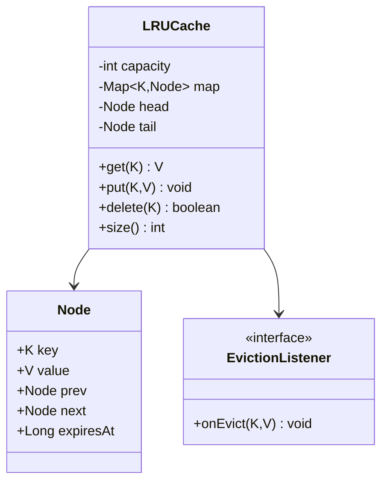

# LLD: LRU Cache Implementation

> **Focus areas:** Hash map + doubly linked list · O(1) get/put · Capacity eviction · Concurrency · TTL variants · Distributed notes · Generics & API design  
> **Style:** LLD interview (clarify → complexity → classes → algorithms/code → concurrency → reliability → progressive scale → wrap-up → Q&A)  
> **Quality bar:** Correct O(1) operations, clear node ownership, thread-safety options with trade-offs, no hand-wavy “just use LinkedHashMap” without explaining  
> **Interview theme:** Microsoft — classic coding+design hybrid; often asked to **implement** then discuss scaling (Baseline → 10× → 100× → 1,000×)

---

## Table of Contents

1. [Clarify Requirements (Interview Q&A)](#1-clarify-requirements-interview-qa)
2. [Complexity & Scale](#2-complexity--scale)
3. [Class Diagrams & Responsibilities](#3-class-diagrams--responsibilities)
4. [Key Algorithms & Code Sketches](#4-key-algorithms--code-sketches)
5. [Concurrency & Edge Cases](#5-concurrency--edge-cases)
6. [Persistence & Distributed Notes](#6-persistence--distributed-notes)
7. [Reliability](#7-reliability)
8. [Scalability](#8-scalability)
9. [Wrap-Up](#9-wrap-up)
10. [Deeper / Related Interview Questions](#10-deeper--related-interview-questions)
11. [Appendices](#11-appendices)

---

## 1. Clarify Requirements (Interview Q&A)

Goal: design and implement an **LRU (Least Recently Used) cache** with capacity `C`: `get` and `put` in average **O(1)** time; on overflow evict the least recently used entry.

### 1.0 What this is / is not

| Dimension | This | Not |
|-----------|------|-----|
| Job | In-process LRU (+ concurrency / distributed discussion) | Full Redis product HLD only |
| Eviction | LRU (recency) | LFU/ARC unless asked to extend |
| Persistence | Optional notes | Durable DB |
| Microsoft lens | Clean API, correctness, threading, then scale-out | Premature cluster design |

### 1.1 Clarifying questions

| # | Question | Typical answer | Implication |
|---|----------|----------------|-------------|
| F1 | Operations? | `get(key)`, `put(key,value)`, maybe `delete` | Core API |
| F2 | Capacity? | Max entries N (count-based MVP) | Evict on put when full |
| F3 | Missing get? | Return null / Optional.empty | Document |
| F4 | Put existing? | Update value + refresh recency | Move to most-recent |
| F5 | Thread safety? | Ask — single-thread first, then concurrent | Lock strategy |
| F6 | Generics? | Key K, Value V | Type params |
| F7 | TTL? | Optional Phase 2 | Lazy expire + LRU |
| F8 | Size by bytes? | Count-based MVP | Weighted LRU later |
| F9 | Stats? | hits/misses optional | Counters |
| F10 | Null keys? | Disallow | Validate |
| F11 | Eviction callback? | Optional listener | Resource cleanup |
| F12 | Persistence? | In-memory MVP | Distributed section |

**MVP scope:**

1. Capacity-bounded cache.  
2. O(1) get/put with LRU eviction.  
3. Update-on-put refreshes recency.  
4. Clear structure: `HashMap` + doubly linked list.  
5. Discuss concurrent variants.  
6. Sketch distributed cache placement (not full Redis).

**Out of MVP:** disk tiering, LRU-K, TinyLFU admission, full Redis cluster.

### 1.2 Scope repeat-back

> In-memory LRU cache: map + doubly linked list, O(1) get/put, capacity eviction of least recently used, optional concurrency and TTL—then notes on sharded / distributed caching.

### 1.3 Semantics (lock early)

```text
get(k):
  if absent → miss (null)
  else → mark as most recently used → return value

put(k,v):
  if present → update value → mark MRU
  else → insert as MRU
       if size > capacity → evict LRU node
```

**Recency:** both get and put (on hit) update order. (Some systems use “get-only LRU”; ask!)

---

## 2. Complexity & Scale

### 2.1 Complexity targets

| Op | Time | Space |
|----|------|-------|
| get | O(1) avg | O(capacity) total |
| put | O(1) avg | |
| delete | O(1) avg | |
| evict | O(1) | |

Hash collisions → amortized; mention worst-case pathological hashes.

### 2.2 Progressive scale (when cache is a service)

| Metric | Process-local | 10× app fleet | Distributed |
|--------|---------------|---------------|-------------|
| Entries | 10^5–10^7 | same × machines | partitioned |
| QPS | 10^5–10^6 / proc | fleet | Redis/memcached class |
| Design | Mutex / stripes | near-cache + remote | consistent hash |

### 2.3 Why not only `LinkedHashMap`?

In Java, `LinkedHashMap` with `accessOrder=true` + `removeEldestEntry` **is** LRU—say so, then still implement list+map to prove understanding. In Python, `OrderedDict` / `functools.lru_cache` similarly.

Interviewers often want the **explicit node** design.

---

## 3. Class Diagrams & Responsibilities

### 3.1 Responsibility table

| Class | Responsibility |
|-------|----------------|
| `LRUCache<K,V>` | Public API; capacity; orchestrates map+list |
| `Node<K,V>` | key, value, prev, next; optional expiresAt |
| `DoublyLinkedList<K,V>` | MRU at head / LRU at tail (or reverse—pick one) |
| `EvictionListener<K,V>` | Optional callback on eviction |
| `CacheStats` | hits, misses, evictions |
| `ReadWriteLock` / stripes | Concurrency helpers |

**Convention used here:** **head = MRU**, **tail = LRU** (dummy sentinels).

### 3.2 Class diagram



### 3.3 Invariants

```text
I1: map.size == number of real nodes between sentinels
I2: map contains key iff node linked in list
I3: capacity >= 1 (or 0 = always empty—define)
I4: head.next is MRU; tail.prev is LRU
I5: After get/put hit, node is at MRU position
I6: size <= capacity always after put returns
```

### 3.4 Sentinel nodes

Use dummy `head` and `tail` to avoid null checks:

```text
head <-> n1 <-> n2 <-> ... <-> nk <-> tail
```

---

## 4. Key Algorithms & Code Sketches

### 4.1 List helpers

```python
class Node:
    def __init__(self, key=None, value=None):
        self.key = key
        self.value = value
        self.prev = None
        self.next = None

class LRUCache:
    def __init__(self, capacity: int):
        if capacity < 0:
            raise ValueError("capacity")
        self.capacity = capacity
        self.map = {}
        self.head = Node()  # MRU side
        self.tail = Node()  # LRU side
        self.head.next = self.tail
        self.tail.prev = self.head

    def _add_to_head(self, node: Node) -> None:
        node.prev = self.head
        node.next = self.head.next
        self.head.next.prev = node
        self.head.next = node

    def _remove(self, node: Node) -> None:
        node.prev.next = node.next
        node.next.prev = node.prev
        node.prev = node.next = None

    def _move_to_head(self, node: Node) -> None:
        self._remove(node)
        self._add_to_head(node)

    def _pop_lru(self) -> Node:
        node = self.tail.prev
        self._remove(node)
        return node
```

### 4.2 get / put

```python
    def get(self, key):
        node = self.map.get(key)
        if node is None:
            return None  # miss
        self._move_to_head(node)
        return node.value

    def put(self, key, value) -> None:
        node = self.map.get(key)
        if node is not None:
            node.value = value
            self._move_to_head(node)
            return
        node = Node(key, value)
        self.map[key] = node
        self._add_to_head(node)
        if len(self.map) > self.capacity:
            lru = self._pop_lru()
            del self.map[lru.key]
            # optional: listener.onEvict(lru.key, lru.value)

    def delete(self, key) -> bool:
        node = self.map.pop(key, None)
        if node is None:
            return False
        self._remove(node)
        return True
```

### 4.3 Java-like sketch

```java
public final class LRUCache<K, V> {
  private final int capacity;
  private final Map<K, Node<K, V>> map = new HashMap<>();
  private final Node<K, V> head = new Node<>(null, null);
  private final Node<K, V> tail = new Node<>(null, null);

  public LRUCache(int capacity) {
    if (capacity < 0) throw new IllegalArgumentException();
    this.capacity = capacity;
    head.next = tail;
    tail.prev = head;
  }

  public synchronized V get(K key) {
    Node<K, V> n = map.get(key);
    if (n == null) return null;
    moveToHead(n);
    return n.value;
  }

  public synchronized void put(K key, V value) {
    Node<K, V> n = map.get(key);
    if (n != null) {
      n.value = value;
      moveToHead(n);
      return;
    }
    n = new Node<>(key, value);
    map.put(key, n);
    addToHead(n);
    if (map.size() > capacity) {
      Node<K, V> lru = popLru();
      map.remove(lru.key);
    }
  }
  // helpers omitted — same as Python
}
```

### 4.4 Trace example

```text
capacity=2
put(1,a)  list: 1
put(2,b)  list: 2-1
get(1)    list: 1-2
put(3,c)  evict 2; list: 3-1
get(2)    miss
get(3)    list: 3-1
get(1)    list: 1-3
```

### 4.5 TTL extension (lazy)

```python
def get(self, key):
    node = self.map.get(key)
    if node is None:
        return None
    if node.expires_at is not None and time.time() > node.expires_at:
        self._remove(node)
        del self.map[key]
        return None
    self._move_to_head(node)
    return node.value
```

Eager expiry: background wheel / timing wheel (Phase 2).

### 4.6 Weighted capacity (byte size)

Track `current_weight`; each node has `weight`; evict LRU until `current_weight <= capacity`. Still O(1) per eviction step; put may evict multiple → O(k) evictions worst case—say so.

---

## 5. Concurrency & Edge Cases

### 5.1 Concurrency options

| Strategy | Pros | Cons |
|----------|------|------|
| **Coarse `synchronized` / mutex** | Simple, correct | Low throughput |
| **ReadWriteLock** | Concurrent gets | Writes + recency updates on get → many writes |
| **Segment / striped locks** | Higher throughput | Cross-segment eviction harder |
| **ConcurrentHashMap + approx LRU** | High QPS | Not strict LRU |
| **CLRU / W-TinyLFU (Caffeine)** | Production grade | Complex |

**Interview insight:** classic LRU **updates structure on get**, so RW locks help less than people think. Either:

1. Accept global lock for strict LRU, or  
2. Relax to **approx LRU** (sample, clock, random admit).

### 5.2 Stripe design sketch

```text
N shards, each with own LRUCache(capacity/N) + lock
key → shard = hash(key) % N
Problem: hot keys imbalance; global capacity not exact
OK for many production near-caches
```

### 5.3 Edge cases

| Case | Behavior |
|------|----------|
| capacity = 0 | put no-ops or immediate evict; get always miss |
| capacity = 1 | classic stress for list bugs |
| get missing | null / Optional; no structural change |
| put same key | update + MRU; size unchanged |
| null key/value | reject keys; values policy (allow or not) |
| delete then get | miss |
| eviction listener throws | isolate; cache must stay consistent |
| integer overflow on stats | use long |
| re-entrancy from listener | document forbidden or reentrant lock |
| hashCode mutates key | undefined; keys must be immutable |

### 5.4 Testing checklist

```text
- capacity 1/2 sequences (LeetCode 146 style)
- overwrite value
- interleave get/put
- delete middle node
- concurrent put/get stress (if threaded)
- TTL expiry lazy path
```

### 5.5 Common bugs

1. Forgetting to update map on evict.  
2. Not unlinking both prev/next.  
3. Evicting before insert when updating existing key.  
4. Using singly linked list → O(n) remove.  
5. Moving node without removing first → corrupt cycles.

---

## 6. Persistence & Distributed Notes

### 6.1 Process-local vs remote

| Mode | Use |
|------|-----|
| Embedded LRU | Per-instance memoization, CDN origin shield local |
| Remote cache | Redis/Memcached shared across app fleet |
| Near + far | Local Caffeine + Redis |

### 6.2 Distributed LRU illusion

**There is no global LRU** across nodes without coordination.

Approaches:

1. **Partition by key** (consistent hash): each shard runs local LRU.  
2. **Central Redis** with `MAXMEMORY` + `allkeys-lru`.  
3. **Client-side** caches with TTLs (accept duplication).

**Thundering herd:** on miss, singleflight / request coalescing.

### 6.3 Consistency with DB

```text
Read: cache get → miss → DB → put
Write: DB write → invalidate (or update) cache
Prefer invalidate over update under concurrent writers
```

### 6.4 Serialization

Remote values need codec (JSON/protobuf); size limits; compression optional.

### 6.5 Persistence of cache itself

Usually **ephemeral**. If interviewer insists: snapshot WAL of sets (expensive)—usually wrong tool; use Redis AOF/RDB as product.

---

## 7. Reliability

Microsoft interviewers often pivot from “code LRU” to “what breaks under threads / process death / retries?” Treat the cache as a **component with failure modes**, even when it is process-local.

### 7.1 Invariants that must survive failure

1. `size == map.size == list length` (excluding sentinels).  
2. Every map value points to a live list node; every list node is in the map.  
3. Eviction never leaves a dangling map entry.  
4. `get`/`put` are atomic w.r.t. the structure under the chosen lock policy.  
5. Capacity never exceeded after a successful `put` returns.

### 7.2 Concurrency races (beyond “add a mutex”)

| Race | Symptom | Mitigation |
|------|---------|------------|
| Concurrent `get` moves + `put` evicts | List cycles / lost nodes | Single mutex, or per-shard mutex covering map+list |
| Check-then-act outside lock | Double insert same key | All structure mutations under one critical section |
| Listener callback re-enters cache | Deadlock or nested corruption | Document “no re-entry”; run listener async / outside lock |
| Stats counters unlocked | Wrong hit rate | `long` under lock or `AtomicLong` (accept approximate) |
| Stripe cross-key “transaction” | Impossible atomic multi-key | Don’t promise multi-key atomicity across shards |

**Idempotency:** `put(k,v)` twice with same `(k,v)` is naturally idempotent for values; structure still moves to MRU. `delete(k)` twice → second returns false—safe. For remote caches, clients should treat `SET` as overwrite and use request coalescing on stampede, not “exactly-once put.”

### 7.3 Data loss semantics

| Scenario | Expected | Interview line |
|----------|----------|----------------|
| Process crash | Entire in-memory LRU gone | Cache is **not** source of truth |
| Eviction | Cold keys dropped | By design; measure hit ratio |
| Overwrite put | Previous value replaced | Not “loss” if API is map-like |
| Invalidate race after DB write | Brief stale or miss | Prefer invalidate; tolerate miss |
| Redis `MAXMEMORY` eviction | Keys dropped under pressure | Same product contract as local LRU |

### 7.4 Locking strategy (say crisply)

```text
MVP (whiteboard): ReentrantLock / synchronized around get+put+delete
10× throughput: N striped LRUCaches; key → shard
Strict global LRU + high QPS: usually impossible — relax to approx / remote Redis
Never: ConcurrentHashMap alone without coordinating the linked list
```

### 7.5 Crash recovery

- **Local LRU:** no recovery; warm from traffic or optional preload.  
- **Write-through miss path:** DB remains authoritative; cold start is correct but slower.  
- **Near-cache + Redis:** on app restart, L1 empty; L2 may still hold entries.  
- **Don’t** invent a WAL for a teaching LRU unless asked—say “wrong tool; use Redis AOF/RDB.”

### 7.6 Failure-injection checklist (interview gold)

- Listener throws mid-evict → structure still consistent.  
- OOM during node alloc → put fails cleanly; no half-linked node.  
- Concurrent stress on capacity=1.  
- TTL expiry under concurrent get/put.  
- Hash collision storm (degenerate keys)—mention amortized O(1).

---

## 8. Scalability

Even for LLD, Microsoft expects a **progressive scale story**: what changes when the *workload around the cache* grows, not when you “add more nodes to a doubly linked list.”

### 8.1 Progressive scale table

| Stage | Workload context | Cache shape | LLD implication |
|-------|------------------|-------------|-----------------|
| **Baseline** | Single process, ≤10⁵–10⁶ entries, one service instance | Mutex LRU / `LinkedHashMap` | Prove O(1) map+DLL; correct eviction |
| **10×** | Multi-threaded app, higher QPS, still one box | Striped LRU or Caffeine; metrics | Lock granularity; approx vs strict |
| **100×** | Fleet of app servers sharing state | Near-cache (L1) + Redis/Memcached (L2) | Invalidation protocol; serialization; TTLs |
| **1,000×** | Multi-region / multi-tenant platform | Sharded remote cache, consistent hash, per-tenant caps | No global LRU; admission policy; stampede control; SLOs |

### 8.2 What does *not* scale

- One giant locked list across cores at 1,000× QPS.  
- True **global** LRU across partitions (coordination kills the point).  
- Storing unbounded values without weighted capacity / max-item size.  
- Synchronous write-through to DB on every put under write storms.

### 8.3 Jump cards (say in 20 seconds each)

**10×:** “Shard by key hash into N independent LRUs; accept imperfect global capacity.”  
**100×:** “L1 local for hot keys + L2 Redis; on write, invalidate L2 then L1 (or short TTL).”  
**1,000×:** “Treat cache as a **platform**: consistent hashing, replica sets, tenant quotas, singleflight, and hit-ratio SLOs—not a bigger mutex.”

### 8.4 Capacity planning sketch

```text
entries × (node overhead + key + value) ≤ RAM budget × safety (0.6–0.7)
hit_ratio target → if miss_penalty × miss_qps exceeds SLO, grow capacity or fix admission
evictions/sec high + hit_ratio low → working set > capacity (scale out shards or enlarge)
```

### 8.5 Microsoft framing

Azure / Microsoft services use patterns like **Redis Cache**, in-proc memory caches in ASP.NET, and CDN edge caches. In interview: implement the classic structure first, then narrate the jump to **distributed cache** without pretending local LRU becomes cluster-wide LRU.

---

## 9. Wrap-Up

### 9.1 Summary

| Piece | Choice |
|-------|--------|
| Structure | HashMap + doubly linked list + sentinels |
| Complexity | O(1) get/put/evict |
| Concurrency | Mutex for strict; shards/approx for scale |
| Distributed | Per-shard LRU or Redis; no true global LRU |
| Extensions | TTL, weighted, listener, stats |

### 9.2 30-second pitch

> Map for O(1) lookup, doubly linked list for O(1) recency moves and eviction. Head is MRU, tail is LRU. Puts insert or refresh; overflow pops the tail. For threads, start with one lock; for fleets, shard or use Redis and accept approximate global recency.

### 9.3 Trade-offs

1. Strict LRU vs throughput.  
2. Count capacity vs byte weight.  
3. Invalidate vs update on write-through.  
4. Lazy TTL vs timer wheels.

---

## 10. Deeper / Related Interview Questions

### 10.1 Coding / LLD

**Q1: Why map + doubly linked list, not a heap?**  
A: Heap gives O(log n) touch/evict; DLL + hash gives O(1) move-to-front and pop-tail.

**Q2: Where is the bug if you forget `map.remove` on evict?**  
A: Map still returns a node detached from the list (or worse, reused)—size drift and wrong gets.

**Q3: Capacity-1 sequence: put A, put B, get A?**  
A: After put B, A is gone; get A misses. Trace list pointers aloud.

**Q4: Implement LFU in O(1).**  
A: Key→node; freq→DLL of keys; min-freq pointer; promote on access (LeetCode 460 pattern).

**Q5: `get` without moving—when?**  
A: CLOCK / 2Q / “peek” APIs; or separate `contains` that must not refresh LRU.

### 10.2 Concurrency & reliability

**Q6: Why is lock-free LRU hard?**  
A: Need atomic multi-pointer list updates + map; ABA; usually not worth it vs striped locks / approx.

**Q7: Does ReadWriteLock help classic LRU?**  
A: Weakly—`get` mutates list order, so most “reads” take write lock. Prefer stripes or approx.

**Q8: Listener throws during eviction—what must hold?**  
A: Map/list already consistent *before* listener; catch/isolate; never hold lock inside user code.

**Q9: Idempotent delete under retries?**  
A: Second delete returns false; no exception. Safe for at-least-once callers.

**Q10: Cache stampede on hot key miss?**  
A: Singleflight / request coalescing; optional early refresh; soft TTL + hard TTL.

### 10.3 Scale & products

**Q11: Redis `allkeys-lru` vs your class?**  
A: Redis samples keys and approximates LRU; your class is exact per process. Different contracts.

**Q12: L1 + L2 coherency?**  
A: On write: update DB → invalidate L2 → broadcast/invalidate L1 (or short L1 TTL). Accept brief staleness.

**Q13: Scan resistance?**  
A: Large sequential scan fills LRU with one-time keys; TinyLFU / ARC / segmented LRU admit better.

**Q14: Negative caching?**  
A: Cache miss markers with short TTL to protect DB from repeated absent keys; careful with create races.

**Q15: Shards rebalance when nodes added?**  
A: Consistent hash; keys remap; expect cold misses; optionally preload hot set.

**Q16: Metrics for SLOs?**  
A: hit_ratio, eviction_rate, get/put latency p99, error rate, memory used vs max.

**Q17: Weighted capacity (bytes)?**  
A: Track `currentBytes`; evict LRU until fit; reject single item > maxItemBytes.

**Q18: Soft/weak refs (Java)?**  
A: GC can reclaim values under pressure; semantics become best-effort—document clearly.

### 10.4 Microsoft-flavored

**Q19: How would you place this in an ASP.NET / Azure service?**  
A: In-proc for request memoization; Azure Cache for Redis for multi-instance shared state; never rely on in-proc alone behind a load balancer.

**Q20: Interview close—what do you implement first?**  
A: Single-threaded correct O(1) LRU with tests → mutex → stripes → distributed notes. Coding correctness beats premature Redis diagrams.

---

## 11. Appendices

### 11.1 API contract

```text
class LRUCache<K,V>:
  constructor(capacity: int)
  get(key: K) -> Optional<V>
  put(key: K, value: V) -> void
  delete(key: K) -> bool
  size() -> int
  clear() -> void
```

### 11.2 Complexity proof notes

- Hash map get/put amortized O(1).  
- Pointer rewiring O(1).  
- Evict one node O(1).  
Space O(capacity) nodes + map entries.

### 11.3 OrderedDict Python alternative

```python
from collections import OrderedDict

class LRUCache:
    def __init__(self, capacity):
        self.cap = capacity
        self.od = OrderedDict()

    def get(self, key):
        if key not in self.od:
            return None
        self.od.move_to_end(key)
        return self.od[key]

    def put(self, key, value):
        if key in self.od:
            self.od.move_to_end(key)
        self.od[key] = value
        if len(self.od) > self.cap:
            self.od.popitem(last=False)
```

Use to cross-check custom implementation.

### 11.4 Concurrent wrapper

```java
public V get(K key) {
  lock.lock();
  try { return unsafeGet(key); }
  finally { lock.unlock(); }
}
```

### 11.5 Stats

```text
hits, misses, evictions, puts
hit_rate = hits / (hits+misses)
```

### 11.6 Memory estimate

```text
Per entry ≈ node ptrs (3×8) + key/value refs + map entry overhead
≈ 64–128 B + sizeof(K)+sizeof(V) on 64-bit JVM/Python (order-of)
1M entries × 100 B → ~100 MB + values
```

### 11.7 Eviction listener use cases

Close files, return DB connections, decrement refcounts—must not deadlock on cache lock.

### 11.8 CLOCK algorithm (approx LRU)

Reference bit per page; hand sweeps—better concurrency, weaker recency.

### 11.9 Interview board order

1. Semantics + capacity  
2. Draw map + DLL  
3. Code get/put  
4. Trace example  
5. Threads  
6. Distributed  

### 11.10 Related Microsoft prompts

- Distributed cache HLD  
- Rate limiter (often co-asked)  
- Fixed-size buffer (sibling LLD)  
- In-memory DB  

### 11.11 Failure injection tests

- Listener throws  
- OutOfMemory on put  
- Concurrent resize of underlying map (don’t resize list separately)

### 11.12 TTL + LRU interaction

Expired nodes: remove on access; optional max expired scan on put. Capacity counts only live nodes.

### 11.13 Pseudocode delete-middle

```text
remove(node):
  node.prev.next = node.next
  node.next.prev = node.prev
```

### 11.14 Capacity change online

Rare API `resize(newCap)`: while size > newCap: evict LRU. O(k).

### 11.15 Final signal

Correct pointer manipulation + clear concurrency story beats premature Redis diagrams.

---

*End of LRU cache LLD.*
