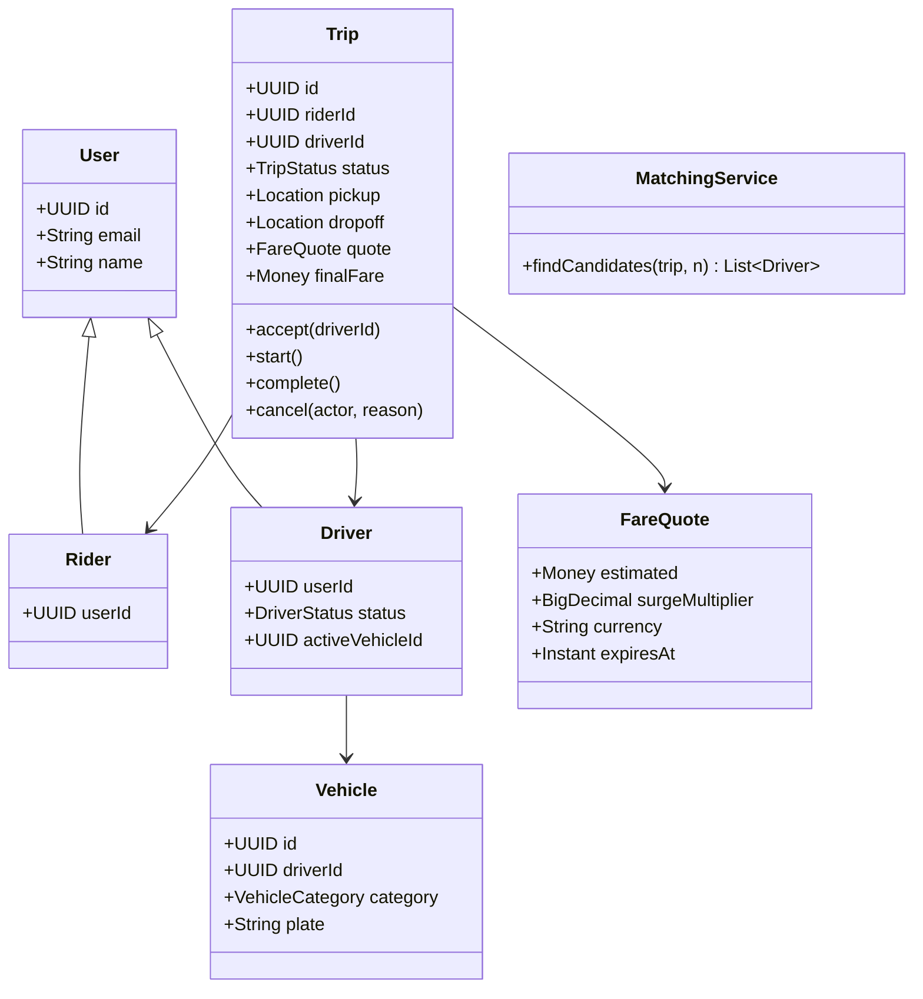

# LLD: Ride-Sharing — Class Model + Database Design

> **Focus areas:** Domain classes · Trip lifecycle · Matching hooks · Geospatial indexes · Relational schema · Indexes · Concurrency · Idempotency · Extensibility  
> **Style:** LLD-heavy (clarify → scale → classes → state machines → schema/SQL → concurrency → reliability → progressive scale → wrap-up → Q&A); HLD matching/geo only as needed  
> **Quality bar:** Clear aggregates, money-safe trip close, race-free accept, normalized+pragmatic schema, interview-ready ER  
> **Interview theme:** Microsoft — often “design classes **and** DB” for Uber-like; show OOP + data modeling fluency; Baseline → 10× → 100× → 1,000×

---

## Table of Contents

1. [Clarify Requirements (Interview Q&A)](#1-clarify-requirements-interview-qa)
2. [Complexity & Scale](#2-complexity--scale)
3. [Class Diagrams & Responsibilities](#3-class-diagrams--responsibilities)
4. [Key Algorithms & Code Sketches](#4-key-algorithms--code-sketches)
5. [Concurrency & Edge Cases](#5-concurrency--edge-cases)
6. [Persistence & Database Schema](#6-persistence--database-schema)
7. [Reliability](#7-reliability)
8. [Scalability](#8-scalability)
9. [Wrap-Up](#9-wrap-up)
10. [Deeper / Related Interview Questions](#10-deeper--related-interview-questions)
11. [Appendices](#11-appendices)

---

## 1. Clarify Requirements (Interview Q&A)

Goal: produce an **object model and relational schema** for a ride-sharing app: riders request trips, drivers are matched/accept, trip progresses to completion and payment—correct under concurrent accepts and retries.

### 1.0 What this is / is not

| Dimension | This | Not |
|-----------|------|-----|
| Job | Classes + DB + trip invariants | Full city-scale HLD only (geo cell fleet) |
| Matching | Interface + simple nearest sketch | Deep dispatch ML |
| Maps | Lat/lng points; index notes | Build Google Maps |
| Microsoft lens | Clean domain + schema + races | UML decoration |

### 1.1 Clarifying questions

| # | Question | Typical answer | Implication |
|---|----------|----------------|-------------|
| F1 | Roles? | Rider, Driver, Admin | User subtypes / roles |
| F2 | Trip types? | Solo MVP; pool Phase 2 | `TripType` |
| F3 | Matching? | System proposes; driver accepts | Offer / claim model |
| F4 | Pricing? | Estimate + final fare | `FareQuote` snapshot |
| F5 | Payments? | Auth on start / capture on complete | Payment port |
| F6 | Locations? | Pickup/dropoff + live driver loc | Geo points; last-loc table |
| F7 | Vehicles? | One active vehicle per driver | Vehicle entity |
| F8 | Cancel? | Rider/driver/system with fees | State transitions |
| F9 | Ratings? | After complete | Rating entity |
| F10 | Surge? | Multiplier on quote | Quote fields |
| F11 | Multi-stop? | Out of MVP | — |
| F12 | Regions? | City / geo fence | `region_id` |

**MVP scope:**

1. Rider requests ride with pickup/dropoff.  
2. System creates `Trip` + fare estimate; finds candidate drivers.  
3. Driver accepts (exclusive); navigates; starts; completes.  
4. Payment capture; ratings.  
5. Cancel paths with rules.  
6. Class model + SQL schema + critical indexes.  
7. Concurrent accept correctness.

**Out of MVP:** carpool matching, scheduled rides, intercity, full fraud ML.

### 1.2 Scope repeat-back

> Ride-sharing domain LLD: User/Rider/Driver/Vehicle, Trip lifecycle with exclusive accept, fare quotes, payment ports, location samples—and a relational schema with indexes for active trips and driver lookup—without turning the interview into only Kafka geo streaming.

---

## 2. Complexity & Scale

### 2.1 Domain-scale numbers (for schema choices)

| Metric | Baseline (city MVP) | 10× | 100× | 1,000× |
|--------|---------------------|-----|------|--------|
| DAU riders | 100K | 1M | 10M | 100M |
| Peak trips/sec create | 20 | 200 | 2K | 20K |
| Active drivers | 5K | 50K | 500K | 5M |
| Location updates/sec | 5K | 50K | 500K | 5M |
| Schema impact | Single PG | Partition trips by date/region | Shard by region | Multi-region trip plane + loc pipeline |

### 2.2 Hot data vs cold

| Hot | Cold |
|-----|------|
| Active trips, driver last location | Completed trip history |
| Open offers | Old location breadcrumbs (TTL) |

Location updates often **not** in same OLTP rows as trips—time-series or Redis + periodic flush.

---

## 3. Class Diagrams & Responsibilities

### 3.1 Responsibility table

| Class | Responsibility |
|-------|----------------|
| `User` | Identity, role flags, contact |
| `Rider` | Payment methods ref, home region |
| `Driver` | Status (OFFLINE/IDLE/ON_TRIP), documents |
| `Vehicle` | Plate, category (XL/eco), capacity |
| `Location` | lat, lng, bearing, ts (value object) |
| `Trip` | Aggregate root for ride lifecycle |
| `TripStop` / points | Pickup & dropoff |
| `FareQuote` | Estimate snapshot (amounts, surge, currency) |
| `TripOffer` | Offer to a driver (optional explicit) |
| `MatchingService` | Select candidates |
| `TripService` | Application use cases |
| `PaymentPort` | Auth/capture/refund |
| `PricingPolicy` | Quote + finalize |
| `Rating` | Stars + comment |
| `Region` | Geo/business city |

### 3.2 Enums

```text
DriverStatus: OFFLINE | IDLE | OCCUPIED | ASSIGNED
TripStatus: REQUESTED | MATCHING | ACCEPTED | ARRIVED | IN_PROGRESS
            | COMPLETED | CANCELLED_RIDER | CANCELLED_DRIVER | CANCELLED_SYSTEM | FAILED
VehicleCategory: ECONOMY | XL | PREMIUM
OfferStatus: PENDING | ACCEPTED | EXPIRED | REJECTED
PaymentStatus: NONE | AUTHORIZED | CAPTURED | REFUNDED | FAILED
```

### 3.3 Class diagram



### 3.4 Aggregates & boundaries

```text
Trip aggregate: trip row + status history + fare fields
Driver availability: driver row + last_location (often separate BC)
Payment: external; store PaymentAttempt linked by trip_id
Do not put high-freq GPS into Trip aggregate writes
```

### 3.5 Invariants

```text
I1: At most one ACCEPTED..IN_PROGRESS trip per driver
I2: Trip.driver_id set iff status >= ACCEPTED (and not cancelled before accept)
I3: finalFare set only on COMPLETED (or cancel fee path)
I4: Accept is exclusive — first writer wins
I5: Quote currency immutable for trip
I6: Rider cannot have unbounded concurrent REQUESTED trips (product cap)
```

---

## 4. Key Algorithms & Code Sketches

### 4.1 Trip state machine

```text
REQUESTED → MATCHING → ACCEPTED → ARRIVED → IN_PROGRESS → COMPLETED
                ↘                 ↘ cancel paths ...
Any pre-IN_PROGRESS → CANCELLED_*
IN_PROGRESS → CANCELLED_SYSTEM (rare) / COMPLETED
```

### 4.2 Request + match (application)

```python
class TripService:
    def request_trip(self, rider_id, pickup, dropoff, category) -> Trip:
        quote = self.pricing.quote(pickup, dropoff, category, now())
        trip = Trip.create(rider_id, pickup, dropoff, category, quote)
        self.trips.save(trip)  # status=REQUESTED
        self.outbox.publish("trip.requested", trip.id)
        candidates = self.matcher.find_candidates(trip, limit=5)
        for d in candidates:
            self.offers.create(trip.id, d.id, ttl_sec=15)
            self.notify.driver(d.id, trip.id)
        trip.transition(TripStatus.MATCHING)
        self.trips.save(trip)
        return trip
```

### 4.3 Exclusive accept

```python
    def accept(self, trip_id, driver_id, offer_id) -> Trip:
        # DB transaction
        trip = self.trips.lock_for_update(trip_id)
        if trip.status not in (MATCHING, REQUESTED):
            raise Conflict("not open")
        driver = self.drivers.lock_for_update(driver_id)
        if driver.status != IDLE:
            raise Conflict("driver busy")
        offer = self.offers.lock(offer_id)
        if offer.expired() or offer.driver_id != driver_id:
            raise Conflict("offer")
        trip.driver_id = driver_id
        trip.status = ACCEPTED
        driver.status = ASSIGNED
        offer.status = ACCEPTED
        self.offers.expire_others(trip_id)
        self.trips.save(trip)
        self.drivers.save(driver)
        return trip
```

Equivalent SQL mindset: `UPDATE trips SET driver_id=$1, status='ACCEPTED' WHERE id=$2 AND status='MATCHING' AND driver_id IS NULL`.

### 4.4 Fare finalize

```python
def finalize_fare(trip, distance_m, duration_s, policy) -> Money:
    base = policy.base(trip.category)
    dist = policy.per_m * distance_m
    time = policy.per_s * duration_s
    sub = base + dist + time
    return Money(sub * trip.quote.surge_multiplier, trip.quote.currency)
```

### 4.5 Matching sketch (not full HLD)

```text
1. Geo query drivers IDLE within R km of pickup (geohash / PostGIS)
2. Filter category, rating, destination filters
3. Rank by ETA / distance
4. Offer top K with TTL
```

```python
def find_candidates(self, trip, limit=5):
    cells = geohash_cover(trip.pickup, radius_m=3000)
    drivers = self.driver_loc.query_idle(cells, trip.category)
    drivers.sort(key=lambda d: haversine(d.loc, trip.pickup))
    return drivers[:limit]
```

### 4.6 Location update (driver)

```python
def update_location(driver_id, lat, lng, ts):
    # Redis GEOADD + throttle 1–5s
    redis.geoadd("drivers:loc", lng, lat, driver_id)
    redis.hset(f"driver:{driver_id}", mapping={...})
    # async persist sample optional
```

---

## 5. Concurrency & Edge Cases

### 5.1 Races

| Race | Solution |
|------|----------|
| Two drivers accept same trip | Conditional update / `driver_id IS NULL` |
| Same driver accepts two trips | Lock driver row; status IDLE check |
| Double tap accept | Idempotent: same driver+trip → return success |
| Offer expire vs accept | TTL column + check in txn |
| Payment webhook retry | Idempotency key on payment_attempt |
| Rider cancel during accept | Status CAS; winner notifies loser |

### 5.2 Edge cases

| Case | Behavior |
|------|----------|
| No drivers | Stay MATCHING; expand radius; timeout → FAILED |
| Driver no-show | Rider cancel / re-match; fee policy |
| Rider cancel after arrive | Cancel fee possible |
| App kill mid-trip | Trip remains IN_PROGRESS; resume from server |
| Quote expired before accept | Requote or cancel |
| GPS spoof | Fraud signals; out of MVP deep |
| Refund after capture | PaymentPort.refund; trip stays COMPLETED |
| Currency mismatch | Forbidden by quote immutability |

### 5.3 Idempotency keys

```text
request: Idempotency-Key from client → same trip_id
accept: (trip_id, driver_id) unique success
complete: only from IN_PROGRESS once
```

---

## 6. Persistence & Database Schema

### 6.1 ER overview

```text
users 1—1 riders
users 1—1 drivers
drivers 1—* vehicles
riders 1—* trips
drivers 1—* trips
trips 1—* trip_status_events
trips 1—* trip_offers
trips 1—0..1 payments
trips 1—* ratings
drivers 1—1 driver_last_locations
```

### 6.2 SQL DDL (Postgres-flavored)

```sql
CREATE TABLE users (
  id              UUID PRIMARY KEY,
  email           CITEXT UNIQUE NOT NULL,
  full_name       TEXT NOT NULL,
  phone           TEXT,
  created_at      TIMESTAMPTZ NOT NULL DEFAULT now()
);

CREATE TABLE riders (
  user_id         UUID PRIMARY KEY REFERENCES users(id),
  default_currency CHAR(3) NOT NULL DEFAULT 'USD'
);

CREATE TABLE drivers (
  user_id         UUID PRIMARY KEY REFERENCES users(id),
  status          TEXT NOT NULL CHECK (status IN ('OFFLINE','IDLE','OCCUPIED','ASSIGNED')),
  rating_avg      NUMERIC(3,2) NOT NULL DEFAULT 5.0,
  active_vehicle_id UUID,
  region_id       TEXT NOT NULL,
  updated_at      TIMESTAMPTZ NOT NULL DEFAULT now()
);

CREATE TABLE vehicles (
  id              UUID PRIMARY KEY,
  driver_id       UUID NOT NULL REFERENCES drivers(user_id),
  category        TEXT NOT NULL,
  plate           TEXT NOT NULL,
  make_model      TEXT,
  active          BOOLEAN NOT NULL DEFAULT true
);

CREATE TABLE trips (
  id              UUID PRIMARY KEY,
  rider_id        UUID NOT NULL REFERENCES riders(user_id),
  driver_id       UUID REFERENCES drivers(user_id),
  status          TEXT NOT NULL,
  category        TEXT NOT NULL,
  pickup_lat      DOUBLE PRECISION NOT NULL,
  pickup_lng      DOUBLE PRECISION NOT NULL,
  dropoff_lat     DOUBLE PRECISION NOT NULL,
  dropoff_lng     DOUBLE PRECISION NOT NULL,
  -- quote snapshot
  currency        CHAR(3) NOT NULL,
  estimate_cents  BIGINT NOT NULL,
  surge_multiplier NUMERIC(6,3) NOT NULL DEFAULT 1.0,
  quote_expires_at TIMESTAMPTZ,
  final_fare_cents BIGINT,
  distance_m      INT,
  duration_s      INT,
  requested_at    TIMESTAMPTZ NOT NULL DEFAULT now(),
  accepted_at     TIMESTAMPTZ,
  started_at      TIMESTAMPTZ,
  completed_at    TIMESTAMPTZ,
  cancelled_at    TIMESTAMPTZ,
  cancel_reason   TEXT,
  region_id       TEXT NOT NULL,
  idempotency_key TEXT,
  version         INT NOT NULL DEFAULT 0
);

CREATE UNIQUE INDEX uq_trips_rider_idem ON trips(rider_id, idempotency_key)
  WHERE idempotency_key IS NOT NULL;

CREATE INDEX ix_trips_rider_requested ON trips(rider_id, requested_at DESC);
CREATE INDEX ix_trips_driver_active ON trips(driver_id, status)
  WHERE status IN ('ACCEPTED','ARRIVED','IN_PROGRESS');
CREATE INDEX ix_trips_region_status ON trips(region_id, status)
  WHERE status IN ('REQUESTED','MATCHING');

CREATE TABLE trip_offers (
  id              UUID PRIMARY KEY,
  trip_id         UUID NOT NULL REFERENCES trips(id),
  driver_id       UUID NOT NULL REFERENCES drivers(user_id),
  status          TEXT NOT NULL,
  expires_at      TIMESTAMPTZ NOT NULL,
  created_at      TIMESTAMPTZ NOT NULL DEFAULT now(),
  UNIQUE (trip_id, driver_id)
);

CREATE INDEX ix_offers_driver_pending ON trip_offers(driver_id, status)
  WHERE status = 'PENDING';

CREATE TABLE trip_status_events (
  id              BIGSERIAL PRIMARY KEY,
  trip_id         UUID NOT NULL REFERENCES trips(id),
  from_status     TEXT,
  to_status       TEXT NOT NULL,
  actor_type      TEXT NOT NULL, -- RIDER|DRIVER|SYSTEM
  actor_id        UUID,
  at              TIMESTAMPTZ NOT NULL DEFAULT now(),
  meta_json       JSONB
);

CREATE TABLE payments (
  id              UUID PRIMARY KEY,
  trip_id         UUID NOT NULL REFERENCES trips(id),
  status          TEXT NOT NULL,
  amount_cents    BIGINT NOT NULL,
  currency        CHAR(3) NOT NULL,
  provider_ref    TEXT,
  idempotency_key TEXT NOT NULL UNIQUE,
  created_at      TIMESTAMPTZ NOT NULL DEFAULT now()
);

CREATE TABLE ratings (
  id              UUID PRIMARY KEY,
  trip_id         UUID NOT NULL REFERENCES trips(id),
  from_user_id    UUID NOT NULL,
  to_user_id      UUID NOT NULL,
  stars           SMALLINT NOT NULL CHECK (stars BETWEEN 1 AND 5),
  comment         TEXT,
  created_at      TIMESTAMPTZ NOT NULL DEFAULT now(),
  UNIQUE (trip_id, from_user_id, to_user_id)
);

CREATE TABLE driver_last_locations (
  driver_id       UUID PRIMARY KEY REFERENCES drivers(user_id),
  lat             DOUBLE PRECISION NOT NULL,
  lng             DOUBLE PRECISION NOT NULL,
  heading         REAL,
  updated_at      TIMESTAMPTZ NOT NULL,
  geohash         TEXT NOT NULL
);

CREATE INDEX ix_driver_loc_geohash ON driver_last_locations(geohash)
  WHERE true; -- pair with drivers.status=IDLE in query
```

### 6.3 Accept SQL pattern

```sql
BEGIN;
SELECT status, driver_id FROM trips WHERE id = $trip FOR UPDATE;
-- check MATCHING and driver_id IS NULL
UPDATE trips
SET driver_id = $driver, status = 'ACCEPTED', accepted_at = now(), version = version + 1
WHERE id = $trip AND status = 'MATCHING' AND driver_id IS NULL;

UPDATE drivers SET status = 'ASSIGNED', updated_at = now()
WHERE user_id = $driver AND status = 'IDLE';
-- if etag/rowcount != 1 → ROLLBACK conflict

UPDATE trip_offers SET status = 'ACCEPTED'
WHERE id = $offer AND status = 'PENDING' AND expires_at > now();

UPDATE trip_offers SET status = 'EXPIRED'
WHERE trip_id = $trip AND status = 'PENDING' AND id <> $offer;
COMMIT;
```

### 6.4 Geo indexing options

| Approach | Use |
|----------|-----|
| Geohash prefix | Simple; Redis GEO |
| PostGIS `geography` | SQL `ST_DWithin` |
| Quadtile cells | Custom |

MVP: Redis GEO for idle drivers + `driver_last_locations` snapshot.

### 6.5 Partitioning (100×)

```text
trips PARTITION BY RANGE (requested_at) weekly/monthly
OR by region_id hash for active operational stores
Archive COMPLETED > 90d to cold storage
```

### 6.6 What not to store in Postgres at 500K loc/s

Raw every GPS ping—use Redis/Kafka → sample to `trip_route_points` after complete.

```sql
CREATE TABLE trip_route_points (
  trip_id UUID NOT NULL,
  ts TIMESTAMPTZ NOT NULL,
  lat DOUBLE PRECISION NOT NULL,
  lng DOUBLE PRECISION NOT NULL,
  PRIMARY KEY (trip_id, ts)
);
```

---

## 7. Reliability

Ride-sharing LLD reliability is **exactly one winning driver**, **no lost paid trips**, and **idempotent money side-effects**.

### 7.1 Trip invariants

1. Valid state transitions only (see state machine).  
2. At most one `ACCEPTED`/`IN_PROGRESS` driver per trip.  
3. Fare quote snapshot frozen at request (or explicit reprice event).  
4. Terminal states immutable except corrections via new compensating records.  
5. Payment capture keyed by `trip_id` (or payment intent id)—at-most-once effect.

### 7.2 Races & locking

| Race | Symptom | Mitigation |
|------|---------|------------|
| Two drivers accept | Double assign | Conditional `UPDATE trips SET driver_id=… WHERE status='REQUESTED'` + expire other offers in one txn |
| Rider cancel vs accept | Zombie assignment | CAS on status; loser gets conflict |
| Duplicate create trip | Two trips | Idempotency key from client (`request_id` UNIQUE) |
| Complete vs payment retry | Double charge | Payment idempotency key = trip_id |
| Stale location → bad match | Long ETA / cancel | Loc TTL; ignore stale GEO members |

**Locking:** prefer **row-level conditional updates** over long `SELECT FOR UPDATE` chains; keep accept transaction short.

### 7.3 Data loss

| Data | Loss mode | Mitigation |
|------|-----------|------------|
| GPS pings | Ephemeral by design | Redis TTL; sample to route on complete |
| Active trip row | DB crash | PG WAL / HA; never sole-copy in Redis |
| Offer fanout | Driver never saw offer | Timeout + rematch; not catastrophic |
| Outbox event | Downstream miss | Transactional outbox + publisher retry |

### 7.4 Crash recovery & idempotency

```text
Client request_id → trips.idempotency_key UNIQUE
Accept: single txn flips trip + offer winners
Complete: insert payment_intent ON CONFLICT DO NOTHING
Outbox: publish TripCompleted at-least-once; consumers idempotent
```

Matching workers are crash-safe if offer creation is idempotent per `(trip_id, driver_id)`.

### 7.5 Microsoft framing

Interviewers want the **accept CAS** and **schema**, then a crisp reliability story: money and assignment are conservative; locations are best-effort high-frequency.

---

## 8. Scalability

### 8.1 Progressive scale

| Stage | Load | Design | Implication |
|-------|------|--------|-------------|
| **Baseline** | City MVP, ~20 trip creates/s | Single PG + Redis GEO | Classes + ER + accept SQL |
| **10×** | Metro / multi-city | Partition trips by time/region; read replicas | Indexes for active trips; loc still Redis |
| **100×** | National | Shard by region; matching service fleet | Don’t put GPS in OLTP path; Kafka loc pipeline |
| **1,000×** | Multi-continent | Regional trip planes; global account/payments; cell-based matching | Cross-region trips rare; sticky region for active trip |

### 8.2 Jump cards

**10×:** “Partition history; keep accept txn local; GEO per city.”  
**100×:** “Region shards; matching workers pull from per-region queues; sample GPS.”  
**1,000×:** “Independent regional stacks; global identity/billing; ETA/matching as separate scaled services.”

### 8.3 Hot data path

```text
loc update → Redis GEO + last_loc (no trip row write)
trip create/accept/complete → Postgres OLTP
analytics → CDC / Kafka async
```

### 8.4 What breaks if you ignore scale

Writing every ping into `trips` or `trip_route_points` live; global lock on matching; single Redis without region fan-out at 1,000× loc/s.

---

## 9. Wrap-Up

### 9.1 Summary

| Layer | Choice |
|-------|--------|
| Aggregate | `Trip` owns lifecycle + fare snapshot |
| Matching | Offer list + exclusive accept |
| Locations | Redis GEO + last-loc table |
| DB | Postgres OLTP; conditional updates |
| Payments | Idempotent external port |
| Scale | Region + time partition; don’t OLTP every ping |

### 9.2 30-second pitch

> Riders create trips with immutable fare quotes; matching fans out time-boxed offers; accept is a transactional compare-and-set so only one driver wins. Schema centers on `trips`, `trip_offers`, `drivers`, and `driver_last_locations`, with indexes for active trips. High-frequency GPS stays outside the trip row path.

### 9.3 Trade-offs

1. Offer/accept vs auto-assign (less driver choice, simpler races).  
2. Normalize status events vs only column on trips.  
3. Redis GEO vs PostGIS for candidate search.  
4. Capture payment on complete vs pre-auth on accept.

---

## 10. Deeper / Related Interview Questions

### 10.1 Domain & schema

**Q1: Why offer table instead of only `driver_id` on trip?**  
A: Models fan-out, expiry, and analytics of declines; accept still CAS on trip.

**Q2: Fare as float?**  
A: No—integer cents + currency; snapshot quote columns on trip.

**Q3: Where do GPS pings live?**  
A: Redis/stream hot path; optional sampled `trip_route_points` after complete.

**Q4: Indexes for “my active trip”?**  
A: Partial unique/index on rider/driver where status in open set.

**Q5: Soft delete drivers?**  
A: `deleted_at` / status; keep FK history on past trips.

### 10.2 Reliability

**Q6: Two drivers accept simultaneously?**  
A: One wins `UPDATE … WHERE status='REQUESTED'`; other gets 0 rows → conflict; expire sibling offers.

**Q7: Idempotent trip create?**  
A: Client `request_id` UNIQUE; return existing trip on conflict.

**Q8: Double payment capture?**  
A: Idempotency key = trip_id; payment provider + local unique intent.

**Q9: Rider cancel vs accept race?**  
A: Both conditional on status; one succeeds; notify the loser via events.

**Q10: Outbox purpose?**  
A: Atomically record `TripCompleted` with trip txn; publisher retries → at-least-once; consumers dedupe.

### 10.3 Scale

**Q11: 10×?**  
A: Time/region partitions; Redis GEO per city; connection pools.

**Q12: 100×?**  
A: Shard OLTP by region; matching fleet; Kafka for loc; archive old trips.

**Q13: 1,000×?**  
A: Regional autonomy; global accounts; cell-based matching; no single-world GEO.

**Q14: Why not Cassandra for active trips MVP?**  
A: Strong conditional accept fits PG better; Cassandra optional for huge history later.

**Q15: Surge storage?**  
A: Geohash → multiplier with version/time; quote uses surge at request time.

### 10.4 Microsoft-flavored

**Q16: Rematch after driver cancel?**  
A: Trip → `REQUESTED`/`REMATCHING`; new offers; preserve fare policy explicitly.

**Q17: Fraud GPS?**  
A: Speed sanity, device attestation hooks—mention; don’t overbuild in LLD.

**Q18: Pooled rides?**  
A: New aggregate `SharedTrip` / legs; different matching—extension.

**Q19: Earnings ledger?**  
A: Append-only driver_ledger entries keyed by trip_id unique.

**Q20: Board order?**  
A: Trip state machine → classes → accept SQL → ER/indexes → loc path → reliability/scale jumps.

---

## 11. Appendices

### 11.1 Public application APIs

```http
POST /v1/trips
POST /v1/trips/{id}/cancel
POST /v1/trips/{id}/accept          # driver
POST /v1/trips/{id}/arrived
POST /v1/trips/{id}/start
POST /v1/trips/{id}/complete
POST /v1/drivers/me/location
POST /v1/trips/{id}/ratings
GET  /v1/trips/{id}
```

### 11.2 Money as cents

Store integers (`estimate_cents`) to avoid float money bugs.

### 11.3 Optimistic locking

`version` column on trips for non-accept updates; accept uses status predicate.

### 11.4 Outbox events

```text
trip.requested, trip.accepted, trip.started, trip.completed, trip.cancelled
```

### 11.5 Sample trip row lifecycle timestamps

```text
requested_at ≤ accepted_at ≤ started_at ≤ completed_at
cancelled_at exclusive with completed_at
```

### 11.6 Driver status machine

```text
OFFLINE ↔ IDLE → ASSIGNED → OCCUPIED → IDLE
                  ↘ IDLE on cancel before start
```

### 11.7 Haversine (interview)

```python
def haversine_m(a, b):
    # standard formula; return meters
    ...
```

### 11.8 Index strategy checklist

- [ ] Active trip by driver unique partial index (optional strong I1)

```sql
CREATE UNIQUE INDEX uq_one_active_trip_per_driver
ON trips(driver_id)
WHERE status IN ('ACCEPTED','ARRIVED','IN_PROGRESS');
```

### 11.9 Interview board order

1. Actors + trip states  
2. Class diagram  
3. Accept race  
4. ER + DDL  
5. Geo index  
6. Payment idempotency  

### 11.10 Related Microsoft prompts

- Uber HLD sibling  
- Presence service (driver online)  
- Real-time transaction microservice  
- Notification system  

### 11.11 Cancel fee pseudo

```python
if trip.status == ARRIVED and actor == RIDER:
    fee = policy.cancel_fee(trip)
    payment.capture_partial(fee)
```

### 11.12 Soft deletes

Prefer status timestamps over deleting trip rows (compliance/disputes).

### 11.13 PII

Phone/email encrypted or restricted; locations sensitive—retention policy.

### 11.14 Testing scenarios

- Dual accept  
- Accept after expire  
- Complete twice  
- Idempotent create  

### 11.15 Final signal

Exclusive accept + schema constraints (`UNIQUE` active driver trip) show you design for races, not only boxes and arrows.

---

*End of ride-sharing class + DB LLD.*
