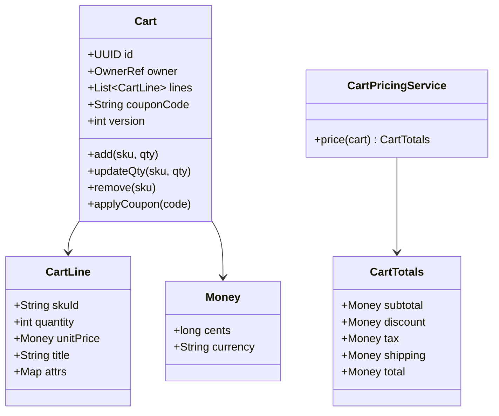
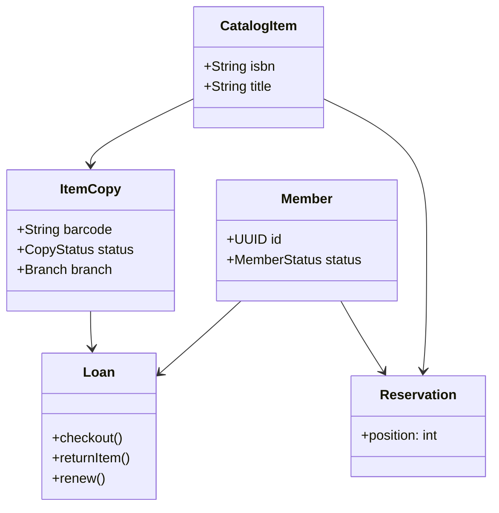

# LLD: Shopping-Cart Object Model (+ Library System Appendix)

> **Focus areas:** Cart aggregate · Line items · Price snapshots · Coupons · Checkout handoff · Guest merge · Concurrency · Persistence · **Appendix:** library borrow/return object model  
> **Style:** LLD / OOD (clarify → scale → classes → algorithms → concurrency → reliability → progressive scale → wrap-up → Q&A)  
> **Quality bar:** Money-safe totals, idempotent checkout start, clear cart vs order boundary, inventory reservation port—not a full ecommerce HLD  
> **Interview theme:** Microsoft — cart **or** library prompts appear; this doc goes **deep on cart** and includes a **library appendix**; Baseline → 10× → 100× → 1,000×

---

## Table of Contents

1. [Clarify Requirements (Interview Q&A)](#1-clarify-requirements-interview-qa)
2. [Complexity & Scale](#2-complexity--scale)
3. [Class Diagrams & Responsibilities](#3-class-diagrams--responsibilities)
4. [Key Algorithms & Code Sketches](#4-key-algorithms--code-sketches)
5. [Concurrency & Edge Cases](#5-concurrency--edge-cases)
6. [Persistence & Database Schema](#6-persistence--database-schema)
7. [Reliability](#7-reliability)
8. [Scalability](#8-scalability)
9. [Wrap-Up](#9-wrap-up)
10. [Deeper / Related Interview Questions](#10-deeper--related-interview-questions)
11. [Appendix A — Library Object Model](#11-appendix-a--library-object-model)
12. [Appendix B — Extras](#12-appendix-b--extras)

---

## 1. Clarify Requirements (Interview Q&A)

Goal: design a **shopping cart object model** (and persistence) supporting guest/user carts, line items, coupon application, tax/shipping hooks, and handoff to checkout/order—correct under concurrent updates and merges.

### 1.0 What this is / is not

| Dimension | This | Not |
|-----------|------|-----|
| Job | Cart domain LLD + schema | Full marketplace HLD |
| Catalog | Product/SKU refs + price port | Search ranking |
| Order | Created at checkout boundary | Warehouse WMS |
| Library | See Appendix A | — |
| Microsoft lens | Clean aggregates, money, races | Coupon ML |

### 1.1 Clarifying questions (cart)

| # | Question | Typical answer | Implication |
|---|----------|----------------|-------------|
| F1 | Guest cart? | Yes — cookie/device id | Anonymous cart id |
| F2 | Login merge? | Merge lines by SKU | Merge policy |
| F3 | Multi-qty? | Yes | Line quantity |
| F4 | Variants? | SKU-level | `sku_id` |
| F5 | Coupons? | One code MVP | `CouponPort` |
| F6 | Inventory? | Soft check on add; reserve on checkout | Ports |
| F7 | Price changes? | Reprice or pin—ask | Snapshot + revalidate |
| F8 | Multi-currency? | Single MVP | `Money` |
| F9 | Saved for later? | Phase 1.5 | Secondary list |
| F10 | Expiry? | TTL guest 30d | Job cleanup |
| F11 | Tax/shipping? | Quote at cart or checkout | Strategy |
| F12 | Idempotent checkout? | Yes | checkoutAttemptId |

**MVP scope:**

1. Add/update/remove line items.  
2. Guest + user carts; merge on login.  
3. Compute subtotal; apply one coupon; tax/shipping estimate hooks.  
4. Start checkout → create order attempt (port); clear/freeze cart.  
5. Schema + optimistic concurrency.  
6. Inventory availability check port.

**Out of MVP:** subscriptions, multi-vendor split carts deep, gift cards ledger.

### 1.2 Scope repeat-back

> Shopping-cart aggregate with SKU lines, money snapshots, coupon and tax/shipping hooks, guest/user merge, and an idempotent checkout handoff—library variant covered in the appendix if the interviewer switches domains.

---

## 2. Complexity & Scale

| Metric | Baseline | 10× | 100× | 1,000× |
|--------|----------|-----|------|--------|
| Active carts | 1M | 10M | 100M | 1B soft/TTL |
| Updates QPS | 1K | 10K | 100K | 1M (sharded) |
| Avg lines/cart | 3–5 | 3–5 | 3–5 | 3–5 |
| Design | PG row + JSON lines | Shard by cart_id | Cart service + Redis hot | Multi-region cart plane + async pricing |

**Note:** Carts are write-heavy, read on every page; cache cart blob per id with version.

---

## 3. Class Diagrams & Responsibilities

### 3.1 Responsibility table (cart)

| Class | Responsibility |
|-------|----------------|
| `Cart` | Aggregate root: id, owner, lines, coupon, version |
| `CartLine` | skuId, qty, unitPrice snapshot, attributes |
| `Money` | amount + currency VO |
| `Coupon` / `AppliedCoupon` | code, discount amount computed |
| `CartPricingService` | subtotal, discounts, tax, shipping, total |
| `CatalogPort` | fetch SKU price/title/availability |
| `InventoryPort` | available qty |
| `CouponPort` | validate + compute discount |
| `TaxPort` / `ShippingPort` | estimates |
| `CheckoutPort` | create order from cart snapshot |
| `CartRepository` | load/save by id |
| `CartService` | use cases |
| `CartMerger` | guest→user merge rules |

### 3.2 Class diagram



### 3.3 Owner model

```text
OwnerRef = UserOwner(user_id) | GuestOwner(guest_token)
Exactly one active open cart per user (product rule)
Guests: one per guest_token
```

### 3.4 Invariants

```text
I1: quantity > 0 for every line; remove if 0
I2: All line currencies == cart currency
I3: version increments every successful mutation
I4: Same sku_id appears at most once (merge qtys)
I5: Checkout consumes cart snapshot at version V (CAS)
I6: Discount <= subtotal (no negative total without store credit)
```

---

## 4. Key Algorithms & Code Sketches

### 4.1 Add item

```python
class CartService:
    def add_item(self, cart_id, sku_id, qty, if_version=None):
        assert qty > 0
        cart = self.repo.lock(cart_id)
        self._check_version(cart, if_version)
        sku = self.catalog.get_sku(sku_id)
        if not sku.active:
            raise Unprocessable("sku")
        avail = self.inventory.available(sku_id)
        line = cart.find_line(sku_id)
        new_qty = (line.quantity if line else 0) + qty
        if new_qty > avail:
            raise Conflict("insufficient stock")
        if line:
            line.quantity = new_qty
            # policy: refresh or keep unitPrice — MVP refresh on add
            line.unit_price = sku.price
        else:
            cart.lines.append(CartLine(sku_id, qty, sku.price, sku.title))
        cart.version += 1
        self.repo.save(cart)
        return self.pricing.price(cart)
```

### 4.2 Pricing

```python
@dataclass
class CartTotals:
    subtotal: Money
    discount: Money
    tax: Money
    shipping: Money
    total: Money

class CartPricingService:
    def price(self, cart: Cart) -> CartTotals:
        sub = Money.zero(cart.currency)
        for line in cart.lines:
            sub += line.unit_price * line.quantity
        discount = Money.zero(cart.currency)
        if cart.coupon_code:
            discount = self.coupons.compute(cart.coupon_code, cart)
            if discount > sub:
                discount = sub
        taxable = sub - discount
        tax = self.tax.estimate(taxable, cart.shipping_address)
        shipping = self.shipping.estimate(cart)
        total = taxable + tax + shipping
        return CartTotals(sub, discount, tax, shipping, total)
```

### 4.3 Coupon apply

```python
    def apply_coupon(self, cart_id, code):
        cart = self.repo.lock(cart_id)
        ok = self.coupons.validate(code, cart)
        if not ok:
            raise Unprocessable("coupon")
        cart.coupon_code = code
        cart.version += 1
        self.repo.save(cart)
        return self.pricing.price(cart)
```

### 4.4 Guest merge on login

```python
class CartMerger:
    def merge(self, user_cart: Cart, guest_cart: Cart) -> Cart:
        # policy: sum quantities per sku; cap at max_per_sku
        for g in guest_cart.lines:
            u = user_cart.find_line(g.sku_id)
            if u:
                u.quantity = min(u.quantity + g.quantity, MAX_QTY)
                # keep user price snapshot or min/max — document: refresh from catalog
            else:
                user_cart.lines.append(g.copy())
        if not user_cart.coupon_code and guest_cart.coupon_code:
            user_cart.coupon_code = guest_cart.coupon_code
        user_cart.version += 1
        self.repo.save(user_cart)
        self.repo.delete(guest_cart.id)
        return user_cart
```

### 4.5 Checkout handoff

```python
    def start_checkout(self, cart_id, attempt_id, address):
        cart = self.repo.lock(cart_id)
        totals = self.pricing.price(cart)
        # revalidate inventory & prices
        for line in cart.lines:
            sku = self.catalog.get_sku(line.sku_id)
            if sku.price != line.unit_price:
                raise Conflict("price_changed", reprice=True)
            if self.inventory.available(line.sku_id) < line.quantity:
                raise Conflict("stock")
        snapshot = CartSnapshot.from_cart(cart, totals, address)
        order = self.checkout.create_order(attempt_id, snapshot)  # idempotent
        cart.freeze_or_clear()  # policy: clear lines; mark CONVERTED
        cart.version += 1
        self.repo.save(cart)
        return order
```

### 4.6 Money VO

```python
@dataclass(frozen=True)
class Money:
    cents: int
    currency: str
    def __add__(self, o):
        self._check(o); return Money(self.cents + o.cents, self.currency)
    def __mul__(self, qty: int):
        return Money(self.cents * qty, self.currency)
```

---

## 5. Concurrency & Edge Cases

### 5.1 Concurrency

| Race | Mitigation |
|------|------------|
| Two tabs update qty | `version` optimistic lock → 409 |
| Merge vs update | Lock user cart row; serialize |
| Double checkout | `attempt_id` unique in order service |
| Coupon single-use | CouponPort redeem at checkout not at apply |
| Inventory steal | Reserve in checkout; not only cart check |

### 5.2 Edge cases

| Case | Behavior |
|------|----------|
| Add qty 0 | Reject |
| Remove missing sku | Idempotent OK |
| Empty checkout | Reject |
| Coupon expires after apply | Fail at checkout revalidate |
| Guest TTL expiry | Soft-delete; client new cart |
| SKU deactivated | Line flagged invalid; block checkout |
| Currency mismatch catalog | Reject add |
| Huge qty | Cap MAX_QTY |
| Negative discount bug | Clamp |
| Tax address missing | Tax=0 estimate + require at checkout |

### 5.3 Cart states

```text
OPEN → CHECKOUT_IN_PROGRESS → CONVERTED
OPEN → ABANDONED (TTL)
CHECKOUT_IN_PROGRESS → OPEN on fail/expire
```

---

## 6. Persistence & Database Schema

### 6.1 Schema options

**A. Normalized lines (good for query/reporting)**  
**B. JSON blob document (good for read-your-writes simplicity)**

MVP interview: normalized + version.

```sql
CREATE TABLE carts (
  id              UUID PRIMARY KEY,
  user_id         UUID NULL,
  guest_token     TEXT NULL,
  currency        CHAR(3) NOT NULL,
  coupon_code     TEXT,
  status          TEXT NOT NULL DEFAULT 'OPEN',
  version         INT NOT NULL DEFAULT 0,
  shipping_address_json JSONB,
  updated_at      TIMESTAMPTZ NOT NULL DEFAULT now(),
  expires_at      TIMESTAMPTZ,
  CHECK (
    (user_id IS NOT NULL AND guest_token IS NULL) OR
    (user_id IS NULL AND guest_token IS NOT NULL)
  )
);

CREATE UNIQUE INDEX uq_cart_user_open ON carts(user_id) WHERE status = 'OPEN' AND user_id IS NOT NULL;
CREATE UNIQUE INDEX uq_cart_guest_open ON carts(guest_token) WHERE status = 'OPEN' AND guest_token IS NOT NULL;

CREATE TABLE cart_lines (
  cart_id         UUID NOT NULL REFERENCES carts(id) ON DELETE CASCADE,
  sku_id          TEXT NOT NULL,
  quantity        INT NOT NULL CHECK (quantity > 0),
  unit_price_cents BIGINT NOT NULL,
  title           TEXT NOT NULL,
  attrs_json      JSONB,
  PRIMARY KEY (cart_id, sku_id)
);

CREATE TABLE checkout_attempts (
  attempt_id      TEXT PRIMARY KEY,
  cart_id         UUID NOT NULL,
  order_id        UUID,
  status          TEXT NOT NULL,
  created_at      TIMESTAMPTZ NOT NULL DEFAULT now()
);
```

### 6.2 Optimistic lock update

```sql
UPDATE carts SET version = version + 1, updated_at = now(), coupon_code = $1
WHERE id = $2 AND version = $3 AND status = 'OPEN';
-- rowcount 0 → conflict
```

### 6.3 Redis acceleration (10×)

```text
cart:{id} -> serialized aggregate + version
TTL refresh on write
On conflict with PG version, reload
```

Hot cart JSON by `cart_id` with version; on CAS fail reload. Not source of truth—PG is.

---

## 7. Reliability

Cart reliability centers on **no double checkout**, **no lost lines under concurrency**, and **money-safe totals**.

### 7.1 Aggregate invariants

1. Line quantities ≥ 1 (or remove line at 0).  
2. At most one active cart per owner scope (user or guest token)—policy.  
3. `version` increments on every successful mutation.  
4. Checkout converts cart once; further checkout with same idempotency key returns same order ref.  
5. Money in integer cents; never float.

### 7.2 Races & locking

| Race | Symptom | Mitigation |
|------|---------|------------|
| Two tabs update qty | Lost update | Optimistic `version` CAS; retry |
| Guest merge + concurrent add | Duplicate/missing lines | Merge under user cart lock/CAS; serialize |
| Double checkout click | Two orders | Idempotency key + unique constraint on `checkout_attempt` |
| Price change mid-checkout | Customer surprise | Reprice at checkout; confirm delta or fail |
| Coupon + inventory race | Oversell / invalid coupon | Reserve stock + redeem coupon in same txn or saga with compensation |

**Idempotency keys:** `Idempotency-Key` on `POST /checkout` stored with response; replays return original `order_id`. Ordinary qty bumps are CAS-versioned.

### 7.3 Data loss

| Scenario | Behavior |
|----------|----------|
| App crash after CAS success | Cart durable in DB; client refreshes |
| Redis eviction of hot cart | Rebuild from PG; brief slower read |
| Abandoned guest cart | TTL job deletes; not loss of paid order |
| Checkout succeeds, response lost | Client retries with same key → same order |

### 7.4 Crash recovery & checkout

```text
checkout(cart_id, idem_key):
  begin
    lock/CAS cart version
    revalidate price + stock reserve
    insert order (UNIQUE idem_key)
    mark cart CONVERTED
  commit
  // outbox: OrderPlaced for payment/fulfillment
```

If process dies after commit but before response: retry is safe. If dies mid-txn: rollback; no order.

### 7.5 Library appendix reliability (when switched)

Borrow/return uses the same ideas: **optimistic version on `Copy`**, idempotent `checkout_loan`, and no double-borrow via unique open loan per copy.

---

## 8. Scalability

### 8.1 Progressive scale

| Stage | QPS / carts | Design | Implication |
|-------|-------------|--------|-------------|
| **Baseline** | ~1K updates, single region PG | Cart aggregate row + JSON/normalized lines | CAS version; pure pricing |
| **10×** | ~10K updates | Redis hot blob + PG truth; read replicas for browse | Invalidate on write |
| **100×** | ~100K | Shard by `cart_id` / tenant; cart microservice | Pricing/tax as ports; checkout saga |
| **1,000×** | Global peak | Multi-region affinity (or CRDT-lite), async enrichment | Avoid cross-region CAS; checkout pinned |

### 8.2 Jump cards

**10×:** “Cache cart document by id+version; PG remains authoritative.”  
**100×:** “Shard carts; keep checkout idempotent; inventory service separate.”  
**1,000×:** “Region-affinity carts; don’t global-lock; merge policies for rare cross-region login.”

### 8.3 Hot spots

- Flash sale: inventory service is the bottleneck, not cart rows.  
- Large B2B carts: normalize lines; paginate UI.  
- Reprice storms: cache catalog quotes; batch tax calls.

### 8.4 Microsoft framing

Similar concerns appear in **Microsoft Store** cart flows: idempotent checkout, money as cents/decimal, clear cart vs order boundary. Library prompt tests the same aggregate discipline on loans.

---

## 9. Wrap-Up

### 9.1 Summary

| Piece | Choice |
|-------|--------|
| Aggregate | `Cart` + `CartLine` |
| Money | Integer cents VO |
| Pricing | Pure function + ports |
| Concurrency | Version CAS |
| Checkout | Idempotent attempt + snapshot |
| Guest | Token cart + merge |

### 9.2 30-second pitch

> The cart is an aggregate of SKU lines with versioned updates. Pricing is a pure calculation over snapshots plus coupon/tax/shipping ports. Guests merge into user carts by summing quantities. Checkout revalidates price and stock, creates an order idempotently from a snapshot, and converts the cart—so the cart never becomes a second source of truth for purchased orders.

### 9.3 Trade-offs

1. Pin prices in cart vs always live reprice.  
2. Redeem coupon early vs at checkout.  
3. JSON document vs normalized lines.  
4. Reserve inventory on add (bad UX) vs checkout (oversell window).

---

## 10. Deeper / Related Interview Questions

### 10.1 Cart domain

**Q1: Why cart ≠ order?**  
A: Cart is mutable intent; order is immutable purchase record after checkout snapshot.

**Q2: Money as float?**  
A: Never—use integer cents or decimal type with explicit currency.

**Q3: Guest merge algorithm?**  
A: Sum quantities per SKU; single CAS on user cart; retire guest token.

**Q4: Coupon apply failures?**  
A: Validate predicates; store code on cart; re-validate at checkout.

**Q5: Pin price vs live reprice?**  
A: Pin stabilizes UX; live avoids stale deals—reprice at checkout either way.

### 10.2 Reliability

**Q6: Lost update on two tabs?**  
A: `UPDATE ... WHERE version=?`; on 0 rows, reload and retry or 409.

**Q7: Double checkout?**  
A: Unique idempotency key → one order; second request returns same order id.

**Q8: Payment captured twice?**  
A: Payment port keyed by `order_id`; outbox once; provider idempotency.

**Q9: Redis and PG diverge?**  
A: PG wins; Redis acceleration; version mismatch → refresh from PG.

**Q10: Partial checkout after reserve?**  
A: Compensating release stock; cart stays ACTIVE; retry with same key if order insert failed.

### 10.3 Scale

**Q11: 10×?**  
A: Redis hot carts + indexes on owner; connection pooling.

**Q12: 100×?**  
A: Shard by cart_id hash; cart service owns mutations; catalog/inventory remote.

**Q13: 1,000× global?**  
A: Regional cart affinity; checkout in home region; accept merge edge cases.

**Q14: Flash sale fairness?**  
A: Inventory counters; cart lines don’t reserve until checkout (or short TTL holds).

**Q15: CRDT carts?**  
A: Usually overkill; CAS + retry suffices; CRDT mainly for offline-first without server serialize.

### 10.4 Library switch + Microsoft

**Q16: Interview switches to library?**  
A: Same aggregate patterns—Appendix A: `Copy`, `Loan`, reservation, fines.

**Q17: Idempotent borrow?**  
A: Unique open loan per copy; request key on borrow API.

**Q18: GDPR delete guest cart?**  
A: Delete by guest token; scrub PII; retain anonymized orders per policy.

**Q19: GraphQL cart?**  
A: Mutations with version; avoid huge nested prices without dataloaders.

**Q20: Board order?**  
A: Cart/lines/money → add/update CAS → pricing ports → guest merge → checkout idempotency → scale jumps.

---

## 11. Appendix A — Library Object Model

When the interviewer asks for a **library system** (online + offline customers) instead of a cart, reuse the same LLD discipline with this domain.

### A.1 Clarifying snapshot

| Topic | MVP answer |
|-------|------------|
| Actors | Member, Librarian, Guest browser |
| Items | Book (ISBN) with copy instances |
| Ops | Search, borrow, return, reserve, renew, fines |
| Offline | Branch visits; sync to central catalog |

### A.2 Responsibility table

| Class | Responsibility |
|-------|----------------|
| `Library` / `Branch` | Location; shelves |
| `CatalogItem` (Work) | Title, ISBN, authors |
| `ItemCopy` | Barcode, status, branch |
| `Member` | Account, status, contact |
| `Loan` | Member + copy + due date |
| `Reservation` | Hold queue on CatalogItem |
| `Fine` | Amount, reason, payment |
| `LibrarianService` | Checkin/checkout use cases |
| `Policy` | Max loans, loan days, renew limits |

### A.3 Enums

```text
CopyStatus: AVAILABLE | ON_LOAN | RESERVED | LOST | REPAIR
LoanStatus: ACTIVE | RETURNED | OVERDUE | LOST
MemberStatus: ACTIVE | BLOCKED | EXPIRED
```

### A.4 Class diagram (compact)



### A.5 Invariants

```text
L1: Copy ON_LOAN iff exactly one ACTIVE loan
L2: Member active loans <= policy.max
L3: Cannot checkout if fines > threshold or BLOCKED
L4: Reservation fulfills to AVAILABLE copy → notify → hold shelf TTL
```

### A.6 Checkout sketch

```python
def checkout(member_id, barcode):
    member = members.lock(member_id)
    policy.assert_can_borrow(member)
    copy = copies.lock(barcode)
    if copy.status != AVAILABLE:
        raise Conflict()
    loan = Loan(member, copy, due=today()+policy.days)
    copy.status = ON_LOAN
    loans.save(loan); copies.save(copy)
```

### A.7 Return + reservation

```python
def return_copy(barcode):
    copy = copies.lock(barcode)
    loan = loans.active_for(copy)
    loan.close(now())
    fine = policy.fine_if_overdue(loan)
    if fine: fines.add(member, fine)
    nxt = reservations.next(copy.catalog_item_id)
    if nxt:
        copy.status = RESERVED
        holds.create(nxt, copy, expire=now()+3d)
        notify(nxt.member)
    else:
        copy.status = AVAILABLE
```

### A.8 Schema sketch

```sql
catalog_items(isbn PK, title, authors...)
item_copies(barcode PK, isbn FK, branch_id, status)
members(id PK, status, email)
loans(id PK, member_id, barcode, checked_out_at, due_at, returned_at, status)
reservations(id PK, isbn, member_id, position, status)
fines(id PK, member_id, cents, status)
```

Unique active loan per copy:

```sql
CREATE UNIQUE INDEX uq_active_loan_copy ON loans(barcode) WHERE status = 'ACTIVE';
```

### A.9 Online vs offline

| Mode | Behavior |
|------|----------|
| Online catalog | Read replicas; search index |
| Offline branch | Local checkout cache; sync queue; conflict = central wins on copy status |
| Guest | Browse only; no borrow |

### A.10 30-second library pitch

> Works vs copies: members borrow **copies**, reserve **works**. Loans are the aggregate for checkout/return; policies enforce limits and fines. A unique active loan per barcode prevents double checkout—the same CAS mindset as cart checkout.

---

## 12. Appendix B — Extras

### B.1 Cart HTTP API

```http
POST /v1/carts
POST /v1/carts/{id}/lines
PATCH /v1/carts/{id}/lines/{sku}
DELETE /v1/carts/{id}/lines/{sku}
POST /v1/carts/{id}/coupon
GET  /v1/carts/{id}
POST /v1/carts/{id}/checkout
POST /v1/carts/merge
```

### B.2 Sample totals JSON

```json
{
  "subtotal_cents": 5000,
  "discount_cents": 500,
  "tax_cents": 360,
  "shipping_cents": 0,
  "total_cents": 4860,
  "currency": "USD",
  "version": 9
}
```

### B.3 Interview board order (cart)

1. Cart vs Order boundary  
2. Line + Money  
3. Versioning  
4. Merge  
5. Checkout idempotency  
6. Schema  

### B.4 Interview board order (library)

1. Work vs Copy  
2. Loan state  
3. Reservation queue  
4. Fines policy  
5. Unique constraints  

### B.5 Related Microsoft prompts

- Shopping cart HLD  
- Online marketplace  
- Library online/offline system HLD  

### B.6 Coupon types (extension)

```text
PERCENT_OFF, AMOUNT_OFF, FREE_SHIPPING, BUY_X_GET_Y
Engine: rules list with priority; MVP one code
```

### B.7 Abandoned cart job

```text
UPDATE carts SET status='ABANDONED'
WHERE status='OPEN' AND expires_at < now();
```

### B.8 Testing checklist (cart)

- [ ] Merge sums  
- [ ] Version conflict  
- [ ] Double checkout attempt_id  
- [ ] Price change at checkout  
- [ ] Coupon clamp  

### B.9 Testing checklist (library)

- [ ] Double checkout same barcode  
- [ ] Blocked member  
- [ ] Hold expiry returns to AVAILABLE  
- [ ] Renew past max  

### B.10 Final signal

For cart: **versioned aggregate + checkout snapshot**. For library: **copy uniqueness + loan aggregate**. Same interview muscle—invariants and ports.

---

*End of shopping-cart (+ library appendix) LLD.*
