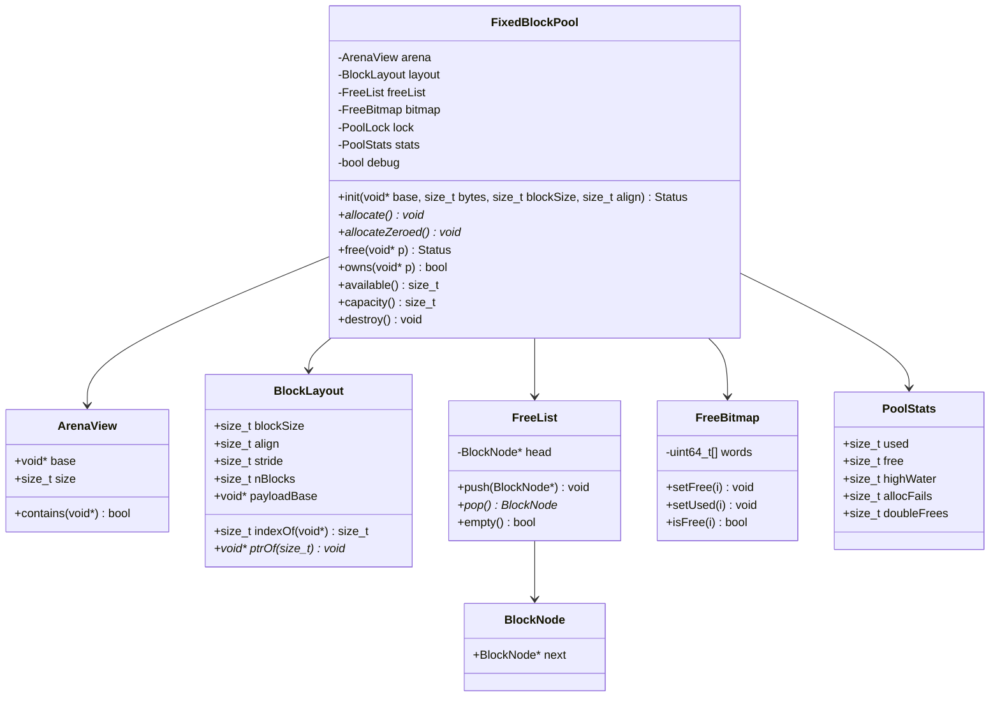

# LLD: Fixed-Size-Block Memory Manager

> **Focus areas:** Free list · Bitmap · O(1) alloc/free · Alignment · Thread safety · Canaries / debug · No `malloc`/`free`/`new`/`delete` in the manager itself  
> **Style:** LLD interview (clarify → NFRs → cases → classes → algorithms/pseudocode → concurrency → reliability/scalability/maintainability → wrap-up → Q&A → appendices)  
> **Quality bar:** True O(1) hot path, clear ownership of the backing arena, no hidden heap use, race-free under concurrent alloc/free, debuggable corruption paths  
> **Interview theme:** NVIDIA — **kernel / driver / firmware / CUDA runtime** style low-level design; arena carved from a caller-supplied buffer (or static BSS / boot allocator)

---

## Table of Contents

1. [Clarify Requirements (Interview Q&A)](#1-clarify-requirements-interview-qa)
2. [Non-Functional Requirements](#2-non-functional-requirements)
3. [Cases](#3-cases)
4. [Object Model & Class Diagrams](#4-object-model--class-diagrams)
5. [Public APIs / Interfaces](#5-public-apis--interfaces)
6. [Key Algorithms & Pseudocode](#6-key-algorithms--pseudocode)
7. [Concurrency & Consistency](#7-concurrency--consistency)
8. [Debugging, Canaries & Corruption](#8-debugging-canaries--corruption)
9. [Design Deep Dive](#9-design-deep-dive)
10. [Reliability](#10-reliability)
11. [Scalability](#11-scalability)
12. [Maintainability](#12-maintainability)
13. [Wrap-Up](#13-wrap-up)
14. [Deeper / Related Interview Questions](#14-deeper--related-interview-questions)
15. [Appendices](#15-appendices)

---

## 1. Clarify Requirements (Interview Q&A)

Goal: design a **fixed-size-block memory manager** that carves a caller-provided (or statically reserved) arena into equal-sized blocks and provides **O(1)** `allocate` / `free`, **without calling** `malloc` / `free` / `new` / `delete` inside the implementation.

### 1.0 What this is / is not

| Dimension | This doc | Not this |
|-----------|----------|----------|
| Job | Fixed block pool / slab cell | General variable-size malloc (separate doc) |
| Heap | Arena given up front | Growing via `sbrk`/`mmap` as MVP |
| Fragmentation | External N/A (fixed size); internal = unused bytes in block | Coalescing / buddy |
| NVIDIA lens | Driver pools, firmware arenas, GPU host staging cells | Userspace glibc internals only |

### 1.1 Clarifying questions (ask aloud)

| # | Question | Typical answer | Implication |
|---|----------|----------------|-------------|
| F1 | Block size? | Compile-time or init-time constant `B` | All cells identical |
| F2 | Capacity? | `N` blocks from arena of size ≥ metadata + `N*B` | Precompute layout |
| F3 | Who owns arena? | Caller supplies `void* base, size_t bytes` | No heap growth in MVP |
| F4 | Alignment? | Blocks aligned to `max(alignof(max_align_t), user_align)` | Padding in layout |
| F5 | Thread safety? | Ask — single-thread first, then concurrent | Lock / lock-free free list |
| F6 | OOM behavior? | Return `nullptr` / error code | Never abort silently |
| F7 | Double-free? | Detect in debug; UB or error in release | Canary + free-bit |
| F8 | Free invalid ptr? | Detect if in range + aligned | Bounds check |
| F9 | Zeroing? | Optional `allocateZeroed` | Explicit API |
| F10 | Stats? | free/used counts, high-water | Counters |
| F11 | Multiple sizes? | Out of MVP — use N managers or size-class doc | Composition |
| F12 | NUMA / GPU? | Optional: pin arena; device-side separate | Call out |

**MVP scope:**

1. Init from caller buffer; lay out header + free structure + `N` payload blocks.  
2. `allocate()` / `free(ptr)` in O(1).  
3. Alignment guarantees documented.  
4. Debug mode: canaries, double-free detection, optional poison.  
5. Thread-safe variant with clear trade-offs.  
6. No calls to system heap APIs inside the manager.

**Out of MVP:** variable sizes, growable heap, cross-process shared arenas (mention only), full sanitizer integration.

### 1.2 Scope repeat-back

> Fixed-size pool over a caller-owned arena: free-list (and/or bitmap) for O(1) alloc/free, aligned blocks, optional mutex/lock-free concurrency, debug canaries—never `malloc`/`new` inside the manager.

### 1.3 Semantics (lock early)

```text
init(arena, arena_bytes, block_size, align):
  compute N, layout metadata + blocks
  all blocks start FREE

allocate():
  if no free block → null
  else → take one FREE → mark USED → return payload pointer

free(p):
  validate p ∈ arena, aligned to block, currently USED
  mark FREE → return to free structure
```

**Fragmentation:** for fixed-size blocks, **external fragmentation is N/A**. Internal waste = `block_size - requested` if API accepts “up to B” objects; if API is “always B”, internal waste is the caller’s problem.

---

## 2. Non-Functional Requirements

| # | NFR | Target | Why |
|---|-----|--------|-----|
| N1 | Alloc latency | O(1), p99 tens of ns in-process (unlocked) | ISR / hot path friendly |
| N2 | Free latency | O(1) | Symmetric |
| N3 | Determinism | No hidden syscalls on hot path | Real-time / driver |
| N4 | Correctness | No double-issue of same block | Memory safety |
| N5 | Debuggability | Canaries + poison in debug builds | Catch UAF / overflow |
| N6 | Thread safety | Documented model; no data races | Multi-threaded drivers |
| N7 | Footprint | Metadata ≪ payload; predictable | Embedded / firmware |
| N8 | Portability | Pure pointer arithmetic; no libc heap | Cross platform |

### 2.1 Progressive scale (object-system view)

| Metric | Base | 10× | 100× |
|--------|------|-----|------|
| Blocks N | 1K | 10K | 100K–1M |
| Threads | 1 | 8–32 | many cores |
| Design shift | Intrusive free list | Sharded pools | Per-CPU caches + central pool |
| Arena size | MBs | tens of MB | GBs (host) / carve device heaps separately |

### 2.2 Complexity targets

| Op | Time | Space |
|----|------|-------|
| allocate | O(1) | O(N) metadata total |
| free | O(1) | |
| owns(ptr) | O(1) | |
| stats | O(1) | |

---

## 3. Cases

### 3.1 Happy paths

1. Init 1024 blocks of 64B → allocate until empty → free all → allocate again succeeds.  
2. Aligned arena → every returned pointer `% align == 0`.  
3. Concurrent alloc from 8 threads with mutex → no duplicate pointers.  
4. Debug build: write past end → canary trip on free.  
5. `allocateZeroed` returns memory that reads as zero.

### 3.2 Edge / failure cases

| Case | Behavior |
|------|----------|
| Arena too small for one block | `init` fails |
| allocate when empty | `nullptr` / `NO_MEMORY` |
| free(nullptr) | no-op or error (pick + document) |
| double-free | debug: assert/error; release: detect via free-bit or corrupt list |
| free pointer not from pool | reject |
| free misaligned interior pointer | reject |
| free after destroy | UB — document lifetime |
| concurrent free same block | must not corrupt free list |
| overflow write into next block | canary detects on free (debug) |
| use-after-free | poison pattern helps ASAN-like catch in tests |

### 3.3 Invariants

```text
I1: Exactly N blocks; used + free == N
I2: Every FREE block appears exactly once in free structure
I3: Every USED block appears in no free structure
I4: Returned pointers are block-aligned and within [payload_base, payload_end)
I5: Manager never calls malloc/free/new/delete
I6: Metadata never overlaps payload (except intrusive next stored in free payload)
```

---

## 4. Object Model & Class Diagrams

### 4.1 Core entities

| Class | Responsibility |
|-------|----------------|
| `FixedBlockPool` | Public façade: init/alloc/free/stats |
| `ArenaView` | `base`, `size`; bounds checks |
| `BlockLayout` | Computes offsets, `N`, stride, alignment |
| `FreeList` | Intrusive singly linked list of free blocks |
| `FreeBitmap` | Optional bitset of free/used (O(1) with freelist hybrid) |
| `BlockHeader` / canary region | Debug metadata around payload |
| `PoolStats` | used, free, high_water, alloc_fail |
| `PoolLock` | Mutex / spinlock / none |
| `DebugGuard` | Poison, canary verify |

**Two classic designs (discuss both):**

1. **Intrusive free list:** store `next` inside free block payload — zero extra per-block RAM when free.  
2. **Bitmap + stack of indices:** separate bit array; index stack for O(1); payload pristine.

Hybrid: freelist for O(1) + bitmap for O(1) “is this block free?” validation.

### 4.2 Class diagram



### 4.3 Memory layout (diagram)

```text
arena base
┌──────────────────┬────────────────────────────┬────────────────────────────┐
│ PoolControlBlock │ optional bitmap (ceil(N/8))│ Block[0] ... Block[N-1]    │
│ (this object OR  │                            │ each: [canary_lo][payload] │
│  colocated hdr)  │                            │       [canary_hi] (debug)  │
└──────────────────┴────────────────────────────┴────────────────────────────┘
     ↑ must not use heap                          ↑ all same stride S
```

**Intrusive free list when FREE:**

```text
Block payload bytes reinterpreted as:
┌──────────────┬─────────────────┐
│ next*        │ unused...       │
└──────────────┴─────────────────┘
```

---

## 5. Public APIs / Interfaces

```cpp
enum class Status { Ok, InvalidArg, NoMemory, Corrupt, DoubleFree, NotOwned };

struct PoolConfig {
  size_t block_size;   // payload size visible to user (or total stride—be explicit)
  size_t alignment;    // >= alignof(void*)
  bool   debug_canaries;
  bool   thread_safe;
};

class FixedBlockPool {
public:
  Status init(void* arena, size_t arena_bytes, const PoolConfig& cfg);
  void*  allocate();
  void*  allocate_zeroed();
  Status free(void* p);
  bool   owns(const void* p) const;
  size_t capacity() const;
  size_t available() const;
  PoolStats stats() const;
  void   destroy();  // does not free arena; only resets state
};
```

**Placement:** Prefer `FixedBlockPool` living *inside* the arena’s control block (placement new / manual init) so even the manager object needs no heap.

**C-style NVIDIA driver flavor:**

```c
typedef struct fb_pool fb_pool_t;
int  fb_pool_init(fb_pool_t* p, void* arena, size_t n, size_t block, size_t align);
void* fb_pool_alloc(fb_pool_t* p);
int  fb_pool_free(fb_pool_t* p, void* ptr);
```

---

## 6. Key Algorithms & Pseudocode

### 6.1 Layout computation

```text
function compute_layout(arena_base, arena_bytes, block_size, align, debug):
  assert is_power_of_two(align)
  ctrl_size = align_up(sizeof(ControlBlock), align)
  canary = debug ? 2 * sizeof(uint32_t) : 0
  stride = align_up(block_size + canary, align)

  // bitmap after control (optional)
  // We need N such that ctrl + bitmap(N) + N*stride <= arena_bytes
  // Solve by iteration or closed form approximation then clamp:

  rem = arena_bytes - ctrl_size
  // lower bound ignore bitmap first
  n_guess = rem / stride
  loop:
    bitmap_bytes = align_up(ceil(n_guess / 8), align)
    if ctrl_size + bitmap_bytes + n_guess * stride <= arena_bytes:
      break
    n_guess -= 1
    if n_guess == 0: return error

  payload_base = arena_base + ctrl_size + bitmap_bytes
  // ensure payload_base aligned
  payload_base = align_up_ptr(payload_base, align)
  // recompute N if alignment ate space
  n = (arena_base + arena_bytes - payload_base) / stride
  return Layout{n, stride, payload_base, bitmap_bytes}
```

### 6.2 Init — build free list

```text
function init(pool, arena, bytes, cfg):
  layout = compute_layout(...)
  if layout.n == 0: return InvalidArg
  pool.layout = layout
  pool.bitmap.clear_all_free()   // or all free bits = 1
  pool.freeList.head = null

  for i from layout.n-1 down to 0:   // push high→low so alloc returns low addresses first (optional)
    node = (BlockNode*) layout.ptrOf(i)
    if cfg.debug: write_canaries(node)
    freeList.push(node)
    bitmap.setFree(i)

  pool.stats = {used:0, free:layout.n, highWater:0, ...}
  return Ok
```

### 6.3 Allocate (O(1))

```text
function allocate(pool) -> void*:
  optional lock(pool.lock)

  node = freeList.pop()
  if node == null:
    stats.allocFails++
    unlock; return null

  i = layout.indexOf(node)
  assert bitmap.isFree(i)
  bitmap.setUsed(i)

  if debug:
    verify_canaries(node)        // should still be intact while free
    poison_payload(node, 0xA5)   // optional: catch UAF reads differently
    // or leave uninitialized for speed

  stats.used++; stats.free--
  stats.highWater = max(highWater, used)

  unlock
  return payload_ptr(node)   // skip low canary if present
```

### 6.4 Free (O(1))

```text
function free(pool, p) -> Status:
  if p == null: return Ok          // or InvalidArg — document
  optional lock

  if not owns(p): unlock; return NotOwned
  node = block_from_payload(p)
  i = layout.indexOf(node)

  if bitmap.isFree(i):
    stats.doubleFrees++
    unlock; return DoubleFree

  if debug:
    if not verify_canaries(node): unlock; return Corrupt
    poison_payload(node, 0xDD)   // classic MSVC free fill

  bitmap.setFree(i)
  freeList.push(node)
  stats.used--; stats.free++

  unlock
  return Ok
```

### 6.5 owns / index

```text
function owns(p):
  if p < payload_base or p >= payload_end: return false
  off = (uint8_t*)p - (uint8_t*)payload_base
  // if canaries: adjust to block base
  if off % stride != payload_offset_in_stride: return false
  return true

function indexOf(block_base):
  return ((uint8_t*)block_base - (uint8_t*)payload_base) / stride
```

### 6.6 Bitmap-only allocate (alternative, still O(1) with index stack)

If intrusive list undesirable (payload must stay clean even when free for DMA inspection):

```text
// FreeIndexStack: array of size_t indices, length = free_count
allocate:
  if stack.empty: return null
  i = stack.pop()
  bitmap.setUsed(i)
  return ptrOf(i)

free:
  validate + bitmap was used
  bitmap.setFree(i)
  stack.push(i)
```

Stack storage lives in arena metadata region — still no `malloc`.

---

## 7. Concurrency & Consistency

### 7.1 The race

Two threads `pop` same `head` → both get same block → **double alloc**.  
Two threads free and push → lost node in list → **leak** or cycle.

### 7.2 Solutions

| Approach | Pros | Cons |
|----------|------|------|
| Single mutex / spinlock around alloc+free | Simple, correct | Contended at high QPS |
| Lock-free Treiber stack (CAS on head) | Fast | ABA; need tagged ptr or hazard |
| Per-thread caches + central pool | Scales | Memory imbalance; steal |
| Sharded pools (N arenas) | Easy | Caller chooses shard |

**Recommended interview answer:** MVP = **spinlock** protecting freelist+bitmap+stats. Mention **Treiber stack** + ABA (tag with bump counter in high bits on 64-bit). For driver softirqs: prefer spinlock with correct IRQ discipline.

### 7.3 Lock-free free list sketch (advanced)

```text
struct Head { BlockNode* ptr; uintptr_t tag; }; // 128-bit CAS or ptr|tag

pop:
  loop:
    h = atomic_load(head)
    if h.ptr == null: return null
    next = h.ptr->next          // DANGER: h.ptr may be concurrently reused (ABA)
    newh = {next, h.tag+1}
    if CAS(head, h, newh): return h.ptr

push:
  loop:
    h = atomic_load(head)
    node->next = h.ptr
    newh = {node, h.tag+1}
    if CAS(head, h, newh): return
```

**ABA fix:** tagged head, or never reuse nodes for stack while popped without epoch/hazard (harder). For interview: name ABA, prefer mutex unless asked for lock-free.

### 7.4 Bitmap + list atomicity

Under concurrency, **bitmap and freelist must update in one critical section** (or use carefully ordered lock-free protocol). Never set USED then fail to remove from list.

### 7.5 Re-entrancy

Document: alloc/free not safe to call from their own hooks; no callbacks while holding lock unless re-entrant lock (usually avoid).

---

## 8. Debugging, Canaries & Corruption

### 8.1 Canary placement

```text
Block stride layout (debug):
[ magic_lo: u32 ][ payload block_size ][ magic_hi: u32 ][ pad to align ]
magic = 0xC5A31C5A ^ (index * FNV)
```

On free: verify both magics. On alloc from free: verify still intact (detects wild writes into free blocks).

### 8.2 Poison patterns

| State | Pattern | Purpose |
|-------|---------|---------|
| Fresh alloc (debug) | `0xA5` | Uninitialized use |
| Freed | `0xDD` | UAF read |
| Guard | canary magic | Overflow/underflow |

### 8.3 Free-bit vs list membership

Bitmap `isFree` catches double-free in O(1) without walking the list. Keep bitmap even if freelist is primary.

### 8.4 Red zones

Optional: increase stride with unmapped guard pages between blocks — heavy; usually for ASAN, not embedded pools.

---

## 9. Design Deep Dive

### 9.1 Why fixed blocks at NVIDIA

- GPU driver command buffers, fence objects, small descriptor nodes.  
- Firmware message queues.  
- Real-time paths that **cannot** take page faults or heap locks.  
- Predictable worst-case latency.

### 9.2 Free list vs bitmap vs both

| Structure | Alloc | Free | Double-free detect | Payload when free |
|-----------|-------|------|--------------------|-------------------|
| Intrusive LIFO list | O(1) | O(1) | hard alone | overwritten by `next` |
| Bitmap scan | O(N) | O(1) | easy | pristine |
| Bitmap + index stack | O(1) | O(1) | easy | pristine |
| List + bitmap | O(1) | O(1) | easy | intrusive |

**Interview pick:** list + bitmap.

### 9.3 Alignment & GPU / DMA

If blocks feed DMA: ensure align ≥ device requirement (e.g. 64B, 256B). Avoid storing intrusive `next` if hardware may snoop free buffers—use index stack instead.

### 9.4 Placement of ControlBlock

```text
Option A: ControlBlock is separate stack/global object; arena is pure blocks
Option B: ControlBlock carved at arena start (self-contained region)
```

Option B is nicer for “one blob” firmware images.

### 9.5 Multiple block sizes

Compose: `Map<size, FixedBlockPool>` or array of pools for size classes — bridge to general allocator doc. Still no general coalescing.

### 9.6 Failure modes

| Failure | Mitigation |
|---------|------------|
| Metadata corruption | Canaries; magic in ControlBlock |
| Arena overlap with stack | Caller contract; init asserts |
| Wrong align | Reject init |
| Stats drift | Update only under same lock as list |
| Destroy while threads alloc | Lifetime protocol / RCU epoch |

### 9.7 Observability

Counters: `alloc_ok`, `alloc_fail`, `free_ok`, `double_free`, `canary_fail`, `used`, `high_water`.  
Optional: histogram of hold time if timestamps stamped in debug headers (costs space).

### 9.8 Testing strategy

| Test | Assert |
|------|--------|
| Exhaustion | N allocs ok; N+1 null |
| Free-all-realloc | Same capacity |
| Unique pointers | Set size == N when full |
| Alignment | `ptr & (align-1) == 0` |
| Double-free | Status::DoubleFree |
| Concurrent | Threads × ops; no duplicate live ptrs |
| Canary | Deliberate overflow → Corrupt on free |
| No heap | Link with malloc interposer that aborts |

### 9.9 Deal-breakers

- Calling `malloc` “just for the free list nodes”  
- O(N) scan for free bit without stack/list  
- Forgetting alignment on payload_base  
- Updating list without bitmap (or vice versa) under threads  
- Treating external fragmentation as a problem (wrong concept here)

---

## 10. Reliability

### 10.1 Invariants under failure

1. Partial `allocate` must not leak a block (pop only after validation; or pop then rollback on failure).  
2. `free` of unknown pointer must not push garbage into freelist.  
3. Debug checks may return errors; release builds may `assert` or harden with bitmap only.

### 10.2 Corruption containment

On `Corrupt`: freeze pool (fail further allocs), emit telemetry — better than continuing with corrupted freelist (use-after-corruption → security issues).

### 10.3 Idempotency

`free(nullptr)` idempotent if defined as no-op. Double-free is **not** idempotent success—return error.

### 10.4 Lifetime

```text
init → [alloc/free]* → destroy
destroy does not release arena memory (caller owns it)
dangling pool use after destroy = bug
```

---

## 11. Scalability

### 11.1 Progressive scale table

| Stage | Context | Shape | LLD implication |
|-------|---------|-------|-----------------|
| **Baseline** | 1 thread, ≤10⁴ blocks | Mutex or unlocked freelist | Prove O(1) + layout |
| **10×** | Multi-thread driver | Spinlock / Treiber | Name ABA |
| **100×** | Many cores, hot alloc | Per-CPU caches of K blocks | Refill from central |
| **1,000×** | Process-wide / multi-GPU host | Sharded arenas; NUMA bind | Avoid one global lock |

### 11.2 Per-CPU cache sketch

```text
alloc:
  if cpu_cache[cpu].empty:
    steal batch of K from central under lock
  return cpu_cache[cpu].pop()

free:
  if cpu_cache[cpu].size >= Kmax:
    return batch to central
  else cpu_cache[cpu].push(p)
```

Trade-off: blocks cached on idle CPUs → apparent OOM while global free > 0. Mitigate with steal-from-remote.

### 11.3 What does not scale

One global lock at extreme alloc rates; giant single list with false sharing on `head` cache line—pad `head` / use shards.

---

## 12. Maintainability

| Practice | Why |
|----------|-----|
| Single layout module | Alignment bugs concentrate there |
| Debug/release via `if (debug)` or template policy | Zero cost in shipping |
| Explicit Status codes | No errno soup |
| Invariant checker `validate()` | Walk list + bitmap cross-check in tests |
| No virtual calls on hot path | Predictable codegen |
| Document ownership of arena | API contract in header |

**Open/Closed:** new debug features (stack traces per alloc) via optional header slab without changing alloc signature.

---

## 13. Wrap-Up

### 13.1 60-second narrative

"We take a caller-owned arena, compute an aligned stride, and manage `N` identical blocks with an **intrusive freelist** plus a **bitmap** for validation. Alloc/free are O(1) pops/pushes. No `malloc`/`new` inside. Concurrency starts with a spinlock; we can discuss Treiber stacks and ABA or per-CPU caches. Debug canaries and poison catch overflows and UAF. External fragmentation isn't a thing for fixed-size pools—capacity planning is."

### 13.2 What interviewers grade

| Signal | Show |
|--------|------|
| Constraints | No heap APIs in implementation |
| Complexity | True O(1) structure |
| Layout | Alignment + metadata math |
| Concurrency | Race + lock/CAS + ABA |
| Debug | Canaries / double-free |
| Systems taste | Per-CPU, DMA alignment |

### 13.3 Closing cheat sheet

| Topic | Answer |
|-------|--------|
| Free structure | Intrusive LIFO + bitmap |
| OOM | nullptr / Status |
| Fragmentation | N/A externally |
| Double-free | Bitmap check |
| Threads | Lock; mention ABA |
| Kill | Hidden malloc; O(N) scan; ignore align |

---

## 14. Deeper / Related Interview Questions

### 14.1 Core LLD

**Q1: Why intrusive freelist?**  
A: Zero extra storage per free block; nodes are the blocks.

**Q2: When is intrusive a bad idea?**  
A: DMA engines reading “free” buffers; security wanting scrubbed payloads; tools that dump payload.

**Q3: How do you compute N safely?**  
A: Account control + bitmap + align padding; iterate down; never overflow size_t.

**Q4: Is bitmap alone O(1) alloc?**  
A: No if you scan bits—need ffs on words carefully still O(N/64) worst; pair with stack/list.

**Q5: Alignment of 24-byte payload with 16-byte align?**  
A: stride = align_up(24+canaries, 16).

### 14.2 Concurrency & reliability

**Q6: Explain ABA on freelist.**  
A: Pop A; free A; alloc A again; concurrent pop still has old next → CAS succeeds wrongly.

**Q7: Can you use `shared_ptr` for blocks?**  
A: That allocates control blocks from heap—violates constraint unless custom allocator carefully; usually no.

**Q8: What if free list is corrupted to point outside?**  
A: `owns`/`indexOf` checks before use; magic in ControlBlock; fail closed.

**Q9: Real-time bound?**  
A: Unlocked or bounded spin; no page fault; arena prefaulted / unevictable.

### 14.3 NVIDIA flavor

**Q10: Host vs device memory pools?**  
A: Same algorithmic shape; device pool may live in BAR/VRAM with different align and no intrusive if GPU reads.

**Q11: Relationship to CUDA caching allocator?**  
A: Caching allocator is variable-size + stream awareness; fixed pool is a building block for same-size objects.

**Q12: Use in interrupt context?**  
A: Spinlock variant; no sleeping mutex; no allocation that can schedule.

---

## 15. Appendices

### A. Minimal C++-like implementation sketch

```cpp
struct alignas(64) FixedBlockPool {
  struct Node { Node* next; };

  uint8_t* base{};
  size_t   arena_size{};
  size_t   stride{};
  size_t   n{};
  uint8_t* payload{};
  Node*    free_head{};
  uint64_t* bitmap{};      // n bits
  size_t   used{};
  bool     debug{};
  SpinLock lock{};

  Status init(void* arena, size_t bytes, size_t block, size_t align, bool dbg);
  void*  allocate();
  Status free(void* p);
};

void* FixedBlockPool::allocate() {
  LockGuard g(lock);
  Node* n = free_head;
  if (!n) return nullptr;
  free_head = n->next;
  size_t i = index_of(n);
  bitmap_set_used(i);
  used++;
  return payload_from(n);
}

Status FixedBlockPool::free(void* p) {
  LockGuard g(lock);
  if (!owns(p)) return Status::NotOwned;
  Node* n = node_from(p);
  size_t i = index_of(n);
  if (bitmap_is_free(i)) return Status::DoubleFree;
  if (debug && !canary_ok(n)) return Status::Corrupt;
  bitmap_set_free(i);
  n->next = free_head;
  free_head = n;
  used--;
  return Status::Ok;
}
```

### B. Worked numeric example

```text
arena = 4096 bytes at 0x1000
block_size = 64, align = 64, debug on, no canaries
ctrl = 128 (aligned)
bitmap for n≈60 → 8 bytes → align 64 → 64
payload_base = 0x1000+128+64 = 0x10C0 → already aligned
n = (4096 - 192) / 64 = 3904/64 = 61 blocks
```

### C. Invariant validator

```text
function validate(pool):
  seen = 0
  for node in walk(free_head):
    assert owns(node) and bitmap.isFree(index(node))
    seen++
    assert seen <= n
  assert seen == n - used
  for i in 0..n-1:
    if bitmap.isFree(i): must be reachable from list
```

### D. Comparison table

| Allocator | Size | Coalesce | Syscalls | Typical use |
|----------|------|---------|----------|-------------|
| FixedBlockPool | fixed | n/a | none hot | drivers, RT |
| Buddy | pow2 | yes | optional | kernels |
| Slab/SLUB | classes | n/a per class | rare | kernels |
| jemalloc/tcmalloc | classes | yes | mmap batch | apps |

### E. Interview whiteboard order

1. Constraints: no malloc, fixed B, N from arena.  
2. Draw layout.  
3. Freelist + bitmap.  
4. Pseudocode alloc/free.  
5. Alignment.  
6. Threads + ABA.  
7. Canaries.  
8. Scale: per-CPU.  

### F. Glossary

| Term | Meaning |
|------|---------|
| Arena | Contiguous caller memory region |
| Stride | Bytes between block starts |
| Intrusive | Metadata stored inside object storage |
| Canary | Guard value to detect overflow |
| ABA | Lock-free hazard when tag reused |
| Poison | Fill pattern for debug |

### G. Sample clarifying dialogue

> **Interviewer:** Implement a memory manager without malloc.  
> **You:** Fixed-size or variable?  
> **Interviewer:** Fixed.  
> **You:** I’ll take a base pointer and size, split into N aligned blocks, intrusive freelist + bitmap, O(1) alloc/free, spinlock for threads, canaries in debug.

### H. Extension: object construct/destruct

```text
template<class T>
T* alloc_obj(pool):
  static_assert(sizeof(T) <= block_size)
  void* p = pool.allocate()
  if (!p) return null
  return new (p) T(...)   // placement new — allowed; does not call heap new

free_obj(pool, T* t):
  t->~T()
  pool.free(t)
```

Placement `new` is OK if it does not allocate—clarify with interviewer that **heap `operator new` is forbidden**, placement is fine.

### I. Metrics for a design review

- Worst-case cycles alloc/free  
- Bytes metadata / block  
- False-sharing on `free_head`  
- Double-free detection latency  
- Behavior under 100% utilization  

### J. Relationship to next doc

Variable-size allocators reuse **size classes**, each often backed by a structure like this pool (slab). This LLD is the cell; `memory-allocator-lld-system-design.md` is the organism.

---

*End of fixed-block memory manager LLD.*
