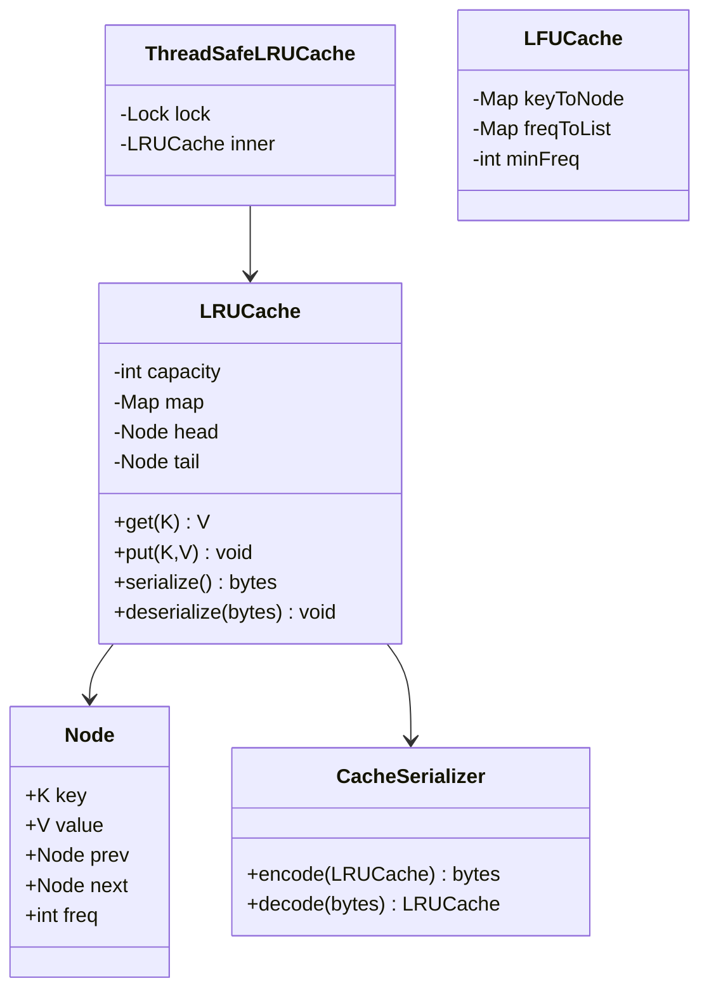

# LLD: LRU Cache Extensions (Serialize · Threads · LFU/CUDA)

> **Focus areas:** Hash map + doubly linked list · O(1) get/put · Serialization · Multithreading · LFU O(1) · CUDA device-side cache discussion · API design  
> **Style:** LLD interview (clarify → complexity → classes → algorithms/code → concurrency → reliability → progressive scale → wrap-up → Q&A)  
> **Quality bar:** Correct O(1) base LRU, explicit extension designs with trade-offs, full classes + pseudocode—not “use Redis” hand-waving  
> **Interview theme:** NVIDIA — classic LRU then **extend**: persist/serialize, thread-safety, and LFU or CUDA-device-side caching discussion

---

## Table of Contents

1. [Clarify Requirements (Interview Q&A)](#1-clarify-requirements-interview-qa)
2. [Complexity & Scale](#2-complexity--scale)
3. [Class Diagrams & Responsibilities](#3-class-diagrams--responsibilities)
4. [Key Algorithms & Code Sketches](#4-key-algorithms--code-sketches)
5. [Extension A — Serialization](#5-extension-a--serialization)
6. [Extension B — Multithreading](#6-extension-b--multithreading)
7. [Extension C — LFU & CUDA-Device Cache](#7-extension-c--lfu--cuda-device-cache)
8. [Reliability](#8-reliability)
9. [Scalability](#9-scalability)
10. [Wrap-Up](#10-wrap-up)
11. [Deeper / Related Interview Questions](#11-deeper--related-interview-questions)
12. [Appendices](#12-appendices)

---

## 1. Clarify Requirements (Interview Q&A)

Goal: implement a **classic LRU**, then extend with **(a) serialize/deserialize**, **(b) thread-safe access**, and **(c) LFU and/or CUDA device-side cache** with concrete structures.

### 1.0 What this is / is not

| Dimension | This | Not |
|-----------|------|-----|
| Job | In-process cache LLD + extensions | Full Redis HLD only |
| Base eviction | LRU (recency) | ARC/TinyLFU unless compared |
| Serialize | Snapshot bytes / stream | ACID database |
| CUDA | Design + host/device sketch | Full GPU memory manager |
| NVIDIA lens | Threads + optional device hot-set | Ignoring host correctness |

### 1.1 Clarifying questions

| # | Question | Typical answer | Implication |
|---|----------|----------------|-------------|
| F1 | Ops? | `get`, `put`, maybe `delete`, `size` | Core API |
| F2 | Capacity? | Max entries N | Evict on overflow |
| F3 | Missing get? | null / optional | Document |
| F4 | Put existing? | Update + refresh LRU | Move to MRU |
| F5 | Serialize format? | Versioned binary (JSON OK on board) | Schema + order |
| F6 | Thread safety? | Multiple readers/writers | Lock strategy |
| F7 | LFU vs LRU? | Extension: frequency eviction | Extra maps |
| F8 | CUDA? | Device-side hot lookups | Memory limits + divergence |
| F9 | Value types? | Small POD / blob | Serde must know layout |
| F10 | Stats? | hits/misses optional | Counters |
| F11 | Null keys? | Disallow | Validate |
| F12 | Persist trigger? | Explicit `dump`/`load` MVP | Not continuous WAL |

**MVP:** O(1) map+DLL LRU; versioned round-trip serialize (preserve order); thread-safe facade or stripes; LFU O(1) **or** CUDA host-authoritative snapshot; clear invariants.

**Out of MVP:** disk tiering, distributed invalidation, lock-free marvels, full CUDA allocator.

### 1.2 Scope repeat-back

> Build in-memory LRU (map + DLL). Extend with versioned snapshot serialization, concurrency (mutex → stripes), then O(1) LFU and/or CUDA device read-only hot-set—stating what stays on host.

### 1.3 Semantics

```text
get(k): absent → miss; else mark MRU → return value
put(k,v): update+MRU or insert MRU; if size > C → evict LRU
serialize(): bytes reloadable with same logical map (+ LRU order)
deserialize(bytes): replace contents / return new instance
```

---

## 2. Complexity & Scale

### 2.1 Complexity targets

| Op | Time | Space |
|----|------|-------|
| get / put / delete / evict | O(1) avg | O(capacity) |
| serialize / deserialize | O(n) | O(n) |
| LFU get/put | O(1) avg | O(capacity) + freq buckets |

### 2.2 Progressive scale

| Stage | Context | Design |
|-------|---------|--------|
| Baseline | Single thread, ≤10⁶ entries | Classic LRU |
| 10× | Multi-threaded process | Mutex → stripes |
| 100× | Many processes | L1 + shared L2; serialize warm-start |
| 1,000× | Fleet / GPU workers | Shard; approx eviction; device top-K |

### 2.3 Why not only `OrderedDict` / `LinkedHashMap`?

Acknowledge they exist; still implement nodes—interviewers want pointer discipline and extension hooks.

---

## 3. Class Diagrams & Responsibilities

### 3.1 Responsibility table

| Class | Responsibility |
|-------|----------------|
| `Node<K,V>` | key, value, prev, next; optional `freq` |
| `LRUCache<K,V>` | Public API; map + list; capacity |
| `CacheSerializer` | Encode/decode snapshot |
| `ThreadSafeLRUCache` | Locking facade or striped shards |
| `LFUCache<K,V>` | freq map + min-freq structure |
| `CudaDeviceCacheOrchestrator` | Pack/publish device hot table |
| `CacheStats` / `EvictionListener` | Optional counters / callbacks |

**Convention:** **head = MRU**, **tail = LRU**, dummy sentinels.

### 3.2 Class diagram



### 3.3 Invariants

```text
I1: map.size == real nodes between sentinels
I2: key in map iff node linked
I3: head.next = MRU; tail.prev = LRU
I4: size <= capacity after put returns
I5: serialize magic/version match deserialize
I6: under lock, ops atomic w.r.t. peers (threaded)
I7 (LFU): minFreq is minimal among keys present
```

---

## 4. Key Algorithms & Code Sketches

### 4.1 Base structures + helpers

```python
class Node:
    def __init__(self, key=None, value=None):
        self.key = key
        self.value = value
        self.prev = None
        self.next = None
        self.freq = 1  # LFU extension


class LRUCache:
    """Head = MRU, Tail = LRU, with sentinel nodes."""

    def __init__(self, capacity: int):
        if capacity < 0:
            raise ValueError("capacity")
        self.capacity = capacity
        self.map = {}
        self.head = Node()
        self.tail = Node()
        self.head.next = self.tail
        self.tail.prev = self.head
        self.hits = self.misses = self.evictions = 0

    def _add_to_head(self, node: Node) -> None:
        node.prev = self.head
        node.next = self.head.next
        self.head.next.prev = node
        self.head.next = node

    def _remove(self, node: Node) -> None:
        node.prev.next = node.next
        node.next.prev = node.prev
        node.prev = node.next = None

    def _move_to_head(self, node: Node) -> None:
        self._remove(node)
        self._add_to_head(node)

    def _pop_lru(self) -> Node:
        node = self.tail.prev
        if node is self.head:
            raise RuntimeError("empty")
        self._remove(node)
        return node

    def size(self) -> int:
        return len(self.map)

    def clear(self) -> None:
        self.map.clear()
        self.head.next = self.tail
        self.tail.prev = self.head

    def peek_mru_n(self, n: int):
        """Non-mutating; for CUDA publish."""
        out, node = [], self.head.next
        while node is not self.tail and len(out) < n:
            out.append((node.key, node.value))
            node = node.next
        return out
```

### 4.2 get / put / delete

```python
    def get(self, key):
        node = self.map.get(key)
        if node is None:
            self.misses += 1
            return None
        self.hits += 1
        self._move_to_head(node)
        return node.value

    def put(self, key, value) -> None:
        if self.capacity == 0:
            return
        node = self.map.get(key)
        if node is not None:
            node.value = value
            self._move_to_head(node)
            return
        node = Node(key, value)
        self.map[key] = node
        self._add_to_head(node)
        if len(self.map) > self.capacity:
            lru = self._pop_lru()
            del self.map[lru.key]
            self.evictions += 1

    def delete(self, key) -> bool:
        node = self.map.pop(key, None)
        if node is None:
            return False
        self._remove(node)
        return True
```

### 4.3 Trace

```text
capacity=2
put(1,"a")   MRU→ 1
put(2,"b")   MRU→ 2-1
get(1)       MRU→ 1-2
put(3,"c")   evict 2; MRU→ 3-1
serialize → deserialize → get(3)=="c", get(1)=="a", get(2) miss
```

### 4.4 Java-like surface

```java
public final class LRUCache<K, V> {
  private final int capacity;
  private final Map<K, Node<K, V>> map = new HashMap<>();
  private final Node<K, V> head = new Node<>(null, null);
  private final Node<K, V> tail = new Node<>(null, null);

  public V get(K key) { /* move to head */ }
  public void put(K key, V value) { /* insert/evict */ }
  public byte[] serialize() { return CacheSerializer.encode(this); }
  public void deserialize(byte[] b, Serde<K,V> s) { CacheSerializer.decodeInto(b, this, s); }
}
```

---

## 5. Extension A — Serialization

### 5.1 Goals

| Goal | Choice |
|------|--------|
| Round-trip keys/values | Required |
| Preserve LRU order | **Yes** |
| Versioning | Magic + `uint32` version |
| Integrity | CRC32/64 footer |
| Security | Size limits; fail closed on corrupt |

### 5.2 Binary format (v1)

```text
magic "LRUC" | version | capacity | count | flags
records[count] in MRU→LRU: key_len|key|val_len|val
optional stats: hits,misses,evictions
crc32(payload)
```

**Rebuild:** walk records and **relink pointers directly**—do **not** call `put` in MRU→LRU order (eviction would corrupt the set mid-load).

### 5.3 Serializer pseudocode

```python
import struct, zlib

MAGIC, VERSION = b"LRUC", 1

class CacheSerializer:
    def __init__(self, key_encode, key_decode, val_encode, val_decode):
        self.ke, self.kd = key_encode, key_decode
        self.ve, self.vd = val_encode, val_decode

    def encode(self, cache: LRUCache) -> bytes:
        records = []
        node = cache.head.next
        while node is not cache.tail:
            records.append((self.ke(node.key), self.ve(node.value)))
            node = node.next
        flags = 0x1
        parts = [struct.pack("<IIII", VERSION, cache.capacity, len(records), flags)]
        for kb, vb in records:
            parts += [struct.pack("<I", len(kb)) + kb, struct.pack("<I", len(vb)) + vb]
        parts.append(struct.pack("<QQQ", cache.hits, cache.misses, cache.evictions))
        payload = b"".join(parts)
        return MAGIC + payload + struct.pack("<I", zlib.crc32(payload) & 0xffffffff)

    def decode_into(self, data: bytes, cache: LRUCache) -> None:
        if data[:4] != MAGIC:
            raise ValueError("bad magic")
        payload, crc_b = data[4:-4], data[-4:]
        if (zlib.crc32(payload) & 0xffffffff) != struct.unpack("<I", crc_b)[0]:
            raise ValueError("crc")
        version, capacity, count, flags = struct.unpack_from("<IIII", payload, 0)
        if version != VERSION:
            raise ValueError("version")
        cache.clear()
        cache.capacity = capacity
        off, nodes = 16, []
        for _ in range(count):
            (klen,) = struct.unpack_from("<I", payload, off); off += 4
            kb = payload[off:off + klen]; off += klen
            (vlen,) = struct.unpack_from("<I", payload, off); off += 4
            vb = payload[off:off + vlen]; off += vlen
            nodes.append(Node(self.kd(kb), self.vd(vb)))
        prev = cache.head
        for n in nodes:  # nodes[0]=MRU … nodes[-1]=LRU
            cache.map[n.key] = n
            prev.next, n.prev, prev = n, prev, n
        prev.next, cache.tail.prev = cache.tail, prev
        if flags & 1:
            cache.hits, cache.misses, cache.evictions = struct.unpack_from("<QQQ", payload, off)
```

### 5.4 Policies & edges

| Case | Behavior |
|------|----------|
| Empty | count=0 valid |
| Capacity in snapshot | Snapshot wins **or** reject—pick one |
| Concurrent mutate | Hold lock for whole encode (Ext B) |
| Corrupt CRC / huge record | Fail closed |
| JSON alternate | `{"v":1,"capacity":2,"order_mru_to_lru":[...]}` |

**Deal-breaker:** Deserialize via naïve `put` without disabling eviction.

---

## 6. Extension B — Multithreading

### 6.1 Options

| Strategy | Pros | Cons |
|----------|------|------|
| Coarse mutex / `RLock` | Simple, strict LRU | Contended |
| RW lock | Tempting | `get` mutates → mostly writers |
| Striped LRU | Scales | Imperfect global LRU/capacity |
| CHM + approx | Fast | Not strict LRU |

**Path:** correct coarse lock → stripes → approx.

### 6.2 Coarse-lock facade

```python
import threading

class ThreadSafeLRUCache:
    def __init__(self, capacity: int, serializer: CacheSerializer):
        self._lock = threading.RLock()
        self._inner = LRUCache(capacity)
        self._ser = serializer

    def get(self, key):
        with self._lock:
            return self._inner.get(key)

    def put(self, key, value):
        with self._lock:
            self._inner.put(key, value)

    def delete(self, key) -> bool:
        with self._lock:
            return self._inner.delete(key)

    def serialize(self) -> bytes:
        with self._lock:
            return self._ser.encode(self._inner)

    def deserialize(self, data: bytes) -> None:
        with self._lock:
            self._ser.decode_into(data, self._inner)
```

Serialize/deserialize share the lock → no torn snapshots.

### 6.3 Striped design

```python
class StripedLRUCache:
    def __init__(self, capacity: int, stripes: int = 16):
        self.n = stripes
        base, rem = divmod(capacity, stripes)
        self.locks = [threading.Lock() for _ in range(stripes)]
        self.shards = [LRUCache(base + (1 if i < rem else 0)) for i in range(stripes)]

    def _i(self, key) -> int:
        return hash(key) % self.n  # production: stable hash

    def get(self, key):
        i = self._i(key)
        with self.locks[i]:
            return self.shards[i].get(key)

    def put(self, key, value):
        i = self._i(key)
        with self.locks[i]:
            self.shards[i].put(key, value)

    def serialize(self) -> bytes:
        for lk in self.locks:  # fixed order → no deadlock
            lk.acquire()
        try:
            return StripedSerializer.encode(self.shards)  # per-shard sections
        finally:
            for lk in reversed(self.locks):
                lk.release()
```

**Trade-off:** no true global LRU—usually OK for near-caches.

### 6.4 Listener / edges

- Eviction listener under lock calling back into cache → deadlock; unlock then notify.  
- Parallel get/put same key: serialized moves OK.  
- Stripe resize rare: pause or careful rehash.

---

## 7. Extension C — LFU & CUDA-Device Cache

### 7.1 LFU O(1) structures (LeetCode 460)

```text
key → Node(key, value, freq)
freq → DLL of nodes at that frequency (LRU order within freq = tie-break)
minFreq → smallest freq present

get: bump freq (move across lists); update minFreq if old list emptied
put new: if full, evict tail of freqToList[minFreq]; insert freq=1; minFreq=1
```

### 7.2 LFU pseudocode

```python
class LFUCache:
    def __init__(self, capacity: int):
        self.capacity = capacity
        self.key_to_node = {}
        self.freq_to_list = {}  # freq -> DLL (head MRU, tail LRU)
        self.min_freq = 0

    def _dll(self, freq: int):
        if freq not in self.freq_to_list:
            self.freq_to_list[freq] = EmptyDLL()
        return self.freq_to_list[freq]

    def _touch(self, node: Node) -> None:
        f = node.freq
        self._dll(f).remove(node)
        if self._dll(f).empty() and self.min_freq == f:
            self.min_freq = f + 1
        node.freq = f + 1
        self._dll(node.freq).add_to_head(node)

    def get(self, key):
        node = self.key_to_node.get(key)
        if node is None:
            return None
        self._touch(node)
        return node.value

    def put(self, key, value) -> None:
        if self.capacity == 0:
            return
        if key in self.key_to_node:
            node = self.key_to_node[key]
            node.value = value
            self._touch(node)
            return
        if len(self.key_to_node) >= self.capacity:
            victim = self._dll(self.min_freq).pop_lru()
            del self.key_to_node[victim.key]
        node = Node(key, value)
        node.freq = 1
        self.key_to_node[key] = node
        self._dll(1).add_to_head(node)
        self.min_freq = 1
```

**Aging:** without it, old popular keys dominate—mention Window-TinyLFU / freq halving; don’t fully implement unless asked.

### 7.3 LRU vs LFU (say aloud)

| Policy | Best when | Weak when |
|--------|-----------|-----------|
| LRU | Temporal locality | Scan pollution |
| LFU | Stable hot keys | Bursts without aging |
| TinyLFU | Production admission | Heavier whiteboard |

### 7.4 CUDA framing

Many GPU threads look up a small hot table. Host LRU per access is too slow; device needs a **tiny** structure.

**Constraints:** warp divergence; no rich host locks on device; shared mem is KB-class; device linked-list eviction is painful.

### 7.5 Preferred design: host-authoritative + device read-only snapshot

```text
1) Host LRU/LFU owns canonical cache
2) Pack top-K hot entries into contiguous device buffer
3) Double-buffer publish (atomic live pointer)
4) Kernels binary-search or perfect-hash; miss → slow path / sentinel
```

```cpp
struct Entry { uint64_t key; float value; };
__device__ Entry* g_live_table;
__device__ int    g_live_count;

__device__ bool cache_lookup(uint64_t key, float* out) {
  int lo = 0, hi = g_live_count - 1;
  while (lo <= hi) {
    int mid = (lo + hi) >> 1;
    uint64_t k = g_live_table[mid].key;
    if (k == key) { *out = g_live_table[mid].value; return true; }
    if (k < key) lo = mid + 1; else hi = mid - 1;
  }
  return false;
}
```

```python
class CudaDeviceCacheOrchestrator:
    def __init__(self, host_cache: LRUCache, k: int):
        self.host, self.k = host_cache, k
        self.buf_a, self.buf_b, self.live = DeviceBuffer(), DeviceBuffer(), "A"

    def publish_top_k(self):
        # under host lock
        entries = self.host.peek_mru_n(self.k)  # or LFU top-K
        entries.sort(key=lambda e: e[0])
        standby = self.buf_b if self.live == "A" else self.buf_a
        standby.upload(entries)
        self.flip_live_pointer(standby)  # stream sync then atomic publish
        self.live = "B" if self.live == "A" else "A"
```

### 7.6 True device-side LRU?

| Approach | Verdict |
|----------|---------|
| Per-SM shared-mem LRU list | Tiny K; heavy warp sync |
| Set-associative + CLOCK | More GPU-natural |
| Global hash + locks | Contention; avoid |
| Read-only snapshot | **Preferred interview answer** |

**Deal-breaker:** “Mutex LRU on every CUDA thread like CPU.” Prefer host **LFU** to choose top-K (scan-resistant) for publish.

### 7.7 Complexity summary

| Component | get/put | Notes |
|-----------|---------|-------|
| LRU | O(1) | Base |
| Serialize | O(n) | Lock if threaded |
| Striped LRU | O(1) | Approx global |
| LFU | O(1) | Freq lists |
| CUDA lookup | O(log K) / O(1) hash | K ≪ N |

---

## 8. Reliability

**Hazards:** forget `map.remove` on evict; relink without unlink; unlocked serialize; deserialize via `put`; stale LFU `minFreq`; ignore CRC; listener deadlock; device flip without sync.

**Tests:** LeetCode-146 sequences; serialize round-trip; bad CRC rejected; threaded get/put/serialize stress; LFU equal-freq LRU-within-freq; CUDA double-buffer race with sync.

| Inject | Expect |
|--------|--------|
| Listener throws | Structure remains consistent |
| OOM mid-deserialize | Keep old cache or clear+fail (document) |

---

## 9. Scalability

| Stage | Cache shape | Emphasis |
|-------|-------------|----------|
| Baseline | Mutex LRU | O(1) + serialize |
| 10× threads | Stripes | Drop strict global LRU |
| 100× processes | L1 + Redis L2 | Warm-start dump/load |
| 1,000× + GPU | Host LFU + device top-K | No global DLL on GPU |

**Jump cards:** 10× stripe; 100× L1+L2; 1,000× host policy + device snapshot.

**Does not scale:** giant locked DLL at M-QPS; exact global LRU across machines; device DLL updated by all warps; unbounded serialize.

---

## 10. Wrap-Up

| Piece | Choice |
|-------|--------|
| Base | HashMap + DLL sentinels, head=MRU |
| Serialize | Versioned binary, MRU order, CRC, direct relink |
| Threads | RLock facade; stripes for throughput |
| LFU | key→node, freq→DLL, minFreq |
| CUDA | Host policy + double-buffered read-only top-K |

**Pitch:** Map + DLL LRU; versioned snapshot that rebuilds pointers; lock then stripe; on GPU publish a sorted hot snapshot—don’t port the linked list. Use LFU when the hot set is frequency-stable.

**Trade-offs:** strict vs striped; ordered snapshots vs dict-only dumps; LFU aging vs simplicity; device freshness vs publish sync.

**Deal-breakers:** heap “O(1) LRU”; deserialize that evicts mid-load; unlocked multithreaded serialize; CUDA mutex-list as the only plan.

---

## 11. Deeper / Related Interview Questions

### 11.1 Base & serialize

**Q: Why DLL not singly linked / heap?**  
A: O(1) middle remove; heap is O(log n) touch.

**Q: Capacity 0/1?**  
A: Define explicitly; capacity 1 is the best bug magnet—trace aloud.

**Q: Preserve stats / endianness?**  
A: Optional flag; fixed little-endian; CRC + size caps for untrusted bytes.

**Q: Deserialize security?**  
A: Fail closed; no code exec; max record length.

### 11.2 Concurrency & LFU

**Q: Why RW locks disappoint?**  
A: Recency update on get is a structural write.

**Q: Lock-free LRU?**  
A: Multi-pointer CAS + ABA; rarely worth it vs stripes/approx.

**Q: Striped serialize deadlock?**  
A: Acquire shard locks in fixed index order.

**Q: How is LFU O(1)?**  
A: key→node; freq→DLL; bump with pointer rewires; track minFreq.

**Q: Frequency aging / scans?**  
A: Without aging, old keys dominate; LRU suffers one-shot scans—TinyLFU resists better.

### 11.3 CUDA / NVIDIA & scale

**Q: Shared-mem cache per block?**  
A: Block-local reuse only; `__syncthreads`; not a process-global cache.

**Q: Host↔device consistency?**  
A: Double-buffer / epoch publish; kernels never free the live buffer.

**Q: Texture/constant memory?**  
A: Hardware caches for read-only tables may beat software LRU for fixed data.

**Q: Redis `allkeys-lru` vs this class?**  
A: Redis approximates via sampling; this is exact per process.

**Q: Interview close order?**  
A: Correct single-thread LRU → serialize → mutex → LFU or CUDA snapshot.

---

## 12. Appendices

### 12.1 API contract

```text
LRUCache(capacity); get/put/delete/size/clear; serialize/deserialize
ThreadSafeLRUCache: same surface
LFUCache: get/put with frequency eviction
CudaDeviceCacheOrchestrator.publish_top_k()
```

### 12.2 OrderedDict cross-check

```python
from collections import OrderedDict

class RefLRU:
    def __init__(self, capacity):
        self.cap, self.od = capacity, OrderedDict()

    def get(self, key):
        if key not in self.od:
            return None
        self.od.move_to_end(key)
        return self.od[key]

    def put(self, key, value):
        if key in self.od:
            self.od.move_to_end(key)
        self.od[key] = value
        if len(self.od) > self.cap:
            self.od.popitem(last=False)
```

### 12.3 LFU freq-list diagram

```text
minFreq=2
freq2: head <-> (B) <-> (A) <-> tail   # A = LRU within freq2
freq3: head <-> (C) <-> tail
full put → evict A (tail of minFreq)
```

### 12.4 CUDA double-buffer timeline

```text
t0 kernel→buf_A; t1 host fills buf_B; t2 sync; t3 atomic live=buf_B; t4 recycle A
```

### 12.5 Size / memory estimates

```text
Serialize ≈ header + Σ(8 + |k| + |v|) + stats + CRC
Host entry ≈ 64–128 B + sizeof(K)+sizeof(V) (order-of)
```

### 12.6 Common bugs

1. Evict when updating existing key.  
2. Sentinel / unlink mistakes.  
3. LFU `minFreq++` while old list non-empty.  
4. Device pointer flip without visibility/sync.  
5. Python `hash()` salt across processes for striped dumps—use stable hash.

### 12.7 Interview board order

1. Semantics → 2. Map+DLL → 3. get/put → 4. Trace → 5. Serialize rebuild → 6. Threads → 7. LFU/CUDA → 8. Scale

### 12.8 Related / final signal

LeetCode 146/460; Caffeine/W-TinyLFU for later reading. Correct pointer ops + **versioned snapshot** + honest **threading** beat a flashy wrong GPU linked list. For CUDA: **host policy + read-only hot set**.

---

*End of LRU cache extensions LLD.*
