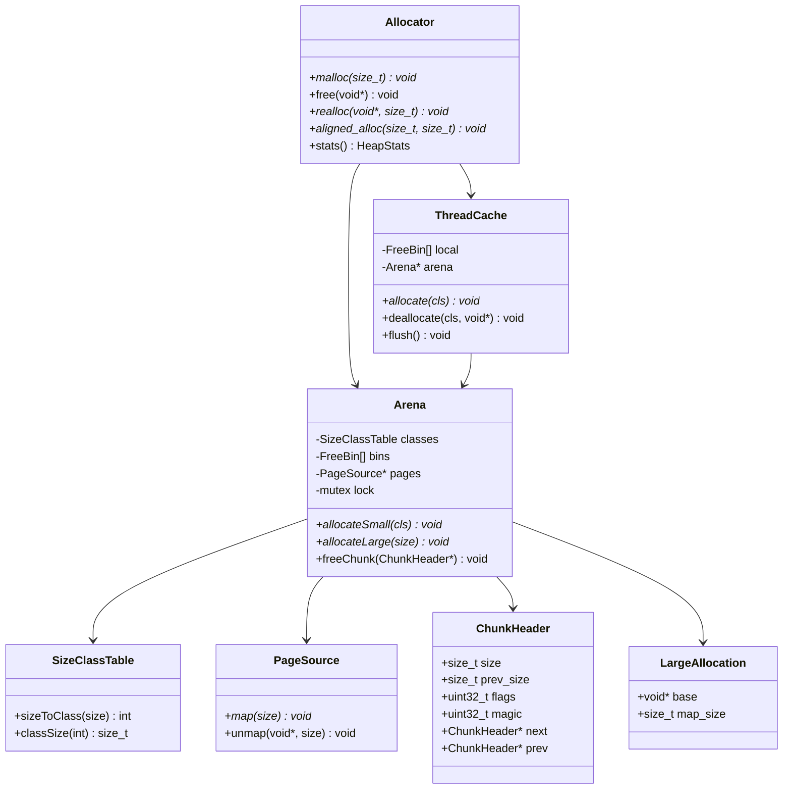

# LLD: General Memory Allocator (Variable Sizes)

> **Focus areas:** Size classes · Freelists · Coalescing · `mmap`/`sbrk` (conceptual) · Thread caches · Fragmentation · Alloc/free algorithms  
> **Style:** LLD interview (clarify → NFRs → cases → classes → algorithms/pseudocode → concurrency → reliability/scalability/maintainability → wrap-up → Q&A → appendices)  
> **Quality bar:** Clear size-class design, correct split/coalesce invariants, honest fragmentation discussion, thread-cache story without hand-waving  
> **Interview theme:** NVIDIA — host-side runtime / driver / tools allocator design; contrast with fixed-block pools and GPU caching allocators

---

## Table of Contents

1. [Clarify Requirements (Interview Q&A)](#1-clarify-requirements-interview-qa)
2. [Non-Functional Requirements](#2-non-functional-requirements)
3. [Cases](#3-cases)
4. [Object Model & Class Diagrams](#4-object-model--class-diagrams)
5. [Public APIs / Interfaces](#5-public-apis--interfaces)
6. [Key Algorithms & Pseudocode](#6-key-algorithms--pseudocode)
7. [Size Classes, Splitting & Coalescing](#7-size-classes-splitting--coalescing)
8. [Concurrency & Thread Caches](#8-concurrency--thread-caches)
9. [Design Deep Dive](#9-design-deep-dive)
10. [Reliability](#10-reliability)
11. [Scalability](#11-scalability)
12. [Maintainability](#12-maintainability)
13. [Wrap-Up](#13-wrap-up)
14. [Deeper / Related Interview Questions](#14-deeper--related-interview-questions)
15. [Appendices](#15-appendices)

---

## 1. Clarify Requirements (Interview Q&A)

Goal: design a **general-purpose memory allocator** for variable allocation sizes: `allocate(size)` / `free(ptr)` (and ideally `realloc`), with good average latency, controlled fragmentation, and a clear story for growing the heap via OS primitives (`sbrk` / `mmap` conceptually).

### 1.0 What this is / is not

| Dimension | This doc | Not this |
|-----------|----------|----------|
| Job | Variable-size userspace/kernel-style allocator | Fixed-only pool (sibling doc) |
| OS | Abstract `PageSource` (`mmap`/`sbrk`) | Full virtual memory subsystem |
| GPU | Optional notes on CUDA caching allocator parallels | Device PTX memory spaces |
| NVIDIA lens | Runtime, driver host heaps, tooling | Rewriting jemalloc from scratch in 45 min |

### 1.1 Clarifying questions (ask aloud)

| # | Question | Typical answer | Implication |
|---|----------|----------------|-------------|
| F1 | API? | `malloc`/`free`/`realloc`/`aligned_alloc` | Classic |
| F2 | Size range? | 1B → hundreds of MB | Small vs large path |
| F3 | Threads? | Multi-threaded | Thread cache + central |
| F4 | Goals? | Throughput + bounded fragmentation | Size classes |
| F5 | Real-time? | Soft real-time OK; not hard WCET | Avoid unbounded walks |
| F6 | Security? | Optional canaries, quarantine | Debug/hardened mode |
| F7 | Growth? | Request pages from OS | `PageSource` port |
| F8 | Shrink? | Return large spans to OS | `munmap` |
| F9 | Alignment? | `max_align_t`; over-align API | Header design |
| F10 | Stats? | Bytes allocated, mmap count | Telemetry |
| F11 | Fork safety? | Mention atfork | Rare but real |
| F12 | Replace global malloc? | Design as library first | `__malloc_hook` etc. out |

**MVP scope:**

1. Size-class freelists for small/medium allocations.  
2. Chunk headers with size + free/used + boundary tags for coalescing.  
3. Large allocations via direct `mmap`.  
4. Split on alloc; coalesce on free.  
5. Per-thread cache sketch.  
6. Fragmentation vocabulary (internal/external).

**Out of MVP:** full jemalloc extent/SHM, Windows Heap internals, GPU VRAM virtualization.

### 1.2 Scope repeat-back

> Variable-size allocator: size classes + freelists for small objects, boundary-tag coalescing in spans, direct mmap for large, thread caches for scalability—honest about fragmentation and OS interaction.

### 1.3 Semantics

```text
malloc(n):
  if n == 0 → impl-defined (null or unique)
  round up to size class or chunk grain
  find free chunk ≥ need → split → mark used → return payload

free(p):
  if p == null → no-op
  mark free → coalesce with neighbors → freelist or return span to OS

realloc(p, n):
  if fits in place (±slack) → maybe grow into adjacent free
  else malloc+copy+free
```

---

## 2. Non-Functional Requirements

| # | NFR | Target | Why |
|---|-----|--------|-----|
| N1 | Small alloc latency | O(1) typical via size class | Hot path |
| N2 | Free latency | O(1) typical; coalesce O(1) with boundary tags | Symmetric |
| N3 | Fragmentation | Internal bounded by class waste; external managed by coalesce + size classes | Long-lived processes |
| N4 | Scalability | Near-linear with cores via thread cache | Servers / drivers |
| N5 | Correctness | No double metadata; safe coalescing | Security |
| N6 | Observability | Allocated bytes, class histograms | Tuning |
| N7 | Large alloc | Bypass classes; page multiple | Avoid huge freelist nodes |
| N8 | Portability | `PageSource` abstraction | Host OS variance |

### 2.1 Progressive scale

| Metric | Base | 10× | 100× |
|--------|------|-----|------|
| Threads | 1–4 | 32–64 | 100s |
| Alloc rate | 1M/s | 10M/s | 100M/s class |
| RSS | 100MB | GBs | tens of GB |
| Design | Global freelist | Thread cache | Sharded arenas (jemalloc-like) |

### 2.2 Complexity targets

| Op | Typical | Worst notes |
|----|---------|-------------|
| malloc small | O(1) | refill from central |
| free small | O(1) | coalesce neighbors O(1) |
| malloc large | O(OS mmap) | |
| find best-fit arbitrary | O(n) avoided | use classes / segregated |

---

## 3. Cases

### 3.1 Happy paths

1. `malloc(24)` → class 32 → return aligned payload.  
2. `malloc(100)` from chunk 256 → split remainder 156 onto freelist.  
3. Free two adjacent chunks → one coalesced chunk.  
4. `malloc(8<<20)` → direct mmap; free → munmap.  
5. Two threads malloc heavily → mostly hit thread caches.

### 3.2 Edge / failure cases

| Case | Behavior |
|------|----------|
| OOM from OS | return null; set errno conceptually |
| double-free | detect via chunk state / quarantine |
| free wild pointer | reject if header magic bad |
| malloc overflow size | reject `n > PTRDIFF_MAX` etc. |
| realloc shrink | split or lazy |
| realloc grow in place | if next chunk free & large enough |
| fragmentation death | many holes; large malloc fails despite free bytes |
| false sharing on arena | pad / shard |
| fork + threads | child inherits locks held — atfork |

### 3.3 Invariants

```text
I1: Every heap chunk has valid header (size, flags, magic)
I2: Free chunks are in exactly one freelist / tree
I3: Adjacent free chunks are coalesced (eager) OR intentionally deferred (document)
I4: payload = header + sizeof(Header), aligned
I5: Sum of chunk sizes in a span == span size
I6: Used chunk not on freelist
```

---

## 4. Object Model & Class Diagrams

### 4.1 Responsibility table

| Class | Responsibility |
|-------|----------------|
| `Allocator` | Public malloc/free/realloc |
| `SizeClassTable` | Map request → class index / bytes |
| `FreeList` / `FreeBin` | Per-class LIFO or FIFO list |
| `ChunkHeader` | size, prev_size, free bit, magic |
| `Span` / `ArenaRun` | Contiguous region for a class or page run |
| `Arena` | Central metadata + bins + page ownership |
| `ThreadCache` | Per-thread magazines of small objects |
| `PageSource` | `map`/`unmap` (`mmap`/`sbrk`) |
| `LargeAllocator` | Direct page mappings |
| `HeapStats` | Counters / histograms |

### 4.2 Class diagram



### 4.3 Chunk layout (boundary tags)

```text
  ... | Chunk A (used) | Chunk B (free) | Chunk C (used) | ...

Chunk B:
┌────────────┬─────────────────────────┬────────────┐
│ Header     │ payload / freelist ptrs │ footer sz  │
│ size|FREE  │                         │ size|FREE  │
└────────────┴─────────────────────────┴────────────┘
prev_size in next header == size of B  (for walking backward)
```

Footer (or `prev_size` in next chunk) enables **O(1) coalesce with previous**.

---

## 5. Public APIs / Interfaces

```cpp
class Allocator {
public:
  explicit Allocator(PageSource* pages, ArenaConfig cfg);

  void*  malloc(size_t n);
  void*  calloc(size_t n, size_t m);
  void*  realloc(void* p, size_t n);
  void*  aligned_alloc(size_t align, size_t n);
  void   free(void* p);

  HeapStats stats() const;
};

struct PageSource {
  virtual void* map(size_t bytes, size_t align) = 0;
  virtual void  unmap(void* p, size_t bytes) = 0;
};

// Conceptual OS backends
class MmapPageSource : public PageSource { /* mmap MAP_PRIVATE */ };
class SbrkPageSource : public PageSource { /* contiguous heap grow — teaching only */ };
```

**Large threshold:** e.g. `n >= 256KiB` → mmap path (tunable).

---

## 6. Key Algorithms & Pseudocode

### 6.1 Size class mapping

```text
// Example geometric classes (simplified):
// 8, 16, 32, 48, 64, 80, 96, 112, 128, then ~12.5% growth...

function size_to_class(n):
  if n == 0: n = 1
  n = align_up(n, ALIGN)   // e.g. 8 or 16
  if n <= SMALL_MAX:
    return table[n / ALIGN]   // dense table
  if n <= MEDIUM_MAX:
    return binary_search_class_table(n)
  return LARGE_SENTINEL

function class_size(c):
  return CLASS_BYTES[c]
```

**Internal fragmentation:** waste = `class_size - request` (plus header overhead attributed carefully).

### 6.2 malloc top-level

```text
function malloc(n):
  if n > MAX_SIZE: return null
  cls = size_to_class(n)
  if cls == LARGE:
    return allocate_large(align_up(n + HEADER, PAGE))

  // thread cache first
  p = thread_cache.allocate(cls)
  if p: return p

  // central arena
  lock(arena)
  p = arena.allocate_small(cls)
  unlock(arena)
  return p
```

### 6.3 Arena small allocate (segregated freelist)

```text
function arena.allocate_small(cls):
  bin = bins[cls]
  if not bin.empty:
    chunk = bin.pop()          // LIFO
    chunk.flags = USED
    maybe_clear_freelist_ptrs(chunk)
    stats.record(cls)
    return payload(chunk)

  // refill: take a span of pages, slab into class-sized cells
  span = page_source.map(span_bytes_for(cls))
  if span == null: return null
  for each cell in span:
    bin.push(cell_as_free_chunk)
  chunk = bin.pop()
  chunk.flags = USED
  return payload(chunk)
```

**Note:** Pure segregated size classes often **do not split variable chunks**—each class has fixed cell size (slab). Hybrid allocators use:

- **Slab/size-class** for small  
- **Address-ordered freelist / tree of variable chunks** for medium with split/coalesce  

Interview: pick hybrid and say so.

### 6.4 Variable chunk path (split)

```text
function alloc_from_variable_freelist(need):
  // need includes header (+ footer if used)
  chunk = find_free_chunk_ge(need)   // first-fit / best-fit / segregated by size tree
  if chunk == null:
    grow_heap(max(need, GROW_MIN))
    chunk = find_free_chunk_ge(need)
    if chunk == null: return null

  if chunk.size >= need + MIN_CHUNK:
    rem = split(chunk, need)     // rem goes back to freelist
  remove_from_freelist(chunk)
  chunk.flags = USED
  update_boundary_tags(chunk)
  return payload(chunk)

function split(chunk, need):
  rem_size = chunk.size - need
  chunk.size = need
  rem = (Chunk*)((uint8_t*)chunk + need)
  rem.size = rem_size
  rem.flags = FREE
  rem.prev_size = need
  write_footer(rem)
  update_next_prev_size(rem)
  insert_freelist(rem)
  return rem
```

### 6.5 free + coalesce

```text
function free(p):
  if p == null: return
  chunk = header_from_payload(p)
  assert chunk.magic OK and USED

  if is_large_mmap(chunk):
    page_source.unmap(chunk.map_base, chunk.map_size)
    return

  if thread_cache.can_take(chunk.class):
    thread_cache.deallocate(chunk)
    return

  lock(arena)
  free_chunk_coalesce(chunk)
  unlock(arena)

function free_chunk_coalesce(chunk):
  chunk.flags = FREE

  // coalesce forward
  next = next_chunk(chunk)
  if next.valid and next.FREE:
    remove_from_freelist(next)
    chunk.size += next.size
    write_footer(chunk)

  // coalesce backward
  if prev_chunk_is_free(chunk):   // via prev_size / footer
    prev = prev_chunk(chunk)
    remove_from_freelist(prev)
    prev.size += chunk.size
    chunk = prev
    write_footer(chunk)

  update_next_prev_size(chunk)
  insert_freelist(chunk)

  // optional: if chunk is entire span and large, unmap
  maybe_release_span(chunk)
```

### 6.6 realloc

```text
function realloc(p, n):
  if p == null: return malloc(n)
  if n == 0: free(p); return null

  chunk = header(p)
  need = size_to_usable(n)
  if chunk.size - HEADER >= need and chunk.size - need < SHRINK_THRESHOLD:
    return p   // keep slack

  // try grow into next free
  next = next_chunk(chunk)
  if next.FREE and chunk.size + next.size >= need + HEADER:
    remove_from_freelist(next)
    chunk.size += next.size
    if chunk.size >= need + MIN_CHUNK + HEADER:
      split(chunk, need + HEADER)
    return p

  q = malloc(n)
  if q == null: return null
  memcpy(q, p, min(old_usable, n))
  free(p)
  return q
```

### 6.7 Large mmap path

```text
function allocate_large(map_bytes):
  map_bytes = align_up(map_bytes, PAGE)
  base = page_source.map(map_bytes)
  if base == null: return null
  // store LargeAllocation record in header at base OR side table
  h = (LargeHeader*)base
  h.magic = LARGE_MAGIC
  h.map_size = map_bytes
  return base + sizeof(LargeHeader)
```

Side table (pointer → size) avoids placing headers in exotic alignments; header-in-block is simpler for interview.

---

## 7. Size Classes, Splitting & Coalescing

### 7.1 Why size classes

| Approach | Pros | Cons |
|----------|------|------|
| One big freelist first-fit | Simple | Fragmentation; O(n) |
| Best-fit tree | Less waste | Complexity; slower |
| Size classes / slabs | O(1); locality | Internal waste; worse if unique sizes |
| Buddy (power of 2) | Easy coalesce | Up to ~50% internal waste |

**Industry practice:** tcmalloc/jemalloc/mimalloc — **size classes + spans**, large via mmap.

### 7.2 Internal vs external fragmentation

| Type | Meaning | Mitigations |
|------|---------|-------------|
| Internal | Unused bytes inside allocated block | Tighter classes; exact bins |
| External | Free total enough but no contiguous hole | Coalesce; mmap large; compaction (rare) |

### 7.3 Eager vs lazy coalesce

- **Eager (dlmalloc-style):** coalesce on every free — simpler external frag.  
- **Lazy / deferred:** quarantine or delay merge — better security/UAF detect, batching.

### 7.4 `sbrk` vs `mmap`

| Mechanism | Contiguous? | Free to OS | Notes |
|-----------|-------------|------------|-------|
| `sbrk`/`brk` | Yes, one heap | Hard (only high watermark) | Teaching / old libc |
| `mmap` | Discrete spans | `munmap` easy | Modern default for large + many arenas |

**Interview line:** “I’ll model `PageSource::map/unmap` like mmap; mention sbrk as historical contiguous grow.”

---

## 8. Concurrency & Thread Caches

### 8.1 The bottleneck

Global arena lock serializes malloc — dies at high core counts.

### 8.2 Thread cache (magazine)

```text
ThreadCache:
  for each small class c:
    list of free objects (max LATCH)

allocate(c):
  if local[c].not_empty: return local.pop()
  batch = arena.alloc_batch(c, BATCH)  // one lock acquisition
  keep one; stash rest locally

deallocate(c, p):
  if local[c].size < LIMIT: local.push(p)
  else: arena.free_batch(c, flush half)
```

### 8.3 Arenas / sharding

jemalloc: multiple arenas; threads bind to arena → less contention than one global heap.

```text
arena_id = thread_id % N_ARENAS
```

### 8.4 False sharing

Pad per-thread cache root; avoid bouncing central freelist heads across cores.

### 8.5 Lock order

```text
Never: hold thread-cache (no lock) → fine
Central: single arena mutex OR sharded
Do not call user code under arena lock
```

---

## 9. Design Deep Dive

### 9.1 Header design sketch

```text
struct ChunkHeader {
  size_t   prev_size;  // only meaningful if prev is free (or always store)
  size_t   size;       // low bits: flags FREE/USED/MMAP
  uint32_t magic;      // debug
  // when FREE and variable-list:
  ChunkHeader *fd, *bk; // freelist links (intrusive)
};
```

Usable size = `size - sizeof(Header) - optional_footer`.

### 9.2 Finding a free chunk (variable path)

| Policy | Strategy |
|--------|----------|
| First-fit | Scan address-ordered list |
| Next-fit | Resume scan cursor |
| Best-fit | Size tree (e.g. red-black) / segregated fits |
| Segregated fits | Array of lists by size class of *free* chunks |

### 9.3 Growth policy

```text
grow = max(need, max(HEAP_GROW_MIN, heap_size >> 2))  // geometric-ish
```

Avoid tiny sbrk every malloc.

### 9.4 CUDA caching allocator parallel (NVIDIA flavor)

| Host malloc | CUDA caching allocator |
|-------------|------------------------|
| Size classes | Pool bins by size |
| Thread cache | Stream-ordered pools |
| Coalesce | Block merge when free & sync allows |
| Fragmentation | Major training pain — split pools / `cudaMallocAsync` |

Say: “Same themes: binning, caching, fragmentation; different synchronization (streams/events).”

### 9.5 Security hardening (optional)

- Guard canaries after payload  
- Free quarantine (delay reuse)  
- Pointer mangling on freelist (`xor` with secret)  
- Abort on bad magic  

### 9.6 Failure modes

| Failure | Mitigation |
|---------|------------|
| Coalesce use-after-free | Magic + FREE bit checks |
| Size integer overflow | Checked add |
| Arena lock deadlock | No nested user callbacks |
| Leak spans | Stats + heap profiling hooks |
| RSS bloat | Periodic purge / munmap empty spans |

### 9.7 Observability

- `allocated_bytes`, `mapped_bytes`, `class_allocs[c]`  
- Fragmentation metric ≈ `mapped - allocated`  
- Per-arena contention counters  

### 9.8 Testing

| Test | Assert |
|------|--------|
| Smoke | malloc/free loops |
| Coalesce | free adj → one chunk validate() |
| Split | remainder on freelist |
| Large | mmap count +/− |
| Threads | stress; no crashes; bytes account |
| Fragmentation | adversarial pattern; measure |
| Overflow | size near SIZE_MAX rejected |

### 9.9 Deal-breakers

- Forgetting coalesce → external fragmentation spiral  
- Coalescing **used** neighbor  
- Freelist unlink without validation (unsafe unlink attacks historically)  
- One global lock as the only scale story  
- Claiming O(1) best-fit over unsorted list  

---

## 10. Reliability

### 10.1 Invariants checklist

1. Boundary tags agree on both sides of a free chunk.  
2. `malloc` never returns overlapping live payloads.  
3. Double-free detected or safely no-ops only if quarantined uniquely.  
4. OOM returns null without corrupting heap.  
5. Partial grow failure rolls back.

### 10.2 Crash / corruption

Debug `validate_heap()`: walk all chunks in each span; sum sizes; check freelist membership consistency.

### 10.3 Idempotency

`free(null)` idempotent. `free(p); free(p)` must not silently corrupt — detect.

### 10.4 Allocator as dependable component

In drivers: prefer dedicated pools for critical objects; use general allocator for slow paths only.

---

## 11. Scalability

### 11.1 Progressive scale

| Stage | Shape | Implication |
|-------|-------|-------------|
| **Baseline** | One arena, mutex, size classes | Correctness first |
| **10×** | Thread caches | Batch refill |
| **100×** | Multiple arenas | Reduce lock convoying |
| **1,000×** | Per-NUMA arenas, background purge | Platform allocator territory |

### 11.2 What does not scale

- Address-ordered first-fit over millions of holes under one lock.  
- Returning every small free to OS (`munmap` storm).  
- True global best-fit.

### 11.3 Capacity planning

```text
RSS ≈ mapped spans
fragmentation_ratio = (mapped - live) / mapped
if high + alloc fails: tune classes, purge, or compaction strategy
```

---

## 12. Maintainability

| Practice | Why |
|----------|-----|
| `PageSource` port | Test with fake mapped vectors |
| Central `SizeClassTable` | Tunable without rewriting alloc |
| Debug vs shipping builds | Canaries off in prod |
| Explicit large threshold constant | Clear policy |
| Fuzz + stress in CI | Heap bugs are security bugs |

**Open/Closed:** new size-class schedule via data table; new page backend via interface.

---

## 13. Wrap-Up

### 13.1 60-second narrative

"Small allocations hit **size classes** and **thread caches**; misses refill from an **arena** that owns page spans. Medium variable chunks use headers with **boundary tags** so free can **coalesce in O(1)**. Large allocations **mmap** directly and **munmap** on free. Fragmentation is internal (class waste) plus external (holes)—coalescing and binning manage it. Scaling is caches + sharded arenas, not a bigger mutex."

### 13.2 Grading signals

| Signal | Show |
|--------|------|
| Structure | Classes vs large path |
| Algorithms | Split + coalesce |
| OS | mmap/sbrk roles |
| Threads | Cache + arena |
| Frag | Internal vs external |
| Honesty | Not rewriting jemalloc fully |

### 13.3 Cheat sheet

| Topic | Answer |
|-------|--------|
| Small path | Size class freelist / slab |
| Coalesce | Boundary tags O(1) |
| Large | mmap |
| Scale | Thread cache + arenas |
| Frag | Class waste + holes |
| Kill | No coalesce; global lock only; O(n) first-fit as sole design |

---

## 14. Deeper / Related Interview Questions

### 14.1 Algorithms

**Q1: First-fit vs best-fit?**  
A: First-fit faster, more frag; best-fit less waste, more search cost—segregated fits compromise.

**Q2: Why boundary tags?**  
A: Know previous chunk size/free bit to coalesce backward without a tree walk.

**Q3: Buddy allocator trade-off?**  
A: Simple coalesce via buddies; internal waste up to nearly 2× for awkward sizes.

**Q4: What is slab allocation?**  
A: Per-type or per-size object cache; used heavily in kernels—fixed cell within span.

**Q5: When to munmap?**  
A: Whole span empty and above threshold; avoid syscall churn for tiny frees.

### 14.2 Concurrency

**Q6: Why not shared_ptr for heap nodes?**  
A: Circular dependency on the allocator you’re building.

**Q7: False sharing on freelist?**  
A: Hot `head` pointer line ping-pongs; shard or use thread-local.

**Q8: Fork safety?**  
A: `pthread_atfork` to reset locks in child; prefer single-threaded fork or allocator_reset.

### 14.3 NVIDIA / systems

**Q9: How does this differ from fixed-block pool?**  
A: Variable sizes need classes/coalesce; fixed pool is O(1) trivial cells.

**Q10: GPU memory allocator differences?**  
A: Address space separate; sync with streams; fragmentation kills large `cudaMalloc`; caching layers.

**Q11: Alignment for SIMD/DMA?**  
A: `aligned_alloc`; oversize header + align payload; or front padding recorded in header.

**Q12: How do you test without huge RSS?**  
A: Fake `PageSource` over a pre-reserved arena vector.

---

## 15. Appendices

### A. End-to-end malloc pseudocode (hybrid)

```text
malloc(n):
  n = normalize(n)
  if n >= LARGE_THRESHOLD:
    return mmap_large(n)

  cls = size_to_class(n)
  if (p = tcache.pop(cls)): return p

  lock(arena[cls.arena])
  if (p = bins[cls].pop()):
    unlock; tcache.maybe_refill_from_self; return p

  span = map_span(cls)
  if !span: unlock; return null
  carve_span_into_bin(span, cls)
  p = bins[cls].pop()
  unlock
  return p
```

### B. Coalesce diagram

```text
Before free(B):  [A used][B used][C free]
After free(B):   [A used][B+C free     ]

Before free(B):  [A free][B used][C free]
After free(B):   [A+B+C free           ]
```

### C. Sample size class table (truncated)

| Class | Bytes | Notes |
|-------|------:|-------|
| 0 | 16 | min |
| 1 | 32 | |
| 2 | 48 | |
| 3 | 64 | |
| 4 | 80 | |
| 5 | 96 | |
| 6 | 128 | |
| 7 | 160 | |
| 8 | 192 | |
| 9 | 256 | |
| … | … | geometric |
| L | ≥256KiB | mmap |

### D. Comparison: dlmalloc vs tcmalloc vs jemalloc (interview level)

| | dlmalloc | tcmalloc | jemalloc |
|--|----------|----------|----------|
| Small | bins + coalesce | thread cache + spans | arenas + size classes |
| Scale | weaker | strong | strong |
| Fragmentation | coalesce-focused | class waste | tunable |
| Complexity | moderate | high | high |

### E. Adversarial fragmentation pattern

```text
repeat:
  p[i] = malloc(1<<20)
then free every odd p[i]
then malloc(2<<20)  // may fail despite ~50% free if no coalesce across holes properly
```

With eager coalesce of adjacent frees you’re OK only if odds weren’t separated by live evens—classic checkerboard.

### F. Header magic & safe unlink sketch

```text
free(chunk):
  assert chunk.magic == MAGIC_USED
  // safe unlink if doubly linked:
  assert chunk.fd->bk == chunk and chunk.bk->fd == chunk
  chunk.fd->bk = chunk.bk
  chunk.bk->fd = chunk.fd
```

### G. `realloc` in-place decision tree

```text
if new_size <= old_usable:
  if old_usable - new_size >= MIN_SPLIT: split
  return p
if next free and old+next >= new:
  absorb (+ split rem)
  return p
else malloc-copy-free
```

### H. Interview whiteboard order

1. API + small/large split.  
2. Size classes diagram.  
3. Chunk header + coalesce.  
4. Pseudocode malloc/free.  
5. Thread cache.  
6. Fragmentation vocabulary.  
7. mmap vs sbrk.  

### I. Glossary

| Term | Meaning |
|------|---------|
| Span | Contiguous pages for carving |
| Bin | Freelist for a size class |
| Boundary tag | Size/free info at chunk edges |
| Magazine | Batch of objects in tcache |
| Extent | jemalloc contiguous region concept |
| Purge | Return unused pages to OS |

### J. Worked example

```text
Request malloc(100) with classes … 96, 128 …
→ class 128
Header 16 → chunk need 144? (depends if header inside class)
If slab cell is exactly 128 usable: return 128-byte cell (28B internal waste)
```

Clarify whether class size is **usable** or **total**—pick usable for API clarity.

### K. Relationship to fixed-block doc

Each size class bin can be implemented with the **fixed-block pool** techniques (intrusive freelist of cells). This allocator **orchestrates** many pools + variable coalesce region + OS pages.

### L. Minimal fake PageSource for tests

```text
class ArenaBumpSource:
  buf[MAX]
  watermark
  map(n): take from watermark; record
  unmap: mark free in interval tree (or only support unmap of latest for sbrk-like tests)
```

### M. Metrics dashboard (what to say)

- Hit rate of tcache  
- Arena lock wait time  
- mmap count / sec  
- Fragmentation ratio  
- Size-class histogram  

### N. Common bug checklist

- [ ] Forgot to set next chunk `prev_size` after split  
- [ ] Coalesced without removing neighbor from freelist  
- [ ] Returned header address instead of payload  
- [ ] Alignment not applied for `aligned_alloc`  
- [ ] Race: free to tcache while another thread munmaps span  

---

*End of general memory allocator LLD.*
