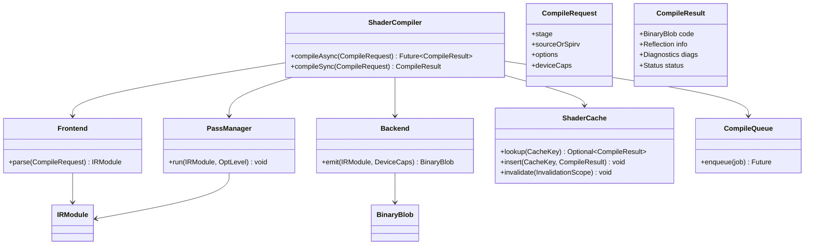
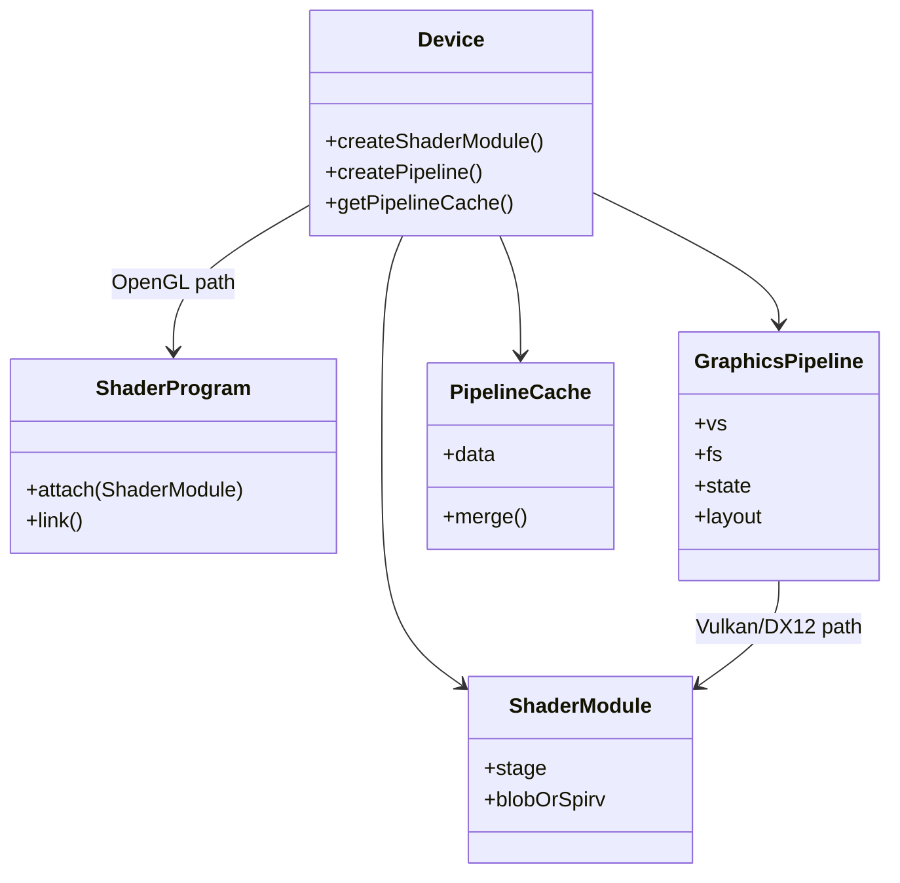

# LLD: Minimal Shader Compilation Pipeline (+ Graphics API Compare)

> **Focus areas:** Frontend parse · IR · Optimize · Backend codegen (GPU ISA conceptual) · Compiled-shader caching · Invalidation · Multi-thread compile · API object model  
> **Style:** LLD interview (clarify → NFRs → cases → classes → algorithms/pseudocode → concurrency → reliability/scalability/maintainability → wrap-up → Q&A → appendices)  
> **Quality bar:** Clear pipeline stages, honest Vulkan vs OpenGL vs DX12 object-model differences, cache key correctness, thread-safe compile orchestration  
> **Interview theme:** NVIDIA — **driver / compiler / graphics runtime** style; think GLSL/HLSL/SPIR-V → vendor IR → SASS-like ISA (conceptual, not proprietary dumps)

---

## Table of Contents

1. [Clarify Requirements (Interview Q&A)](#1-clarify-requirements-interview-qa)
2. [Non-Functional Requirements](#2-non-functional-requirements)
3. [Cases](#3-cases)
4. [Object Model & Class Diagrams](#4-object-model--class-diagrams)
5. [Public APIs / Interfaces](#5-public-apis--interfaces)
6. [Pipeline Stages & Pseudocode](#6-pipeline-stages--pseudocode)
7. [Graphics API Compare (Vulkan / OpenGL / DX12)](#7-graphics-api-compare-vulkan--opengl--dx12)
8. [Caching, Invalidation & Multi-Thread Compile](#8-caching-invalidation--multi-thread-compile)
9. [Design Deep Dive](#9-design-deep-dive)
10. [Reliability](#10-reliability)
11. [Scalability](#11-scalability)
12. [Maintainability](#12-maintainability)
13. [Wrap-Up](#13-wrap-up)
14. [Deeper / Related Interview Questions](#14-deeper--related-interview-questions)
15. [Appendices](#15-appendices)

---

## 1. Clarify Requirements (Interview Q&A)

Goal: design a **minimal shader compilation pipeline** and the **runtime object model** around it: take shader source (or IR), produce GPU-executable code, **cache** results, **invalidate** correctly, and compile **concurrently**—plus explain how this sits differently under **Vulkan vs OpenGL vs Direct3D 12**.

### 1.0 What this is / is not

| Dimension | This doc | Not this |
|-----------|----------|----------|
| Job | Compiler pipeline LLD + API objects | Full AAA engine renderer HLD |
| ISA | Conceptual GPU machine code | Real NVIDIA SASS encoding |
| SPIR-V | First-class IR input | Writing a production LLVM clone in 45 min |
| NVIDIA lens | Driver compiler / PSO cache thinking | CUDA `nvcc` host compiler internals only |

### 1.1 Clarifying questions (ask aloud)

| # | Question | Typical answer | Implication |
|---|----------|----------------|-------------|
| F1 | Input language? | GLSL / HLSL / SPIR-V | Frontend choice |
| F2 | Output? | Vendor binary + reflection | Backend + metadata |
| F3 | Online vs offline? | Both; online with cache | Async compile |
| F4 | Stages? | VS/PS/CS minimal; optional GS/FS | Program types |
| F5 | Optimizations? | -O0/-O2 style levels | Pass manager |
| F6 | Specialization? | Constants / caps / permutations | Cache key dims |
| F7 | Threading? | Thread pool compile | Job system |
| F8 | Cache persist? | Disk + memory | Hash store |
| F9 | API? | Discuss VK/GL/DX12 | Object model |
| F10 | Link vs compile? | Separate compile + link/PSO | Pipelines |
| F11 | Errors? | Diagnostics with locations | Frontend |
| F12 | Secure cache? | Optional hash verify | Integrity |

**MVP scope:**

1. Frontend: parse/validate → AST or direct to IR.  
2. Mid-end: IR passes (DCE, constfold, simple inlining).  
3. Backend: register-ish lowering + conceptual ISA emit.  
4. Reflection: bindings, attributes.  
5. `ShaderCompiler` service + cache.  
6. API objects: shader module / program / pipeline sketch.  
7. Multi-thread compile queue.  
8. High-level API comparison.

**Out of MVP:** full DXIL bitcode, ray-tracing pipelines, proprietary scheduling, real register allocator research quality.

### 1.2 Scope repeat-back

> Minimal shader compiler: source/SPIR-V → IR → optimize → GPU ISA blob + reflection; disk/memory cache keyed by source+options+device; thread-pool builds; explain how GL links programs vs Vulkan/DX12 pipeline state objects.

### 1.3 Pipeline sketch (lock early)

```text
Source (GLSL/HLSL) ──▶ Frontend ──▶ IR ──▶ Opt Passes ──▶ Backend ──▶ BinaryBlob
SPIR-V ────────────────────┘                              │
                                                          ▼
                                                 Reflection + Cache Store

Runtime: request(key) → cache hit? return : enqueue compile → complete → insert cache
```

---

## 2. Non-Functional Requirements

| # | NFR | Target | Why |
|---|-----|--------|-----|
| N1 | Correctness | Spec-conformant for supported subset | Visual bugs |
| N2 | Compile latency | Interactive: <100ms tiny shaders; async OK for large | Hitching |
| N3 | Cache hit rate | High after warm-up | Frame time |
| N4 | Determinism | Same key → same blob (or versioned) | Repro / cache |
| N5 | Thread safety | Parallel compiles; safe cache | Load screens / PSO warmup |
| N6 | Debuggability | Actionable error messages | Content authors |
| N7 | Portability of IR | SPIR-V / internal IR stable | Multi-gen GPUs |
| N8 | Footprint | Cache eviction policy | Disk/RAM |

### 2.1 Progressive scale

| Metric | Base | 10× | 100× |
|--------|------|-----|------|
| Shaders / title | 100s | 1K–10K | 100K perms |
| Compile threads | 2–4 | =cores | farm / offline |
| Cache size | 100MB | GBs | distributed PSO cache |
| Design | Proc cache | Persistent + async | Pipeline cache share / cloud |

### 2.2 Complexity targets

| Op | Typical |
|----|---------|
| Cache lookup | O(1) hash |
| Compile tiny | tens of ms |
| Compile huge | seconds → async |
| Invalidate by version | O(entries touched) or generation bump |

---

## 3. Cases

### 3.1 Happy paths

1. GLSL VS+FS compile → link → draw-compatible program (GL model).  
2. SPIR-V module → Vulkan `VkShaderModule` → PSO create hits pipeline cache.  
3. Same shader, same options, second run → disk cache hit, no compile.  
4. 8 threads compile independent shaders → all succeed into cache.  
5. Specialization constant change → different cache key → new blob.

### 3.2 Edge / failure cases

| Case | Behavior |
|------|----------|
| Syntax error | Diagnostics; no cache insert |
| Unsupported intrinsic | Error at frontend/lowering |
| OOM mid-compile | Fail job; no corrupt cache entry |
| Cache corruption | Hash/magic fail → recompile |
| Driver version bump | Global cache UUID invalidate |
| Concurrent same key | Singleflight — one compile |
| Huge permutation explosion | Cap / lazy compile / offline bake |
| Link mismatch VS/FS interfaces | Link error |
| Debug vs release opt | Different keys |
| Evict hot entry | Recompile on demand |

### 3.3 Invariants

```text
I1: Cache key uniquely identifies compilation inputs + compiler version + device ISA family
I2: Successful cache entry always has matching content hash
I3: Failed compiles do not leave “success” entries
I4: Thread pool never mutates IR of another job without ownership
I5: Pipeline/program objects do not outlive their module dependencies (refcounts)
I6: Invalidation never returns blob from incompatible driver UUID
```

---

## 4. Object Model & Class Diagrams

### 4.1 Compiler-side responsibilities

| Class | Responsibility |
|-------|----------------|
| `ShaderCompiler` | Façade: compile async/sync |
| `Frontend` | Lex/parse/validate → IR |
| `SpirvReader` | Import SPIR-V to IR |
| `IRModule` | Functions, types, globals |
| `PassManager` | Run optimization passes |
| `Backend` | Lower + emit `BinaryBlob` |
| `ReflectionBuilder` | Bindings / I/O signatures |
| `CompileJob` | One unit of work |
| `CompileQueue` | Thread pool + singleflight |
| `ShaderCache` | Memory + disk |
| `CacheKey` | Canonical hash inputs |
| `DiagnosticEngine` | Errors/warnings |

### 4.2 Runtime / API object responsibilities

| Class | Responsibility |
|-------|----------------|
| `ShaderSource` / `ShaderModule` | Immutable code object |
| `ShaderProgram` (GL-like) | Linked stages |
| `GraphicsPipeline` / `ComputePipeline` | PSO-like (VK/DX12) |
| `PipelineLayout` / `RootSignature` | Binding layout |
| `PipelineCache` | API-visible cache blob |
| `Device` | Owns compiler + caches |

### 4.3 Class diagram — compiler



### 4.4 Class diagram — API objects (unified teaching model)



### 4.5 IR sketch

```text
IRModule
  types[]
  global_vars[]          // ubo/ssbo/textures as bindables
  functions[]
    Function
      args[], blocks[]
        BasicBlock
          instructions[]   // add, mul, load, store, textureSample, branch, return
```

---

## 5. Public APIs / Interfaces

### 5.1 Compiler service

```cpp
enum class ShaderStage { Vertex, Fragment, Compute };

struct CompileOptions {
  OptLevel opt = OptLevel::O2;
  bool debug_info = false;
  map<string, uint32_t> specialization;
  string entry_point = "main";
};

struct CompileRequest {
  ShaderStage stage;
  enum class Input { GLSL, HLSL, SPIRV } lang;
  vector<uint8_t> bytes;          // source text or SPIR-V
  CompileOptions opt;
  DeviceCaps caps;                // ISA family, feature bits
};

class ShaderCompiler {
public:
  Future<CompileResult> compileAsync(CompileRequest req);
  CompileResult compileSync(CompileRequest req);
};
```

### 5.2 Cache

```cpp
struct CacheKey {
  array<uint8_t, 32> hash;        // sha256 of canonical request
};

class ShaderCache {
public:
  optional<CachedEntry> lookup(const CacheKey&);
  void insert(const CacheKey&, CachedEntry);
  void invalidateDriverUuid(const Uuid&);
  void evict(size_t max_bytes);
};
```

### 5.3 GL-like vs VK-like runtime (teaching)

```cpp
// OpenGL-flavored
class GLProgram {
  void attach(GLShader);
  bool link();
  void use();
};

// Vulkan-flavored
class VkStylePipeline {
  // created with full GraphicsPipelineCreateInfo:
  // stages[], vertexInput, raster, blend, layout, renderPass/dynamic
};
```

---

## 6. Pipeline Stages & Pseudocode

### 6.1 Top-level compile

```text
function compile(req) -> CompileResult:
  key = CacheKey::from(req, compiler_version, driver_uuid)
  if hit = cache.lookup(key):
    stats.hits++; return hit.result

  // singleflight
  return inflight.do(key, () => compile_uncached(req, key))

function compile_uncached(req, key):
  diags = DiagnosticEngine()
  try:
    ir = frontend.lower(req, diags)
    if diags.has_error(): return Fail(diags)

    pass_manager.run(ir, req.opt.opt)
    blob = backend.emit(ir, req.caps, diags)
    if diags.has_error(): return Fail(diags)

    refl = reflection.build(ir)
    result = Ok(blob, refl, diags)
    cache.insert(key, result)
    return result
  catch OOM:
    return Fail(OOM)
```

### 6.2 Frontend (GLSL subset sketch)

```text
function frontend.lower(req):
  if req.lang == SPIRV:
    return spirv_reader.decode(req.bytes)

  tokens = lex(req.bytes)
  ast = parse(tokens)
  validate_types_and_builtins(ast, req.stage)
  ir = ast_to_ir(ast, req.entry_point)
  annotate_bindings(ir)   // layout(set=,binding=) etc.
  return ir
```

### 6.3 Pass manager

```text
passes_O1 = [ConstFold, DCE, SimplifyCFG]
passes_O2 = passes_O1 + [InlineSmall, Mem2RegLite, CSE]

function run(ir, level):
  list = select(level)
  for p in list:
    p.run(ir)
    verify(ir)   // debug builds
```

**Pass examples (interview depth):**

| Pass | Effect |
|------|--------|
| ConstFold | Fold `3+4` |
| DCE | Remove unused ops |
| SimplifyCFG | Merge blocks |
| InlineSmall | Inline tiny funcs |
| CSE | Common subexpr |

### 6.4 Backend (conceptual GPU ISA)

```text
function emit(ir, caps):
  // 1) Legalize: expand unsupported ops into libcalls / sequences
  legalize(ir, caps)

  // 2) Lower textures/samplers to machine bind model
  lower_bindables(ir)

  // 3) Schedule / allocate registers (simplified)
  //    - build interference on SSA or value numbering
  //    - assign VGPRs/SGPRs conceptual buckets
  allocate_registers(ir, caps.reg_file)

  // 4) Emit instruction stream
  buf = CodeBuffer()
  for f in ir.functions:
    emit_prologue(buf, f)
    for bb in f.blocks:
      for inst in bb:
        emit_inst(buf, inst, caps.isa_version)
    emit_epilogue(buf, f)

  // 5) Relocation / bind tables
  buf.append(reflection_tables)

  return BinaryBlob{buf, hash, isa_version}
```

**Do not claim real SASS:** say “vendor ISA blob with register allocation and texture ops lowered.”

### 6.5 Reflection

```text
Reflection:
  inputs[]:  {location, type}      // VS attributes
  outputs[]: {location, type}
  bindings[]: {set, binding, kind: UBO|SSBO|IMG|SAMP, size}
  workgroup: {x,y,z}               // CS
  push_constants_size
```

Used by pipeline layout validation (VK) or linker (GL).

### 6.6 Link step (GL-style program)

```text
function link(program):
  // match VS outputs to FS inputs by location/name
  for each fs_input:
    if no matching vs_output: error
  merge reflection
  // optional: whole-program opts across stages
  program.binary = pack(stage_blobs)
  program.status = LINKED
```

Vulkan typically **does not** do GL-style link of separately compiled stages into a “program”; interfaces checked at **pipeline creation**.

---

## 7. Graphics API Compare (Vulkan / OpenGL / DX12)

### 7.1 Object model & when compilation happens

| Topic | OpenGL | Vulkan | Direct3D 12 |
|-------|--------|--------|-------------|
| Shader object | `glCompileShader` | `VkShaderModule` (often SPIR-V) | `ID3DBlob` DXIL/DXBC |
| Combination | `glLinkProgram` | `VkPipeline` (PSO) | PSO (`CreateGraphicsPipelineState`) |
| State binding | Lots of mutable global state | Explicit in PSO / dynamic state | Explicit in PSO / bundles |
| Validation | Driver often lenient/late | Explicit; layers | Debug layer |
| Cache | Implicit driver cache | `VkPipelineCache` | Cached PSO blobs / D3D12 pipeline library |
| CPU cost model | Hitch risk on first draw | Upfront PSO create | Upfront PSO create |
| Multi-thread | Limited historical | Explicit concurrency | Explicit concurrency |

### 7.2 Interview narrative

```text
OpenGL: compile shaders → link program → use; many states late-bound; drivers JIT/specialize quietly.

Vulkan/DX12: app owns more — provide IR/bytecode, describe nearly full pipeline state at create time;
compilation/specialization cost pulled earlier; caches are explicit objects/files.
```

### 7.3 Implications for our LLD

| Design piece | GL mapping | VK/DX mapping |
|--------------|------------|---------------|
| `ShaderCompiler` | behind `glCompileShader` | behind module+PSO create / dxc |
| `ShaderProgram.link` | first-class | mostly replaced by PSO create validation |
| `PipelineCache` | opaque driver | first-class / library |
| Specialization | `#define` permutations / ext | specialization constants / PSO variants |

### 7.4 SPIR-V’s role

- Vulkan’s portable shading IR.  
- Frontend can be `glslang` → SPIR-V → vendor mid-end.  
- Our LLD: `SpirvReader` into internal IR **or** optimize SPIR-V then lower.

### 7.5 DX12 note

HLSL → DXIL (via DXC) → vendor compiler at PSO create / driver. Same pipeline stages conceptually.

---

## 8. Caching, Invalidation & Multi-Thread Compile

### 8.1 Cache key contents

```text
key = H(
  canonical_source_or_spirv_bytes,
  stage,
  entry_point,
  CompileOptions,          // opt level, defines, specialization
  device_isa_family,
  feature_bits_used,
  compiler_version,
  driver_uuid
)
```

**Permutation warning:** `#define` soup explodes keys — prefer specialization constants + fewer variants.

### 8.2 Memory + disk tiers

```text
lookup:
  mem → disk → miss → compile → insert mem+disk

disk entry:
  magic | key | compiler_uuid | content_hash | blob | reflection
```

### 8.3 Invalidation

| Event | Action |
|-------|--------|
| Driver update | bump `driver_uuid`; ignore old entries |
| Compiler fix | bump `compiler_version` |
| Device change | different `isa_family` |
| App opt toggle | different options in key |
| Explicit clear | API `pipelineCache` reset / delete dir |
| LRU pressure | evict cold disk entries |

Generation counter:

```text
global_gen++
lookup requires entry.gen == global_gen
```

### 8.4 Singleflight / coalescing

```text
map<CacheKey, SharedFuture<Result>> inflight

function do(key, fn):
  lock
  if key in inflight: f = inflight[key]; unlock; return f
  f = promise
  inflight[key] = f
  unlock
  result = fn()
  complete promise
  lock; inflight.erase(key); unlock
  return result
```

Prevents thundering herd on cold cache at level load.

### 8.5 Thread pool

```text
CompileQueue:
  N worker threads
  priority queue: interactive > background warmup

worker:
  job = q.pop()
  result = compile_uncached(job.req)
  job.promise.set(result)
```

**IR ownership:** each job owns its `IRModule`; passes are re-entrant or thread-local.

### 8.6 Pipeline cache merge (Vulkan flavor)

```text
merge(a, b):
  for entry in b:
    if a.compatible(entry): a.insert_if_absent(entry)
```

App can persist blob across runs.

---

## 9. Design Deep Dive

### 9.1 Why IR not AST→ISA directly?

| Benefit | Explanation |
|---------|-------------|
| Shared opts | Same passes for GLSL and SPIR-V |
| Legalization | Caps differ by GPU gen |
| Testability | IR verifier |
| Caching mid | Optional cache optimized IR (rare) |

### 9.2 Optimization levels vs hitching

Games often **warmup PSOs** offline or at load. Online `-O0` for iteration; shipping `-O2` with cache.

### 9.3 Whole-program / cross-stage

GL link can do cross-stage opts. VK PSO creation can specialize with state (e.g., output formats). Model as backend taking `PipelineStateSubset` optional input:

```text
emit(ir, caps, optional_pso_state)
```

Different PSO state → **different cache key**.

### 9.4 Failure modes

| Failure | Mitigation |
|---------|------------|
| Cache key collision | SHA-256; include lengths |
| Stale ISA on GPU hang | uuid + version |
| Non-deterministic emit | Stabilize pass order; avoid pointer hashes |
| Priority inversion | Separate interactive pool |
| Disk full | Fail insert; compile still returns in-mem |

### 9.5 Observability

Metrics: `compile_ms`, `cache_hit`, `inflight_coalesced`, `opt_level`, `fail_syntax`, `queue_depth`.  
Trace: optional chrome-trace of jobs.

### 9.6 Testing strategy

| Test | Assert |
|------|--------|
| Golden IR | Parse snapshots |
| Opt | DCE removes dead |
| Cache | Second compile 0 backend calls |
| Invalidation | uuid bump misses |
| Singleflight | 100 threads 1 compile |
| Link | Interface mismatch errors |
| Concurrency | Stress pool + cache |

### 9.7 Deal-breakers

- Cache key missing opt/defines → wrong code, silent.  
- Mutating shared IR across threads.  
- Equating GL program with VK pipeline carelessly.  
- Claiming to emit real SASS details.  
- Blocking render thread on huge compiles without async story.

### 9.8 NVIDIA-flavored talking points

- Driver compiles → GPU machine code; heavy investment in offline/online caches.  
- Shader permutations historically painful for hitches → explicit APIs + caches.  
- Parallelism: compile threads during load; pipeline cache reuse across processes sometimes.

---

## 10. Reliability

### 10.1 Invariants

1. Never return success blob if verifier failed.  
2. Disk entries MAC/hash verified.  
3. Cancelled jobs do not insert partials.  
4. Diagnostics always attached on failure.

### 10.2 Crash during compile

Process crash: incomplete disk write avoided via write-temp + atomic rename.

```text
write(tmp); fsync; rename(tmp → final)
```

### 10.3 Idempotency

Recompiling same key overwrites identical content (or skips). Safe for retries.

### 10.4 Security

Treat shader cache as **untrusted** if shared: verify hash; optional signature in privileged stores.

---

## 11. Scalability

### 11.1 Progressive scale

| Stage | Shape |
|-------|-------|
| **Baseline** | Sync compile + mem cache |
| **10×** | Thread pool + disk cache + singleflight |
| **100×** | PSO warmup lists; pipeline cache share; opt jobs |
| **1,000×** | Offline bake farm; content pipeline ships blobs; cloud cache |

### 11.2 Permutation explosion

```text
materials × features × MSAA × formats → combinatorial blowup
Mitigate: specialize late, reduce defines, uber-shaders with branches, async compile
```

### 11.3 What does not scale

Single-threaded compile on render thread; unbounded disk cache without eviction; caching only by filename.

---

## 12. Maintainability

| Practice | Why |
|----------|-----|
| Pass plugins | Add opts without rewriting façade |
| IR verifier | Catch pass bugs early |
| Golden tests | Frontend stability |
| Version fields everywhere | Cache safety |
| Clear API boundary | Compiler vs Device runtime |

**Open/Closed:** new stage (mesh shader) adds `ShaderStage` + frontend rules + reflection fields—not a rewrite of cache.

---

## 13. Wrap-Up

### 13.1 60-second narrative

"We compile shaders through **frontend → IR → opt passes → backend ISA blob** with reflection. A **cache key** hashes source, options, device, and compiler/driver versions; memory and disk tiers avoid hitching. A **thread pool** with **singleflight** compiles in parallel. OpenGL centers on **compile + link program**; Vulkan and DX12 push cost into **pipeline state objects** with explicit **pipeline caches**. Incorrect cache keys are worse than misses—so invalidation and key design are first-class."

### 13.2 Grading signals

| Signal | Show |
|--------|------|
| Pipeline | Clear stages |
| API compare | GL vs VK/DX12 objects |
| Cache | Key dims + invalidation |
| Threads | Pool + singleflight |
| Honesty | Conceptual ISA |
| Product sense | Hitching / permutations |

### 13.3 Cheat sheet

| Topic | Answer |
|-------|--------|
| IR | Portable mid-end |
| Cache key | source+opts+device+versions |
| GL | Program link |
| VK/DX12 | PSO + pipeline cache |
| Threads | Queue + coalesce |
| Kill | Bad keys; sync compile on hot path; N×2FF thinking N/A here |

---

## 14. Deeper / Related Interview Questions

### 14.1 Compiler

**Q1: Why SPIR-V instead of shipping GLSL to the driver?**  
A: Portable, structured IR; frontends compete; drivers focus on mid/back.

**Q2: SSA in shader IR?**  
A: Simplifies opts; backend may leave SSA late then allocate regs.

**Q3: What breaks if pass order is nondeterministic?**  
A: Cache instability; hard-to-repro codegen.

**Q4: Uber-shader vs permutations?**  
A: Uber: fewer compiles, more runtime branches/regs; perms: lean code, cache blowups.

**Q5: How do specialization constants affect caching?**  
A: They’re compile inputs → part of key (or baked into SPIR-V before keying).

### 14.2 APIs & runtime

**Q6: Why did Vulkan introduce pipeline cache objects?**  
A: Make warmup/persistence explicit; reduce driver magic; multi-thread friendly.

**Q7: Can you change blend state without recompile in VK?**  
A: Historically many states baked into PSO; newer dynamic state reduces variants—still a key topic.

**Q8: GL hot-reload workflow?**  
A: Recompile shader, relink program; validate link; swap; cache invalidate that key.

### 14.3 NVIDIA / systems

**Q9: Compile hitch on first draw—where?**  
A: GL drivers may defer; VK if PSO created late on frame; fix with warmup.

**Q10: Multi-process cache sharing?**  
A: Careful file locking + uuid; security of shared blobs.

**Q11: How related to CUDA compile?**  
A: Similar staged compilation; different runtime (`nvrtc` vs graphics PSO); still IR+cache themes.

**Q12: Binary compatibility across GPU generations?**  
A: Usually not—key must include ISA family; recompile or ship fat binaries.

---

## 15. Appendices

### A. End-to-end sequence (Vulkan-like)

```text
1. App compiles HLSL/GLSL → SPIR-V (offline) OR loads SPIR-V
2. Device.createShaderModule(spirv)
3. Device.createGraphicsPipeline(stages, state, layout, pipelineCache)
      → ShaderCompiler.compile / cache lookup per stage (+ state specialized key)
4. Persist pipelineCache data to disk
5. Next run: load cache → mostly hits
```

### B. End-to-end sequence (OpenGL-like)

```text
1. glCreateShader / glShaderSource / glCompileShader  → Frontend+Backend
2. glCreateProgram / glAttachShader / glLinkProgram → interface check + pack
3. glUseProgram
4. Driver-internal cache may remember binary (glGetProgramBinary)
```

### C. Cache key canonicalization pseudocode

```text
function canonical_bytes(req):
  w = Writer()
  w.u32(req.lang)
  w.u32(req.stage)
  w.str(req.opt.entry_point)
  w.u32(req.opt.opt)
  w.u32(req.opt.debug_info)
  for (k,v) in sorted(req.opt.specialization):
    w.str(k); w.u32(v)
  w.bytes(req.bytes)
  w.bytes(req.caps.fingerprint)
  w.bytes(COMPILER_VERSION)
  w.bytes(DRIVER_UUID)
  return sha256(w.finish())
```

### D. Minimal IR instruction set (teaching)

```text
Arithmetic: ADD, SUB, MUL, FMA, DIV
Logic: AND, OR, XOR, SELECT
Memory: LOAD, STORE
Texture: TEX_SAMPLE, TEX_FETCH
Control: BR, CONDBR, RETURN, PHI (SSA)
Bind: BIND_RESOURCE (metadata)
```

### E. Register allocation sketch (linear scan lite)

```text
build live intervals from SSA use-def
sort by start
for interval in order:
  expire old
  if free reg: assign
  else spill furthest use
```

Mention only—don’t implement full RA unless asked.

### F. Diagnostic example

```text
ERROR: fragment.glsl:42:5: unknown identifier 'textre'
  42 |     color = textre(uSamp, uv);
     |             ^
```

### G. Comparison matrix (detailed)

| Capability | OpenGL | Vulkan | DX12 |
|------------|--------|--------|------|
| Portable IR | GLSL (SPIR-V optional) | SPIR-V | DXIL |
| Explicit barriers | weaker historically | yes | yes |
| Multi-queue | limited | yes | yes |
| PSO | implicit | explicit | explicit |
| Bindless | extensions | descriptors | descriptors/SM |

### H. Threading model diagram

```text
RenderThread ---- request PSO ----▶ CompileFrontend
                                      │
BackgroundWorkers ◀──── jobs ─────────┤
      │                               │
      ▼                               ▼
  ShaderCache ◀──────── insert/lookup ┘
```

### I. Invalidation flowchart

```text
driver_update?
  yes → bump DRIVER_UUID → all disk entries miss
compiler_hotfix?
  yes → bump COMPILER_VERSION
caps change (new GPU)?
  yes → different caps.fingerprint
else keys stable
```

### J. Interview whiteboard order

1. API context (GL vs VK/DX).  
2. Pipeline stages boxes.  
3. Cache key fields.  
4. Thread pool + singleflight.  
5. PSO vs Program.  
6. Failure/invalidation.  

### K. Glossary

| Term | Meaning |
|------|---------|
| PSO | Pipeline State Object |
| SPIR-V | Standard Portable Intermediate Representation |
| DXIL | DirectX Intermediate Language |
| Reflection | Metadata about bindings/IO |
| Specialization constant | Compile-time value in SPIR-V |
| Hitch | Frame-time spike from compile |
| Pipeline cache | Persistent compiled PSO store |

### L. Sample `CompileJob` struct

```cpp
struct CompileJob {
  CacheKey key;
  CompileRequest req;
  promise<CompileResult> done;
  Priority prio;
};
```

### M. Disk entry layout

```text
offset0  magic "NSDC"
offset4  version u32
offset8  key[32]
offset40 driver_uuid[16]
offset56 content_sha[32]
offset88 refl_size u32
offset92 blob_size u32
offset96 reflection bytes
...      blob bytes
```

### N. Relationship to fixed allocators

Compiler itself uses general allocator heavily; driver runtime may place **shader blobs** in fixed arenas for residency—tie to sibling LLDs if asked.

### O. Minimal pass: DCE pseudocode

```text
function DCE(ir):
  mark all instructions reachable from returns / stores / side-effect ops
  for inst in reverse_postorder:
    if !marked(inst) and !has_side_effects(inst):
      remove(inst)
```

### P. Frontend vs backend bugs — how to tell

| Symptom | Likely |
|---------|--------|
| Wrong type error | Frontend |
| Black pixels, valid reflect | Backend/opt |
| Crash only at -O2 | Opt pass |
| Only after driver update | Backend/ISA / bad cache uuid |

### Q. Warmup API sketch

```text
device.warmup(list of PipelineCreateInfo):
  parallel for info in list:
    createPipeline(info)  // populate cache
  flush disk
```

### R. What “minimal” excludes (say aloud)

Geometry/tessellation/mesh detail, ray tracing, derivative opts, subgroup ops completeness, real SSA RA quality—scope control is an interview skill.

---

*End of shader compilation pipeline LLD.*
