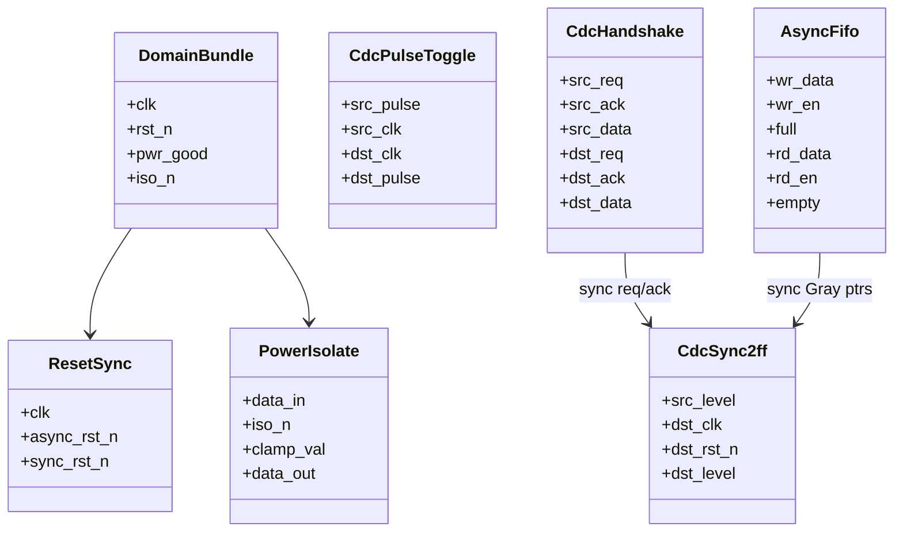

# LLD: SoC Control-Signal Clock / Power Domain Crossing (CDC)

> **Focus areas:** 2FF synchronizers · CDC · Async FIFO for data · Reset crossing · Metastability · Power-domain isolation · Formal checklist · SDC timing constraints  
> **Style:** Hardware LLD interview (clarify → NFRs → cases → “classes” as RTL module interfaces → protocols → reliability/scalability/maintainability → wrap-up → Q&A → appendices)  
> **Quality bar:** Correct synchronizer use (and when **not** to use them), clear multi-bit strategies, reset and isolation story, constraint/pseudo-formal checklist—not hand-wavy “add 2 flops”  
> **Interview theme:** NVIDIA GPU / SoC — **graphics, display, memory controller, power islands, NVLink-ish control planes**; show silicon-aware design taste

---

## Table of Contents

1. [Clarify Requirements (Interview Q&A)](#1-clarify-requirements-interview-qa)
2. [Non-Functional Requirements](#2-non-functional-requirements)
3. [Cases](#3-cases)
4. [Module Model & “Class” Diagrams](#4-module-model--class-diagrams)
5. [Public Interfaces (RTL Ports)](#5-public-interfaces-rtl-ports)
6. [Key Circuits & Protocols (Pseudocode / RTL Sketches)](#6-key-circuits--protocols-pseudocode--rtl-sketches)
7. [Metastability, MTBF & Multi-Bit CDC](#7-metastability-mtbf--multi-bit-cdc)
8. [Reset Crossing & Power Domain Isolation](#8-reset-crossing--power-domain-isolation)
9. [Timing Constraints (SDC Discussion)](#9-timing-constraints-sdc-discussion)
10. [Design Deep Dive](#10-design-deep-dive)
11. [Reliability](#11-reliability)
12. [Scalability](#12-scalability)
13. [Maintainability](#13-maintainability)
14. [Wrap-Up](#14-wrap-up)
15. [Deeper / Related Interview Questions](#15-deeper--related-interview-questions)
16. [Appendices](#16-appendices)

---

## 1. Clarify Requirements (Interview Q&A)

Goal: design the **hardware modules and rules** for safely moving **control signals** (and related data) across **asynchronous clock domains** and **power domains** inside an SoC / GPU partition—without metastability failures, reset races, or isolation glitches.

### 1.0 What this is / is not

| Dimension | This doc | Not this |
|-----------|----------|----------|
| Job | CDC + power isolation LLD for control | Full NoC microarchitecture HLD |
| Data path | Async FIFO when multi-bit/data needed | High-speed SerDes PHY design |
| Software | Driver implications of resets/power | Full RM (resource manager) stack |
| NVIDIA lens | GPU islands: GPC/TPC, display, FB, PWR | Pure textbook FF only |

### 1.1 Clarifying questions (ask aloud)

| # | Question | Typical answer | Implication |
|---|----------|----------------|-------------|
| F1 | Signal type? | Level control, pulse, multi-bit bus, stream | Different CDC recipes |
| F2 | Clocks related? | Async (mesochronous possible) | Assume async unless proven |
| F3 | Frequency ratio? | Arbitrary; may stop clocks | Must tolerate gated clocks |
| F4 | Power domains? | Yes — AON vs core vs ISO | Isolation cells + handshake |
| F5 | Latency OK? | Control: few cycles OK | 2FF / handshake fine |
| F6 | Throughput data? | Occasional vs continuous | Pulse vs async FIFO |
| F7 | Reset strategy? | Async assert, sync deassert | Reset synchronizers |
| F8 | Formal? | CDC lint + formal properties | Checklist |
| F9 | Single-chip? | One die, many domains | Still many CDCs |
| F10 | Safety level? | Consumer GPU + data center | MTBF targets differ |
| F11 | Glitch sources? | Combo logic before sync | Register then sync |
| F12 | Tools? | Spyglass CDC / Jasper / SDC | Process awareness |

**MVP scope:**

1. Single-bit level synchronizer (2FF).  
2. Pulse / toggle synchronizer for edge events.  
3. Handshake (req/ack) for multi-bit control words.  
4. Async FIFO for data streams.  
5. Reset crossing.  
6. Power-domain isolation + clamp values.  
7. Constraint and verification checklist.

**Out of MVP:** full DVFS FSM design, PLL programming sequences (mention), package SI.

### 1.2 Scope repeat-back

> SoC CDC kit: 2FF for slow level controls, toggle/handshake for events and multi-bit, async FIFO for bandwidth, reset sync, power isolation cells—with SDC `set_false_path`/`set_max_delay` discipline and a formal/lint checklist.

### 1.3 Taxonomy (lock early)

```text
Single-bit LEVEL  → 2FF (or 3FF) synchronizer
Single-bit PULSE  → toggle sync + edge detect  OR  handshake
Multi-bit CONTROL → req/ack handshake (stable data while req)
Multi-bit STREAM  → asynchronous FIFO (Gray pointers)
RESET             → async assert / sync deassert chain
POWER CROSSING    → isolation cells + enable sequencing
```

**Never** put an arbitrary multi-bit bus through N independent 2FF syncs (incoherent samples → garbage).

---

## 2. Non-Functional Requirements

| # | NFR | Target | Why |
|---|-----|--------|-----|
| N1 | Functional correctness | No illegal cross-domain samples | Silicon bugs = respins |
| N2 | MTBF | Metastability MTBF ≫ product life | Reliability |
| N3 | Latency | Bounded, documented cycles | SW/HW contracts |
| N4 | Power | Safe when source domain off | No crowbar / floats |
| N5 | Clock stop | No deadlock if src clk gated mid-handshake | GPU power modes |
| N6 | Verifiability | Lint + formal + sims | Signoff |
| N7 | Reuse | Parameterized CDC library cells | Maintainability |
| N8 | Observability | Optional sticky error / overflow flags | Bring-up |

### 2.1 Progressive scale (SoC view)

| Metric | Base IP block | 10× | 100× |
|--------|---------------|-----|------|
| Clock domains | 2–4 | 20–40 | 100s (GPU) |
| CDC crossings | dozens | thousands | tens of thousands |
| Design shift | Hand modules | CDC library + lint waivers policy | Automated structural CDC + ownership |

### 2.2 Latency budgets (example)

| Path | Typical |
|------|---------|
| 2FF level | 2–3 dst cycles |
| Toggle pulse | 2–3 dst + src toggle path |
| Req/ack word | ~4–8 cycles round trip (ratio dependent) |
| Async FIFO | 2–3 cycles pointer sync + mem |

---

## 3. Cases

### 3.1 Happy paths

1. Slow `enable` from PWR domain → 2FF into graphics clk → stable control.  
2. “Kick” pulse from CPU clk → toggle sync → one-cycle pulse in GPU clk.  
3. 32-bit MMIO control word → req/ack with data held stable.  
4. DMA descriptors stream → async FIFO, almost-full backpressure.  
5. Power down client island → isolation clamps outputs → safe values to always-on.

### 3.2 Edge / failure cases

| Case | Behavior |
|------|----------|
| Combo glitch into synchronizer | May false-trigger — **register in src first** |
| Multi-bit via parallel 2FF | Coherency fail — forbidden |
| Pulse narrower than src period sampled wrong | Use toggle or stretch |
| FIFO overflow | Sticky error; drop or backpressure |
| FIFO read empty | Underflow flag |
| Src clock stops during req | Deadlock if ack waits — timeout / design for gated clocks |
| Isolation enabled late | X-propagation / crowbar risk |
| Reset release async to clk | Partial reset state — sync deassert |
| Gray code bug (multi-bit ptr) | Illegal FIFO state |
| Related clocks treated async | Extra latency OK; or use sync FIFO if same clock |

### 3.3 Invariants

```text
I1: Synchronizer inputs are driven by registered (glitch-free) sources
I2: Multi-bit data constant while handshake req asserted (src side)
I3: Async FIFO pointers Gray-encoded before crossing
I4: Isolation enables sequenced before power remove / after power good
I5: No timed path assumed through async crossings unless explicitly max_delay
I6: Reset deassert synchronized to local clock
```

---

## 4. Module Model & “Class” Diagrams

Think of RTL modules as classes: clear ports, responsibilities, and composition.

### 4.1 Responsibility table

| Module (“class”) | Responsibility |
|------------------|----------------|
| `CdcSync2ff` | 2-flop (or 3) level synchronizer |
| `CdcPulseToggle` | Edge event across domains |
| `CdcHandshake` | Req/ack + stable data register |
| `AsyncFifo` | Data plane crossing with Gray ptrs |
| `ResetSync` | Async assert, sync deassert |
| `PowerIsolate` | Isolation cell wrapper + clamp policy |
| `CdcLibPackage` | Parameterized standard cells / macros |
| `DomainBundle` | Clock, reset, power good, iso enables |

### 4.2 Module diagram



### 4.3 Block diagram — control word crossing

```text
     SRC CLK DOMAIN                         DST CLK DOMAIN
 ┌──────────────────┐                  ┌──────────────────┐
 │ reg data_s       │                  │                  │
 │ reg req_s        │── req (2FF) ───▶│ req_d            │
 │                  │◀─ ack (2FF) ────│ / FSM capture    │
 │ hold data while  │                  │ data_q ◀─ data_s │
 │ req asserted     │──── data ───────▶│ (no per-bit sync)│
 └──────────────────┘                  └──────────────────┘
```

### 4.4 Block diagram — async FIFO

```text
  wr_clk domain          CDC                 rd_clk domain
  wr_ptr (bin→Gray) ──▶ 2FF sync ──▶ Gray→bin compare → empty/full
  mem[wr]  ◀──────────────────────────────▶ mem[rd]
  rd_ptr Gray ◀── 2FF sync ◀── rd_ptr (bin→Gray)
```

---

## 5. Public Interfaces (RTL Ports)

### 5.1 `CdcSync2ff`

```systemverilog
module cdc_sync2ff #(
  parameter int STAGES = 2,          // 2 or 3
  parameter bit RESET_VAL = 1'b0
) (
  input  logic dst_clk,
  input  logic dst_rst_n,            // synced reset in dst domain
  input  logic src_level,            // MUST be glitch-free / registered
  output logic dst_level
);
```

### 5.2 `CdcPulseToggle`

```systemverilog
module cdc_pulse_toggle (
  input  logic src_clk,
  input  logic src_rst_n,
  input  logic src_pulse,            // 1-cycle pulse in src
  input  logic dst_clk,
  input  logic dst_rst_n,
  output logic dst_pulse             // 1-cycle pulse in dst
);
```

### 5.3 `CdcHandshake` (multi-bit control)

```systemverilog
module cdc_handshake #(
  parameter int WIDTH = 32
) (
  // src
  input  logic             src_clk,
  input  logic             src_rst_n,
  input  logic             src_valid,   // pulse or level start
  input  logic [WIDTH-1:0] src_data,
  output logic             src_ready,   // accepts new xfer
  // dst
  input  logic             dst_clk,
  input  logic             dst_rst_n,
  output logic             dst_valid,
  input  logic             dst_ready,
  output logic [WIDTH-1:0] dst_data
);
```

### 5.4 `AsyncFifo`

```systemverilog
module async_fifo #(
  parameter int WIDTH = 64,
  parameter int DEPTH = 16           // power of two
) (
  input  logic             wr_clk,
  input  logic             wr_rst_n,
  input  logic [WIDTH-1:0] wr_data,
  input  logic             wr_en,
  output logic             full,
  output logic             almost_full,

  input  logic             rd_clk,
  input  logic             rd_rst_n,
  output logic [WIDTH-1:0] rd_data,
  input  logic             rd_en,
  output logic             empty,
  output logic             almost_empty,

  output logic             overflow_sticky,
  output logic             underflow_sticky
);
```

### 5.5 `ResetSync` / `PowerIsolate`

```systemverilog
module reset_sync (
  input  logic clk,
  input  logic async_rst_n,
  output logic sync_rst_n
);

module power_isolate #(
  parameter int WIDTH = 1,
  parameter logic [WIDTH-1:0] CLAMP = '0
) (
  input  logic             iso_n,      // 0 = isolate
  input  logic [WIDTH-1:0] data_in,
  output logic [WIDTH-1:0] data_out
);
```

---

## 6. Key Circuits & Protocols (Pseudocode / RTL Sketches)

### 6.1 2FF level synchronizer

```systemverilog
always_ff @(posedge dst_clk or negedge dst_rst_n) begin
  if (!dst_rst_n) begin
    ff1 <= RESET_VAL;
    ff2 <= RESET_VAL;
  end else begin
    ff1 <= src_level;   // may go metastable
    ff2 <= ff1;         // resolve before use
  end
end
assign dst_level = ff2;
```

**Rules:**

- `src_level` from a flip-flop in **source** domain (or known glitch-free).  
- Do **not** synchronize the same signal with two independent chains and expect agreement without design.  
- For very fast toggles relative to dst clk, level sync alone loses edges → use toggle/FIFO.

### 6.2 Pulse → toggle → pulse

```text
// SRC
on src_pulse: toggle_s <= ~toggle_s

// CDC
toggle_d = sync2ff(toggle_s)

// DST
dst_pulse <= toggle_d XOR toggle_d_q
toggle_d_q <= toggle_d
```

**Property:** each src edge event becomes exactly one dst pulse (if dst clk fast enough to sample each toggle; if src events faster than dst can absorb → need FIFO/credit).

### 6.3 Req/ack handshake (4-phase, async)

```text
SRC FSM:
  IDLE: on valid & !busy: data_s<=data; req_s<=1; → WAIT_ACK
  WAIT_ACK: if ack_s_sync: req_s<=0; → WAIT_ACK_LOW
  WAIT_ACK_LOW: if !ack_s_sync: ready; → IDLE

DST FSM:
  IDLE: if req_d_sync: data_q<=data_s; valid←; → WAIT_READY
  ... consume with dst_ready ...
  then ack_d<=1 until req drops, then ack_d<=0
```

**Critical:** `data_s` held constant from req rise until ack seen (src). Dst samples data **after** seeing synchronized req (and with appropriate delay if needed—usually sample when req_d rises).

### 6.4 Async FIFO — Gray pointer sync

```text
parameters: DEPTH = 2^N

wr_clk:
  if wr_en and !full:
    mem[wr_ptr_bin[N-1:0]] <= wr_data
    wr_ptr_bin <= wr_ptr_bin + 1
  wr_ptr_gray <= bin2gray(wr_ptr_bin)
  rd_ptr_gray_sync <= sync2ff(rd_ptr_gray)   // multi-bit Gray OK bit-wise
  full <= (wr_ptr_gray == {~rd_ptr_gray_sync[N:N-1], rd_ptr_gray_sync[N-2:0]})
          // classic full detect with extra pointer bit

rd_clk:
  symmetric empty detect
```

**Why Gray:** only one bit changes per increment → bitwise 2FF yields either old or new pointer, never arbitrary mix of multi-bit binary.

### 6.5 Almost-full / backpressure

```text
almost_full when free_entries < THRESHOLD
Producer must stop before full to account for pointer sync latency
```

Credit-based: initialize credits = DEPTH - margin; decrement on send; increment when rd returns credit across CDC (another handshake/FIFO).

---

## 7. Metastability, MTBF & Multi-Bit CDC

### 7.1 Metastability intuition

A flip-flop sampling an async input may enter a metastable voltage; resolution time is statistical. Second flop waits for resolution → output used by logic is stable with high probability.

### 7.2 MTBF (say in interview)

```text
MTBF ≈ (e^(t_r / τ)) / (T_w · f_clk · f_data)
```

- More stages or slower clocks → higher MTBF.  
- NVIDIA data-center vs mobile may pick 2 vs 3 stages differently.

### 7.3 Multi-bit strategies

| Method | Use when |
|--------|----------|
| Independent 2FF per bit | **Only** if bits mutually independent & uncorrelated OK |
| Gray code + 2FF | Pointers, counters |
| Handshake + stable data | Control registers / sparse words |
| Async FIFO | Continuous data / commands |
| Recode to 1-hot carefully | Rare; still need care |

### 7.4 Related / mesochronous clocks

If clocks are **phase-related** from same PLL with known skew, sometimes sync FIFO or carefully constrained paths—**do not assume** without clocking architect signoff.

---

## 8. Reset Crossing & Power Domain Isolation

### 8.1 Reset synchronizer

```text
async_rst_n ──▶ FF1 ──▶ FF2 ──▶ sync_rst_n
assert: asynchronous (immediate)
deassert: synchronized to clk (avoid partial release)
```

**Crossing resets between domains:** do not use one domain’s sync reset as another’s async reset without a local `reset_sync`.

### 8.2 Reset removal ordering

```text
Power good → release isolation → deassert resets (per domain) → enable traffic
```

Document per-island sequences; GPU power states often scripted by PWR microcontroller / PMU.

### 8.3 Isolation cells

When domain A powers off, outputs floating → corrupt domain B.

```text
data_out = iso_n ? data_in : CLAMP
```

Isolation enable `iso_n` must be driven from **always-on** domain and timed so:

1. Assert isolation **before** remove power.  
2. Keep isolation until destination no longer depends on source.  
3. Deassert isolation only after source powered + reset done + outputs valid.

### 8.4 Handshake vs power-down

If src may lose power mid-transaction: design **abort**, sticky error in AON, or disallow power-down until idle (credit drain).

---

## 9. Timing Constraints (SDC Discussion)

### 9.1 Typical constraints

```tcl
# Async clocks
set_clock_groups -asynchronous -group {clk_src} -group {clk_dst}

# Or false path into synchronizer first flop data pin
set_false_path -to [get_pins sync/ff1/D]

# Max delay for quasi-static paths / external
set_max_delay $MAX -from [get_clocks clk_src] -to [get_pins sync/ff1/D]

# Handshake data path: data timed as max_delay relative to req
# (methodology-specific — say "data stable window vs synced req")
```

### 9.2 What not to do

- Leaving CDC paths as timed setup/hold between async clocks → impossible/noisy.  
- False-pathing **everything** including FIFO memory addresses incorrectly.  
- Forgetting `set_max_delay` where methodology requires bounded skew for multi-bit non-Gray (prefer avoid that design).

### 9.3 Naming & attributes

```text
(* ASYNC_REG = "TRUE" *) logic ff1, ff2;  // tool retention / placement
```

Keep sync FFs physically close; avoid combo between them.

---

## 10. Design Deep Dive

### 10.1 NVIDIA GPU flavor — where CDC appears

| Area | Crossing example |
|------|------------------|
| Host / front-end | CPU / PCIe clock ↔ GPU hub |
| Graphics pipeline | GPC vs ROP vs display |
| Memory | Framebuffer controller vs engines |
| Power | Always-on PWR ↔ islands |
| Debug | JTAG / always-on traces |

Interview: pick one crossing and apply the taxonomy.

### 10.2 Control vs data plane

```text
Control: enable, mode, kick, interrupt → sync / handshake
Data: pixel, command packets → async FIFO / NoC with credits
```

### 10.3 Interrupt crossing

Edge interrupt → toggle sync → pulse in dst → sticky status bit cleared by SW in dst domain.

### 10.4 Failure modes

| Failure | Mitigation |
|---------|------------|
| Glitchy async input | Src register |
| FIFO ptr binary sync | Use Gray |
| Isolation wrong clamp | Explicit CLAMP policy per signal |
| Reset deassert race | Reset sync stages |
| Deadlock gated clock | Design idle-before-gate; timeouts in AON |
| Over-constrained CDC | Correct SDC |

### 10.5 Verification strategy

| Layer | What |
|-------|------|
| Lint (Spyglass CDC) | Structural crossings identified |
| Formal | Handshake properties; Gray one-hot diff |
| Simulation | Clock sweeps; gate clocks; power collapse |
| Gate-level | Select CDC paths with SDF caution |
| Silicon | Sticky counters; bring-up knobs |

### 10.6 Formal checklist (interview gold)

```text
□ Every async input feeds approved sync cell
□ No multi-bit bus through naked per-bit sync (unless Gray/independent)
□ FIFO ptrs Gray; depth power-of-two
□ Handshake data stability property
□ Reset sync present per domain
□ Isolation on all cross-power nets
□ SDC clock groups / false path / max_delay reviewed
□ Overflow/underflow sticky defined
□ Clock-gate mid-xfer analyzed
□ Naming: modules from CDC library only (no DIY 1FF)
```

### 10.7 Deal-breakers

- “Just add two flops” on a 128-bit bus.  
- Syncing a combo decode.  
- Ignoring power isolation.  
- Binary pointer CDC.  
- Async reset release everywhere.

---

## 11. Reliability

### 11.1 Invariants under stress

1. Metastability confined to synchronizer first stage.  
2. FIFO never reports !full and !empty incorrectly due to ptr skew beyond Gray design.  
3. Power collapse cannot inject X into always-on without isolation.  
4. Reset does not release different FFs on different edges without sync.

### 11.2 Soft error / SEU note

Synchronizer chains can be upset; critical controls may use triple stages or majority—mention for safety-critical (auto), less common for consumer GPU config bits.

### 11.3 Sticky diagnostics

```text
overflow_sticky, underflow_sticky, handshake_timeout_sticky
cleared by AON write; counted for RAS
```

---

## 12. Scalability

### 12.1 Progressive scale

| Stage | CDC practice |
|-------|--------------|
| **Baseline** | Few domains; hand-instantiated library cells |
| **10×** | Shared CDC IP; lint waiver process |
| **100×** | Thousands of crossings; automated structural CDC; ownership per unit |
| **1,000×** | Chiplet / multi-die: treat die-to-die as another “domain” with link protocol |

### 12.2 What does not scale

Ad-hoc synchronizers per designer; undocumented waivers; one mega-async FIFO for all controls (latency/contention).

### 12.3 Library parameterization

```text
cdc_sync2ff #(.STAGES(3))
async_fifo #(.WIDTH(256), .DEPTH(32))
```

Common cells → common signoff.

---

## 13. Maintainability

| Practice | Why |
|----------|-----|
| Only library CDC cells | Lint patterns stable |
| Signal naming `*_async`, `*_sync` | Reviewability |
| Per-crossing design doc entry | Waivers justified |
| Power sequence owned by PWR team | Clear interface contracts |
| Assertions in TB | `data stable while req` |

**Open/Closed:** new protocol (AXI async bridge) composes handshake/FIFO; don’t invent new sync physics.

---

## 14. Wrap-Up

### 14.1 60-second narrative

"Classify the signal: level, pulse, multi-bit control, or stream. Levels get **2FF**; pulses get **toggle sync**; multi-bit control gets **req/ack with stable data**; streams get **async FIFO with Gray pointers**. Resets are **async assert / sync deassert**. Power crossings use **isolation clamps** sequenced with power good. Constraints mark async clock groups and protect synchronizers. We verify with CDC lint, formal properties, and sticky RAS counters."

### 14.2 Grading signals

| Signal | Show |
|--------|------|
| Taxonomy | Right tool per signal |
| Metastability | 2FF purpose + MTBF intuition |
| Multi-bit | Why not N×2FF |
| Reset/power | Isolation + sync deassert |
| Signoff | SDC + checklist |
| GPU taste | Clock gate / islands |

### 14.3 Cheat sheet

| Topic | Answer |
|-------|--------|
| Level | 2FF |
| Pulse | Toggle |
| Multi-bit ctrl | Handshake |
| Data | Async FIFO + Gray |
| Reset | Sync deassert |
| Power | Isolate then power off |
| Kill | Bus through 2FFs; combo into sync; no iso |

---

## 15. Deeper / Related Interview Questions

### 15.1 CDC fundamentals

**Q1: Why two flops not one?**  
A: First may be metastable; second samples after resolution time.

**Q2: When three flops?**  
A: Higher MTBF / faster clocks / stricter RAS.

**Q3: Can Gray code still fail?**  
A: If multi-bit changes not truly one-at-a-time (bad encoder) or sampled during multi-bit glitch—keep encoder clean.

**Q4: Is `set_false_path` always enough?**  
A: Methodology may want `set_max_delay` into first stage for correlation; follow shop rules.

**Q5: Related clocks?**  
A: May use sync FIFO if same edge domain; confirm with clocking.

### 15.2 Protocols & power

**Q6: 2-phase vs 4-phase handshake?**  
A: 4-phase return-to-zero common in async; 2-phase faster but trickier.

**Q7: Clock stops with open req?**  
A: Deadlock risk—idle/drain policies before clock gate; AON timeout.

**Q8: What clamp value for active-low reset crossing power?**  
A: Clamp to safe inactive; document per signal.

**Q9: FIFO depth sizing?**  
A: Bandwidth × CDC latency + margin; almost-full threshold ≥ sync delay in writes.

### 15.3 NVIDIA flavor

**Q10: Crossing into a power-gated GPC?**  
A: Isolate outputs, hold resets, use AON for mode bits, re-init after power-up.

**Q11: Display vs graphics clock?**  
A: Classic async; frame timing via FIFO + genlock strategies (high level).

**Q12: Why CDC library ownership matters at GPU scale?**  
A: Tens of thousands of crossings—process beats heroics.

---

## 16. Appendices

### A. Full toggle-synchronizer sketch

```systemverilog
// src
always_ff @(posedge src_clk or negedge src_rst_n) begin
  if (!src_rst_n) tog <= 1'b0;
  else if (src_pulse) tog <= ~tog;
end

// dst sync + edge
cdc_sync2ff u_sync(.dst_clk(dst_clk), .dst_rst_n(dst_rst_n),
                   .src_level(tog), .dst_level(tog_s));
always_ff @(posedge dst_clk or negedge dst_rst_n) begin
  if (!dst_rst_n) begin tog_r <= 1'b0; dst_pulse <= 1'b0; end
  else begin
    tog_r <= tog_s;
    dst_pulse <= tog_s ^ tog_r;
  end
end
```

### B. Gray code helpers

```text
bin2gray(b) = b ^ (b >> 1)
gray2bin(g): b[N]=g[N]; for i=N-1..0: b[i]=b[i+1]^g[i]
```

Pointer width = `log2(DEPTH)+1` for full/empty distinction.

### C. Handshake timing diagram (text)

```text
src_data  ----< D0 >---------------------------
src_req   ____/¯¯¯¯¯¯¯¯¯\______________________
ack_sync  __________/¯¯¯¯¯¯¯¯¯\________________
                      ^ src may drop req
dst sees req, captures D0, asserts ack
```

### D. Power sequence diagram

```text
pwr_good_src     ____/¯¯¯¯¯¯¯¯¯¯¯¯¯¯¯¯¯¯¯¯¯
iso_n            ¯¯¯¯\_____/¯¯¯¯¯¯¯¯¯¯¯¯¯¯¯
rst_n_src        _________/¯¯¯¯¯¯¯¯¯¯¯¯¯¯¯¯
traffic          ______________/¯¯¯¯¯¯¯¯¯¯¯
                 isolate before power lose;
                 on power-up: pwr_good → reset release → iso release → traffic
```

### E. Comparison table

| Technique | Coherent multi-bit | Throughput | Latency | Complexity |
|-----------|-------------------|------------|---------|------------|
| 2FF | no | low | low | lowest |
| Toggle | event only | low | low | low |
| Handshake | yes | low-med | med | med |
| Async FIFO | yes | high | med | higher |

### F. Common CDC lint findings

| Finding | Fix |
|---------|-----|
| Async reset to non-reset pin | Fix connectivity |
| Combo async | Insert src FF |
| Multiple syncs diverge | Single chain + fanout after |
| Missing sync | Insert library cell |
| Reconvergence | Redesign or qualified sync |

### G. Interview whiteboard order

1. Ask signal class + clocks + power.  
2. Draw domains.  
3. Pick recipe.  
4. Sketch 2FF / handshake / FIFO.  
5. Reset + isolation.  
6. SDC + verification checklist.  

### H. Glossary

| Term | Meaning |
|------|---------|
| CDC | Clock domain crossing |
| MTBF | Mean time between failures (metastability) |
| Gray code | Single-bit-change encoding |
| Isolation cell | Clamp when domain off |
| AON | Always-on power domain |
| Quasi-static | Changes rarely vs clocks |
| Reconvergence | Same async signal synced twice and recombined |

### I. Minimal formal properties (conceptual)

```text
property data_stable:
  @(posedge src_clk) req |-> $stable(data) until ack_seen;

property gray_single_bit:
  @(posedge wr_clk) $onehot0(wr_gray ^ $past(wr_gray));
```

### J. Almost-full margin rationale

```text
Pointer sync latency ≈ STAGES dst cycles (+ src)
Producer may write that many times after almost_full crosses
THRESHOLD >= that margin
```

### K. Relationship to software

Drivers must:

- Not assume zero-latency control writes.  
- Poll status in correct domain mapping.  
- Follow power/reset sequences from HW programming guide.  

### L. Worked example — 8-bit mode register

```text
Bad:  sync each of 8 bits independently → transient illegal modes
Good: handshake transfer of full 8-bit word; dst updates atomically
```

### M. Sticky RAS register map (sketch)

| Bit | Meaning |
|-----|---------|
| 0 | fifo_overflow |
| 1 | fifo_underflow |
| 2 | handshake_timeout |
| 3 | iso_violation_detect (if monitored) |

### N. When sync FIFO is legal

Same clock edge domain, or known synchronous relationship with timing closure—**not** for arbitrary PLL islands.

### O. Parameter defaults for library

| Param | Default | Notes |
|-------|---------|-------|
| STAGES | 2 | 3 for aggressive |
| FIFO DEPTH | 16 | pow2 |
| ALMOST_FULL | DEPTH-4 | tune |
| RESET_VAL | 0 | per signal |

---

*End of SoC clock/power domain crossing LLD.*
